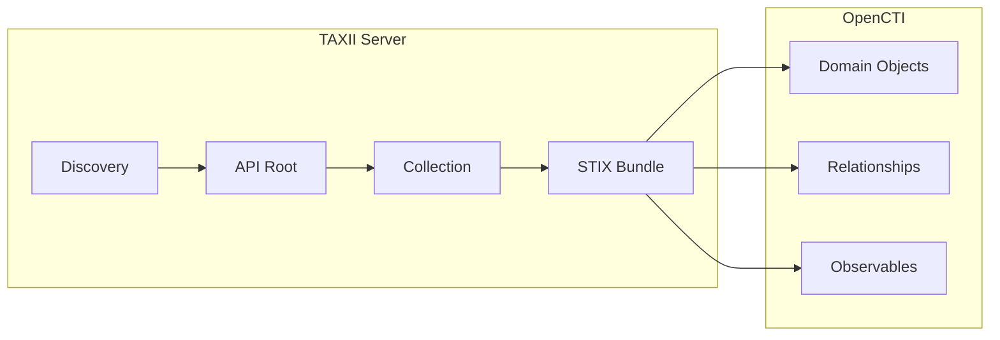

# OpenCTI TAXII 2 Connector

| Status | Date | Comment |
|--------|------|---------|
| Community | -    | -       |

The TAXII 2 connector imports STIX 2.x threat intelligence from any TAXII 2.0 or 2.1 server into OpenCTI.

## Table of Contents

- [OpenCTI TAXII 2 Connector](#opencti-taxii-2-connector)
  - [Table of Contents](#table-of-contents)
  - [Introduction](#introduction)
  - [Installation](#installation)
    - [Requirements](#requirements)
  - [Configuration variables](#configuration-variables)
    - [OpenCTI environment variables](#opencti-environment-variables)
    - [Base connector environment variables](#base-connector-environment-variables)
    - [Connector extra parameters environment variables](#connector-extra-parameters-environment-variables)
  - [Deployment](#deployment)
    - [Docker Deployment](#docker-deployment)
    - [Manual Deployment](#manual-deployment)
  - [Usage](#usage)
  - [Behavior](#behavior)
  - [Debugging](#debugging)
  - [Additional information](#additional-information)

## Introduction

TAXII (Trusted Automated eXchange of Intelligence Information) is a transport protocol for sharing cyber threat intelligence. TAXII 2.x is the modern version of the protocol, designed to work with STIX 2.x. This connector can pull threat intelligence from any TAXII 2.0 or 2.1 compliant server.

## Installation

### Requirements

- OpenCTI Platform >= 6.x
- Access to a TAXII 2.x server

## Configuration variables

There are a number of configuration options, which are set either in `docker-compose.yml` (for Docker) or in `config.yml` (for manual deployment).

### OpenCTI environment variables

| Parameter     | config.yml | Docker environment variable | Mandatory | Description                                          |
|---------------|------------|-----------------------------|-----------|------------------------------------------------------|
| OpenCTI URL   | url        | `OPENCTI_URL`               | Yes       | The URL of the OpenCTI platform.                     |
| OpenCTI Token | token      | `OPENCTI_TOKEN`             | Yes       | The default admin token set in the OpenCTI platform. |

### Base connector environment variables

| Parameter         | config.yml      | Docker environment variable   | Default | Mandatory | Description                                                                 |
|-------------------|-----------------|-------------------------------|---------|-----------|-----------------------------------------------------------------------------|
| Connector ID      | id              | `CONNECTOR_ID`                |         | Yes       | A unique `UUIDv4` identifier for this connector instance.                   |
| Connector Name    | name            | `CONNECTOR_NAME`              | TAXII2  | No        | Name of the connector.                                                      |
| Connector Scope   | scope           | `CONNECTOR_SCOPE`             |         | Yes       | Comma-separated observable types to import.                                 |
| Log Level         | log_level       | `CONNECTOR_LOG_LEVEL`         | error   | No        | Determines the verbosity of the logs: `debug`, `info`, `warn`, or `error`.  |
| Duration Period   | duration_period | `CONNECTOR_DURATION_PERIOD`   | PT60M   | No        | Time interval between connector runs in ISO 8601 format.                    |

### Connector extra parameters environment variables

| Parameter                           | config.yml                                | Docker environment variable                      | Default              | Mandatory | Description                                                                 |
|-------------------------------------|-------------------------------------------|--------------------------------------------------|----------------------|-----------|-----------------------------------------------------------------------------|
| Discovery URL                       | taxii2.discovery_url                      | `TAXII2_DISCOVERY_URL`                           |                      | Yes       | TAXII 2 server discovery URL.                                               |
| Cert Path                           | taxii2.cert_path                          | `TAXII2_CERT_PATH`                               |                      | No        | Path to client certificate for mTLS.                                        |
| Username                            | taxii2.username                           | `TAXII2_USERNAME`                                |                      | No        | Username for basic authentication.                                          |
| Password                            | taxii2.password                           | `TAXII2_PASSWORD`                                |                      | No        | Password for basic authentication.                                          |
| Use Token                           | taxii2.use_token                          | `TAXII2_USE_TOKEN`                               | false                | No        | Use bearer token authentication.                                            |
| Token                               | taxii2.token                              | `TAXII2_TOKEN`                                   |                      | No        | Bearer token value.                                                         |
| Use API Key                         | taxii2.use_apikey                         | `TAXII2_USE_APIKEY`                              | false                | No        | Use API key authentication.                                                 |
| API Key Name                        | taxii2.apikey_key                         | `TAXII2_APIKEY_KEY`                              |                      | No        | API key header name.                                                        |
| API Key Value                       | taxii2.apikey_value                       | `TAXII2_APIKEY_VALUE`                            |                      | No        | API key value.                                                              |
| TAXII 2.1                           | taxii2.v21                                | `TAXII2_V21`                                     | true                 | No        | Use TAXII 2.1 (false for TAXII 2.0).                                        |
| Collections                         | taxii2.collections                        | `TAXII2_COLLECTIONS`                             | *.*                  | No        | Collections to poll (format: `api_root.collection` or `*.*` for all).       |
| Initial History                     | taxii2.initial_history                    | `TAXII2_INITIAL_HISTORY`                         | 24                   | No        | Hours of history to fetch on first run.                                     |
| Verify SSL                          | taxii2.verify_ssl                         | `TAXII2_VERIFY_SSL`                              | true                 | No        | Verify SSL certificates.                                                    |
| Create Indicators                   | taxii2.create_indicators                  | `TAXII2_CREATE_INDICATORS`                       | true                 | No        | Create indicators.                                                          |
| Create Observables                  | taxii2.create_observables                 | `TAXII2_CREATE_OBSERVABLES`                      | true                 | No        | Create observables.                                                         |
| Add Custom Label                    | taxii2.add_custom_label                   | `TAXII2_ADD_CUSTOM_LABEL`                        | false                | No        | Add a custom label to all imported objects.                                 |
| Custom Label                        | taxii2.custom_label                       | `TAXII2_CUSTOM_LABEL`                            |                      | No        | Custom label value.                                                         |
| Force Pattern as Name               | taxii2.force_pattern_as_name              | `TAXII2_FORCE_PATTERN_AS_NAME`                   | false                | No        | Use indicator pattern as name.                                              |
| Force Multiple Pattern Name         | taxii2.force_multiple_pattern_name        | `TAXII2_FORCE_MULTIPLE_PATTERN_NAME`             | Multiple Indicators  | No        | Name for multi-pattern indicators.                                          |
| STIX Custom Property to Label       | taxii2.stix_custom_property_to_label      | `TAXII2_STIX_CUSTOM_PROPERTY_TO_LABEL`           | false                | No        | Convert custom STIX properties to labels.                                   |
| STIX Custom Property                | taxii2.stix_custom_property               | `TAXII2_STIX_CUSTOM_PROPERTY`                    |                      | No        | Custom property name to convert.                                            |
| Enable URL Query Limit              | taxii2.enable_url_query_limit             | `TAXII2_ENABLE_URL_QUERY_LIMIT`                  | false                | No        | Enable query limit parameter.                                               |
| URL Query Limit                     | taxii2.url_query_limit                    | `TAXII2_URL_QUERY_LIMIT`                         | 100                  | No        | Query limit value.                                                          |
| Determine Score by Label            | taxii2.determine_x_opencti_score_by_label | `TAXII2_DETERMINE_X_OPENCTI_SCORE_BY_LABEL`      | false                | No        | Set score based on labels.                                                  |
| Default Score                       | taxii2.default_x_opencti_score            | `TAXII2_DEFAULT_X_OPENCTI_SCORE`                 | 50                   | No        | Default x_opencti_score.                                                    |
| High Score Labels                   | taxii2.indicator_high_score_labels        | `TAXII2_INDICATOR_HIGH_SCORE_LABELS`             | high                 | No        | Labels that trigger high score.                                             |
| High Score                          | taxii2.indicator_high_score               | `TAXII2_INDICATOR_HIGH_SCORE`                    | 80                   | No        | High score value.                                                           |
| Medium Score Labels                 | taxii2.indicator_medium_score_labels      | `TAXII2_INDICATOR_MEDIUM_SCORE_LABELS`           | medium               | No        | Labels that trigger medium score.                                           |
| Medium Score                        | taxii2.indicator_medium_score             | `TAXII2_INDICATOR_MEDIUM_SCORE`                  | 60                   | No        | Medium score value.                                                         |
| Low Score Labels                    | taxii2.indicator_low_score_labels         | `TAXII2_INDICATOR_LOW_SCORE_LABELS`              | low                  | No        | Labels that trigger low score.                                              |
| Low Score                           | taxii2.indicator_low_score                | `TAXII2_INDICATOR_LOW_SCORE`                     | 40                   | No        | Low score value.                                                            |
| Set Indicator as Detection          | taxii2.set_indicator_as_detection         | `TAXII2_SET_INDICATOR_AS_DETECTION`              | false                | No        | Mark indicators as detection.                                               |
| Create Author                       | taxii2.create_author                      | `TAXII2_CREATE_AUTHOR`                           | false                | No        | Create author identity.                                                     |
| Author Name                         | taxii2.author_name                        | `TAXII2_AUTHOR_NAME`                             |                      | No        | Author identity name.                                                       |
| Author Description                  | taxii2.author_description                 | `TAXII2_AUTHOR_DESCRIPTION`                      |                      | No        | Author identity description.                                                |
| Author Reliability                  | taxii2.author_reliability                 | `TAXII2_AUTHOR_RELIABILITY`                      | A - Completely reliable | No     | Author reliability level.                                                   |

## Deployment

### Docker Deployment

Build the Docker image:

```bash
docker build -t opencti/connector-taxii2:latest .
```

Configure the connector in `docker-compose.yml`:

```yaml
  connector-taxii2:
    image: opencti/connector-taxii2:latest
    environment:
      - OPENCTI_URL=http://localhost
      - OPENCTI_TOKEN=ChangeMe
      - CONNECTOR_ID=ChangeMe
      - CONNECTOR_NAME=TAXII2
      - CONNECTOR_SCOPE=ipv4-addr,ipv6-addr,domain,url,file-sha256
      - CONNECTOR_LOG_LEVEL=error
      - CONNECTOR_DURATION_PERIOD=PT60M
      - TAXII2_DISCOVERY_URL=https://taxii.example.com/taxii2/
      - TAXII2_USERNAME=ChangeMe
      - TAXII2_PASSWORD=ChangeMe
      - TAXII2_V21=true
      - TAXII2_COLLECTIONS=*.*
      - TAXII2_INITIAL_HISTORY=24
      - TAXII2_VERIFY_SSL=true
      - TAXII2_CREATE_INDICATORS=true
      - TAXII2_CREATE_OBSERVABLES=true
    restart: always
```

Start the connector:

```bash
docker compose up -d
```

### Manual Deployment

1. Create `config.yml` based on `config.yml.sample`.

2. Install dependencies:

```bash
pip3 install -r requirements.txt
```

3. Start the connector:

```bash
python3 main.py
```

## Usage

The connector runs automatically at the interval defined by `CONNECTOR_DURATION_PERIOD`. To force an immediate run:

**Data Management → Ingestion → Connectors**

Find the connector and click the refresh button to reset the state and trigger a new sync.

## Behavior

The connector discovers and polls TAXII collections, importing all STIX objects found.

### Data Flow



### Collection Selection

The `TAXII2_COLLECTIONS` parameter supports:

- `*.*` - All collections from all API roots
- `api_root.*` - All collections from specific API root
- `api_root.collection_name` - Specific collection

### Authentication Methods

| Method       | Configuration                    |
|--------------|----------------------------------|
| Basic Auth   | `TAXII2_USERNAME`, `TAXII2_PASSWORD` |
| Bearer Token | `TAXII2_USE_TOKEN=true`, `TAXII2_TOKEN` |
| API Key      | `TAXII2_USE_APIKEY=true`, `TAXII2_APIKEY_KEY`, `TAXII2_APIKEY_VALUE` |
| mTLS         | `TAXII2_CERT_PATH`               |

## Debugging

Enable verbose logging:

```env
CONNECTOR_LOG_LEVEL=debug
```

## Additional information

- **TAXII 2.0 vs 2.1**: Set `TAXII2_V21=false` for TAXII 2.0 servers
- **Initial History**: Controls how far back to fetch on first run
- **Rate Limits**: Some servers have rate limits; adjust polling interval accordingly
- **Native STIX**: TAXII delivers native STIX 2.x; minimal conversion needed
