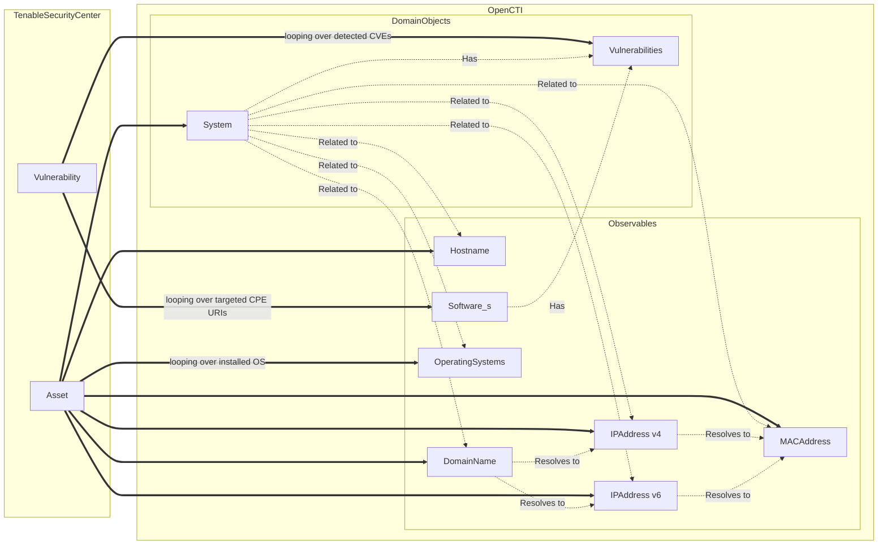
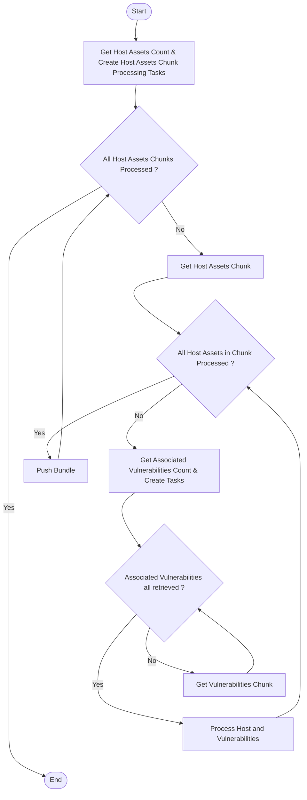

# Tenable Security Center Connector

The Tenable Security Center connector for OpenCTI allows for the ingestion of vulnerability data from Tenable Security Center 
into the OpenCTI platform. 

See : https://fr.tenable.com/products/security-center


Table of Contents

- [Tenable Security Center Connector](#tenable-security-center-connector)
  - [Introduction](#introduction)
  - [Installation](#installation)
  - [Configuration variables](#configuration-variables)
  - [Deployment](#deployment)
  - [Usage](#usage)
  - [Behavior](#behavior)
  - [Development](#development)
  - [Additional information](#additional-information)

## Introduction
This connector fetches data such as vulnerabilities, assets, and scan results, and integrates them 
into OpenCTI for further analysis and correlation with other threat intelligence data.

## Installation

### Requirements

- OpenCTI Platform >= 6.4
- Tenable Security Center Instance and API access

## Configuration variables

The connector should be configured via environment variables.

For instance using `shell`


directly
```shell
export ENV_VAR_NAME="..."
```

with a .env file
```shell
export $(grep -v '^#' .env | xargs -d '\n')
```

or `docker-compose.yml` in the container `environment` section.

with a config.yaml file (dev purposes):

config.yaml should be composed of 2 levels keys/value such as
```yaml
connector: 
  id: "..."
```
you can then alter the `app.py` file to load the config.yaml using the dedicated adapterr:

```python 
from tenable_security_center.adapters.config import ConfigLoaderYaml

config = ConfigLoaderYaml("path/to/config.yaml")
```

### OpenCTI environment variables

Below are the parameters you'll need to set for OpenCTI:

| Parameter     | Docker environment variable | Mandatory | Description                                          |
|---------------|-----------------------------|-----------|------------------------------------------------------|
| OpenCTI URL   | `OPENCTI_URL`               | Yes       | The URL of the OpenCTI platform.                     |
| OpenCTI Token | `OPENCTI_TOKEN`             | Yes       | The default admin token set in the OpenCTI platform. |

### Base connector environment variables

Below are the parameters you'll need to set for running the connector properly:
| Parameter       | Docker environment variable | Default         | Mandatory | Description                                                                              |
|-----------------|-----------------------------|-----------------|-----------|------------------------------------------------------------------------------------------|
| Connector ID    | `CONNECTOR_ID`              |                 | Yes       | A unique `UUIDv4` identifier for this connector instance.                                |
| Connector Name  | `CONNECTOR_NAME`            |                 | Yes       | Name of the connector.                                                                   |
| Connector Scope | `CONNECTOR_SCOPE`           |                 | Yes       | The scope or type of data the connector is importing, either a MIME type or Stix Object. |
| Log Level       | `CONNECTOR_LOG_LEVEL`       | warn            | Yes       | Determines the verbosity of the logs. Options are `debug`, `info`, `warn`, or `error`.   |
| Duration Period | `CONNECTOR_DURATION_PERIOD` | PT12H | Yes | The interval at which the connector runs, in ISO8601 format. Example: PT30M for 30 minutes. |
| Queue Threshold | `CONNECTOR_QUEUE_THRESHOLD` | 500 | No | The maximum size of the queue in MBytes. Default is 500MBytes. |
| Run and Terminate | `CONNECTOR_RUN_AND_TERMINATE` | False | No | If set to True, the connector will run once and then terminate. Default is False. |
| Send to Queue | `CONNECTOR_SEND_TO_QUEUE` | True | No | If set to True, the connector will send data to the queue. Default is True. |
| Send to Directory | `CONNECTOR_SEND_TO_DIRECTORY` | False | No | If set to True, the connector will send data to a directory. Default is False. |
| Directory Path | `CONNECTOR_SEND_TO_DIRECTORY_PATH` | CHANGEME | No | The path to the directory where data will be sent if `CONNECTOR_SEND_TO_DIRECTORY` is True. |
| Directory Retention | `CONNECTOR_SEND_TO_DIRECTORY_RETENTION` | 7 | No | The number of days to retain data in the directory. Default is 7 days. |


### Connector extra parameters environment variables

Below are the parameters you'll need to set for the connector:

| Parameter                              | Docker environment variable       | Default | Mandatory | Description                                                                                     |
|----------------------------------------|-----------------------------------|---------|-----------|-------------------------------------------------------------------------------------------------|
| API base URL                           | `TSC_API_BASE_URL`                |         | Yes       | Base URL for Tenable Security Center API                                                        |
| API access key                         | `TSC_API_ACCESS_KEY`              |         | Yes       | Access key for Tenable Security Center API                                                      |
| API secret key                         | `TSC_API_SECRET_KEY`              |         | Yes       | Secret key for Tenable Security Center API                                                      |
| Number of threads                      | `TSC_NUMBER_THREADS`              | 1       | No        | Number of threads to use for processing. Monitor server capacity and API throttle rate when increasing this.|
| API timeout                            | `TSC_API_TIMEOUT`                 | 30      | No        | Timeout for API requests in seconds                                                             |
| API backoff                            | `TSC_API_BACKOFF`                 | 5       | No        | Backoff time in seconds for API retries                                                         |
| API retries                            | `TSC_API_RETRIES`                 | 3       | No        | Number of retries for API requests                                                              |
| Export since                           | `TSC_EXPORT_SINCE`                |         | Yes       | Export data since this date, in ISO8601 format. This will be overwritten after the first successful run. |
| Minimum severity level                 | `TSC_SEVERITY_MIN_LEVEL`          |         | Yes       | Minimum severity level to export. Should be one of "info", "low", "medium", "high", "critical"  |
| Process Systems Without Vulnerabilities | `TSC_PROCESS_SYSTEMS_WITHOUT_VULNERABILITIES` |         | Yes       | Process systems without vulnerabilities (True/False). Activating this option might significantly increase the amount of ingested data.|
| Marking definition                     | `TSC_MARKING_DEFINITION`          |         | No        | Marking definition for exported data (Should be TLP:WHITE, TLP:AMBER, etc)                                                           |


## Deployment

Whether you are using the connector in a test or production environment, it is strongly advised to create a dedicated opencti user account.
Indeed the Tenable Security Center connector will ingests Vulnerabilities that could overwrite the already existing info in OpenCTI.
To choose your ground truth, you can use the connector account `confidence` score in the OpenCTI platform.


### Docker Deployment
Build a Docker Image using the provided `Dockerfile`.

Example:

```shell
# Replace the IMAGE NAME with the appropriate value
docker build . -t [IMAGE NAME]:latest
```

Make sure to replace the environment variables in `docker-compose.yml` or provide a `.env` file with the appropriate configurations for your
environment (see `.env.sample` file). Then, start the docker container with the provided `docker-compose.yml` file.

```shell
docker compose up -d
```

### Source code Deployment

Install the required tenable_security_center package (preferably in a virtual environment):

```shell
python -m venv .venv
source .venv/bin/activate
pip install tenable-security-center
```

Then, start the connector:

```shell
python app.py
```

## Usage

After Installation, the connector should require minimal interaction to use, and should update automatically at a regular interval specified in your `docker-compose.yml` in `duration_period`.

However, if you would like to force an immediate download of a new batch of entities, navigate to:

`Data management` -> `Ingestion` -> `Connectors` in the OpenCTI platform.

Find the connector, and click on the refresh button to reset the connector's state and force a new
download of data by re-running the connector.

Note: Once the connector run successfully, the `TSC_ACCES_KEY`and `TSC_SECRET_KEY` are not requireed anymore and can be removed from the environment variables.

## Behavior
### Mapping details
The retrieved data are mapped as follows:


## Development
To develop on the connector source code, you can install the provided tenable-security-center package in `editable` mode with the dev dependencies using :

```shell
pip install -e .[all]
``` 

### Linting and typing
To format, lint and validate the source code, you can use the isort, black, ruff and mypy configurations:

```shell
python -m isort . ; python -m black . --check ; python -m ruff check . ; python -m mypy . ; python -m pip_audit .
```

### Testing
To run the tests, you can use the following command:

```shell
python -m pytest -vv
```

## Additional information

### Data retrieval flowchart

The connector iterates over scanned assets and recover the relevant information following this flowchart: 


