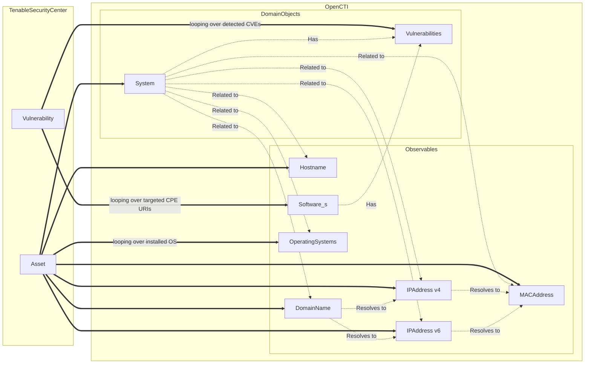
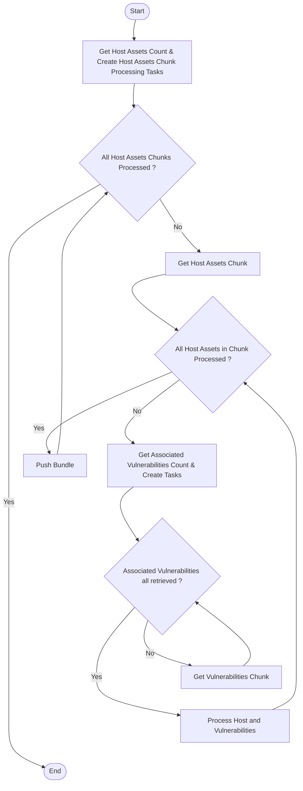

# Tenable Security Center Connector

| Status | Date | Comment |
|--------|------|---------|
| Filigran Verified | -    | -       |

The Tenable Security Center connector for OpenCTI allows for the ingestion of vulnerability data from Tenable Security Center 
into the OpenCTI platform. 

See : https://fr.tenable.com/products/security-center

## Table of Contents

- [Tenable Security Center Connector](#tenable-security-center-connector)
  - [Introduction](#introduction)
  - [Installation](#installation)
  - [Configuration variables](#configuration-variables)
  - [Deployment](#deployment)
  - [Usage](#usage)
  - [Behavior](#behavior)
  - [Development](#development)
  - [Additional information](#additional-information)

## Introduction
This connector fetches data such as vulnerabilities, assets, and scan results, and integrates them 
into OpenCTI for further analysis and correlation with other threat intelligence data.

## Installation

### Requirements

- OpenCTI Platform >= 6.4
- Tenable Security Center Instance and API access

## Configuration variables

Find all the configuration variables available here: [Connector Configurations](./__metadata__/CONNECTOR_CONFIG_DOC.md)

_The `opencti` and `connector` options in the `docker-compose.yml` and `config.yml` are the same as for any other connector.
For more information regarding variables, please refer to [OpenCTI's documentation on connectors](https://docs.opencti.io/latest/deployment/connectors/)._

### Connector extra parameters environment variables

Below are the parameters you'll need to set for the connector:

| Parameter                              | Docker environment variable       | Default | Mandatory | Description                                                                                     |
|----------------------------------------|-----------------------------------|---------|-----------|-------------------------------------------------------------------------------------------------|
| API base URL                           | `TSC_API_BASE_URL`                |         | Yes       | Base URL for Tenable Security Center API                                                        |
| API access key                         | `TSC_API_ACCESS_KEY`              |         | Yes       | Access key for Tenable Security Center API                                                      |
| API secret key                         | `TSC_API_SECRET_KEY`              |         | Yes       | Secret key for Tenable Security Center API                                                      |
| Number of threads                      | `TSC_NUMBER_THREADS`              | 1       | No        | Number of threads to use for processing. Monitor server capacity and API throttle rate when increasing this.|
| API timeout                            | `TSC_API_TIMEOUT`                 | 30      | No        | Timeout for API requests in seconds                                                             |
| API backoff                            | `TSC_API_BACKOFF`                 | 5       | No        | Backoff time in seconds for API retries                                                         |
| API retries                            | `TSC_API_RETRIES`                 | 3       | No        | Number of retries for API requests                                                              |
| Export since                           | `TSC_EXPORT_SINCE`                |         | Yes       | Export data since this date, in ISO8601 format. This will be overwritten after the first successful run. |
| Minimum severity level                 | `TSC_SEVERITY_MIN_LEVEL`          |         | Yes       | Minimum severity level to export. Should be one of "info", "low", "medium", "high", "critical"  |
| Process Systems Without Vulnerabilities | `TSC_PROCESS_SYSTEMS_WITHOUT_VULNERABILITIES` |         | Yes       | Process systems without vulnerabilities (True/False). Activating this option might significantly increase the amount of ingested data.|
| Marking definition                     | `TSC_MARKING_DEFINITION`          |         | No        | Marking definition for exported data (Should be TLP:WHITE, TLP:AMBER, etc)                                                           |

## Deployment

Whether you are using the connector in a test or production environment, it is strongly advised to create a dedicated opencti user account.
Indeed the Tenable Security Center connector will ingests Vulnerabilities that could overwrite the already existing info in OpenCTI.
To choose your ground truth, you can use the connector account `confidence` score in the OpenCTI platform.

### Docker Deployment
Build a Docker Image using the provided `Dockerfile`.

Example:

```shell
# Replace the IMAGE NAME with the appropriate value
docker build . -t [IMAGE NAME]:latest
```

Make sure to replace the environment variables in `docker-compose.yml` or provide a `.env` file with the appropriate configurations for your
environment (see `.env.sample` file). Then, start the docker container with the provided `docker-compose.yml` file.

```shell
docker compose up -d
```

### Source code Deployment

Install the required tenable_security_center package (preferably in a virtual environment):

```shell
python -m venv .venv
source .venv/bin/activate
pip install tenable-security-center
```

Then, start the connector:

```shell
python app.py
```

## Usage

After Installation, the connector should require minimal interaction to use, and should update automatically at a regular interval specified in your `docker-compose.yml` in `duration_period`.

However, if you would like to force an immediate download of a new batch of entities, navigate to:

`Data management` -> `Ingestion` -> `Connectors` in the OpenCTI platform.

Find the connector, and click on the refresh button to reset the connector's state and force a new
download of data by re-running the connector.

Note: Once the connector run successfully, the `TSC_ACCES_KEY`and `TSC_SECRET_KEY` are not requireed anymore and can be removed from the environment variables.

## Behavior

### Mapping details
The retrieved data are mapped as follows:

```mermaid

graph LR
    subgraph TenableSecurityCenter
        direction TB
        TenableHostAsset[Asset]
        TenableVulnerability[Vulnerability]
    end

    subgraph OpenCTI
        direction LR
        subgraph DomainObjects
            direction TB
            OpenCTISystem[System]
            OpenCTIVulnerability[Vulnerabilities]
        end

        subgraph Observables
            direction TB
            OpenCTIMACAddress[MACAddress]
            OpenCTIPv4Address[IPAddress v4]
            OpenCTIPv6Address[IPAddress v6]
            OpenCTIHostname[Hostname]
            OpenCTIDomainName[DomainName]
            OpenCTIOperatingSystem[OperatingSystems]
            OpenCTISoftware[Software_s]
        end
        %% OpenCTIMACAddress ~~~ OpenCTIPv4Address
    end

    %% Asset generates System and Observables
    TenableHostAsset ==> OpenCTISystem & OpenCTIMACAddress & OpenCTIPv4Address & OpenCTIPv6Address & OpenCTIHostname & OpenCTIDomainName
    TenableHostAsset==>|looping over installed OS| OpenCTIOperatingSystem

    %% Plugin generates Software and Vulnerability
    TenableVulnerability ==>|looping over targeted CPE URIs| OpenCTISoftware
    TenableVulnerability ==>|looping over detected CVEs| OpenCTIVulnerability

    %% Relationships between System and Observables
    OpenCTISystem -.-> |"Related to"| OpenCTIMACAddress & OpenCTIPv4Address & OpenCTIPv6Address & OpenCTIHostname & OpenCTIDomainName & OpenCTIOperatingSystem
    %% Relationships between observables
    OpenCTIDomainName -.->|"Resolves to"| OpenCTIPv4Address & OpenCTIPv6Address -.->|"Resolves to"| OpenCTIMACAddress
    
    %% Relationships between Vulnerabilities and Software
    OpenCTISoftware -.-> |"Has"| OpenCTIVulnerability
    OpenCTISystem -.-> |"Has"| OpenCTIVulnerability

```

## Development
To develop on the connector source code, you can install the provided tenable-security-center package in `editable` mode with the dev dependencies using :

```shell
pip install -e .[all]
``` 

### Linting and typing
To format, lint and validate the source code, you can use the isort, black, ruff and mypy configurations:

```shell
python -m isort . ; python -m black . --check ; python -m ruff check . ; python -m mypy . ; python -m pip_audit .
```

### Testing
To run the tests, you can use the following command:

```shell
python -m pytest -vv
```

## Additional information

### Data retrieval flowchart

The connector iterates over scanned assets and recover the relevant information following this flowchart: 


```mermaid
flowchart TD
    Start(["Start"])
    GetHostsCountAndCreateTasks["Get Host Assets Count & Create Host Assets Chunk Processing Tasks"]
    ConditionHostsChunks{"All Host Assets Chunks Processed ?"}
    GetHostsChunk["Get Host Assets Chunk"]
    ConditionAllHostsInChunk{"All Host Assets in Chunk Processed ?"}
    GetAssociatedVulnCountAndCreateTasks["Get Associated Vulnerabilities Count & Create Tasks"]
    ConditionVuln{"Associated Vulnerabilities all retrieved ?"} 
    GetAsociatedVulnsChunk["Get Vulnerabilities Chunk"]
    ProcessHostAndVulnerabilities["Process Host and Vulnerabilities"]
    PushBundle["Push Bundle"]
    End(["End"])

    Start 
    --> GetHostsCountAndCreateTasks
    --> ConditionHostsChunks
		    ConditionHostsChunks -- Yes --> End
		    ConditionHostsChunks -- No --> 
			    GetHostsChunk --> 
			    ConditionAllHostsInChunk -- Yes --> PushBundle --> ConditionHostsChunks
			    ConditionAllHostsInChunk -- No -->
					    GetAssociatedVulnCountAndCreateTasks --> 
					    ConditionVuln  -- Yes --> ProcessHostAndVulnerabilities --> ConditionAllHostsInChunk
						  ConditionVuln  -- No --> GetAsociatedVulnsChunk --> ConditionVuln  

  %% Formatting 
  Start ~~~ 
  GetHostsCountAndCreateTasks ~~~
  ConditionHostsChunks ~~~
  GetHostsChunk ~~~
  ConditionAllHostsInChunk ~~~
  GetAssociatedVulnCountAndCreateTasks ~~~
  ConditionVuln ~~~
  GetAsociatedVulnsChunk ~~~
  ConditionAllHostsInChunk ~~~
  GetAsociatedVulnsChunk 

  GetAsociatedVulnsChunk ~~~ ProcessHostAndVulnerabilities 

  PushBundle  & ProcessHostAndVulnerabilities ~~~ End
```
