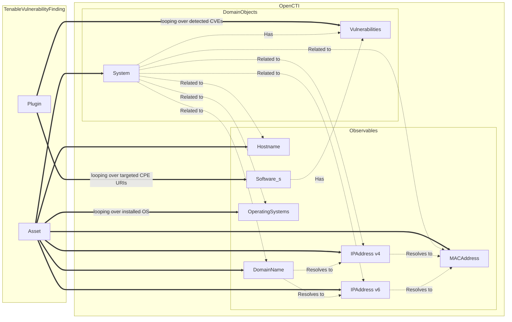
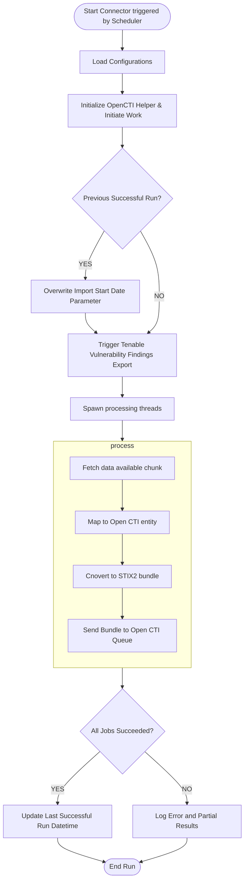

# OpenCTI Tenable Vulnerability Management Connector

This connector integrates Tenable Vulnerability Management with the OpenCTI platform. It pulls vulnerability data from Tenable, such as vulnerabilities, severity levels, and asset data, and imports it into OpenCTI to provide comprehensive visibility into security risks.

See https://docs.tenable.com/vulnerability-management.htm

## Table of Contents

- [Introduction](#introduction)
- [Installation](#installation)
  - [Requirements](#requirements)
- [Configuration variables](#configuration-variables)
  - [OpenCTI environment variables](#opencti-environment-variables)
  - [Base connector environment variables](#base-connector-environment-variables)
  - [Connector extra parameters environment variables](#connector-extra-parameters-environment-variables)
- [Deployment](#deployment)
  - [Docker Deployment](#docker-deployment)
  - [Manual Deployment](#manual-deployment)
- [Usage](#usage)
- [Behavior](#behavior)
- [Debugging](#debugging)
- [Additional information](#additional-information)

## Introduction

The Tenable Vulnerability Management Connector for OpenCTI imports vulnerability data from Tenable and maps it to relevant entities in the OpenCTI ecosystem. This includes vulnerabilities, CVEs, severity levels, and affected assets. The data can be used to enhance threat intelligence, vulnerability management, and security operation workflows in OpenCTI.

## Installation

### Requirements

- OpenCTI Platform >= 6.x
- Tenable Vulnerability Management API access (API key required)

## Configuration variables

The configuration variables for the connector can be set in `docker-compose.yml` for Docker deployments or `config.yml` for manual deployments.

### OpenCTI environment variables

| Parameter     | config.yml | Docker environment variable | Mandatory | Description                                          |
|---------------|------------|-----------------------------|-----------|------------------------------------------------------|
| OpenCTI URL   | url        | `OPENCTI_URL`               | Yes       | The URL of the OpenCTI platform.                     |
| OpenCTI Token | token      | `OPENCTI_TOKEN`             | Yes       | The default admin token set in the OpenCTI platform. |

### Base connector environment variables

| Parameter       | config.yml | Docker environment variable | Default         | Mandatory | Description                                                                      |
|-----------------|------------|-----------------------------|-----------------|-----------|----------------------------------------------------------------------------------|
| Connector ID    | id         | `CONNECTOR_ID`              | /               | Yes       | A unique `UUIDv4` identifier for this connector instance.                        |
| Connector Type  | type       | `CONNECTOR_TYPE`            | EXTERNAL_IMPORT | Yes       | Should always be set to `EXTERNAL_IMPORT` for this connector.                    |
| Connector Name  | name       | `CONNECTOR_NAME`            |                 | Yes       | Name of the connector.                                                           |
| Connector Scope | scope      | `CONNECTOR_SCOPE`           | vulnerability   | Yes       | The scope or type of data the connector is importing (e.g., vulnerability).      |
| Log Level       | log_level  | `CONNECTOR_LOG_LEVEL`       | info            | Yes       | Determines the verbosity of the logs. Options: `debug`, `info`, `warn`, `error`. |

### Connector extra parameters environment variables

| Parameter          | config.yml         | Docker environment variable | Default                   | Mandatory | Description                                                                                    |
|--------------------|--------------------|-----------------------------|---------------------------|-----------|------------------------------------------------------------------------------------------------|
| API base URL       | api_base_url       | `TIO_API_BASE_URL`          | https://cloud.tenable.com | Yes       | Base URL for the Tenable API.                                                                  |
| API access key     | api_access_key     | `TIO_API_ACCESS_KEY`        |                           | Yes       | Tenable API access key.                                                                        |
| API secret key     | api_secret_key     | `TIO_API_SECRET_KEY`        |                           | Yes       | Tenable API secret key.                                                                        |
| API timeout        | api_timeout        | `TIO_API_TIMEOUT`           | 30                        | No        | Timeout for API requests in seconds.                                                           |
| API retries        | api_retries        | `TIO_API_RETRIES`           | 5                         | No        | Number of retries in case of failure.                                                          |
| API backoff        | api_backoff        | `TIO_API_BACKOFF`           | 1                         | No        | Time (in seconds) to wait before retrying after receiving a 429 response from the API.         |
| Export since date  | export_since       | `TIO_EXPORT_SINCE`          | 1970-01-01T00:00:00+00    | No        | Date from which to start pulling vulnerability data.                                           |
| Minimum severity   | min_severity       | `TIO_MIN_SEVERITY`          | low                       | No        | The minimum severity level of vulnerabilities to import (`low`, `medium`, `high`, `critical`). |
| Marking definition | marking_definition | `TIO_MARKING_DEFINITION`    | TLP:CLEAR                 | No        | Default marking definition for imported data (e.g., `TLP:AMBER`, `TLP:GREEN`, `TLP:CLEAR`).    |
| Number of threads  | num_thread         | `TIO_NUM_THREADS`           | 1                         | No        | Number of threads to use for the connector.                                                    |

## Deployment

### Docker Deployment

Before building the Docker container, you need to set the version of pycti in `requirements.txt` equal to whatever
version of OpenCTI you're running. Example, `pycti==5.12.20`. If you don't, it will take the latest version, but
sometimes the OpenCTI SDK fails to initialize.

Build a Docker Image using the provided `Dockerfile`.

Example:

```shell
# Replace the IMAGE NAME with the appropriate value
docker build . -t [IMAGE NAME]:latest
```

Make sure to replace the environment variables in `docker-compose.yml` with the appropriate configurations for your
environment. Then, start the docker container with the provided docker-compose.yml

```shell
docker compose up -d
# -d for detached
```

### Manual Deployment

Create a file `config.yml` based on the provided `config.yml.sample`.

Replace the configuration variables (especially the "**ChangeMe**" variables) with the appropriate configurations for
you environment.

Install the required python dependencies (preferably in a virtual environment):

```shell
pip3 install -r requirements.txt
```

Then, start the connector from /src:

```shell
python3 main.py
```

## Usage

After Installation, the connector should require minimal interaction to use, and should update automatically at a regular interval specified in your `docker-compose.yml` or `config.yml` in `duration_period`.

However, if you would like to force an immediate download of a new batch of entities, navigate to:

`Data management` -> `Ingestion` -> `Connectors` in the OpenCTI platform.

Find the connector, and click on the refresh button to reset the connector's state and force a new
download of data by re-running the connector.

## Behavior

### Mapping details



## Debugging
Set the log level by configuring CONNECTOR_LOG_LEVEL. Example log levels:

debug: Detailed logs for troubleshooting.
info: General operational logs.
warn: Warnings on non-critical issues.
error: Logs only critical errors.
Logging can be customized via the self.helper.connector_logger calls within the connector's codebase.

## Tests
Unit tests are available in /tests repository and can be run using pytest:

```shell
pip install -r test-requirements.txt
python -m pytest ./tests
```

Note : fake data used for unit tests comes from Tenable Vuln Management [API doc example](https://developer.tenable.com/reference/exports-vulns-download-chunk) [consulted on October 16th, 2024]

## Additional information
- Ensure your Tenable API access is configured correctly (API keys, base URL).
- The connector handles rate limits using a backoff and retry mechanism for 429 HTTP responses.
- Consider the `min_severity` threshold and `export_since` parameters for performance optimization.
- global flow:


