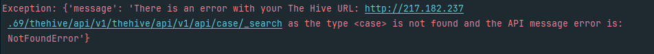

# TheHive Connector for OpenCTI

The **TheHive Connector** allows for integration of TheHive's alert and case management capabilities into OpenCTI. This connector imports TheHive's cases, alerts, tasks, and observables into OpenCTI. The connector uses the Python modules `thehive4py` and will work on version 4 and 5.  

## Configuration:

Setting up TheHive Connector is straightforward. The following table provides details on the necessary parameters:

| Parameter                       | Docker envvar                 | Mandatory | Description                                                     |
|---------------------------------|-------------------------------|-----------|-----------------------------------------------------------------|
| `opencti.url`                   | `OPENCTI_URL`                 | Yes       | The URL of the OpenCTI platform.                                |
| `opencti.token`                 | `OPENCTI_TOKEN`               | Yes       | The token for accessing OpenCTI.                                |
| `connector.id`                  | `CONNECTOR_ID`                | Yes       | A unique `UUIDv4` identifier for this connector instance.       |
| `connector.name`                | `CONNECTOR_NAME`              | Yes       | Name of the connector. Should always be "TheHive".              |
| `connector.scope`               | `CONNECTOR_SCOPE`             | Yes       | The scope of data the connector is importing.                   |
| `connector.update_existing_data`| `CONNECTOR_UPDATE_EXISTING_DATA`| Yes     | Decide whether the connector should update already existing data.|
| `connector.log_level`           | `CONNECTOR_LOG_LEVEL`         | Yes       | Logging level. Choices: `info`, `error`, etc.                   |
| `thehive.url`                   | `THEHIVE_URL`                 | Yes       | URL of your TheHive instance.                                   |
| `thehive.api_key`               | `THEHIVE_API_KEY`             | Yes       | Your API Key for accessing TheHive.                             |
| `thehive.check_ssl`             | `THEHIVE_CHECK_SSL`           | Yes       | Whether to validate the SSL certificate of TheHive instance.   |
| `thehive.organization_name`     | `THEHIVE_ORGANIZATION_NAME`   | Yes       | Name of your organization in TheHive.                           |
| `thehive.import_from_date`      | `THEHIVE_IMPORT_FROM_DATE`    | No        | Date from which to start importing data.                        |
| `thehive.import_only_tlp`       | `THEHIVE_IMPORT_ONLY_TLP`     | No        | Levels of the Traffic Light Protocol (TLP) to be imported. e.g., `0,1,2,3,4`      |
| `thehive.import_alerts`         | `THEHIVE_IMPORT_ALERTS`       | No        | Whether to import alerts from TheHive.                          |
| `thehive.severity_mapping`      | `THEHIVE_SEVERITY_MAPPING`    | No        | Mapping of severity levels between TheHive and OpenCTI. e.g., `1:low,2:medium,3:high,4:critical`         |
| `thehive.case_status_mapping`   | `THEHIVE_CASE_STATUS_MAPPING` | No        | Status mapping for cases. e.g., `hive_status_1:opencti_status_id_2,hive_status_2:opencti_status_id_2`                                       |
| `thehive.task_status_mapping`   | `THEHIVE_TASK_STATUS_MAPPING` | No        | Status mapping for tasks. e.g., `hive_status_1:opencti_status_id_2,hive_status_2:opencti_status_id_2`                                             |
| `thehive.alert_status_mapping`  | `THEHIVE_ALERT_STATUS_MAPPING`| No        | Status mapping for alerts. e.g., `hive_status_1:opencti_status_id_2,hive_status_2:opencti_status_id_2`                                            |
| `thehive.user_mapping`          | `THEHIVE_USER_MAPPING`        | No        | Mapping of TheHive assignees to OpenCTI users. e.g., `user@contoso.com:opencti_user_id,user2@contoso.com:opencti_user_id_2`                 |
| `thehive.interval`              | `THEHIVE_INTERVAL`            | Yes       | Frequency of running the connector in minutes.                  |

## Supported Indicator Field Names
The following is a list of indicator Field Names supported by this integration and the prescribed value types. Indicators of this field name will be imported into OpenCTI as the STIX object defined. Please ensure that the field names are receiving standardized values to avoid potential import errors (e.g., and IP is an IP).

| TheHive Indicator Name        | STIX Object      |
|------------------------|--------------------------------|
| asset                  | Identity (system)                           |
| autonomous-system      | Autonomous System (AS)        |
| cve                    | Vulnerability             |
| domain                 | Domain Name              |
| file                   | File: Checks the length and determines the hash type (supported: MD5, SHA-1, SHA-256)                            |
| file_md5               | File                |
| file_sha1              | File              |
| file_sha256            | File            |
| filename               | File                      |
| fqdn                   | Domain Name                 |
| hostname               | Identity (system)                 |
| hash                   | File: Checks the length and determines the hash type (supported: MD5, SHA-1, SHA-256)                           |
| identity               | Identity                  |
| ip                     | IPv4 Address or IPv6 Address, supports ipv4, ipv6, and cidr notation of both.                            |
| ipv4                   | IPv4 Address                |
| ipv6                   | IPv6 Address                |
| mail                   | Email Message (body)             |
| mail-subject           | Email Message (subject)            |
| mail_subject           | Email Message (subject)          |
| email_subject          | Email Message (subject)          |
| email_address          | Email Message (email-addr)            |
| other                  | Custom Observable                     |
| organisation           | Identity (organization)                           |
| organization           | Identity (organization)                  |
| regexp                 | Custom Observable Text                     |
| registry               | Windows Registry Key       |
| registry_key               | Windows Registry Key       |
| registry_value               | Windows Registry Type Value       |
| risk_object_asset      | Identity (system)                           |
| risk_object_identity   | Identity (identity)                           |
| system                 | Identity (system)                  |
| uri_path               | Url                     |
| url                    | Url                      |
| user-agent             | Custom Observable User Agent               |
| user_agent             | Custom Observable User Agent               |
| supplier               | Identity (organization)                           |
| vendor                 | Identity (organization)                           |


## Errors you may encounter

You may encounter this kind of error:

```shell
AttributeError: 'str' object has no attribute 'get'
```

The connector tries to make an API call but the type given is not the one expected (`case` or `alert`) so the given exception will be raised and it will end the loop:



To handle it, you can check the TheHive URL in the configuration file and re-run the connector.
