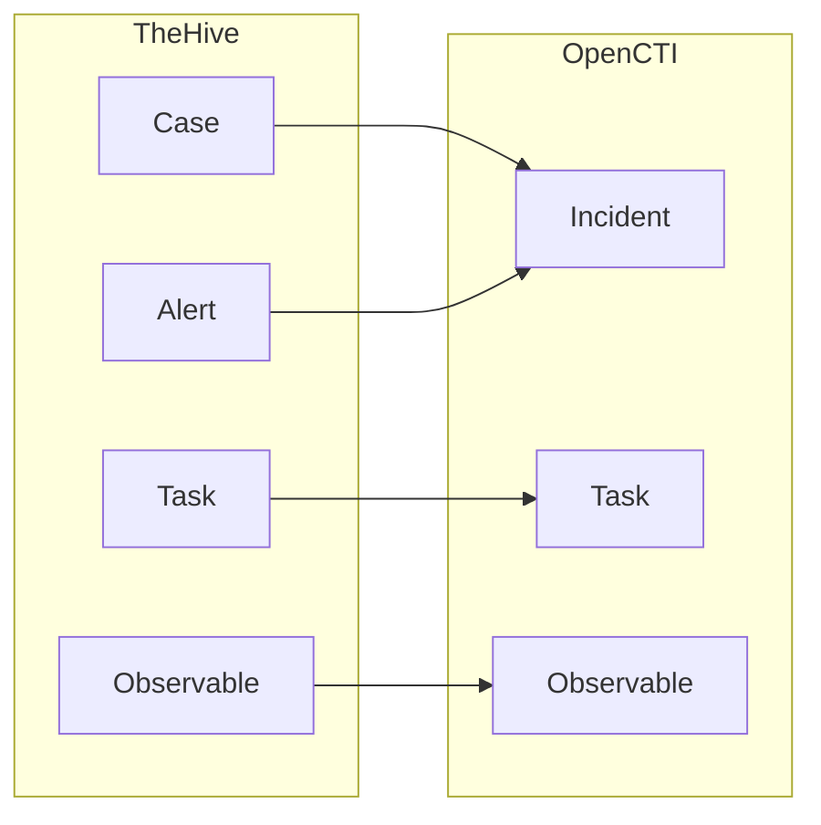

# OpenCTI TheHive Connector

| Status | Date | Comment |
|--------|------|---------|
| Filigran Verified | -    | -       |

The TheHive connector imports cases, alerts, and observables from TheHive incident response platform into OpenCTI.

## Table of Contents

- [OpenCTI TheHive Connector](#opencti-thehive-connector)
  - [Table of Contents](#table-of-contents)
  - [Introduction](#introduction)
  - [Installation](#installation)
    - [Requirements](#requirements)
  - [Configuration variables](#configuration-variables)
    - [OpenCTI environment variables](#opencti-environment-variables)
    - [Base connector environment variables](#base-connector-environment-variables)
    - [Connector extra parameters environment variables](#connector-extra-parameters-environment-variables)
  - [Deployment](#deployment)
    - [Docker Deployment](#docker-deployment)
    - [Manual Deployment](#manual-deployment)
  - [Usage](#usage)
  - [Behavior](#behavior)
  - [Debugging](#debugging)
  - [Additional information](#additional-information)

## Introduction

TheHive is a scalable security incident response platform designed for SOCs and CSIRTs. This connector synchronizes cases, alerts, tasks, and observables from TheHive into OpenCTI as incidents and their associated objects.

## Installation

### Requirements

- OpenCTI Platform >= 6.x
- TheHive 4.x or 5.x instance
- TheHive API key with read access

## Configuration variables

There are a number of configuration options, which are set either in `docker-compose.yml` (for Docker) or in `config.yml` (for manual deployment).

### OpenCTI environment variables

| Parameter     | config.yml | Docker environment variable | Mandatory | Description                                          |
|---------------|------------|-----------------------------|-----------|------------------------------------------------------|
| OpenCTI URL   | url        | `OPENCTI_URL`               | Yes       | The URL of the OpenCTI platform.                     |
| OpenCTI Token | token      | `OPENCTI_TOKEN`             | Yes       | The default admin token set in the OpenCTI platform. |

### Base connector environment variables

| Parameter       | config.yml | Docker environment variable | Default  | Mandatory | Description                                                                 |
|-----------------|------------|-----------------------------| ---------|-----------|-----------------------------------------------------------------------------|
| Connector ID    | id         | `CONNECTOR_ID`              |          | Yes       | A unique `UUIDv4` identifier for this connector instance.                   |
| Connector Name  | name       | `CONNECTOR_NAME`            | TheHive  | No        | Name of the connector.                                                      |
| Connector Scope | scope      | `CONNECTOR_SCOPE`           | thehive  | No        | The scope or type of data the connector is importing.                       |
| Log Level       | log_level  | `CONNECTOR_LOG_LEVEL`       | error    | No        | Determines the verbosity of the logs: `debug`, `info`, `warn`, or `error`.  |

### Connector extra parameters environment variables

| Parameter             | config.yml                   | Docker environment variable       | Default              | Mandatory | Description                                                                 |
|-----------------------|------------------------------|-----------------------------------|----------------------|-----------|-----------------------------------------------------------------------------|
| TheHive URL           | thehive.url                  | `THEHIVE_URL`                     |                      | Yes       | URL of the TheHive instance.                                                |
| API Key               | thehive.api_key              | `THEHIVE_API_KEY`                 |                      | Yes       | TheHive API key.                                                            |
| Check SSL             | thehive.check_ssl            | `THEHIVE_CHECK_SSL`               | true                 | No        | Verify SSL certificates.                                                    |
| Organization Name     | thehive.organization_name    | `THEHIVE_ORGANIZATION_NAME`       |                      | Yes       | TheHive organization name.                                                  |
| Import from Date      | thehive.import_from_date     | `THEHIVE_IMPORT_FROM_DATE`        |                      | No        | Start date for importing (ISO format).                                      |
| Import Only TLP       | thehive.import_only_tlp      | `THEHIVE_IMPORT_ONLY_TLP`         | 0,1,2,3,4            | No        | TLP levels to import (comma-separated).                                     |
| Import Alerts         | thehive.import_alerts        | `THEHIVE_IMPORT_ALERTS`           | true                 | No        | Import alerts in addition to cases.                                         |
| Severity Mapping      | thehive.severity_mapping     | `THEHIVE_SEVERITY_MAPPING`        | 1:low,2:medium,3:high,4:critical | No | Map TheHive severity to OpenCTI.                                            |
| Case Status Mapping   | thehive.case_status_mapping  | `THEHIVE_CASE_STATUS_MAPPING`     |                      | No        | Map TheHive case status to OpenCTI status ID.                               |
| Task Status Mapping   | thehive.task_status_mapping  | `THEHIVE_TASK_STATUS_MAPPING`     |                      | No        | Map TheHive task status to OpenCTI status ID.                               |
| Alert Status Mapping  | thehive.alert_status_mapping | `THEHIVE_ALERT_STATUS_MAPPING`    |                      | No        | Map TheHive alert status to OpenCTI status ID.                              |
| User Mapping          | thehive.user_mapping         | `THEHIVE_USER_MAPPING`            |                      | No        | Map TheHive assignees to OpenCTI user IDs.                                  |
| Interval              | thehive.interval             | `THEHIVE_INTERVAL`                | 5                    | No        | Polling interval in minutes.                                                |
| Case Tag Whitelist    | thehive.case_tag_whitelist   | `THEHIVE_CASE_TAG_WHITELIST`      |                      | No        | Only import cases with these tags.                                          |

## Deployment

### Docker Deployment

Build the Docker image:

```bash
docker build -t opencti/connector-thehive:latest .
```

Configure the connector in `docker-compose.yml`:

```yaml
  connector-thehive:
    image: opencti/connector-thehive:latest
    environment:
      - OPENCTI_URL=http://localhost
      - OPENCTI_TOKEN=ChangeMe
      - CONNECTOR_ID=ChangeMe
      - CONNECTOR_NAME=TheHive
      - CONNECTOR_SCOPE=thehive
      - CONNECTOR_LOG_LEVEL=error
      - THEHIVE_URL=https://thehive.example.com
      - THEHIVE_API_KEY=ChangeMe
      - THEHIVE_CHECK_SSL=true
      - THEHIVE_ORGANIZATION_NAME=MyOrg
      - THEHIVE_IMPORT_FROM_DATE=2021-01-01T00:00:00
      - THEHIVE_IMPORT_ONLY_TLP=0,1,2,3,4
      - THEHIVE_IMPORT_ALERTS=true
      - "THEHIVE_SEVERITY_MAPPING=1:low,2:medium,3:high,4:critical"
      - THEHIVE_INTERVAL=5
    restart: always
```

Start the connector:

```bash
docker compose up -d
```

### Manual Deployment

1. Create `config.yml` based on `config.yml.sample`.

2. Install dependencies:

```bash
pip3 install -r requirements.txt
```

3. Start the connector:

```bash
python3 main.py
```

## Usage

The connector runs automatically at the interval defined by `THEHIVE_INTERVAL`. To force an immediate run:

**Data Management → Ingestion → Connectors**

Find the connector and click the refresh button to reset the state and trigger a new sync.

## Behavior

The connector fetches cases and alerts from TheHive and converts them to STIX 2.1 incidents and observables.

### Data Flow



### Entity Mapping

| TheHive Data         | OpenCTI Entity      | Description                                      |
|----------------------|---------------------|--------------------------------------------------|
| Case                 | Incident            | Security incident                                |
| Alert                | Incident            | Security alert                                   |
| Task                 | Task                | Case tasks                                       |
| Observable (IP)      | IPv4-Addr/IPv6-Addr | IP address observables                           |
| Observable (Domain)  | Domain-Name         | Domain observables                               |
| Observable (Hash)    | File                | File hash observables                            |
| Observable (URL)     | URL                 | URL observables                                  |
| Observable (Email)   | Email-Addr          | Email observables                                |

### Severity Mapping

| TheHive Severity | OpenCTI Severity |
|------------------|------------------|
| 1                | low              |
| 2                | medium           |
| 3                | high             |
| 4                | critical         |

### Status Mapping

Use the mapping parameters to align TheHive workflow states with OpenCTI status IDs:

```env
THEHIVE_CASE_STATUS_MAPPING=Open:status-id-1,Closed:status-id-2
THEHIVE_TASK_STATUS_MAPPING=Waiting:status-id-1,InProgress:status-id-2,Completed:status-id-3
THEHIVE_ALERT_STATUS_MAPPING=New:status-id-1,Imported:status-id-2
```

## Debugging

Enable verbose logging:

```env
CONNECTOR_LOG_LEVEL=debug
```

## Additional information

- **TheHive Versions**: Supports TheHive 4.x and 5.x
- **Organization**: Specify the organization to filter cases
- **TLP Filtering**: Use `IMPORT_ONLY_TLP` to control what data is imported
- **User Mapping**: Map TheHive assignees to OpenCTI users for proper attribution
- **Reference**: [TheHive Project](https://thehive-project.org/)
