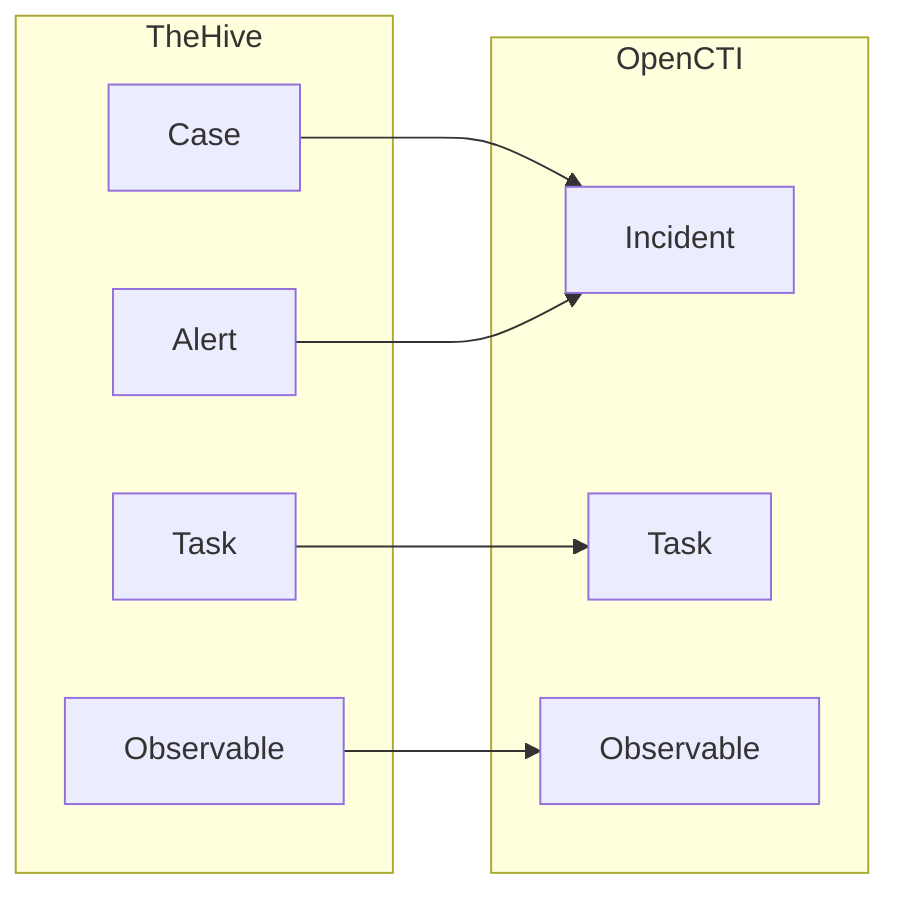

# OpenCTI TheHive Connector

| Status | Date | Comment |
|--------|------|---------|
| Filigran Verified | -    | -       |

The TheHive connector imports cases, alerts, and observables from TheHive incident response platform into OpenCTI.

## Table of Contents

- [OpenCTI TheHive Connector](#opencti-thehive-connector)
  - [Table of Contents](#table-of-contents)
  - [Introduction](#introduction)
  - [Installation](#installation)
    - [Requirements](#requirements)
  - [Configuration variables](#configuration-variables)
  - [Deployment](#deployment)
    - [Docker Deployment](#docker-deployment)
    - [Manual Deployment](#manual-deployment)
  - [Usage](#usage)
  - [Behavior](#behavior)
  - [Debugging](#debugging)
  - [Additional information](#additional-information)

## Introduction

TheHive is a scalable security incident response platform designed for SOCs and CSIRTs. This connector synchronizes cases, alerts, tasks, and observables from TheHive into OpenCTI as incidents and their associated objects.

## Installation

### Requirements

- OpenCTI Platform >= 6.x
- TheHive 4.x or 5.x instance
- TheHive API key with read access

## Configuration variables

Find all the configuration variables available here: [Connector Configurations](./__metadata__/CONNECTOR_CONFIG_DOC.md)

_The `opencti` and `connector` options in the `docker-compose.yml` and `config.yml` are the same as for any other connector.
For more information regarding variables, please refer to [OpenCTI's documentation on connectors](https://docs.opencti.io/latest/deployment/connectors/)._

## Deployment

### Docker Deployment

Build the Docker image:

```bash
docker build -t opencti/connector-thehive:latest .
```

Configure the connector in `docker-compose.yml`:

```yaml
  connector-thehive:
    image: opencti/connector-thehive:latest
    environment:
      - OPENCTI_URL=http://localhost
      - OPENCTI_TOKEN=ChangeMe
      - CONNECTOR_ID=ChangeMe
      - CONNECTOR_NAME=TheHive
      - CONNECTOR_SCOPE=thehive
      - CONNECTOR_LOG_LEVEL=error
      - THEHIVE_URL=https://thehive.example.com
      - THEHIVE_API_KEY=ChangeMe
      - THEHIVE_CHECK_SSL=true
      - THEHIVE_ORGANIZATION_NAME=MyOrg
      - THEHIVE_IMPORT_FROM_DATE=2021-01-01T00:00:00
      - THEHIVE_IMPORT_ONLY_TLP=0,1,2,3,4
      - THEHIVE_IMPORT_ALERTS=true
      - THEHIVE_SEVERITY_MAPPING=1:low,2:medium,3:high,4:critical
      - THEHIVE_INTERVAL=5
    restart: always
```

Start the connector:

```bash
docker compose up -d
```

### Manual Deployment

1. Create `config.yml` based on `config.yml.sample`.

2. Install dependencies:

```bash
pip3 install -r requirements.txt
```

3. Start the connector:

```bash
python3 main.py
```

## Usage

The connector runs automatically at the interval defined by `THEHIVE_INTERVAL`. To force an immediate run:

**Data Management → Ingestion → Connectors**

Find the connector and click the refresh button to reset the state and trigger a new sync.

## Behavior

The connector fetches cases and alerts from TheHive and converts them to STIX 2.1 incidents and observables.

## Attachments import

By default, attachments from TheHive cases are **not imported**.
This behavior is intentional to prevent issues with large files and message size limits in the messaging system.

### How to enable attachments import

Attachments import can be enabled using one of the following options:

**Environment variable**
```bash
THEHIVE_IMPORT_ATTACHMENTS=true
```

### RabbitMQ message size limitation

OpenCTI relies on RabbitMQ for message transport.  
By default, RabbitMQ has a maximum message size limit of **512 MB**.

When importing large attachments, this limit may be exceeded and result in errors such as:

PRECONDITION_FAILED - message size is larger than configured max size

### Data Flow


```mermaid
graph LR
    subgraph TheHive
        direction TB
        Case[Case]
        Alert[Alert]
        Task[Task]
        Observable[Observable]
    end

    subgraph OpenCTI
        direction LR
        Incident[Incident]
        TaskEntity[Task]
        SCO[Observable]
    end

    Case --> Incident
    Alert --> Incident
    Task --> TaskEntity
    Observable --> SCO
```

### Entity Mapping

| TheHive Data         | OpenCTI Entity      | Description                                      |
|----------------------|---------------------|--------------------------------------------------|
| Case                 | Incident            | Security incident                                |
| Alert                | Incident            | Security alert                                   |
| Task                 | Task                | Case tasks                                       |
| Observable (IP)      | IPv4-Addr/IPv6-Addr | IP address observables                           |
| Observable (Domain)  | Domain-Name         | Domain observables                               |
| Observable (Hash)    | File                | File hash observables                            |
| Observable (URL)     | URL                 | URL observables                                  |
| Observable (Email)   | Email-Addr          | Email observables                                |

### Severity Mapping

| TheHive Severity | OpenCTI Severity |
|------------------|------------------|
| 1                | low              |
| 2                | medium           |
| 3                | high             |
| 4                | critical         |

### Status Mapping

Use the mapping parameters to align TheHive workflow states with OpenCTI status IDs:

```env
THEHIVE_CASE_STATUS_MAPPING=Open:status-id-1,Closed:status-id-2
THEHIVE_TASK_STATUS_MAPPING=Waiting:status-id-1,InProgress:status-id-2,Completed:status-id-3
THEHIVE_ALERT_STATUS_MAPPING=New:status-id-1,Imported:status-id-2
```

## Debugging

Enable verbose logging:

```env
CONNECTOR_LOG_LEVEL=debug
```

## Additional information

- **TheHive Versions**: Supports TheHive 4.x and 5.x
- **Organization**: Specify the organization to filter cases
- **TLP Filtering**: Use `IMPORT_ONLY_TLP` to control what data is imported
- **User Mapping**: Map TheHive assignees to OpenCTI users for proper attribution
- **Reference**: [TheHive Project](https://thehive-project.org/)
