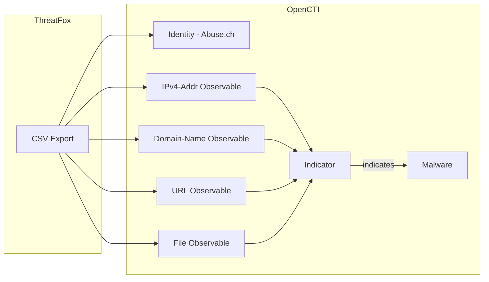

# OpenCTI ThreatFox Connector

The ThreatFox connector imports indicators of compromise (IOCs) from abuse.ch ThreatFox into OpenCTI.

| Status    | Date | Comment |
|-----------|------|---------|
| Community | -    | -       |

## Table of Contents

- [OpenCTI ThreatFox Connector](#opencti-threatfox-connector)
  - [Table of Contents](#table-of-contents)
  - [Introduction](#introduction)
  - [Installation](#installation)
    - [Requirements](#requirements)
  - [Configuration variables](#configuration-variables)
    - [OpenCTI environment variables](#opencti-environment-variables)
    - [Base connector environment variables](#base-connector-environment-variables)
    - [Connector extra parameters environment variables](#connector-extra-parameters-environment-variables)
  - [Deployment](#deployment)
    - [Docker Deployment](#docker-deployment)
    - [Manual Deployment](#manual-deployment)
  - [Usage](#usage)
  - [Behavior](#behavior)
  - [Debugging](#debugging)
  - [Additional information](#additional-information)

## Introduction

ThreatFox is a free platform from abuse.ch for sharing indicators of compromise (IOCs) associated with malware. The database contains IOCs like IP addresses, domains, URLs, and file hashes linked to specific malware families.

This connector fetches the recent IOC export from ThreatFox and imports them into OpenCTI as observables and indicators, with relationships to malware families when available.

## Installation

### Requirements

- OpenCTI Platform >= 6.x
- Internet access to ThreatFox CSV feed (publicly available)

## Configuration variables

There are a number of configuration options, which are set either in `docker-compose.yml` (for Docker) or in `config.yml` (for manual deployment).

### OpenCTI environment variables

| Parameter     | config.yml | Docker environment variable | Mandatory | Description                                          |
|---------------|------------|-----------------------------|-----------|------------------------------------------------------|
| OpenCTI URL   | url        | `OPENCTI_URL`               | Yes       | The URL of the OpenCTI platform.                     |
| OpenCTI Token | token      | `OPENCTI_TOKEN`             | Yes       | The default admin token set in the OpenCTI platform. |

### Base connector environment variables

| Parameter         | config.yml      | Docker environment variable   | Default         | Mandatory | Description                                                                 |
|-------------------|-----------------|-------------------------------|-----------------|-----------|-----------------------------------------------------------------------------|
| Connector ID      | id              | `CONNECTOR_ID`                |                 | Yes       | A unique `UUIDv4` identifier for this connector instance.                   |
| Connector Name    | name            | `CONNECTOR_NAME`              | ThreatFox       | No        | Name of the connector.                                                      |
| Connector Scope   | scope           | `CONNECTOR_SCOPE`             | threatfox       | No        | The scope or type of data the connector is importing.                       |
| Log Level         | log_level       | `CONNECTOR_LOG_LEVEL`         | error           | No        | Determines the verbosity of the logs: `debug`, `info`, `warn`, or `error`.  |
| Duration Period   | duration_period | `CONNECTOR_DURATION_PERIOD`   |                 | No        | Time interval between connector runs in ISO 8601 format.                    |

### Connector extra parameters environment variables

| Parameter            | config.yml                    | Docker environment variable         | Default                                       | Mandatory | Description                                                                 |
|----------------------|-------------------------------|-------------------------------------|-----------------------------------------------|-----------|-----------------------------------------------------------------------------|
| CSV URL              | threatfox.csv_url             | `THREATFOX_CSV_URL`                 | https://threatfox.abuse.ch/export/csv/recent/ | No        | ThreatFox CSV feed URL.                                                     |
| Import Offline       | threatfox.import_offline      | `THREATFOX_IMPORT_OFFLINE`          | true                                          | No        | Import IOCs marked as offline.                                              |
| Create Indicators    | threatfox.create_indicators   | `THREATFOX_CREATE_INDICATORS`       | true                                          | No        | Create indicators in addition to observables.                               |
| Default Score        | threatfox.default_x_opencti_score | `THREATFOX_DEFAULT_X_OPENCTI_SCORE` | 50                                        | No        | Default x_opencti_score for observables.                                    |
| IP Score             | threatfox.x_opencti_score_ip  | `THREATFOX_X_OPENCTI_SCORE_IP`      | (uses default)                                | No        | x_opencti_score for IP observables.                                         |
| Domain Score         | threatfox.x_opencti_score_domain | `THREATFOX_X_OPENCTI_SCORE_DOMAIN` | (uses default)                               | No        | x_opencti_score for Domain observables.                                     |
| URL Score            | threatfox.x_opencti_score_url | `THREATFOX_X_OPENCTI_SCORE_URL`     | (uses default)                                | No        | x_opencti_score for URL observables.                                        |
| Hash Score           | threatfox.x_opencti_score_hash | `THREATFOX_X_OPENCTI_SCORE_HASH`   | (uses default)                                | No        | x_opencti_score for Hash observables.                                       |
| IOC Types            | threatfox.ioc_to_import       | `THREATFOX_IOC_TO_IMPORT`           | all_types                                     | No        | IOC types to import: `all_types`, `ip:port`, `domain`, `url`, `md5_hash`, `sha1_hash`, `sha256_hash`. |
| Interval (deprecated) | threatfox.interval           | `THREATFOX_INTERVAL`                | 3                                             | No        | **[DEPRECATED]** Interval in days. Use `CONNECTOR_DURATION_PERIOD`.         |

## Deployment

### Docker Deployment

Build the Docker image:

```bash
docker build -t opencti/connector-threatfox:latest .
```

Configure the connector in `docker-compose.yml`:

```yaml
  connector-threatfox:
    image: opencti/connector-threatfox:latest
    environment:
      - OPENCTI_URL=http://localhost
      - OPENCTI_TOKEN=ChangeMe
      - CONNECTOR_ID=ChangeMe
      - CONNECTOR_NAME=ThreatFox
      - CONNECTOR_SCOPE=threatfox
      - CONNECTOR_LOG_LEVEL=error
      - CONNECTOR_DURATION_PERIOD=PT6H
      - THREATFOX_CSV_URL=https://threatfox.abuse.ch/export/csv/recent/
      - THREATFOX_IMPORT_OFFLINE=true
      - THREATFOX_CREATE_INDICATORS=true
      - THREATFOX_DEFAULT_X_OPENCTI_SCORE=50
      - THREATFOX_IOC_TO_IMPORT=all_types
    restart: always
```

Start the connector:

```bash
docker compose up -d
```

### Manual Deployment

1. Create `config.yml` based on `config.yml.sample`.

2. Install dependencies:

```bash
pip3 install -r requirements.txt
```

3. Start the connector from the `src` directory:

```bash
python3 -m __main__
```

## Usage

The connector runs automatically at the interval defined by `CONNECTOR_DURATION_PERIOD`. To force an immediate run:

**Data Management → Ingestion → Connectors**

Find the connector and click the refresh button to reset the state and trigger a new sync.

## Behavior

The connector fetches the ThreatFox CSV export and creates observables and indicators in OpenCTI.

### Data Flow



### Entity Mapping

| ThreatFox IOC Type   | OpenCTI Entity      | Description                                      |
|----------------------|---------------------|--------------------------------------------------|
| ip:port              | IPv4-Addr           | IP address (port stored in description)          |
| domain               | Domain-Name         | Domain name                                      |
| url                  | URL                 | URL observable                                   |
| md5_hash             | File (MD5)          | MD5 file hash                                    |
| sha1_hash            | File (SHA-1)        | SHA-1 file hash                                  |
| sha256_hash          | File (SHA-256)      | SHA-256 file hash                                |
| Malware name         | Malware             | Malware family                                   |

### Processing Details

For each IOC in the ThreatFox feed:

1. **Observable**: Created based on IOC type with:
   - `x_opencti_score`: Configurable per type
   - Labels from ThreatFox tags
   - External reference to ThreatFox

2. **Indicator**: Created with STIX pattern matching the observable

3. **Malware Relationship**: If malware family is specified, creates `indicates` relationship

### Type-Specific Scoring

Configure different scores for different IOC types:
- IP addresses: `THREATFOX_X_OPENCTI_SCORE_IP`
- Domains: `THREATFOX_X_OPENCTI_SCORE_DOMAIN`
- URLs: `THREATFOX_X_OPENCTI_SCORE_URL`
- Hashes: `THREATFOX_X_OPENCTI_SCORE_HASH`

## Debugging

Enable verbose logging:

```env
CONNECTOR_LOG_LEVEL=debug
```

## Additional information

- **Public Feed**: ThreatFox data is publicly available without authentication
- **IOC Freshness**: The `csv_recent` endpoint provides IOCs from the last 7 days
- **Confidence Levels**: ThreatFox includes confidence levels that can be reflected in scores
- **Reference**: [ThreatFox](https://threatfox.abuse.ch/)
