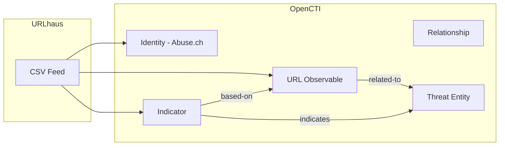

# OpenCTI URLhaus Connector

The URLhaus connector imports malicious URL data from abuse.ch URLhaus into OpenCTI as URL observables and indicators.

| Status            | Date | Comment |
|-------------------|------|---------|
| Filigran Verified | -    | -       |

## Table of Contents

- [OpenCTI URLhaus Connector](#opencti-urlhaus-connector)
  - [Table of Contents](#table-of-contents)
  - [Introduction](#introduction)
  - [Installation](#installation)
    - [Requirements](#requirements)
  - [Configuration variables](#configuration-variables)
    - [OpenCTI environment variables](#opencti-environment-variables)
    - [Base connector environment variables](#base-connector-environment-variables)
    - [Connector extra parameters environment variables](#connector-extra-parameters-environment-variables)
  - [Deployment](#deployment)
    - [Docker Deployment](#docker-deployment)
    - [Manual Deployment](#manual-deployment)
  - [Usage](#usage)
  - [Behavior](#behavior)
  - [Debugging](#debugging)
  - [Additional information](#additional-information)

## Introduction

URLhaus is a project from abuse.ch with the goal of sharing malicious URLs that are being used for malware distribution. The service collects and tracks URLs that host malware, including download locations, C&C servers, and exploit kit landing pages.

This connector fetches the recent URL additions from URLhaus and imports them as URL observables and indicators into OpenCTI, with optional threat relationship creation.

## Installation

### Requirements

- OpenCTI Platform >= 6.x
- Internet access to URLhaus CSV feed (publicly available)

## Configuration variables

There are a number of configuration options, which are set either in `docker-compose.yml` (for Docker) or in `config.yml` (for manual deployment).

### OpenCTI environment variables

| Parameter     | config.yml | Docker environment variable | Mandatory | Description                                          |
|---------------|------------|-----------------------------|-----------|------------------------------------------------------|
| OpenCTI URL   | url        | `OPENCTI_URL`               | Yes       | The URL of the OpenCTI platform.                     |
| OpenCTI Token | token      | `OPENCTI_TOKEN`             | Yes       | The default admin token set in the OpenCTI platform. |

### Base connector environment variables

| Parameter         | config.yml      | Docker environment variable   | Default         | Mandatory | Description                                                                 |
|-------------------|-----------------|-------------------------------|-----------------|-----------|-----------------------------------------------------------------------------|
| Connector ID      | id              | `CONNECTOR_ID`                |                 | Yes       | A unique `UUIDv4` identifier for this connector instance.                   |
| Connector Name    | name            | `CONNECTOR_NAME`              | Abuse.ch URLhaus | No      | Name of the connector.                                                      |
| Connector Scope   | scope           | `CONNECTOR_SCOPE`             | urlhaus         | No        | The scope or type of data the connector is importing.                       |
| Log Level         | log_level       | `CONNECTOR_LOG_LEVEL`         | error           | No        | Determines the verbosity of the logs: `debug`, `info`, `warn`, or `error`.  |

### Connector extra parameters environment variables

| Parameter            | config.yml                   | Docker environment variable       | Default                                      | Mandatory | Description                                                                 |
|----------------------|------------------------------|-----------------------------------|----------------------------------------------|-----------|-----------------------------------------------------------------------------|
| Interval             | urlhaus.interval             | `URLHAUS_INTERVAL`                | 3                                            | Yes       | Polling interval in hours.                                                  |
| CSV URL              | urlhaus.csv_url              | `URLHAUS_CSV_URL`                 | https://urlhaus.abuse.ch/downloads/csv_recent/ | No     | URLhaus CSV feed URL.                                                       |
| Default Score        | urlhaus.default_x_opencti_score | `URLHAUS_DEFAULT_X_OPENCTI_SCORE` | 80                                         | No        | Default x_opencti_score for imported indicators.                            |
| Import Offline       | urlhaus.import_offline       | `URLHAUS_IMPORT_OFFLINE`          | true                                         | No        | Import URLs marked as "offline" in addition to "online".                    |
| Threats from Labels  | urlhaus.threats_from_labels  | `URLHAUS_THREATS_FROM_LABELS`     | true                                         | No        | Create relationships to existing threats based on URL tags.                 |

## Deployment

### Docker Deployment

Build the Docker image:

```bash
docker build -t opencti/connector-urlhaus:latest .
```

Configure the connector in `docker-compose.yml`:

```yaml
  connector-urlhaus:
    image: opencti/connector-urlhaus:latest
    environment:
      - OPENCTI_URL=http://localhost
      - OPENCTI_TOKEN=ChangeMe
      - CONNECTOR_ID=ChangeMe
      - CONNECTOR_NAME=Abuse.ch URLhaus
      - CONNECTOR_SCOPE=urlhaus
      - CONNECTOR_LOG_LEVEL=error
      - URLHAUS_INTERVAL=3
      - URLHAUS_CSV_URL=https://urlhaus.abuse.ch/downloads/csv_recent/
      - URLHAUS_DEFAULT_X_OPENCTI_SCORE=80
      - URLHAUS_IMPORT_OFFLINE=true
      - URLHAUS_THREATS_FROM_LABELS=true
    restart: always
```

Start the connector:

```bash
docker compose up -d
```

### Manual Deployment

1. Create `config.yml` based on `config.yml.sample`.

2. Install dependencies:

```bash
pip3 install -r requirements.txt
```

3. Start the connector from the `src` directory:

```bash
python3 main.py
```

## Usage

The connector runs automatically at the interval defined by `URLHAUS_INTERVAL`. To force an immediate run:

**Data Management → Ingestion → Connectors**

Find the connector and click the refresh button to reset the state and trigger a new data fetch.

## Behavior

The connector fetches the recent CSV feed from URLhaus and creates URL observables and indicators in OpenCTI.

### Data Flow



### Entity Mapping

| URLhaus CSV Field    | OpenCTI Entity/Property | Description                                      |
|----------------------|-------------------------|--------------------------------------------------|
| url                  | URL Observable          | Malicious URL value                              |
| url                  | Indicator               | STIX pattern `[url:value = '...']`               |
| dateadded            | Indicator.valid_from    | Date URL was added to URLhaus                    |
| url_status           | Indicator.description   | online/offline status                            |
| threat               | Indicator.description   | Threat type (malware, C&C, etc.)                 |
| tags                 | Observable.labels       | Malware family tags                              |
| urlhaus_link         | External Reference      | Link to URLhaus entry                            |
| reporter             | Indicator.description   | Reporter username                                |

### CSV Schema

URLhaus CSV feed columns:
1. `id` - URLhaus ID
2. `dateadded` - Date/time added (UTC)
3. `url` - The malicious URL
4. `url_status` - online/offline
5. `last_online` - Last seen online
6. `threat` - Threat type
7. `tags` - Comma-separated malware tags
8. `urlhaus_link` - Reference URL
9. `reporter` - Reporter name

### Threat Relationships

When `URLHAUS_THREATS_FROM_LABELS=true`:
- Tags are used to search for existing threats in OpenCTI
- If a matching Threat-Actor, Intrusion-Set, Malware, Campaign, Incident, or Tool exists:
  - Indicator → `indicates` → Threat
  - URL → `related-to` → Threat

### Processing Details

1. **URL Observable**: Created with:
   - `x_opencti_score`: Configurable default score
   - Labels from URLhaus tags
   - External reference to URLhaus

2. **Indicator**: Created with:
   - Pattern: `[url:value = '<url>']`
   - `x_opencti_main_observable_type`: "Url"
   - Description includes threat type, reporter, status

3. **Relationship**: `based-on` from Indicator to Observable

4. **TLP Marking**: All data marked as TLP:WHITE

## Debugging

Enable verbose logging:

```env
CONNECTOR_LOG_LEVEL=debug
```

Log output includes:
- CSV download status
- URL processing progress
- Threat relationship creation

## Additional information

- **Public Feed**: URLhaus data is publicly available without authentication
- **CSV Variants**: 
  - `csv_recent/` - Recent 30 days (recommended)
  - `csv/` - Full database (very large)
- **Update Frequency**: URLhaus updates frequently; 3-hour polling is recommended
- **Offline URLs**: Set `URLHAUS_IMPORT_OFFLINE=false` to skip inactive URLs
- **High Score**: Default score of 80 reflects high confidence in URLhaus data
- **Reference**: [URLhaus](https://urlhaus.abuse.ch/)
