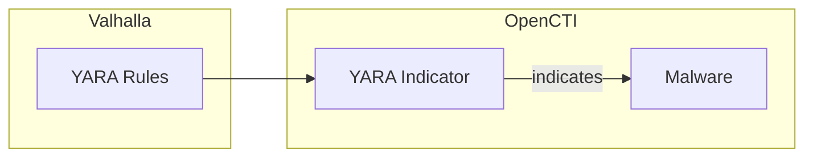

# OpenCTI Valhalla Connector

| Status | Date | Comment |
|--------|------|---------|
| Community | -    | -       |

The Valhalla connector imports YARA detection rules from Nextron Systems' Valhalla YARA rule feed into OpenCTI.

## Table of Contents

- [OpenCTI Valhalla Connector](#opencti-valhalla-connector)
  - [Table of Contents](#table-of-contents)
  - [Introduction](#introduction)
  - [Installation](#installation)
    - [Requirements](#requirements)
  - [Configuration variables](#configuration-variables)
  - [Deployment](#deployment)
    - [Docker Deployment](#docker-deployment)
    - [Manual Deployment](#manual-deployment)
  - [Usage](#usage)
  - [Behavior](#behavior)
  - [Debugging](#debugging)
  - [Additional information](#additional-information)

## Introduction

Valhalla is a YARA rule feed service from Nextron Systems (creators of THOR and LOKI). It provides high-quality, handcrafted YARA rules for malware detection, covering various malware families, APT tools, and webshells.

This connector imports YARA rules from Valhalla into OpenCTI as YARA pattern indicators, enabling integration of detection rules with threat intelligence workflows.

## Installation

### Requirements

- OpenCTI Platform >= 6.x
- Valhalla API key (optional - demo data available without key)

## Configuration variables

Find all the configuration variables available here: [Connector Configurations](./__metadata__/CONNECTOR_CONFIG_DOC.md)

_The `opencti` and `connector` options in the `docker-compose.yml` and `config.yml` are the same as for any other connector.
For more information regarding variables, please refer to [OpenCTI's documentation on connectors](https://docs.opencti.io/latest/deployment/connectors/)._

## Deployment

### Docker Deployment

Build the Docker image:

```bash
docker build -t opencti/connector-valhalla:latest .
```

Configure the connector in `docker-compose.yml`:

```yaml
  connector-valhalla:
    image: opencti/connector-valhalla:latest
    environment:
      - OPENCTI_URL=http://localhost
      - OPENCTI_TOKEN=ChangeMe
      - CONNECTOR_ID=ChangeMe
      - CONNECTOR_NAME=Valhalla
      - CONNECTOR_SCOPE=valhalla
      - CONNECTOR_LOG_LEVEL=error
      - VALHALLA_API_KEY=
      - VALHALLA_INTERVAL_SEC=86400
    restart: always
```

Start the connector:

```bash
docker compose up -d
```

### Manual Deployment

1. Create `config.yml` based on `config.yml.sample`.

2. Install dependencies:

```bash
pip3 install -r requirements.txt
```

3. Start the connector:

```bash
python3 main.py
```

## Usage

The connector runs automatically at the interval defined by `VALHALLA_INTERVAL_SEC`. To force an immediate run:

**Data Management → Ingestion → Connectors**

Find the connector and click the refresh button to reset the state and trigger a new sync.

## Behavior

The connector fetches YARA rules from the Valhalla API and imports them as YARA pattern indicators.

### Data Flow



### Entity Mapping

| Valhalla Data        | OpenCTI Entity      | Description                                      |
|----------------------|---------------------|--------------------------------------------------|
| YARA Rule            | Indicator (YARA)    | YARA pattern indicator                           |
| Rule Name            | Indicator.name      | Name of the detection rule                       |
| Rule Description     | Indicator.description | Rule description and context                  |
| Tags                 | Labels              | Rule categories and targets                      |
| Malware Reference    | Malware             | Associated malware family                        |

### Processing Details

For each YARA rule from Valhalla:

1. **YARA Indicator**: Created with:
   - Pattern type: `yara`
   - Pattern: Full YARA rule content
   - Name and description
   - Labels from rule tags

2. **Malware Relationship**: If malware family is referenced, creates `indicates` relationship

### Rule Categories

Valhalla provides rules for:
- APT malware and tools
- Commodity malware
- Webshells
- Hack tools
- Exploits
- Dual-use tools

## Debugging

Enable verbose logging:

```env
CONNECTOR_LOG_LEVEL=debug
```

## Additional information

- **Demo Mode**: Without API key, only public demo rules are available
- **Subscription**: Full access requires Valhalla subscription from Nextron Systems
- **Quality**: Rules are handcrafted by Florian Roth and the Nextron team
- **Update Frequency**: Daily polling is recommended
- **Reference**: [Valhalla](https://valhalla.nextron-systems.com/)
