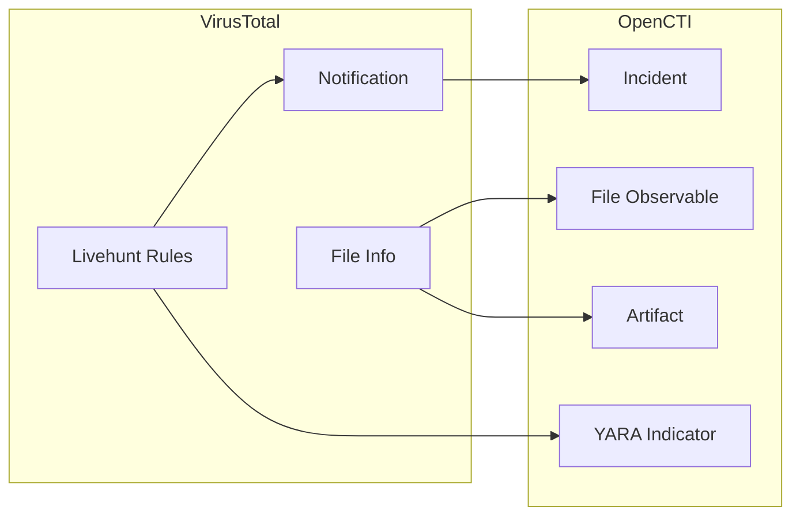

# OpenCTI VirusTotal Livehunt Notifications Connector

The VirusTotal Livehunt Notifications connector imports malware samples matching YARA rules from VirusTotal Livehunt into OpenCTI.

| Status            | Date | Comment |
|-------------------|------|---------|
| Filigran Verified | -    | -       |

## Table of Contents

- [OpenCTI VirusTotal Livehunt Notifications Connector](#opencti-virustotal-livehunt-notifications-connector)
  - [Table of Contents](#table-of-contents)
  - [Introduction](#introduction)
  - [Installation](#installation)
    - [Requirements](#requirements)
  - [Configuration variables](#configuration-variables)
    - [OpenCTI environment variables](#opencti-environment-variables)
    - [Base connector environment variables](#base-connector-environment-variables)
    - [Connector extra parameters environment variables](#connector-extra-parameters-environment-variables)
  - [Deployment](#deployment)
    - [Docker Deployment](#docker-deployment)
    - [Manual Deployment](#manual-deployment)
  - [Usage](#usage)
  - [Behavior](#behavior)
  - [Debugging](#debugging)
  - [Additional information](#additional-information)

## Introduction

VirusTotal Livehunt is a YARA-based real-time scanning service that alerts users when new files matching their rules are submitted. This connector fetches Livehunt notifications and creates corresponding incidents, file objects, and YARA indicators in OpenCTI.

## Installation

### Requirements

- OpenCTI Platform >= 6.x
- VirusTotal Premium account with Livehunt access
- VirusTotal API key

## Configuration variables

There are a number of configuration options, which are set either in `docker-compose.yml` (for Docker) or in `config.yml` (for manual deployment).

### OpenCTI environment variables

| Parameter     | config.yml | Docker environment variable | Mandatory | Description                                          |
|---------------|------------|-----------------------------|-----------|------------------------------------------------------|
| OpenCTI URL   | url        | `OPENCTI_URL`               | Yes       | The URL of the OpenCTI platform.                     |
| OpenCTI Token | token      | `OPENCTI_TOKEN`             | Yes       | The default admin token set in the OpenCTI platform. |

### Base connector environment variables

| Parameter       | config.yml | Docker environment variable | Default                            | Mandatory | Description                                                                 |
|-----------------|------------|-----------------------------|------------------------------------|-----------|-----------------------------------------------------------------------------|
| Connector ID    | id         | `CONNECTOR_ID`              |                                    | Yes       | A unique `UUIDv4` identifier for this connector instance.                   |
| Connector Name  | name       | `CONNECTOR_NAME`            | VirusTotal Livehunt Notifications  | No        | Name of the connector.                                                      |
| Connector Scope | scope      | `CONNECTOR_SCOPE`           | StixFile,Indicator,Incident        | No        | The scope or type of data the connector is importing.                       |
| Log Level       | log_level  | `CONNECTOR_LOG_LEVEL`       | error                              | No        | Determines the verbosity of the logs: `debug`, `info`, `warn`, or `error`.  |

### Connector extra parameters environment variables

| Parameter            | config.yml                        | Docker environment variable                               | Default    | Mandatory | Description                                                                 |
|----------------------|-----------------------------------|-----------------------------------------------------------|------------|-----------|-----------------------------------------------------------------------------|
| API Key              | virustotal.api_key                | `VIRUSTOTAL_LIVEHUNT_NOTIFICATIONS_API_KEY`               |            | Yes       | VirusTotal Premium API key.                                                 |
| Interval             | virustotal.interval_sec           | `VIRUSTOTAL_LIVEHUNT_NOTIFICATIONS_INTERVAL_SEC`          | 300        | No        | Time between requests in seconds.                                           |
| Create Alert         | virustotal.create_alert           | `VIRUSTOTAL_LIVEHUNT_NOTIFICATIONS_CREATE_ALERT`          | true       | No        | Create incident/alert for each notification.                                |
| Extensions           | virustotal.extensions             | `VIRUSTOTAL_LIVEHUNT_NOTIFICATIONS_EXTENSIONS`            |            | No        | Comma-separated file extensions to filter (e.g., `exe,dll`).                |
| Min File Size        | virustotal.min_file_size          | `VIRUSTOTAL_LIVEHUNT_NOTIFICATIONS_MIN_FILE_SIZE`         |            | No        | Minimum file size in bytes.                                                 |
| Max File Size        | virustotal.max_file_size          | `VIRUSTOTAL_LIVEHUNT_NOTIFICATIONS_MAX_FILE_SIZE`         | 52428800   | No        | Maximum file size in bytes (default: 50MB).                                 |
| Max Age Days         | virustotal.max_age_days           | `VIRUSTOTAL_LIVEHUNT_NOTIFICATIONS_MAX_AGE_DAYS`          | 3          | No        | Only process files submitted within this many days.                         |
| Min Positives        | virustotal.min_positives          | `VIRUSTOTAL_LIVEHUNT_NOTIFICATIONS_MIN_POSITIVES`         |            | No        | Minimum number of AV detections.                                            |
| Create File          | virustotal.create_file            | `VIRUSTOTAL_LIVEHUNT_NOTIFICATIONS_CREATE_FILE`           | true       | No        | Create file observable for matched files.                                   |
| Upload Artifact      | virustotal.upload_artifact        | `VIRUSTOTAL_LIVEHUNT_NOTIFICATIONS_UPLOAD_ARTIFACT`       | false      | No        | Upload file to OpenCTI as artifact.                                         |
| Create YARA Rule     | virustotal.create_yara_rule       | `VIRUSTOTAL_LIVEHUNT_NOTIFICATIONS_CREATE_YARA_RULE`      | true       | No        | Create YARA indicator for the matching rule.                                |
| Delete Notification  | virustotal.delete_notification    | `VIRUSTOTAL_LIVEHUNT_NOTIFICATIONS_DELETE_NOTIFICATION`   | false      | No        | Delete notification from VT after processing.                               |
| Filter with Tag      | virustotal.filter_with_tag        | `VIRUSTOTAL_LIVEHUNT_NOTIFICATIONS_FILTER_WITH_TAG`       |            | No        | Only process notifications with this tag.                                   |

## Deployment

### Docker Deployment

Build the Docker image:

```bash
docker build -t opencti/connector-virustotal-livehunt-notifications:latest .
```

Configure the connector in `docker-compose.yml`:

```yaml
  connector-virustotal-livehunt-notifications:
    image: opencti/connector-virustotal-livehunt-notifications:latest
    environment:
      - OPENCTI_URL=http://localhost
      - OPENCTI_TOKEN=ChangeMe
      - CONNECTOR_ID=ChangeMe
      - CONNECTOR_NAME=VirusTotal Livehunt Notifications
      - CONNECTOR_SCOPE=StixFile,Indicator,Incident
      - CONNECTOR_LOG_LEVEL=error
      - VIRUSTOTAL_LIVEHUNT_NOTIFICATIONS_API_KEY=ChangeMe
      - VIRUSTOTAL_LIVEHUNT_NOTIFICATIONS_INTERVAL_SEC=300
      - VIRUSTOTAL_LIVEHUNT_NOTIFICATIONS_CREATE_ALERT=True
      - VIRUSTOTAL_LIVEHUNT_NOTIFICATIONS_CREATE_FILE=True
      - VIRUSTOTAL_LIVEHUNT_NOTIFICATIONS_CREATE_YARA_RULE=True
      - VIRUSTOTAL_LIVEHUNT_NOTIFICATIONS_MAX_AGE_DAYS=3
    restart: always
```

Start the connector:

```bash
docker compose up -d
```

### Manual Deployment

1. Create `config.yml` based on `config.yml.sample`.

2. Install dependencies:

```bash
pip3 install -r requirements.txt
```

3. Start the connector:

```bash
python3 main.py
```

## Usage

The connector runs automatically at the interval defined by `VIRUSTOTAL_LIVEHUNT_NOTIFICATIONS_INTERVAL_SEC`. To force an immediate run:

**Data Management → Ingestion → Connectors**

Find the connector and click the refresh button to reset the state and trigger a new sync.

## Behavior

The connector fetches Livehunt notifications and creates corresponding STIX objects in OpenCTI.

### Data Flow



### Entity Mapping

| VirusTotal Data      | OpenCTI Entity      | Description                                      |
|----------------------|---------------------|--------------------------------------------------|
| Notification         | Incident            | Alert for matched file                           |
| File Metadata        | File                | File observable with hashes                      |
| YARA Rule            | Indicator           | YARA pattern indicator                           |
| File Download        | Artifact            | Actual file content (optional)                   |

### Relationships Created

| Source               | Relationship   | Target                |
|----------------------|----------------|-----------------------|
| Incident             | related-to     | File                  |
| Indicator (YARA)     | based-on       | File                  |

### Filtering Options

| Filter               | Description                                          |
|----------------------|------------------------------------------------------|
| Extensions           | Only process specific file types                     |
| File Size            | Min/max file size limits                             |
| Age                  | Only recent submissions                              |
| Positives            | Minimum AV detection threshold                       |
| Tag                  | Filter by Livehunt rule tag                          |

## Debugging

Enable verbose logging:

```env
CONNECTOR_LOG_LEVEL=debug
```

## Additional information

- **Premium API**: Requires VirusTotal Premium API access
- **API Quota**: Each notification fetch consumes API quota
- **File Download**: Enable `UPLOAD_ARTIFACT` to store actual malware samples
- **Reference**: [VirusTotal Livehunt](https://support.virustotal.com/hc/en-us/articles/360001315857-Livehunt)

