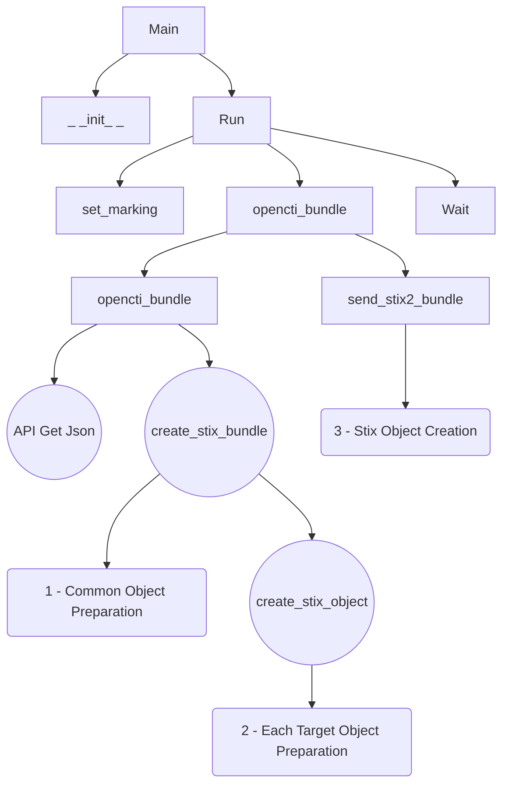
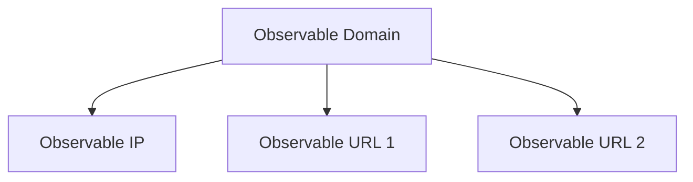
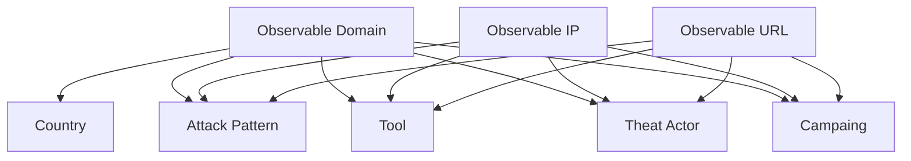
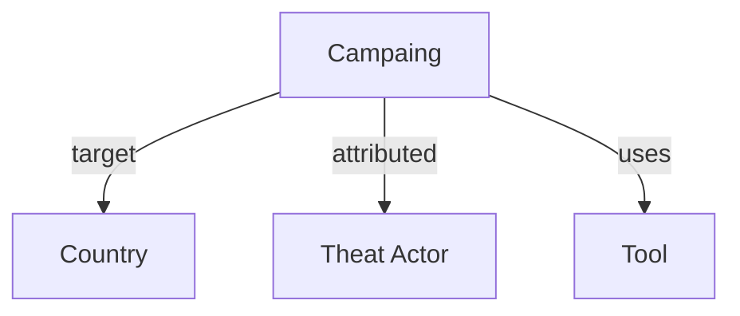

# OpenCTI Witha.name Connector

## Installation

This connector facilitates DDoSia/Noname057 Following via Witha.Name initiative.
It create <font color="ligtblue">Observable</font> but no <font color="ligtblue">Indicator</font> (because, those are targets, not sources)

## Configuration

| Parameter   | Docker envvar  | Description |
|----------------------------------|----------------------------------|----------------------------------------------------------------------------------------------------|
| `opencti_url`  | `OPENCTI_URL`  | The URL of the OpenCTI platform. |
| `opencti_token`   | `OPENCTI_TOKEN`   | The default admin token configured in the OpenCTI platform parameters file.   |
| `connector_id` | `CONNECTOR_ID` | A valid arbitrary `UUIDv4` that must be unique for this connector.   |
| `connector_type` | `CONNECTOR_TYPE` | Must be `EXTERNAL_IMPORT`  |
| `connector_name`  | `CONNECTOR_NAME`  | The name of the connector, can be just "Withaname-ID"   |
| `connector_update_existing_data` | `CONNECTOR_UPDATE_EXISTING_DATA` | If an entity already exists, update its attributes with information provided by this connector. |
| `connector_log_level`   | `CONNECTOR_LOG_LEVEL` | The log level for this connector, could be `debug`, `info`, `warn` or `error` (less verbose).   |
| `withaname_url` | `WITHANAME_URL` | The Witha.name config url: `https://witha.name/data/last.json` |
| `withaname_save_domain` | `WITHANAME_SAVE_DOMAIN` | Does the connector save domain names un OCTI (`true`/`false`) |
| `withaname_save_ip` | `WITHANAME_SAVE_IP` | Does the connector save IP Address un OCTI (`true`/`false`) |
| `withaname_save_url` | `WITHANAME_SAVE_URL` | Does the connector save targeted URL un OCTI (`true`/`false`) |
| `withaname_link_tool` | `WITHANAME_LINK_TOOL` | The tool name `DDoSia` leave empty to not link |
| `withaname_link_ta` | `WITHANAME_LINK_TA` | The trheatActor name `Noname057` leave empty to not link |
| `withaname_link_ap` | `WITHANAME_LINK_AP` | The AttackPattenr name `T1498 Network Denial of Service` leave empty to not link |
| `withaname_link_country` | `WITHANAME_LINK_COUNTRY` | Does the connector link with targeted country, based on TLD (`true`/`false`) |
| `withaname_links_duration` | `WITHANAME_LINKS_DURATION` | How long does the relation is made for (usualy change every 24 hours), adapt with `withaname_interval` |
| `withaname_create_daily_campaigns` | `WITHANAME_CREATE_DAILY_CAMPAIGNS` | Create a campargn a day(`true`/`false`) |
| `withaname_interval` | `WITHANAME_INTERVAL` | Frequence in hours |
| `withaname_shifthour` | `WITHANAME_SHIFTHOUR` | WHich time does the botnet change conf (normally 6 oclock) |
| `withaname_marking` | `WITHANAME_MARKING` | marking element as `TLP:GREEN` |

## Docker Compose Example

See [docker-compose.yml](./docker-compose.yml)

## Reminders
- DDoSia does not evolve frequently, so do not use a high refresh rate (once a days or every 2 hour is a good thing)

## Not Running on Docker?
You can run it without docker (or elsewhere) 

### Create venv

```bash
# Let's create a folder for connector
mkdir -p /root/opencti/running-connectors/
# Let's create a folder for connectors raw sources
mkdir -p /root/raw_src/
cd /root/raw_src/
git clone https://github.com/OpenCTI-Platform/connectors.git

# Virtual environement creation
cd /root/opencti/running-connectors/
python3 -m venv --prompt "OCTI Connectors" /root/opencti/running-connectors/.octi_con_venv
source /root/opencti/running-connectors/.octi_con_venv/bin/activate
pip3 install -r /root/raw_src/connectors/external-import/Witha.name/src/requirements.txt
nano /root/opencti/running-connectors/connector_withaname.sh
```

```bash
#!/bin/bash

export OPENCTI_URL="http://localhost:4000"
export OPENCTI_TOKEN="YOUR-USER-TOKEN"
export CONNECTOR_ID="withaname-ID"
export CONNECTOR_TYPE="EXTERNAL_IMPORT"
export CONNECTOR_NAME="WithaName Connector"
export CONNECTOR_LOG_LEVEL="info"

export WITHANAME_URL="https://witha.name/data/last.json"
export WITHANAME_SAVE_DOMAIN="true"
export WITHANAME_SAVE_IP="true"
export WITHANAME_SAVE_URL="false"
export WITHANAME_LINK_TOOL="DDoSia"
export WITHANAME_LINK_TA="Noname057"
export WITHANAME_LINK_COUNTRY="true"
export WITHANAME_LINK_AP="T1498 Network Denial of Service"
export WITHANAME_LINKS_DURATION=24
export WITHANAME_SHIFTHOUR=6
export WITHANAME_INTERVAL=2
export WITHANAME_MARKING="TLP:GREEN"

# Venv activation
source /root/opencti/running-connectors/.octi_con_venv/bin/activate
# Run Connector
python3 /root/raw_src/connectors/external-import/Witha.name/src/WithaName.py

```
Make it executable
```bash
chmod +x /root/opencti/running-connectors/connector_withaname.sh
```
### Service Creation
```bash
nano /etc/systemd/system/opencti-con-withaname.service
```

```toml
[Unit]
Description=OpenCTI Connector WithaName
Documentation=https://github.com/OpenCTI-Platform/connectors/tree/master/external-import/Witha.Name
# It start after OCTI
Requires=opencti.service
After=opencti.service

[Service]
User=root
Group=root
WorkingDirectory=/root/opencti/running-connectors/

# Wait before running
ExecStartPre=/bin/sleep 60

# Run connector
ExecStart=/bin/bash /root/opencti/running-connectors/connector_withaname.sh
Restart=on-failure
RestartSec=5s

[Install]
WantedBy=multi-user.target
```

### Activate this service

```bash
systemctl daemon-reload
systemctl enable opencti-con-withaname.service
systemctl start opencti-con-withaname.service
```
"Et voila"

# Explanations
## Call synopsis
Simple Call Synotpic (circle are 'you can touch function', square don't touch)



## Link synopsis
If not explicitly named: related-to
### Between Observables


### Observables Other Elements


### Campaign and Other Elements


## opencti_bundle

Root call is on <font color="salmon">opencti_bundle</font> (weel outside normal mechanism).
It calls <font color="salmon">withaname_api_get_list</font> to retreive infos for website in JSON
And then call <font color="salmon">create_stix_bundle</font> wich will create a bundle, that will be processed by parent.

## create_stix_bundle

That perfom basic bundle création, that's a good place to put common elements to further observable/indicator that we will create.

So it creates (if requested = a parameter not empty):
- <font color="ligtblue">Tool</font> (DDoSia)
- <font color="ligtblue">Threat-Actor</font> (Noname057) 
- <font color="ligtblue">Attack Patter</font> (T1498 Network Denial of Service)
- Daily <font color="ligtblue">Campaign</font> ({Tool} {YYYY-MM-DD})
- Link <font color="ligtblue">Campaign</font> <font color="green">attributed-to</font> <font color="ligtblue">Threat Actor</font>
- Link <font color="ligtblue">Campaign</font> <font color="green">uses</font> <font color="ligtblue">Tool</font>
And saves id in the connector, to be accessible in next phase

Then it loop on targets and run <font color="salmon">create_stix_object</font> on each targeted element (retreive by <font color="salmon">opencti_bundle</font> > <font color="salmon">withaname_api_get_list</font>)

## create_stix_object

It will perfom:
- Create <font color="ligtblue">Observable</font> (Domain-NAme, IPv4-Address, URL)
- Linking <font color="green">related-to</font> <font color="ligtblue">Observable</font> (as target) with <font color="ligtblue">Tool</font> (StixCoreRelationship) 
- Linking <font color="green">related-to</font> <font color="ligtblue">Observable</font> (as target) with <font color="ligtblue">Threat-Actor</font> (StixCoreRelationship)
- Linking <font color="green">related-to</font> <font color="ligtblue">Observable</font> (as target) with <font color="ligtblue">Attack Patter</font> (StixCoreRelationship)
- Linking <font color="green">related-to</font> <font color="ligtblue">Observable</font> (as target) with <font color="ligtblue">Country</font> (for domain IOC based on TLD) (StixCoreRelationship)
- Linking <font color="green">related-to</font> <font color="ligtblue">Observable</font> (as target) with <font color="ligtblue">Campaign</font> (StixCoreRelationship)
- Linking <font color="green">targets</font> <font color="ligtblue">Country</font> (as target) with <font color="ligtblue">Campaign </font>(StixCoreRelationship)


# Legend & more
Coloring
- Each Stix Object is <font color="ligtblue">ligtblue</font>
- Each Stix Relation is <font color="green">green</font>
- Python function <font color="salmon">salmon</font>

Some interesting Reading:
- Stix Object: https://oasis-open.github.io/cti-documentation/stix/intro.html
- Stix Relationship: https://docs.oasis-open.org/cti/stix/v2.1/os/stix-v2.1-os.html
