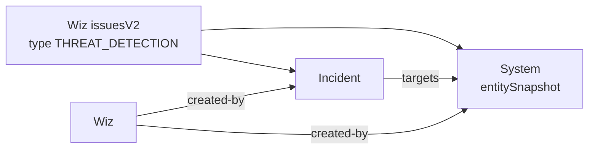

# OpenCTI Wiz Cloud Connector

Ingests **Wiz Threat Detection Issues** from a Wiz tenant as **OpenCTI Incidents**, together with the affected cloud asset as a **System** linked by a `targets` relationship.

> **Not to be confused with the `wiz` connector**, which imports the public Wiz Research threat landscape feed from threats.wiz.io. This connector imports your own tenant's findings from the authenticated Wiz GraphQL API. The two are complementary.

Table of Contents

- [Introduction](#introduction)
- [Requirements](#requirements)
- [Configuration variables](#configuration-variables)
- [Deployment](#deployment)
- [Behavior](#behavior)
- [Known limitations](#known-limitations)

## Introduction

[Wiz](https://www.wiz.io/) is a cloud security platform. Its Threat Detection Rules evaluate cloud events, audit logs and runtime signals, and raise **Issues** of type `THREAT_DETECTION` when suspicious activity is detected.

This connector polls the Wiz GraphQL API (`issuesV2`) and converts each threat detection issue into STIX 2.1 objects pushed to OpenCTI.

## Requirements

- OpenCTI Platform
- A Wiz **service account** (client credentials) with the `read:issues` scope
- Your tenant GraphQL endpoint (Wiz portal, Tenant Info), e.g. `https://api.us17.app.wiz.io/graphql`

## Configuration variables

Find all the configuration variables available here: [Connector Configurations](https://github.com/OpenCTI-Platform/connectors/blob/master/external-import/wiz-cloud/__metadata__/CONNECTOR_CONFIG_DOC.md)

The `opencti` and `connector` options in the `docker-compose.yml` and `config.yml` are the same as for any other connector. For more information regarding variables, please refer to [OpenCTI's documentation on connectors](https://docs.opencti.io/latest/deployment/connectors/).

## Deployment

### Docker

```shell
docker compose up -d
```

### Manual

```shell
pip install -r requirements.txt
cp config.yml.sample config.yml   # then edit
python src/main.py
```

## Behavior



| OpenCTI | Wiz source |
|---|---|
| Incident `name` | `sourceRules[].name` + the Wiz issue `id` |
| Incident `description` | `description` (omitted when empty) |
| Incident `first_seen` / `last_seen` | `firstEventAt` / `lastEventAt` (fallback `createdAt` / `updatedAt`) |
| Incident `severity` | `severity` |
| Incident external reference | `url` (Wiz portal deep link) + issue `id` |
| System `name` | `entitySnapshot.name` |
| System external reference | `entitySnapshot.externalId` (+ `cloudProviderURL` when present) |
| System `labels` | `entitySnapshot.tags` as `key=value` |
| Relationship | Incident `targets` System |

Incremental behavior: on the first run, issues created within the `since` window are imported. On subsequent runs, only issues created after the highest `createdAt` previously seen are fetched (ordered `CREATED_AT DESC`). Entity IDs are deterministic, so re-runs never duplicate.

## Known limitations

- **Updates to already-imported issues are not re-imported.** The Wiz API does not allow filtering or ordering by `updatedAt`, so a status or severity change on an old issue is not detected. A periodic full re-import (planned) will close this gap.
- Only `THREAT_DETECTION` issues are imported. Posture findings (toxic combinations, cloud configuration) are out of scope.
- Threat actors and MITRE ATT&CK techniques from `threatDetectionDetails` are parsed but not yet converted (planned for the next milestone).
