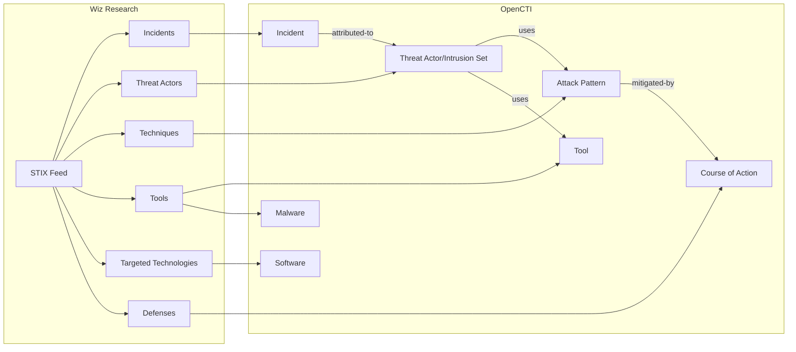

# OpenCTI Wiz Connector

| Status | Date | Comment |
|--------|------|---------|
| Community | -    | -       |

The Wiz connector imports cloud security threat intelligence from Wiz Research into OpenCTI.

## Table of Contents

- [OpenCTI Wiz Connector](#opencti-wiz-connector)
  - [Table of Contents](#table-of-contents)
  - [Introduction](#introduction)
  - [Installation](#installation)
    - [Requirements](#requirements)
  - [Configuration variables](#configuration-variables)
    - [OpenCTI environment variables](#opencti-environment-variables)
    - [Base connector environment variables](#base-connector-environment-variables)
    - [Connector extra parameters environment variables](#connector-extra-parameters-environment-variables)
  - [Deployment](#deployment)
    - [Docker Deployment](#docker-deployment)
    - [Manual Deployment](#manual-deployment)
  - [Usage](#usage)
  - [Behavior](#behavior)
  - [Debugging](#debugging)
  - [Additional information](#additional-information)

## Introduction

This connector imports threat intelligence data publicly available from [Wiz Research](https://threats.wiz.io/). The data provides comprehensive insights into cloud security threats including:

- **Incidents**: Historical collection of past cloud security incidents and campaigns, offering insights into targeting patterns, initial access methods, and effective impact.

- **Actors**: Profiles of threat actors involved in cloud security incidents, shedding light on their potential motivations and victimology for risk assessment and threat modeling.

- **Techniques**: Attack techniques used by threat actors in cloud security incidents, aligned with the MITRE ATT&CK matrix framework.

- **Tools**: Software utilized by threat actors in their activities targeting cloud environments, from penetration testing utilities to bespoke malware.

- **Targeted Technologies**: Frequently targeted software in cloud environments, noting their prevalence and related incidents and techniques.

- **Defenses**: Cloud security measures that can mitigate risks and prevent or detect attack techniques, mapped to the MITRE D3FEND matrix.

## Installation

### Requirements

- OpenCTI Platform >= 6.3.8
- Internet access to https://threats.wiz.io/

## Configuration variables

Find all the configuration variables available here: [Connector Configurations](./__metadata__/CONNECTOR_CONFIG_DOC.md)

_The `opencti` and `connector` options in the `docker-compose.yml` and `config.yml` are the same as for any other connector.
For more information regarding variables, please refer to [OpenCTI's documentation on connectors](https://docs.opencti.io/latest/deployment/connectors/)._

## Deployment

### Docker Deployment

Build the Docker image:

```bash
docker build -t opencti/connector-wiz:latest .
```

Configure the connector in `docker-compose.yml`:

```yaml
  connector-wiz:
    image: opencti/connector-wiz:latest
    environment:
      - OPENCTI_URL=http://localhost
      - OPENCTI_TOKEN=ChangeMe
      - CONNECTOR_ID=ChangeMe
      - CONNECTOR_NAME=Wiz
      - CONNECTOR_SCOPE=wiz
      - CONNECTOR_LOG_LEVEL=info
      - CONNECTOR_DURATION_PERIOD=P1D
      - WIZ_THREAT_ACTOR_AS_INTRUSION_SET=false
      - WIZ_TLP_LEVEL=clear
    restart: always
```

Start the connector:

```bash
docker compose up -d
```

### Manual Deployment

1. Create `config.yml` based on `config.yml.sample`.

2. Install dependencies:

```bash
pip3 install -r requirements.txt
```

3. Start the connector:

```bash
python3 main.py
```

## Usage

The connector runs automatically at the interval defined by `CONNECTOR_DURATION_PERIOD`. To force an immediate run:

**Data Management → Ingestion → Connectors**

Find the connector and click the refresh button to reset the state and trigger a new data fetch.

## Behavior

The connector fetches cloud threat intelligence from Wiz Research and imports it into OpenCTI.

### Data Flow



### Entity Mapping

| Wiz Data               | OpenCTI Entity               | Description                                      |
|------------------------|------------------------------|--------------------------------------------------|
| Incident               | Incident                     | Cloud security incident or campaign              |
| Actor                  | Threat Actor or Intrusion Set| Threat actor profile (configurable)              |
| Technique              | Attack Pattern               | MITRE ATT&CK aligned technique                   |
| Tool (Legitimate)      | Tool                         | Legitimate software used maliciously             |
| Tool (Malware)         | Malware                      | Malicious software                               |
| Targeted Technology    | Software                     | Frequently targeted cloud software               |
| Defense                | Course of Action             | Mitigation mapped to MITRE D3FEND                |

### Configuration Options

#### Threat Actor as Intrusion Set

Set `WIZ_THREAT_ACTOR_AS_INTRUSION_SET=true` to convert Threat Actor objects to Intrusion Set objects. This is useful when:

- You prefer to model threat actors as Intrusion Sets for consistency
- Your threat intelligence workflow uses Intrusion Sets for actor tracking

#### TLP Marking

All imported data is marked with the configured TLP level:

| TLP Level    | Description                                      |
|--------------|--------------------------------------------------|
| clear/white  | Publicly available information (default)         |
| green        | Limited disclosure to community                  |
| amber        | Limited disclosure, need-to-know basis           |
| amber+strict | Strict need-to-know within organization          |
| red          | Personal for named recipients only               |

### External References

All imported entities include an external reference to the Wiz Research STIX feed:

- **Source**: Connector name
- **URL**: https://www.wiz.io/api/feed/cloud-threat-landscape/stix.json
- **Description**: Comprehensive threat intelligence database of cloud security incidents

## Debugging

Enable verbose logging:

```env
CONNECTOR_LOG_LEVEL=debug
```

## Additional information

- **Public Feed**: No authentication required; data is publicly available
- **STIX Format**: Wiz provides data in native STIX format
- **MITRE Mappings**: Techniques map to ATT&CK, defenses map to D3FEND
- **Reference**: [Wiz Cloud Threat Landscape](https://threats.wiz.io/)
