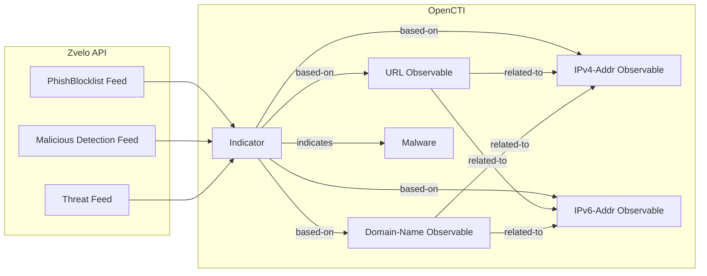

# OpenCTI Zvelo CTI Connector

| Status | Date | Comment |
|--------|------|---------|
| Filigran Verified | -    | -       |

The Zvelo connector imports indicators of compromise (IOCs) from Zvelo Cyber Threat Intelligence feeds into OpenCTI.

## Table of Contents

- [OpenCTI Zvelo CTI Connector](#opencti-zvelo-cti-connector)
  - [Table of Contents](#table-of-contents)
  - [Introduction](#introduction)
  - [Installation](#installation)
    - [Requirements](#requirements)
  - [Configuration variables](#configuration-variables)
    - [OpenCTI environment variables](#opencti-environment-variables)
    - [Base connector environment variables](#base-connector-environment-variables)
    - [Connector extra parameters environment variables](#connector-extra-parameters-environment-variables)
  - [Deployment](#deployment)
    - [Docker Deployment](#docker-deployment)
    - [Manual Deployment](#manual-deployment)
  - [Usage](#usage)
  - [Behavior](#behavior)
  - [Debugging](#debugging)
  - [Additional information](#additional-information)

## Introduction

[Zvelo](https://zvelo.com/) provides cyber threat intelligence feeds for detecting phishing, malware, and other malicious content. This connector supports ingestion from two data collections:

- **[PhishBlocklist](https://zvelo.com/zvelocti-cyber-threat-intelligence/phishblocklist/)**: Phishing threat intelligence data feed
- **[Malicious Detailed Detection](https://zvelo.com/zvelocti-cyber-threat-intelligence/malicious-detailed-detection-feed/)**: Malicious threat intelligence data feed

API documentation: https://docs.zvelo.io/

## Installation

### Requirements

- OpenCTI Platform >= 6.4.0
- Zvelo CTI subscription with API credentials

## Configuration variables

There are a number of configuration options, which are set either in `docker-compose.yml` (for Docker) or in `config.yml` (for manual deployment).

### OpenCTI environment variables

| Parameter     | config.yml | Docker environment variable | Mandatory | Description                                          |
|---------------|------------|-----------------------------|-----------|------------------------------------------------------|
| OpenCTI URL   | url        | `OPENCTI_URL`               | Yes       | The URL of the OpenCTI platform.                     |
| OpenCTI Token | token      | `OPENCTI_TOKEN`             | Yes       | The default admin token set in the OpenCTI platform. |

### Base connector environment variables

| Parameter       | config.yml | Docker environment variable | Default                                          | Mandatory | Description                                                              |
|-----------------|------------|-----------------------------|--------------------------------------------------|-----------|--------------------------------------------------------------------------|
| Connector ID    | id         | `CONNECTOR_ID`              |                                                  | Yes       | A unique `UUIDv4` identifier for this connector instance.                |
| Connector Name  | name       | `CONNECTOR_NAME`            | Zvelo                                            | No        | Name of the connector.                                                   |
| Connector Scope | scope      | `CONNECTOR_SCOPE`           | ipv4-addr,ipv6-addr,domain,url,indicator,malware | No        | The scope or type of data the connector is importing.                    |
| Log Level       | log_level  | `CONNECTOR_LOG_LEVEL`       | info                                             | No        | Determines the verbosity of logs: `debug`, `info`, `warn`, or `error`.   |

### Connector extra parameters environment variables

| Parameter     | config.yml    | Docker environment variable | Default                | Mandatory | Description                                                    |
|---------------|---------------|-----------------------------|------------------------|-----------|----------------------------------------------------------------|
| Client ID     | client_id     | `ZVELO_CLIENT_ID`           |                        | Yes       | Zvelo client ID.                                               |
| Client Secret | client_secret | `ZVELO_CLIENT_SECRET`       |                        | Yes       | Zvelo client secret.                                           |
| Collections   | collections   | `ZVELO_COLLECTIONS`         | phish,malicious,threat | Yes       | Data collections to fetch: `phish`, `malicious`, `threat`.     |

## Deployment

### Docker Deployment

Build the Docker image:

```bash
docker build -t opencti/connector-zvelo:latest .
```

Configure the connector in `docker-compose.yml`:

```yaml
  connector-zvelo:
    image: opencti/connector-zvelo:latest
    environment:
      - OPENCTI_URL=http://localhost
      - OPENCTI_TOKEN=ChangeMe
      - CONNECTOR_ID=ChangeMe
      - CONNECTOR_NAME=Zvelo
      - CONNECTOR_SCOPE=ipv4-addr,ipv6-addr,domain,url,indicator,malware
      - CONNECTOR_LOG_LEVEL=info
      - ZVELO_CLIENT_ID=ChangeMe
      - ZVELO_CLIENT_SECRET=ChangeMe
      - ZVELO_COLLECTIONS=phish,malicious,threat
    restart: always
```

Start the connector:

```bash
docker compose up -d
```

### Manual Deployment

1. Create `config.yml` based on `config.yml.sample`.

2. Install dependencies:

```bash
pip3 install -r requirements.txt
```

3. Start the connector:

```bash
python3 main.py
```

## Usage

The connector runs automatically at the configured interval. To force an immediate run:

**Data Management → Ingestion → Connectors**

Find the connector and click the refresh button to reset the state and trigger a new data fetch.

## Behavior

The connector fetches threat intelligence from Zvelo API and imports it into OpenCTI as indicators, observables, and malware entities.

### Data Flow



### Entity Mapping

| Zvelo Data           | OpenCTI Entity      | Description                                      |
|----------------------|---------------------|--------------------------------------------------|
| URL IOC              | URL                 | Malicious URL observable                         |
| Domain IOC           | Domain-Name         | Malicious domain observable                      |
| IP IOC               | IPv4-Addr/IPv6-Addr | Malicious IP observable                          |
| IOC Pattern          | Indicator           | STIX indicator with pattern                      |
| Malware Family       | Malware             | Associated malware family                        |
| Related IP (ip_info) | IPv4-Addr/IPv6-Addr | IP addresses associated with the IOC             |

### Collection Processing

#### PhishBlocklist Collection

| Field             | OpenCTI Property        | Description                          |
|-------------------|-------------------------|--------------------------------------|
| url               | URL value               | Phishing URL                         |
| confidence_level  | x_opencti_score         | Confidence score                     |
| discovered_date   | valid_from, created     | Discovery timestamp                  |
| brand             | description             | Targeted brand (if available)        |
| ip_info           | IPv4/IPv6 observables   | Associated IP addresses              |

#### Malicious Detection Collection

| Field             | OpenCTI Property        | Description                          |
|-------------------|-------------------------|--------------------------------------|
| url               | URL value               | Malicious URL                        |
| confidence_level  | x_opencti_score         | Confidence score                     |
| discovered_date   | valid_from, created     | Discovery timestamp                  |
| ip_info           | IPv4/IPv6 observables   | Associated IP addresses              |

#### Threat Collection

| Field             | OpenCTI Property        | Description                          |
|-------------------|-------------------------|--------------------------------------|
| ioc               | Observable value        | IOC value (URL, domain, or IP)       |
| ioc_type          | Observable type         | Type: `url`, `domain`, or `ip`       |
| threat_type       | labels                  | Type of threat                       |
| malware_family    | Malware name            | Associated malware family            |
| confidence_level  | x_opencti_score         | Confidence score                     |
| discovered_date   | valid_from, created     | Discovery timestamp                  |
| ip_info           | IPv4/IPv6 observables   | Associated IP addresses              |

### Relationships Created

| Source        | Relationship | Target          | Description                           |
|---------------|--------------|-----------------|---------------------------------------|
| Indicator     | based-on     | Observable      | Indicator based on observable         |
| Indicator     | indicates    | Malware         | Indicator indicates malware family    |
| Observable    | related-to   | IPv4-Addr/IPv6  | Main observable related to IP         |

## Debugging

Enable verbose logging:

```env
CONNECTOR_LOG_LEVEL=debug
```

## Additional information

- **API Documentation**: https://docs.zvelo.io/
- **TLP Marking**: All data imported with TLP:AMBER
- **Author Identity**: Created as "Zvelo" organization
- **Reference**: [Zvelo CTI](https://zvelo.com/zvelocti-cyber-threat-intelligence/)
