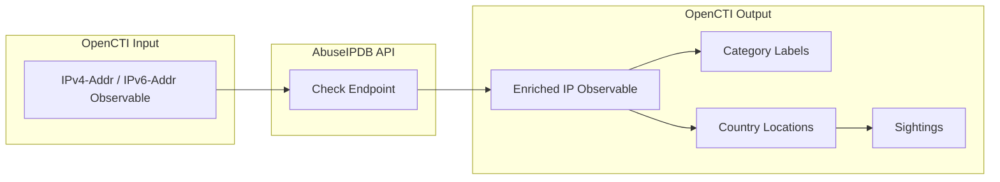

# OpenCTI AbuseIPDB Connector

The AbuseIPDB connector enriches IP address observables in OpenCTI with abuse reports, confidence scores, and category labels from AbuseIPDB's community-driven database.

| Status            | Date | Comment |
|-------------------|------|---------|
| Filigran Verified | -    | -       |

## Table of Contents

- [OpenCTI AbuseIPDB Connector](#opencti-abuseipdb-connector)
  - [Table of Contents](#table-of-contents)
  - [Introduction](#introduction)
  - [Installation](#installation)
    - [Requirements](#requirements)
  - [Configuration variables](#configuration-variables)
    - [OpenCTI environment variables](#opencti-environment-variables)
    - [Base connector environment variables](#base-connector-environment-variables)
    - [Connector extra parameters environment variables](#connector-extra-parameters-environment-variables)
  - [Deployment](#deployment)
    - [Docker Deployment](#docker-deployment)
    - [Manual Deployment](#manual-deployment)
  - [Usage](#usage)
  - [Behavior](#behavior)
  - [Debugging](#debugging)
  - [Additional information](#additional-information)

## Introduction

AbuseIPDB is a robust platform that collects and shares data on malicious IP addresses reported by users around the world. It serves as a valuable tool for cybersecurity teams looking to identify and block IP addresses associated with abusive activities, such as spam, hacking attempts, and other malicious acts. By providing a community-driven database, AbuseIPDB helps organizations strengthen their defenses against network-based threats.

The integration of AbuseIPDB with OpenCTI allows for the seamless enrichment of IP address observables with real-time context on potentially harmful IPs. This enrichment provides abuse confidence scores, category labels, and geographic sighting information, enabling security teams to implement more effective blocking and monitoring strategies.

## Installation

### Requirements

- OpenCTI Platform >= 6.5.1
- AbuseIPDB API key (registration at [abuseipdb.com](https://www.abuseipdb.com))

## Configuration variables

There are a number of configuration options, which are set either in `docker-compose.yml` (for Docker) or in `config.yml` (for manual deployment).

### OpenCTI environment variables

| Parameter     | config.yml | Docker environment variable | Mandatory | Description                                          |
|---------------|------------|-----------------------------|-----------|------------------------------------------------------|
| OpenCTI URL   | url        | `OPENCTI_URL`               | Yes       | The URL of the OpenCTI platform.                     |
| OpenCTI Token | token      | `OPENCTI_TOKEN`             | Yes       | The default admin token set in the OpenCTI platform. |

### Base connector environment variables

| Parameter       | config.yml | Docker environment variable | Default             | Mandatory | Description                                                                                         |
|-----------------|------------|-----------------------------|---------------------|-----------|-----------------------------------------------------------------------------------------------------|
| Connector ID    | id         | `CONNECTOR_ID`              |                     | Yes       | A unique `UUIDv4` identifier for this connector instance.                                           |
| Connector Name  | name       | `CONNECTOR_NAME`            |                     | Yes       | Name of the connector.                                                                              |
| Connector Scope | scope      | `CONNECTOR_SCOPE`           | IPv4-Addr,IPv6-Addr | Yes       | The scope of observables the connector will enrich.                                                 |
| Connector Type  | type       | `CONNECTOR_TYPE`            | INTERNAL_ENRICHMENT | Yes       | Should always be `INTERNAL_ENRICHMENT` for this connector.                                          |
| Log Level       | log_level  | `CONNECTOR_LOG_LEVEL`       | error               | No        | Determines the verbosity of the logs: `debug`, `info`, `warn`, or `error`.                          |
| Auto Mode       | auto       | `CONNECTOR_AUTO`            | true                | No        | Enables or disables automatic enrichment of observables.                                            |

### Connector extra parameters environment variables

| Parameter | config.yml       | Docker environment variable | Default   | Mandatory | Description                                                                                           |
|-----------|------------------|-----------------------------|-----------| ----------|-------------------------------------------------------------------------------------------------------|
| API Key   | abuseipdb.api_key | `ABUSEIPDB_API_KEY`        |           | Yes       | API key used to authenticate requests to the AbuseIPDB service.                                       |
| Max TLP   | abuseipdb.max_tlp | `ABUSEIPDB_MAX_TLP`        | TLP:AMBER | No        | Maximum TLP level for observables to be enriched. Observables with higher TLP will not be processed.  |

## Deployment

### Docker Deployment

Build the Docker image:

```bash
docker build -t opencti/connector-abuseipdb:latest .
```

Configure the connector in `docker-compose.yml`:

```yaml
  connector-abuseipdb:
    image: opencti/connector-abuseipdb:latest
    environment:
      - OPENCTI_URL=http://localhost
      - OPENCTI_TOKEN=ChangeMe
      - CONNECTOR_ID=ChangeMe_UUID4
      - CONNECTOR_NAME=AbuseIPDB
      - CONNECTOR_SCOPE=IPv4-Addr,IPv6-Addr
      - CONNECTOR_TYPE=INTERNAL_ENRICHMENT
      - CONNECTOR_LOG_LEVEL=error
      - CONNECTOR_AUTO=true
      - ABUSEIPDB_API_KEY=ChangeMe
      - ABUSEIPDB_MAX_TLP=TLP:AMBER
    restart: always
```

Start the connector:

```bash
docker compose up -d
```

### Manual Deployment

1. Copy and configure `config.yml` from the provided `config.yml.sample`.

2. Install dependencies:

```bash
pip3 install -r requirements.txt
```

3. Start the connector from the `src` directory:

```bash
python3 -m connector
```

## Usage

The connector enriches IP address observables either automatically (when `CONNECTOR_AUTO=true`) or manually via:

**Observations → Observables**

Select an IPv4 or IPv6 address observable, then click the enrichment button and choose AbuseIPDB.

## Behavior

The connector queries the AbuseIPDB API to retrieve abuse reports for IP addresses and enriches the observable with the results.

### Data Flow



### Enrichment Mapping

| AbuseIPDB Data           | OpenCTI Entity/Property     | Description                                                       |
|--------------------------|-----------------------------|-------------------------------------------------------------------|
| abuseConfidenceScore     | Observable Score            | Confidence score (0-100) indicating likelihood of malicious use   |
| isWhitelisted            | Label "whitelist"           | Applied when IP is in AbuseIPDB whitelist                         |
| reports[].categories     | Labels                      | Abuse category labels (e.g., "Brute Force", "Port Scan")          |
| reports[].reporterCountryCode | Country Location       | Country where the abuse was reported from                         |
| Report aggregation       | Sighting                    | Sighting relationship linking IP to reporting countries           |

### Abuse Categories

The connector maps AbuseIPDB category codes to human-readable labels:

| Code | Category          | Code | Category          |
|------|-------------------|------|-------------------|
| 3    | Fraud Orders      | 14   | Port Scan         |
| 4    | DDOS Attack       | 15   | Hacking           |
| 5    | FTP Brute-Force   | 16   | SQL Injection     |
| 6    | Ping of Death     | 17   | Spoofing          |
| 7    | Phishing          | 18   | Brute Force       |
| 8    | Fraud VOIP        | 19   | Bad Web Bot       |
| 9    | Open Proxy        | 20   | Exploited Host    |
| 10   | Web Spam          | 21   | Web App Attack    |
| 11   | Email Spam        | 22   | SSH               |
| 12   | Blog Spam         | 23   | IoT Targeted      |
| 13   | VPN IP            |      |                   |

### Processing Details

1. **TLP Check**: Validates observable TLP against `max_tlp` setting; skips if TLP exceeds maximum
2. **API Query**: Queries AbuseIPDB for reports in the last 365 days
3. **Whitelist Check**: If IP is whitelisted, adds "whitelist" label and external reference
4. **Report Processing**: If reports exist:
   - Sets abuse confidence score
   - Adds category labels for each unique abuse type
   - Aggregates reports by country
   - Creates Country Location entities
   - Creates Sighting relationships to countries with first/last seen dates and count

### Generated STIX Objects

| STIX Object Type | Description                                        |
|------------------|----------------------------------------------------|
| IPv4-Addr/IPv6-Addr (updated) | Original observable enriched with score and labels |
| Location (Country) | Countries from which abuse reports originated     |
| Sighting         | Links IP observable to country with report metadata |

## Debugging

Enable verbose logging by setting:

```env
CONNECTOR_LOG_LEVEL=debug
```

Log output includes:
- API request/response details
- Report processing progress
- STIX bundle creation and sending status

## Additional information

- **API Rate Limits**: AbuseIPDB has rate limits based on subscription tier; free accounts have limited daily queries
- **Report Age**: The connector retrieves reports from the last 365 days
- **External Reference**: A link to the AbuseIPDB check page is added for whitelisted IPs
- **Automatic Enrichment**: When `CONNECTOR_AUTO=true`, all new IP observables matching the connector scope are automatically enriched
- **Playbook Support**: This connector supports OpenCTI playbook automation
