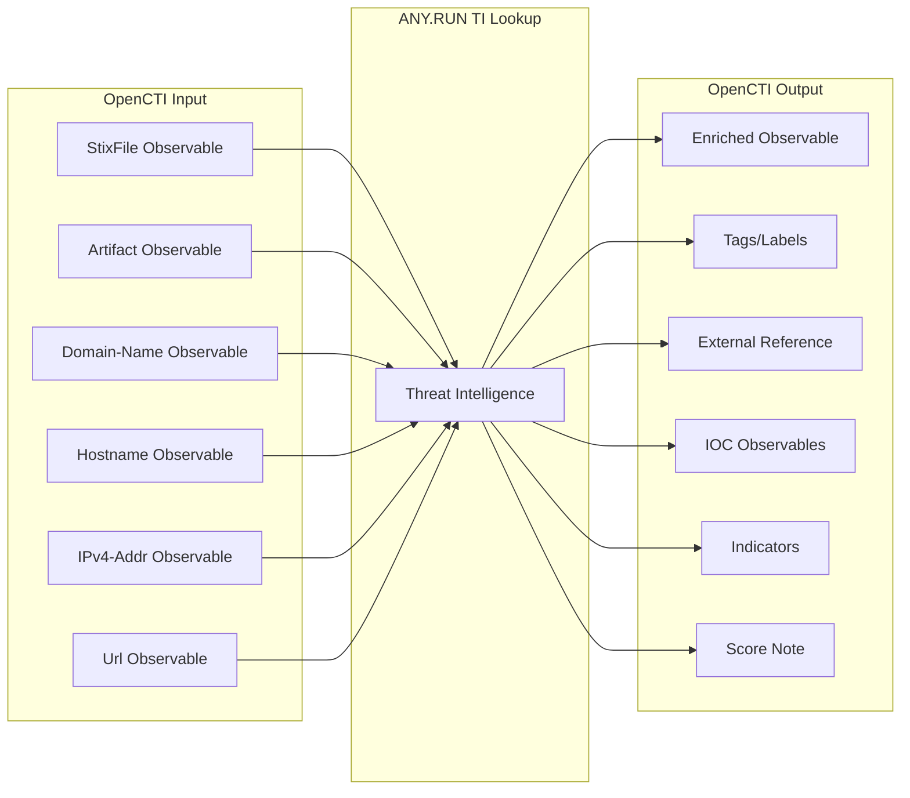

<p align="center">
    <a href="#readme">
        
    </a>
</p>

______________________________________________________________________

# OpenCTI ANY.RUN TI Lookup Connector

| Status           | Date | Comment |
|------------------|------|---------|
| Partner Verified | -    | -       |

The ANY.RUN TI Lookup connector analyzes StixFile, Artifact, Domain-Name, Hostname, IPv4-Addr or Url observables in the ANY.RUN Threat Intelligence Lookup, enriching them with search results including threat scores, tags, country relationships and IOCs.

## Table of Contents

- [OpenCTI ANY.RUN TI Lookup Connector](#opencti-anyrun-ti-lookup-connector)
  - [Table of Contents](#table-of-contents)
  - [Introduction](#introduction)
  - [Installation](#installation)
    - [Requirements](#requirements)
    - [Generate API-KEY](#generate-api-key)
  - [Configuration variables](#configuration-variables)
    - [OpenCTI environment variables](#opencti-environment-variables)
    - [Base connector environment variables](#base-connector-environment-variables)
    - [Base ANY.RUN environment variables](#base-anyrun-environment-variables)
  - [Deployment](#deployment)
    - [Docker Deployment](#docker-deployment)
    - [Manual Deployment](#manual-deployment)
  - [Usage](#usage)
  - [Behavior](#behavior)
  - [Debugging](#debugging)
  - [Additional information](#additional-information)
  - [Support](#support)

## Introduction

ANY.RUN’s [Threat Intelligence Lookup](https://any.run/threat-intelligence-lookup/?utm_source=anyrungithub&utm_medium=documentation&utm_campaign=opencti_lookup&utm_content=linktolookuplanding) (TI Lookup) is a service that allows you to browse IOCs and related threat data to simplify and enrich cyberattack investigations. 

The Threat Intelligence Lookup сonnector enables OpenCTI users to browse various types of IOCs, from IPs and domains to URLs and hashes. 

* Browse indicators in TI Lookup without leaving OpenCTI
* Receive data related to your query to gain actionable insights
* Use them for incident response, to create new rules, train models, update playbooks, etc. 

As a result of integration of TI Lookup with OpenCTI, you’ll achieve: 

* Early Threat Detection: Correlate IOCs to identify incidents before they escalate.
* Proactive Defense Enrichment: Collect indicators from attacks on other companies to update your detection systems.
* Reduced MTTR and Increased Detection Rate: Access to rich threat context enables SOCs to make informed decisions fast.

## Installation

To use this integration, make sure that you have an active [ANY.RUN TI Lookup license](https://intelligence.any.run/plans/?utm_source=anyrungithub&utm_medium=documentation&utm_campaign=opencti_lookup&utm_content=linktotiplans).
ANY.RUN TI Lookup connector for OpenCTI is a standalone Python service that requires access to both the OpenCTI platform and RabbitMQ.
RabbitMQ credentials and connection parameters are provided automatically by the OpenCTI API, based on the platform’s configuration. 

You can enable the connector in one of the following ways: 

* Run as a Python process: simply configure the config.yml file with the appropriate values and launch the connector directly.
* Run in Docker: use the OpenCTI docker image opencti/connector-anyrun-lookup

### Requirements

- OpenCTI Platform >= 6.0.0
- Available on ANY.RUN plans with API access, including trial

### Generate API-KEY

* Go to [ANY.RUN Sandbox](https://app.any.run/?utm_source=anyrungithub&utm_medium=documentation&utm_campaign=opencti_sandbox&utm_content=linktoservice)
* Click Profile > API and Limits > Generate > Copy


## Configuration variables

There are a number of configuration options, which are set either in `docker-compose.yml` (for Docker) or in `config.yml` (for manual deployment).

#### OpenCTI environment variables
| Parameter                    | Docker envvar                    | Mandatory | Description                                                                                                                                                                                  |
|------------------------------|----------------------------------|-----------|----------------------------------------------------------------------------------------------------------------------------------------------------------------------------------------------|
| `opencti_url`                | `OPENCTI_URL`                    | Yes       | The URL of the OpenCTI platform. Note that final `/` should be avoided. Example value: `http://opencti:8080`                                                                                 |
| `opencti_token`              | `OPENCTI_TOKEN`                  | Yes       | The default admin token configured in the OpenCTI platform parameters file. We recommend setting up a separate ``OPENCTI_TOKEN`` named **ANY.RUN** to identify the work of our integrations. |

#### Base connector environment variables
| Parameter                    | Docker envvar                    | Mandatory | Description                                                                                                                                                                                  |
|------------------------------|----------------------------------|-----------|----------------------------------------------------------------------------------------------------------------------------------------------------------------------------------------------|
| `connector_id`               | `CONNECTOR_ID`                   | Yes       | A valid arbitrary `UUIDv4` that must be unique for this connector.                                                                                                                           |
| `connector_type`             | `CONNECTOR_TYPE`                 | Yes       | A connector type.                                                                                                                                                                            |
| `connector_name`             | `CONNECTOR_NAME`                 | Yes       | A connector name to be shown in OpenCTI.                                                                                                                                                     |
| `connector_scope`            | `CONNECTOR_SCOPE`                | Yes       | Supported scope. E. g., `text/html`.                                                                                                                                                         |                     
| `connector_auto`             | `CONNECTOR_AUTO`                 | Yes       | Enable/disable auto-enrichment of observables.                                                                                                                                               |
| `connector_confidence_level` | `CONNECTOR_CONFIDENCE_LEVEL`     | Yes       | The default confidence level for created sightings (a number between 0 and 100, where 0 = Unknown and 100 = Fully trusted).                                                                  |
| `connector_log_level`        | `CONNECTOR_LOG_LEVEL`            | Yes       | The log level for this connector, could be `debug`, `info`, `warn` or `error` (less verbose).                                                                                                |


#### Base ANY.RUN environment variables
| Parameter                    | Docker env_var                   | Mandatory | Description                                                                                                                                                                                  |
|------------------------------|----------------------------------|-----------|----------------------------------------------------------------------------------------------------------------------------------------------------------------------------------------------|
| `token`                      | `ANYRUN_API_KEY`                   | Yes       | ANY.RUN Lookup API-KEY. See "Generate API KEY" section in the README file.                                                                                                                   |
| `lookup_depth`               | `ANYRUN_LOOKUP_DEPTH`                   | Yes       | Specify the number of days from the current date for which you want to lookup.                                                                                                               |

## Deployment

### Docker Deployment

Build the Docker image:

```bash
docker build -t opencti/connector-anyrun-lookup:latest .
```

Configure the connector in `docker-compose.yml`:

```yaml
connector-anyrun-ti-lookup:
  image: anyrun/opencti-connector-anyrun-ti-lookup:latest
  environment:
    # OpenCTI settings.
    - OPENCTI_URL=http://localhost # The URL of the OpenCTI platform. Note that final `/` should be avoided. Example value: `http://opencti:8080`
    - OPENCTI_TOKEN=ChangeMe # The default admin token configured in the OpenCTI platform parameters file.

    # Connector settings.
    - CONNECTOR_ID=ChangeMe # A valid arbitrary `UUIDv4` that must be unique for this connector.
    - CONNECTOR_TYPE=INTERNAL_ENRICHMENT # A connector type.
    - CONNECTOR_NAME=ANY.RUN TI Lookup # A connector name to be shown in OpenCTI.
    - CONNECTOR_SCOPE=StixFile,Artifact,Domain-Name,Hostname,IPv4-Addr,Url # Supported scope. E. g., `text/html`.
    - CONNECTOR_AUTO=false # Enable/disable auto-enrichment of observables.
    - CONNECTOR_CONFIDENCE_LEVEL=75 # From 0 (Unknown) to 100 (Fully trusted)
    - CONNECTOR_LOG_LEVEL=info # The log level for this connector, could be `debug`, `info`, `warn` or `error` (less verbose).

    # ANY.RUN base settings.
    - ANYRUN_API_KEY=ChangeMe # ANY.RUN Lookup API-KEY. See "Generate API token" section in the README file.
    - ANYRUN_LOOKUP_DEPTH=90 # Specify the number of days from the current date for which you want to lookup.
  restart: always
```

Start the connector:

```bash
docker compose up -d
```

### Manual Deployment

1. Copy and configure `config.yml` from the provided `config.yml.sample`.

2. Install dependencies:

```bash
pip3 install -r requirements.txt
```

3. Start the connector from the `src` directory:

```bash
python3 anyrun_lookup.py
```

## Usage

The connector enriches StixFile, Artifact, Domain-Name, Hostname, IPv4-Addr or Url observables by submitting them to the ANY.RUN TI Lookup.

**Observations → Observables**

Select a StixFile, Artifact, Domain-Name, Hostname, IPv4-Addr or Url then click the enrichment button and choose ANY.RUN TI Lookup.

## Behavior

The connector submits observables to ANY.RUN TI Lookup and imports the results back into OpenCTI.

### Data Flow



### Enrichment Mapping

| ANY.RUN Data           | OpenCTI Entity/Property | Description                           |
|------------------------|-------------------------|---------------------------------------|
| Lookup URL             | External Reference      | Link to the ANY.RUN TI Lookup request |
| lookup.summary.tags    | Labels                  | Tags assigned by ANY.RUN analysts     |
| lookup.summary.verdcit | Observable Score        | Threat verdict score from analysis    |
| IOCs (domain)          | Domain-Name Observable  | Extracted domain IOCs with indicators |
| IOCs (url)             | URL Observable          | Extracted URL IOCs with indicators    |
| IOCs (ip)              | IPv4-Addr Observable    | Extracted IP IOCs with indicators     |

### IOC Types Mapping

| ANY.RUN IOC Type | OpenCTI Observable Type |
|----------------|-------------------------|
| domain         | Domain-Name             |
| url            | Url                     |
| ip             | IPv4-Addr               |


### Processing Details

1. **Analysis Submission**: Submits StixFile, Artifact, Domain-Name, Hostname, IPv4-Addr or Url to ANY.RUN TI Lookup with configured lookup settings
2. **Tags/Labels**: Imports lookup tags as labels on the observable
3. **Country Relationship**: Adds country relationship to the main observable if it's type is IPv4-Addr 
4. **Score Update**: Updates observable score with verdict score (or creates note if lower)
5. **IOCs**: Creates observables and indicators for malicious and suspiocus IOCs
6. **Source tasks**: Adds related tasks to the main observable if applicable

### Generated STIX Objects

| STIX Object Type      | Condition              | Description                                                      |
|-----------------------|------------------------|------------------------------------------------------------------|
| External Reference    | Always                 | Link to ANY.RUN TI Lookup request                                |
| Labels                | When tags present      | Analysis tags applied to observable                              |
| Note                  | When score is lower    | Records ANY.RUN score when lower than existing                   |
| Domain-Name           | IOC enabled            | Extracted malicious domains                                      |
| URL                   | IOC enabled            | Extracted malicious URLs                                         |
| IPv4-Addr             | IOC enabled            | Extracted malicious IP addresses                                 |
| Relationship          | Various                | `related-to`, `based-on`, `located-at` linking entities together |

### Relationships Created

- Original Observable → `related-to` → Extracted IOC Observables
- Indicator → `based-on` →  Extracted IOC Observables
- Original IPv4-Addr Observable → `located-at` → TI Lookup GEO Country information

## Debugging

Enable verbose logging by setting:

```env
CONNECTOR_LOG_LEVEL=debug
```

Log output includes:
- Lookup status polling
- IOC extraction progress
- Relationship creation status

## Additional information

- **Analysis Time**: TI Lookup typically takes 5-10 seconds depending on the observable
- **Enterprise Plan Required**: API access requires at minimum the "Enterprise" subscription plan
- **Rate Limits**: API calls are subject to ANY.RUN rate limits based on subscription tier
- **API Access Required**: Available on ANY.RUN plans with API access, including trial
- **Organization Identity**: The connector creates an "ANY.RUN" organization identity for attribution

## Support
This is an ANY.RUN’s supported connector. You can write to us for help with integration via [techsupport@any.run](mailto:techsupport@any.run) .
Contact us for a quote or demo via [this form](https://app.any.run/contact-us/?utm_source=anyrungithub&utm_medium=documentation&utm_campaign=opencti_lookup&utm_content=linktocontactus).
