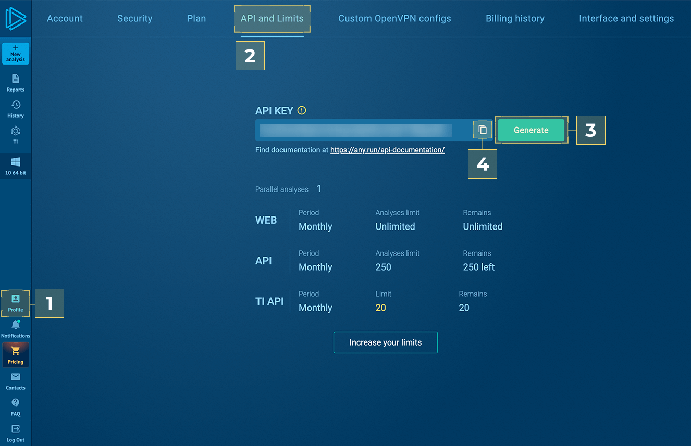

    

______________________________________________________________________

# ANY.RUN Sandbox connector for OpenCTI

The ANY.RUN Sandbox connector enables OpenCTI users to analyze observables such as artifacts and URLs in the cloud sandbox, enriching them with verdicts. This helps security teams detect and defend against emerging, evolving, and persistent cyber threats.

To use this integration, ensure that you have an active [ANY.RUN Sandbox license](https://any.run/demo/?utm_source=opencti_marketplace&utm_medium=integration&utm_campaign=opencti_form).

## Installation

The ANY.RUN Threat Intelligence Lookup connector for OpenCTI is a standalone Python service that requires access to both the OpenCTI platform and RabbitMQ.

RabbitMQ credentials and connection parameters are provided automatically by the OpenCTI API, based on the platform’s configuration.

You can enable the connector in one of the following ways:

* Run as a Python process: simply configure the `config.yml` file with the appropriate values and launch the connector directly.

* Run in Docker: use the OpenCTI docker image `opencti/connector-anyrun-task:latest`

ANY.RUN provide a sample `docker-compose.yml` file, which can be used as a standalone deployment or integrated into OpenCTI’s main `docker-compose.yml`.

### Requirements

- OpenCTI Platform >= 6.7.4
- ANY.RUN Sandbox license

### Generate API key

* Follow [ANY.RUN](https://app.any.run/)
* [1] Profile > [2] API and Limits > [3] Generate > [4] Copy

### Configuration

The connector can be configured with the following variables:  

#### ANY.RUN common preferences
| Parameter                    | Docker envvar                    | Mandatory | Description                                                                                                     |
|------------------------------|----------------------------------|-----------|-----------------------------------------------------------------------------------------------------------------|
| `opencti_url`                | `OPENCTI_URL`                    | Yes       | The URL of the OpenCTI platform. Note that final `/` should be avoided. Example value: `http://opencti:8080`    |
| `opencti_token`              | `OPENCTI_TOKEN`                  | Yes       | The default admin token configured in the OpenCTI platform parameters file. We recommend setting up a separate ``OPENCTI_TOKEN`` named **ANY.RUN** to identify the work of our integrations.                                    |
| `connector_id`               | `CONNECTOR_ID`                   | Yes       | A valid arbitrary `UUIDv4` that must be unique for this connector.                                              |
| `connector_type`             | `CONNECTOR_TYPE`                 | Yes       | A connector type.                                                                                               |
| `connector_name`             | `CONNECTOR_NAME`                 | Yes       | A connector name to be shown in OpenCTI.                                                                        |
| `connector_scope`            | `CONNECTOR_SCOPE`                | Yes       | Supported scope. E. g., `text/html`.                                                                            |                     
| `connector_auto`             | `CONNECTOR_AUTO`                 | Yes       | Enable/disable auto-enrichment of observables.                                                                  |
| `connector_confidence_level` | `CONNECTOR_CONFIDENCE_LEVEL`     | Yes       | The default confidence level for created sightings (a number between 1 and 4).                                  |
| `connector_log_level`        | `CONNECTOR_LOG_LEVEL`            | Yes       | The log level for this connector, could be `debug`, `info`, `warn` or `error` (less verbose).                   |
| `token`                      | `ANYRUN_API_KEY`                 | Yes       | ANY.RUN Sandbox API-KEY. See "Generate API token" section in the README file.                                   |
| `opt_timeout`                      | `ANYRUN_OPT_TIMEOUT`                 | No        | Select analysis completion time. Size range: 10-660 seconds.                                                    |
| `opt_network_connect`                      | `ANYRUN_OPT_NETWORK_CONNECT`                 | No        | Enable network connection.                                                                                      |
| `opt_network_fakenet`                      | `ANYRUN_OPT_NETWORK_FAKENET`                 | No        | Enable FakeNet feature.                                                                                         |
| `opt_network_tor`                      | `ANYRUN_TOR`                 | No        | Enable TOR using.                                                                                               |
| `opt_network_geo`                      | `ANYRUN_GEO`                 | No        | TOR geolocation option. Example: US, AU                                                                         |
| `opt_network_mitm`                      | `ANYRUN_MITM`                 | No        | Enable HTTPS MITM Proxy using.                                                                                  |
| `opt_network_residential_proxy`                      | `ANYRUN_RESIDENTIAL_PROXY`                 | No        | Residential proxy using.                                                                                        |
| `opt_network_residential_proxy_geo`                      | `ANYRUN_RESIDENTIAL_PROXY_GEO`                 | No        | Residential proxy geolocation option. Example: US, AU.                                                          |
| `opt_privacy_type`                      | `ANYRUN_PRIVACY_TYPE`                 | No        | Privacy settings. Supports: public, bylink, owner, byteam.                                                      |
| `obj_ext_extension`                      | `ANYRUN_OBJ_EXT_EXTENSION`                 | No        | Automatically change file extension to valid.                                                                   |
| `env_locale`                      | `ANYRUN_ENV_LOCALE`                 | No        | Operation system's language. Use locale identifier or country name (Ex: "en-US" or "Brazil"). Case-insensitive. |

#### ANY.RUN Windows environment preferences

| Parameter                    | Docker envvar                    | Mandatory | Description                                                                                                   |
|------------------------------|----------------------------------|-----------|---------------------------------------------------------------------------------------------------------------|
|`os_type`                      | `ANYRUN_OS_TYPE`                 | Yes       | Must be `windows`|      
| `env_version`                | `ANYRUN_ENV_VERSION`                    | No       | Version of OS. Supports: 7, 10, 11.  |
| `env_bitness`              | `ANYRUN_ENV_BITNESS`                  | No       | Bitness of Operation System. Supports 32, 64.                                   |
| `env_type`               | `ANYRUN_ENV_TYPE`                   | No       | Environment preset type. You can select **development** env for OS Windows 10 x64. For all other cases, **complete** env is required.                                            |
| `obj_ext_startfolder`             | `ANYRUN_OBJ_EXT_STARTFOLDER`                 | No       | Supports: desktop, home, downloads, appdata, temp, windows, root.                                                                                             |
| `obj_ext_cmd`             | `ANYRUN_OBJ_EXT_CMD`                 | No       | Optional command-line arguments for the analyzed object. Use an empty string ("") to apply the default behavior. |
| `obj_force_elevation`            | `ANYRUN_OBJ_FORCE_ELEVATION`                | No       | Forces the file to execute with elevated privileges and an elevated token (for PE32, PE32+, PE64 files only). |                     
| `obj_ext_browser`             | `ANYRUN_OBJ_EXT_BROWSER`                 | No       | Browser name. Supports: Google Chrome, Mozilla Firefox, Internet Explorer, Microsoft Edge.                    |

#### ANY.RUN Linux environment preferences

| Parameter                    | Docker envvar                    | Mandatory | Description                                             |
|------------------------------|----------------------------------|-----------|---------------------------------------------------------|
|`os_type`                      | `ANYRUN_OS_TYPE`                 | Yes       | Must be `linux`| 
| `obj_ext_startfolder`             | `ANYRUN_OBJ_EXT_STARTFOLDER`                 | No        | Start object from. Supports: desktop, home, downloads, appdata, temp, windows, root.                                       |
| `obj_ext_cmd`             | `ANYRUN_OBJ_EXT_CMD`                 | No       | Optional command-line arguments for the analyzed object. Use an empty string ("") to apply the default behavior. |
| `run_as_root`            | `ANYRUN_RUN_AS_ROOT`                | No       | Run file with superuser privileges.                     |                     
| `obj_ext_browser`             | `ANYRUN_OBJ_EXT_BROWSER`                 | No       | Browser name. Supports: Google Chrome, Mozilla Firefox. |

#### ANY.RUN Android environment preferences

| Parameter                    | Docker envvar                    | Mandatory | Description                                                                                                  |
|------------------------------|----------------------------------|-----------|--------------------------------------------------------------------------------------------------------------|
|`os_type`                      | `ANYRUN_OS_TYPE`                 | Yes       | Must be `android`| 
| `obj_ext_cmd`             | `ANYRUN_OBJ_EXT_CMD`                 | No       | Optional command-line arguments for the analyzed object. Use an empty string ("") to apply the default behavior. |

## Support
This is an ANY.RUN supported connector. For support please contact <anyrun-integrations@any.run>