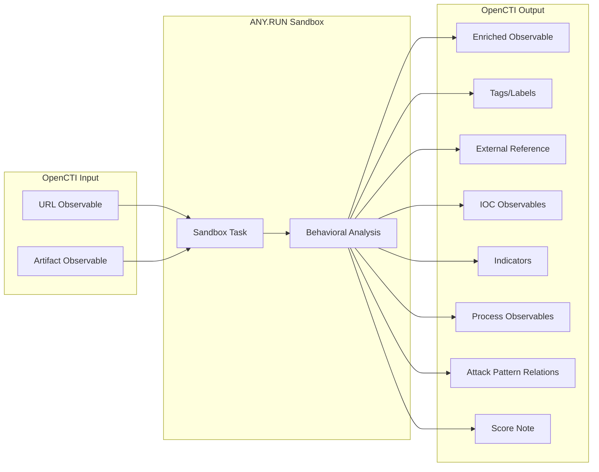

# OpenCTI ANY.RUN Task Connector

The ANY.RUN Task connector analyzes URL and Artifact observables in the ANY.RUN Interactive Online Malware Sandbox, enriching them with sandbox analysis results including threat scores, tags, IOCs, and MITRE ATT&CK patterns.

| Status            | Date | Comment |
|-------------------|------|---------|
| Filigran Verified | -    | -       |

## Table of Contents

- [OpenCTI ANY.RUN Task Connector](#opencti-anyrun-task-connector)
  - [Table of Contents](#table-of-contents)
  - [Introduction](#introduction)
  - [Installation](#installation)
    - [Requirements](#requirements)
  - [Configuration variables](#configuration-variables)
    - [OpenCTI environment variables](#opencti-environment-variables)
    - [Base connector environment variables](#base-connector-environment-variables)
    - [Connector extra parameters environment variables](#connector-extra-parameters-environment-variables)
  - [Deployment](#deployment)
    - [Docker Deployment](#docker-deployment)
    - [Manual Deployment](#manual-deployment)
  - [Usage](#usage)
  - [Behavior](#behavior)
  - [Debugging](#debugging)
  - [Additional information](#additional-information)

## Introduction

ANY.RUN is an interactive online malware sandbox that allows security researchers to analyze suspicious files and URLs in a safe, isolated environment. It provides detailed behavioral analysis, network activity monitoring, and threat intelligence data from malware execution.

This connector integrates ANY.RUN with OpenCTI to submit URL and Artifact (file) observables for sandbox analysis. The analysis results are imported back into OpenCTI, including threat verdicts, tags, IOCs extracted during analysis, MITRE ATT&CK technique mappings, and process behavior information.

## Installation

### Requirements

- OpenCTI Platform >= 6.0.0
- ANY.RUN "Hunter" plan or higher (API access required)

## Configuration variables

There are a number of configuration options, which are set either in `docker-compose.yml` (for Docker) or in `config.yml` (for manual deployment).

### OpenCTI environment variables

| Parameter     | config.yml | Docker environment variable | Mandatory | Description                                          |
|---------------|------------|-----------------------------|-----------|------------------------------------------------------|
| OpenCTI URL   | url        | `OPENCTI_URL`               | Yes       | The URL of the OpenCTI platform.                     |
| OpenCTI Token | token      | `OPENCTI_TOKEN`             | Yes       | The default admin token set in the OpenCTI platform. |

### Base connector environment variables

| Parameter          | config.yml       | Docker environment variable   | Default       | Mandatory | Description                                                                   |
|--------------------|------------------|-------------------------------|---------------|-----------|-------------------------------------------------------------------------------|
| Connector ID       | id               | `CONNECTOR_ID`                |               | Yes       | A unique `UUIDv4` identifier for this connector instance.                     |
| Connector Name     | name             | `CONNECTOR_NAME`              |               | Yes       | Name of the connector.                                                        |
| Connector Scope    | scope            | `CONNECTOR_SCOPE`             | Artifact,Url  | Yes       | The scope of observables the connector will enrich.                           |
| Connector Type     | type             | `CONNECTOR_TYPE`              | INTERNAL_ENRICHMENT | Yes | Should always be `INTERNAL_ENRICHMENT` for this connector.                    |
| Log Level          | log_level        | `CONNECTOR_LOG_LEVEL`         | error         | No        | Determines the verbosity of the logs: `debug`, `info`, `warn`, or `error`.    |
| Confidence Level   | confidence_level | `CONNECTOR_CONFIDENCE_LEVEL`  |               | Yes       | The default confidence level for created relationships (1-100).               |
| Auto Mode          | auto             | `CONNECTOR_AUTO`              | false         | No        | Enables or disables automatic enrichment of observables.                      |

### Connector extra parameters environment variables

| Parameter                 | config.yml                  | Docker environment variable         | Default        | Mandatory | Description                                                                        |
|---------------------------|-----------------------------|-------------------------------------|----------------|-----------|------------------------------------------------------------------------------------|
| API Token                 | anyrun.token                | `ANYRUN_TOKEN`                      |                | Yes       | ANY.RUN API token for authentication.                                              |
| API URL                   | anyrun.url                  | `ANYRUN_API_URL`                    | https://api.any.run | No   | Base URL for the ANY.RUN API.                                                      |
| Task Timer                | anyrun.timer                | `ANYRUN_TASK_TIMER`                 | 60             | No        | Sandbox execution time in seconds.                                                 |
| Operating System          | anyrun.os                   | `ANYRUN_OS`                         | windows        | No        | Operating system for sandbox environment.                                          |
| OS Bitness                | anyrun.bitness              | `ANYRUN_OS_BITNESS`                 | 64             | No        | Operating system bitness: `32` or `64`.                                            |
| OS Version                | anyrun.version              | `ANYRUN_OS_VERSION`                 | 10             | No        | Windows version: `7`, `8.1`, `10`, or `11`.                                        |
| OS Locale                 | anyrun.locale               | `ANYRUN_OS_LOCALE`                  | en-US          | No        | Operating system language locale.                                                  |
| Browser                   | anyrun.browser              | `ANYRUN_OS_BROWSER`                 | Google Chrome  | No        | Browser for URL analysis: `Google Chrome`, `Mozilla Firefox`, `Opera`, `Internet Explorer`, `Microsoft Edge`. |
| Privacy                   | anyrun.privacy              | `ANYRUN_PRIVACY`                    | bylink         | No        | Task privacy: `public`, `bylink`, `owner`, `team`.                                 |
| Automated Interactivity   | anyrun.automated_interactivity | `ANYRUN_AUTOMATED_INTERACTIVITY` | false          | No        | Enable ML-based automated interactivity during analysis.                           |
| Enable IOCs               | anyrun.ioc                  | `ANYRUN_IOC`                        | true           | No        | Import IOCs (domains, URLs, IPs) extracted during analysis.                        |
| Enable MITRE              | anyrun.mitre                | `ANYRUN_MITRE`                      | false          | No        | Create relationships to MITRE ATT&CK techniques.                                   |
| Enable Processes          | anyrun.processes            | `ANYRUN_PROCESSES`                  | false          | No        | Import malicious process observables.                                              |

## Deployment

### Docker Deployment

Build the Docker image:

```bash
docker build -t opencti/connector-anyrun-task:latest .
```

Configure the connector in `docker-compose.yml`:

```yaml
  connector-anyrun-task:
    image: opencti/connector-anyrun-task:latest
    environment:
      - OPENCTI_URL=http://localhost
      - OPENCTI_TOKEN=ChangeMe
      - CONNECTOR_ID=ChangeMe_UUID4
      - CONNECTOR_NAME=ANY.RUN Task
      - CONNECTOR_SCOPE=Artifact,Url
      - CONNECTOR_LOG_LEVEL=error
      - CONNECTOR_AUTO=false
      - ANYRUN_TOKEN=ChangeMe
      - ANYRUN_TASK_TIMER=120
      - ANYRUN_OS=windows
      - ANYRUN_OS_BITNESS=64
      - ANYRUN_OS_VERSION=10
      - ANYRUN_OS_LOCALE=en-US
      - ANYRUN_OS_BROWSER=Google Chrome
      - ANYRUN_PRIVACY=bylink
      - ANYRUN_AUTOMATED_INTERACTIVITY=false
      - ANYRUN_IOC=true
      - ANYRUN_MITRE=false
      - ANYRUN_PROCESSES=false
    restart: always
```

Start the connector:

```bash
docker compose up -d
```

### Manual Deployment

1. Copy and configure `config.yml` from the provided `config.yml.sample`.

2. Install dependencies:

```bash
pip3 install -r requirements.txt
```

3. Start the connector from the `src` directory:

```bash
python3 anyrun_task.py
```

## Usage

The connector enriches URL and Artifact observables by submitting them to the ANY.RUN sandbox. Due to the time required for sandbox analysis, automatic mode is typically disabled.

**Observations → Observables**

Select a URL or Artifact observable, then click the enrichment button and choose ANY.RUN Task.

## Behavior

The connector submits observables to ANY.RUN for sandbox analysis and imports the results back into OpenCTI.

### Data Flow



### Enrichment Mapping

| ANY.RUN Data               | OpenCTI Entity/Property      | Description                                                     |
|----------------------------|------------------------------|-----------------------------------------------------------------|
| Task URL                   | External Reference           | Link to the ANY.RUN task analysis page                          |
| analysis.tags              | Labels                       | Tags assigned by ANY.RUN analysts                               |
| scores.verdict.score       | Observable Score             | Threat verdict score from analysis                              |
| mitre                      | Attack Pattern Relationships | MITRE ATT&CK technique relationships (when enabled)             |
| IOCs (domain)              | Domain-Name Observable       | Extracted domain IOCs with indicators                           |
| IOCs (url)                 | URL Observable               | Extracted URL IOCs with indicators                              |
| IOCs (ip)                  | IPv4-Addr Observable         | Extracted IP IOCs with indicators                               |
| processes                  | Process Observable           | Malicious process information (when enabled)                    |

### IOC Types Mapping

| ANY.RUN IOC Type | OpenCTI Observable Type |
|------------------|-------------------------|
| domain           | Domain-Name             |
| url              | Url                     |
| ip               | IPv4-Addr               |

### Processing Details

1. **Task Submission**: Submits URL or Artifact to ANY.RUN with configured sandbox settings
2. **External Reference**: Creates link to the ANY.RUN task page
3. **Wait for Analysis**: Polls task status until completion (with timeout)
4. **Tags/Labels**: Imports analysis tags as labels on the observable
5. **Score Update**: Updates observable score with verdict score (or creates note if lower)
6. **MITRE ATT&CK** (optional): Creates `related-to` relationships to matching attack patterns
7. **IOCs** (optional): Creates observables and indicators for malicious IOCs found during analysis
8. **Processes** (optional): Creates Process observables for malicious processes with parent-child relationships

### Generated STIX Objects

| STIX Object Type      | Condition              | Description                                                |
|-----------------------|------------------------|------------------------------------------------------------|
| External Reference    | Always                 | Link to ANY.RUN task analysis                              |
| Labels                | When tags present      | Analysis tags applied to observable                        |
| Note                  | When score is lower    | Records ANY.RUN score when lower than existing             |
| Domain-Name           | IOC enabled            | Extracted malicious domains                                |
| URL                   | IOC enabled            | Extracted malicious URLs                                   |
| IPv4-Addr             | IOC enabled            | Extracted malicious IP addresses                           |
| Indicator             | IOC enabled            | STIX patterns for extracted IOCs                           |
| Process               | Processes enabled      | Malicious process information                              |
| Relationship          | Various                | `related-to` linking entities together                     |

### Relationships Created

- Original Observable → `related-to` → Extracted IOC Observables
- Original Observable → `related-to` → Attack Patterns (MITRE)
- Process → `related-to` → Original Observable
- Child Process → `related-to` → Parent Process

## Debugging

Enable verbose logging by setting:

```env
CONNECTOR_LOG_LEVEL=debug
```

Log output includes:
- Task submission details
- Task status polling
- IOC extraction progress
- Relationship creation status

## Additional information

- **Analysis Time**: Sandbox analysis typically takes 1-3 minutes depending on the sample
- **Task Timer**: Configure `ANYRUN_TASK_TIMER` based on expected analysis time
- **Privacy Settings**: Use `bylink` or `team` for sensitive samples
- **Hunter Plan Required**: API access requires at minimum the "Hunter" subscription plan
- **Rate Limits**: API calls are subject to ANY.RUN rate limits based on subscription tier
- **Organization Identity**: The connector creates an "ANY.RUN" organization identity for attribution
