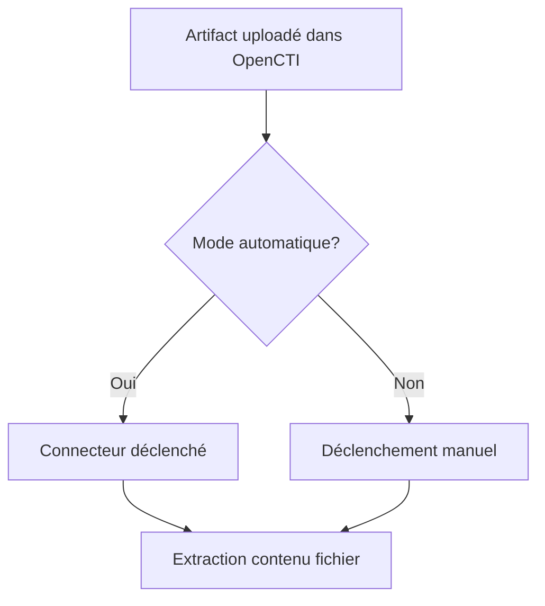
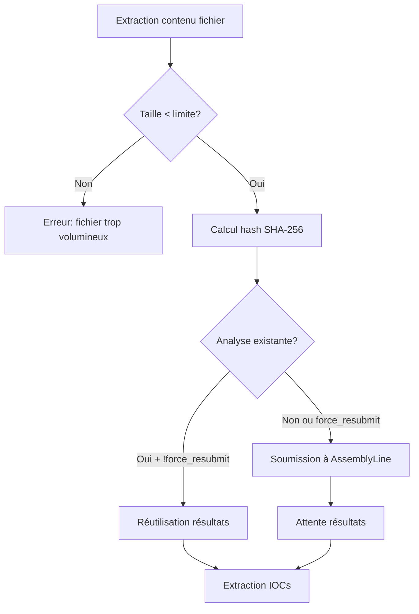
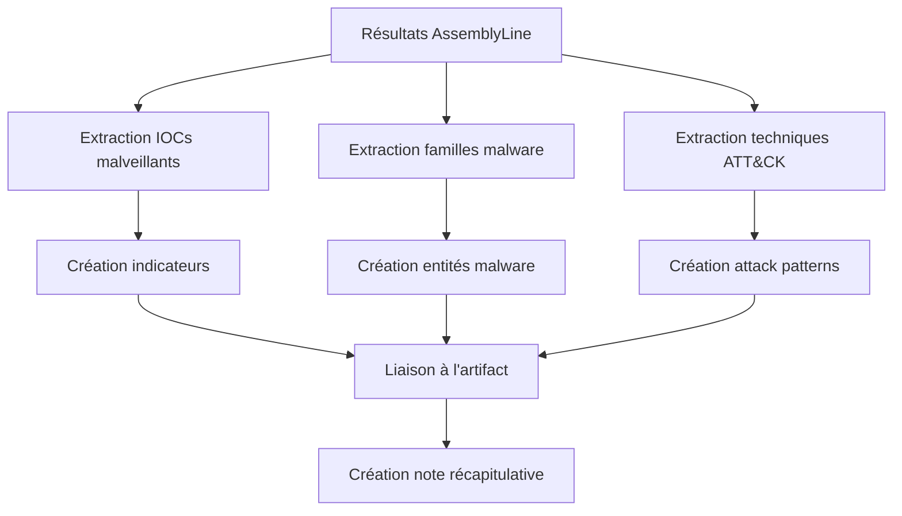

# OpenCTI AssemblyLine Analysis Connector - Documentation Complète

## 📋 Table des Matières

- [Vue d'ensemble](#vue-densemble)
- [Architecture](#architecture)
- [Installation et Configuration](#installation-et-configuration)
- [Fonctionnalités](#fonctionnalités)
- [Paramètres de Configuration](#paramètres-de-configuration)
- [Workflow d'Analyse](#workflow-danalyse)
- [Types d'Objets Créés](#types-dobjets-créés)
- [Logs et Monitoring](#logs-et-monitoring)
- [Dépannage](#dépannage)
- [Limitations](#limitations)
- [FAQ](#faq)

## 🎯 Vue d'ensemble

Le connecteur d'analyse AssemblyLine pour OpenCTI permet l'enrichissement automatique des artefacts de fichiers en soumettant ces fichiers à une plateforme AssemblyLine pour analyse malware. Il extrait automatiquement les IOCs malveillants, les familles de malware et les techniques MITRE ATT&CK pour créer des indicateurs de menace dans OpenCTI.

### Caractéristiques Principales

- **Analyse automatique** des fichiers uploadés dans OpenCTI
- **Extraction d'IOCs** (domaines, IPs, URLs malveillants)
- **Détection de familles malware** (NJRAT, XENORAT, etc.)
- **Mapping MITRE ATT&CK** (techniques d'attaque observées)
- **Support des IOCs suspects** (optionnel)
- **Contrôle de taille de fichier** (limite configurable)
- **Système de retry automatique** pour les uploads en cours
- **Réutilisation d'analyses existantes** (évite les duplications)

## 🏗️ Architecture

```
┌─────────────────┐    ┌──────────────────┐    ┌─────────────────┐
│   OpenCTI       │    │  Connecteur      │    │  AssemblyLine   │
│                 │    │  AssemblyLine    │    │  Platform       │
│ ┌─────────────┐ │    │                  │    │                 │
│ │  Artifact   │ │───▶│ ┌──────────────┐ │───▶│ ┌─────────────┐ │
│ │ (nouveau)   │ │    │ │ Traitement   │ │    │ │  Analyse    │ │
│ └─────────────┘ │    │ │ Automatique  │ │    │ │  Malware    │ │
│                 │    │ └──────────────┘ │    │ └─────────────┘ │
│ ┌─────────────┐ │◀───│ ┌──────────────┐ │◀───│ ┌─────────────┐ │
│ │ Indicators  │ │    │ │ Création     │ │    │ │ Résultats   │ │
│ │ AttackPatt. │ │    │ │ Objets CTI   │ │    │ │ + IOCs      │ │
│ │ Observables │ │    │ │              │ │    │ │ + ATT&CK    │ │
│ └─────────────┘ │    │ └──────────────┘ │    │ └─────────────┘ │
└─────────────────┘    └──────────────────┘    └─────────────────┘
```

## 🚀 Installation et Configuration

### Prérequis

- OpenCTI 5.x ou supérieur
- Accès à une instance AssemblyLine
- Docker et Docker Compose
- Clé API AssemblyLine valide

### Configuration Docker Compose

```yaml
services:
  connector-assemblyline:
    image: assemblyline-connector:latest
    container_name: connector-assemblyline
    environment:
      # ===========================
      # OpenCTI Configuration
      # ===========================
      - OPENCTI_URL=http://opencti:8080
      - OPENCTI_TOKEN=your-opencti-token
      
      # ===========================
      # Connector Configuration
      # ===========================
      - CONNECTOR_ID=your-uuid-v4-here
      - CONNECTOR_TYPE=INTERNAL_ENRICHMENT
      - CONNECTOR_NAME=AssemblyLine
      - CONNECTOR_SCOPE=Artifact
      - CONNECTOR_AUTO=true
      - CONNECTOR_CONFIDENCE_LEVEL=85
      - CONNECTOR_LOG_LEVEL=info
      
      # ===========================
      # AssemblyLine Configuration
      # ===========================
      - ASSEMBLYLINE_URL=https://your-assemblyline-instance.com
      - ASSEMBLYLINE_USER=your-username
      - ASSEMBLYLINE_APIKEY=your-api-key
      - ASSEMBLYLINE_VERIFY_SSL=true
      - ASSEMBLYLINE_SUBMISSION_PROFILE=default
      - ASSEMBLYLINE_TIMEOUT=600
      - ASSEMBLYLINE_FORCE_RESUBMIT=false
      - ASSEMBLYLINE_MAX_FILE_SIZE_MB=10
      - ASSEMBLYLINE_INCLUDE_SUSPICIOUS=false
      - ASSEMBLYLINE_CREATE_ATTACK_PATTERNS=true
      
    restart: unless-stopped
    depends_on:
      - opencti
```

### Configuration Alternative (config.yml)

```yaml
# config.yml
opencti:
  url: 'http://opencti:8080'
  token: 'your-opencti-token'

connector:
  id: 'your-uuid-v4-here'
  type: 'INTERNAL_ENRICHMENT'
  name: 'AssemblyLine'
  scope: 'Artifact'
  auto: true
  confidence_level: 85
  log_level: 'info'

assemblyline:
  url: 'https://your-assemblyline-instance.com'
  user: 'your-username'
  apikey: 'your-api-key'
  verify_ssl: true
  submission_profile: 'default'
  timeout: 600
  force_resubmit: false
  max_file_size_mb: 10
  include_suspicious: false
  create_attack_patterns: true
```

## ⚙️ Paramètres de Configuration

### Paramètres AssemblyLine

| Paramètre | Description | Valeur par défaut | Obligatoire |
|-----------|-------------|-------------------|-------------|
| `ASSEMBLYLINE_URL` | URL de l'instance AssemblyLine | - | ✅ |
| `ASSEMBLYLINE_USER` | Nom d'utilisateur AssemblyLine | - | ✅ |
| `ASSEMBLYLINE_APIKEY` | Clé API AssemblyLine | - | ✅ |
| `ASSEMBLYLINE_VERIFY_SSL` | Vérification SSL | `true` | ❌ |
| `ASSEMBLYLINE_SUBMISSION_PROFILE` | Profil d'analyse | `default` | ❌ |
| `ASSEMBLYLINE_TIMEOUT` | Timeout en secondes | `600` | ❌ |
| `ASSEMBLYLINE_FORCE_RESUBMIT` | Forcer nouvelle analyse | `false` | ❌ |

### Paramètres de Filtrage

| Paramètre | Description | Valeur par défaut | Exemples |
|-----------|-------------|-------------------|----------|
| `ASSEMBLYLINE_MAX_FILE_SIZE_MB` | Taille max en MB | `10` | `1`, `50`, `100` |
| `ASSEMBLYLINE_INCLUDE_SUSPICIOUS` | Inclure IOCs suspects | `false` | `true`, `false` |
| `ASSEMBLYLINE_CREATE_ATTACK_PATTERNS` | Créer patterns ATT&CK | `true` | `true`, `false` |

### Paramètres OpenCTI

| Paramètre | Description | Valeur par défaut |
|-----------|-------------|-------------------|
| `CONNECTOR_AUTO` | Mode automatique | `true` |
| `CONNECTOR_SCOPE` | Portée du connecteur | `Artifact` |
| `CONNECTOR_CONFIDENCE_LEVEL` | Niveau de confiance | `85` |

## 🔄 Workflow d'Analyse

### 1. Déclenchement



### 2. Traitement du Fichier



### 3. Extraction et Création d'Objets



### 4. Système de Retry

Le connecteur implémente un système de retry automatique pour gérer les uploads en cours :

- **Tentative 1** : Immédiate
- **Tentative 2** : Après 5 secondes + rafraîchissement données
- **Tentative 3** : Après 10 secondes + rafraîchissement données
- **Tentative 4** : Après 15 secondes + rafraîchissement données

## 📦 Types d'Objets Créés

### 1. Indicateurs (Indicators)

**IOCs Malveilleux :**
- **Domaines malveilleux** : Pattern STIX `[domain-name:value = 'evil.com']`
- **Adresses IP malveilleus** : Pattern STIX `[ipv4-addr:value = '1.2.3.4']`
- **URLs malveilleux** : Pattern STIX `[url:value = 'http://evil.com/payload']`

**Propriétés :**
- Score de confiance : 80-85
- Labels : `["malicious", "assemblyline"]`
- Références externes vers AssemblyLine

### 2. Observables

**Cyber Observables créés :**
- **Domain-Name** pour les domaines
- **IPv4-Addr** pour les adresses IP  
- **Url** pour les URLs

**Relations :**
- `Artifact` --[related-to]--> `Observable`
- `Indicator` --[based-on]--> `Observable`

### 3. Entités Malware

**Familles de malware détectées :**
- Nom basé sur détection AssemblyLine (NJRAT, XENORAT, etc.)
- Labels : `["trojan"]` (par défaut)
- Propriété `is_family: true`

### 4. Attack Patterns (MITRE ATT&CK)

**Techniques d'attaque :**
- Format : `T1027 - Obfuscated Files or Information`
- Kill Chain Phases MITRE ATT&CK
- Références externes vers MITRE
- Labels incluant la tactique et la confiance

**Relations :**
- `Artifact` --[uses]--> `Attack-Pattern`

### 5. Note Récapitulative

```markdown
# AssemblyLine Analysis Results

**Verdict:** MALICIOUS/SAFE
**Score:** 1500/2000
**Submission ID:** AL_submission_12345

## Malicious IOCs Created as Indicators
- **Malicious Domains:** 3
- **Malicious IP Addresses:** 2
- **Malicious URLs:** 1
- **Malware Families:** 2

## MITRE ATT&CK Analysis
- **Attack Techniques Identified:** 8

## File Information
- **SHA256:** abc123def456...
- **Type:** application/vnd.microsoft.portable-executable
- **Size:** 1,234,567 bytes (1.2 MB)

View full results in AssemblyLine: https://assemblyline.com/submission/12345
```

## 📊 Logs et Monitoring

### Logs de Démarrage

```
INFO - AssemblyLine submission profile: default
INFO - AssemblyLine timeout: 600s
INFO - AssemblyLine force resubmit: False
INFO - AssemblyLine max file size: 10.0 MB
INFO - AssemblyLine include suspicious: False
INFO - AssemblyLine create attack patterns: True
INFO - Starting AssemblyLine connector...
```

### Logs de Traitement

```
INFO - Processing observable: Artifact - 12345678-1234-1234-1234-123456789abc
INFO - Retrieving file content (attempt 1/3)
INFO - File content found in importFiles
INFO - Processing file: malware.exe (1.2 MB, SHA-256: abc123...)
INFO - No existing analysis found, new submission required
INFO - Submitting file to AssemblyLine: malware.exe (1234567 bytes)
INFO - File submitted successfully: AL_submission_12345
INFO - Polling for results... (max wait: 600s)
INFO - Analysis completed with score: 1500/2000
INFO - Extracting IOCs from tags (including: malicious)...
INFO - Found malicious IOC: evil-c2.com (type: network.static.domain)
INFO - Found malicious IOC: 1.2.3.4 (type: network.dynamic.ip)
INFO - Extracted IOCs (malicious) - Domains: 3, IPs: 2, URLs: 1, Families: 2
INFO - Extracting MITRE ATT&CK techniques from attack_matrix...
INFO - Processing tactic: defense-evasion
INFO - Extracted ATT&CK technique: T1027 (Obfuscated Files or Information) - Tactic: defense-evasion
INFO - Extracted 8 ATT&CK techniques across 4 tactics
INFO - Created 8 attack patterns and linked them to the file
INFO - Created indicator for malicious domain: evil-c2.com
INFO - Created indicator for malicious IP: 1.2.3.4
INFO - File successfully analyzed by AssemblyLine and malicious indicators created
```

### Logs d'Erreur Courants

```
ERROR - File size (15.2 MB) exceeds maximum limit (10.0 MB)
ERROR - Artifact has no file content for analysis after waiting
ERROR - AssemblyLine submission failed: HTTP 401 Unauthorized
ERROR - Analysis timeout after 600 seconds
ERROR - Could not create indicator for domain evil.com: Duplicate object
WARNING - Found suspicious IOC: sketchy-site.net (type: network.dynamic.domain)
WARNING - Could not create attack pattern T1055: Object already exists
```

## 🔧 Dépannage

### Problèmes Courants

#### 1. "Artifact has no file content"

**Causes :**
- Fichier encore en cours d'upload
- Artifact ne contient que des hashes
- Problème de permissions fichier

**Solutions :**
- Attendre la fin de l'upload
- Activer `force_resubmit` pour forcer une nouvelle tentative
- Vérifier les permissions sur les fichiers importés

#### 2. "File size exceeds maximum limit"

**Cause :** Fichier trop volumineux selon la limite configurée

**Solution :** Augmenter `ASSEMBLYLINE_MAX_FILE_SIZE_MB` ou analyser des fichiers plus petits

#### 3. "AssemblyLine submission failed: HTTP 401"

**Causes :**
- Clé API invalide
- Utilisateur sans permissions
- Instance AssemblyLine inaccessible

**Solutions :**
- Vérifier `ASSEMBLYLINE_APIKEY`
- Vérifier les permissions utilisateur
- Tester la connectivité : `curl -H "Authorization: Bearer $API_KEY" $ASSEMBLYLINE_URL/api/v4/user/whoami/`

#### 4. "Analysis timeout after 600 seconds"

**Causes :**
- Fichier complexe nécessitant plus de temps
- AssemblyLine surchargé
- Problème réseau

**Solutions :**
- Augmenter `ASSEMBLYLINE_TIMEOUT`
- Réessayer plus tard
- Vérifier la charge AssemblyLine

### Debugging

#### Mode Debug

```yaml
environment:
  - CONNECTOR_LOG_LEVEL=debug
```

#### Vérification de la Configuration

```bash
# Vérifier les logs de démarrage
docker logs connector-assemblyline | grep "AssemblyLine.*:"

# Tester la connexion AssemblyLine
docker exec connector-assemblyline curl -H "Authorization: Bearer $API_KEY" $ASSEMBLYLINE_URL/api/v4/user/whoami/
```

#### Forcer une Nouvelle Analyse

```yaml
environment:
  - ASSEMBLYLINE_FORCE_RESUBMIT=true
```

## ⚠️ Limitations

### Limitations Techniques

1. **Types de fichiers supportés** : Uniquement les artifacts avec contenu binaire
2. **Taille de fichier** : Limitée par la configuration (défaut: 10MB)
3. **Timeout** : Analyses longues peuvent expirer (défaut: 600s)
4. **Rate limiting** : Dépend des limites AssemblyLine

### Limitations Fonctionnelles

1. **Pas de support des liens externes** : URLs de téléchargement non supportées
2. **IOCs limités** : Maximum 20 IOCs par type pour éviter la surcharge
3. **Relations limitées** : Certains types de relations OpenCTI non supportés

### Limitations de Performance

1. **Analyses séquentielles** : Un fichier à la fois
2. **Pas de cache persistant** : Réanalyse possible si force_resubmit=true
3. **Dépendance réseau** : Nécessite connexion stable vers AssemblyLine

## ❓ FAQ

### Configuration

**Q: Comment changer le profil d'analyse AssemblyLine ?**
R: Modifier `ASSEMBLYLINE_SUBMISSION_PROFILE` avec un profil configuré dans votre instance AssemblyLine.

**Q: Peut-on analyser des fichiers de plus de 10MB ?**
R: Oui, augmenter `ASSEMBLYLINE_MAX_FILE_SIZE_MB`. Attention aux ressources et temps d'analyse.

**Q: Comment activer l'inclusion des IOCs suspects ?**
R: Mettre `ASSEMBLYLINE_INCLUDE_SUSPICIOUS=true`. Augmente le nombre d'IOCs extraits.

### Fonctionnement

**Q: Le connecteur réanalyse-t-il les fichiers déjà traités ?**
R: Non par défaut. Mettre `ASSEMBLYLINE_FORCE_RESUBMIT=true` pour forcer.

**Q: Que se passe-t-il si AssemblyLine est indisponible ?**
R: Le connecteur échouera avec une erreur de connexion. L'artifact ne sera pas enrichi.

**Q: Les IOCs sont-ils dédupliqués ?**
R: Oui, OpenCTI gère automatiquement la déduplication basée sur les patterns STIX.

### Troubleshooting

**Q: Comment voir les résultats AssemblyLine complets ?**
R: Consulter l'URL dans la note créée : `View full results in AssemblyLine: https://...`

**Q: Pourquoi certains IOCs ne sont-ils pas créés ?**
R: Vérifier les logs pour les erreurs de création. Causes courantes : objets déjà existants, limites de rate.

**Q: Comment désactiver les Attack Patterns ?**
R: Mettre `ASSEMBLYLINE_CREATE_ATTACK_PATTERNS=false`.

### Performance

**Q: Comment optimiser les performances ?**
R: 
- Utiliser un profil AssemblyLine rapide
- Limiter la taille des fichiers
- Configurer un timeout adapté
- Éviter force_resubmit en production

**Q: Le connecteur peut-il traiter plusieurs fichiers simultanément ?**
R: Non, traitement séquentiel. Déployer plusieurs instances si nécessaire.

---

## 📞 Support

Pour le support technique :
1. Consulter les logs du connecteur
2. Vérifier la configuration AssemblyLine
3. Tester la connectivité réseau
4. Consulter la documentation OpenCTI

**Version du document :** 1.0  
**Dernière mise à jour :** Novembre 2024  
**Compatibilité :** OpenCTI 5.x, AssemblyLine 4.x+
