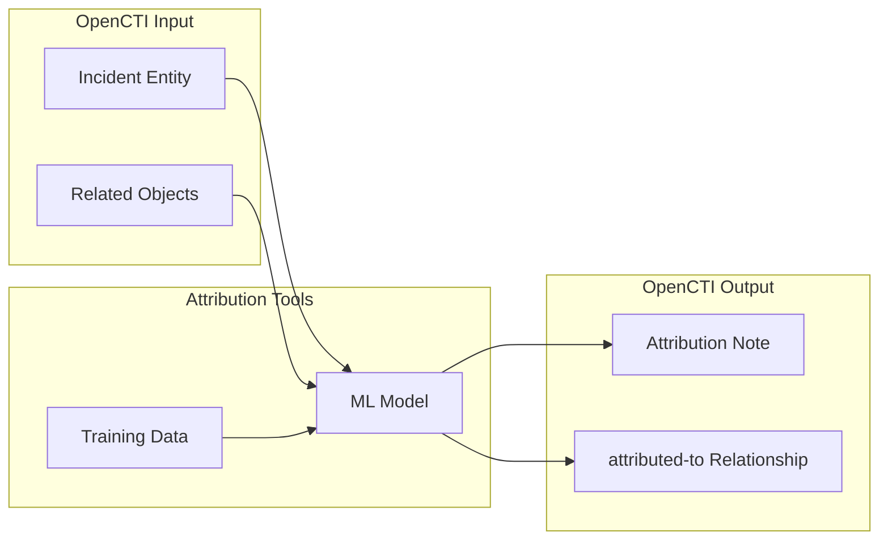

# OpenCTI Attribution Tools Connector

The Attribution Tools connector developed by WithSecure provides ML-based incident attribution capability for OpenCTI, automatically identifying the most probable intrusion sets responsible for an incident.

| Status            | Date | Comment |
|-------------------|------|---------|
| Filigran Verified | -    | -       |

## Table of Contents

- [OpenCTI Attribution Tools Connector](#opencti-attribution-tools-connector)
  - [Table of Contents](#table-of-contents)
  - [Introduction](#introduction)
  - [Installation](#installation)
    - [Requirements](#requirements)
  - [Configuration variables](#configuration-variables)
    - [OpenCTI environment variables](#opencti-environment-variables)
    - [Base connector environment variables](#base-connector-environment-variables)
    - [Connector extra parameters environment variables](#connector-extra-parameters-environment-variables)
  - [Deployment](#deployment)
    - [Docker Deployment](#docker-deployment)
    - [Manual Deployment](#manual-deployment)
  - [Usage](#usage)
  - [Behavior](#behavior)
  - [Debugging](#debugging)
  - [Additional information](#additional-information)

## Introduction

The Attribution Tools connector is an ML-powered enrichment tool that analyzes OpenCTI Incidents and predicts which Intrusion Sets are most likely responsible. The tool is trained from Intrusion Set data already present in your OpenCTI instance and uses machine learning to match incident characteristics against known threat actor profiles.

When triggered on an Incident, the connector:
- Analyzes all related objects (indicators, observables, attack patterns, etc.)
- Applies ML prediction to identify matching intrusion sets
- Creates a Note with ranked attribution predictions and probabilities
- Optionally creates `attributed-to` relationships automatically

This connector was developed as part of the [CC-Driver project](https://www.ccdriver-h2020.com/), funded by the European Union's Horizon 2020 Research and Innovation Programme under Grant Agreement No. 883543.

For more details on the attribution methodology: https://www.preprints.org/manuscript/202308.1936/v1

## Installation

### Requirements

- OpenCTI Platform >= 6.x
- Sufficient Intrusion Set data in OpenCTI for model training
- Persistent storage volume for model persistence

## Configuration variables

There are a number of configuration options, which are set either in `docker-compose.yml` (for Docker) or in `config.yml` (for manual deployment).

### OpenCTI environment variables

| Parameter     | config.yml | Docker environment variable | Mandatory | Description                                          |
|---------------|------------|-----------------------------|-----------|------------------------------------------------------|
| OpenCTI URL   | url        | `OPENCTI_URL`               | Yes       | The URL of the OpenCTI platform.                     |
| OpenCTI Token | token      | `OPENCTI_TOKEN`             | Yes       | The default admin token set in the OpenCTI platform. |

### Base connector environment variables

| Parameter       | config.yml | Docker environment variable | Default   | Mandatory | Description                                                                 |
|-----------------|------------|-----------------------------|-----------|-----------|-----------------------------------------------------------------------------|
| Connector ID    | id         | `CONNECTOR_ID`              |           | Yes       | A unique `UUIDv4` identifier for this connector instance.                   |
| Connector Name  | name       | `CONNECTOR_NAME`            |           | Yes       | Name of the connector.                                                      |
| Connector Scope | scope      | `CONNECTOR_SCOPE`           | Incident  | Yes       | Must be `Incident` for this connector.                                      |
| Connector Type  | type       | `CONNECTOR_TYPE`            | INTERNAL_ENRICHMENT | Yes | Should always be `INTERNAL_ENRICHMENT` for this connector.                  |
| Log Level       | log_level  | `CONNECTOR_LOG_LEVEL`       | info      | No        | Determines the verbosity of the logs: `debug`, `info`, `warn`, or `error`.  |
| Auto Mode       | auto       | `CONNECTOR_AUTO`            | false     | No        | Enables or disables automatic enrichment of incidents.                      |

### Connector extra parameters environment variables

| Parameter                        | config.yml                                  | Docker environment variable                           | Default    | Mandatory | Description                                                                                     |
|----------------------------------|---------------------------------------------|-------------------------------------------------------|------------|-----------|-------------------------------------------------------------------------------------------------|
| Model Training Cron              | attributiontools.model_training_cron_utc    | `ATTRIBUTIONTOOLS_MODEL_TRAINING_CRON_UTC`            | 0 0 * * *  | Yes       | Cron expression for model retraining schedule (UTC timezone).                                   |
| Training Query Threads           | attributiontools.n_training_query_threads   | `ATTRIBUTIONTOOLS_N_TRAINING_QUERY_THREADS`           | 4          | Yes       | Number of threads for fetching training data in parallel. Must be > 0.                          |
| Default Relation Confidence      | attributiontools.default_relation_confidence| `ATTRIBUTIONTOOLS_DEFAULT_RELATION_CONFIDENCE`        | 50         | Yes       | Confidence level (0-100) for automatically created relationships.                               |
| Automatic Relation Creation      | attributiontools.automatic_relation_creation| `ATTRIBUTIONTOOLS_AUTOMATIC_RELATION_CREATION`        | false      | Yes       | Enable automatic creation of `attributed-to` relationships.                                     |
| Relation Creation Threshold      | attributiontools.relation_creation_probability_treshold | `ATTRIBUTIONTOOLS_RELATION_CREATION_PROBABILITY_TRESHOLD` | 0.95 | Yes | Minimum prediction probability (0.0-1.0) required for automatic relationship creation.          |
| Creator Identity ID              | attributiontools.creator_org_identity_id    | `ATTRIBUTIONTOOLS_CREATOR_ORG_IDENTITY_ID`            |            | Yes       | STIX standard_id of the Identity object to set as creator for generated objects.                |

## Deployment

### Docker Deployment

Build the Docker image:

```bash
docker build -t opencti/connector-attribution-tools:latest .
```

Configure the connector in `docker-compose.yml`:

```yaml
  connector-attribution-tools:
    image: opencti/connector-attribution-tools:latest
    environment:
      - OPENCTI_URL=http://localhost
      - OPENCTI_TOKEN=ChangeMe
      - CONNECTOR_ID=ChangeMe_UUID4
      - CONNECTOR_NAME=Attribution Tools
      - CONNECTOR_SCOPE=Incident
      - CONNECTOR_LOG_LEVEL=info
      - CONNECTOR_AUTO=false
      - ATTRIBUTIONTOOLS_MODEL_TRAINING_CRON_UTC=0 0 * * *
      - ATTRIBUTIONTOOLS_N_TRAINING_QUERY_THREADS=4
      - ATTRIBUTIONTOOLS_DEFAULT_RELATION_CONFIDENCE=50
      - ATTRIBUTIONTOOLS_AUTOMATIC_RELATION_CREATION=false
      - ATTRIBUTIONTOOLS_RELATION_CREATION_PROBABILITY_TRESHOLD=0.95
      - ATTRIBUTIONTOOLS_CREATOR_ORG_IDENTITY_ID=identity--ChangeMe
    volumes:
      - attribution_tools_data:/opt/opencti-connector-attribution-tools/data/training_data
    restart: always

volumes:
  attribution_tools_data:
```

Start the connector:

```bash
docker compose up -d
```

### Manual Deployment

1. Copy and configure `config.yml` from the provided `config.yml.sample`.

2. Install dependencies:

```bash
pip3 install -r requirements.txt
```

3. Start the connector from the `src` directory:

```bash
python3 attributiontools.py
```

## Usage

The connector enriches Incident entities by predicting attribution to known Intrusion Sets.

**Analyses → Incidents**

Select an Incident, then click the enrichment button and choose Attribution Tools.

The connector will analyze all related objects within the incident and produce attribution predictions.

## Behavior

The connector uses machine learning to attribute incidents to intrusion sets based on related indicators, observables, attack patterns, and other contextual data.

### Data Flow



### Entity Mapping

| Attribution Tools Output | OpenCTI Entity       | Description                                                |
|--------------------------|----------------------|------------------------------------------------------------|
| Prediction Results       | Note                 | Ranked list of predicted intrusion sets with probabilities |
| Attribution              | Relationship         | `attributed-to` linking Incident to Intrusion Set          |

### Processing Details

1. **Incident Analysis**: Exports the incident and all first-neighbor related objects
2. **Feature Extraction**: Parses incident data into model-consumable format
3. **Prediction**: ML model ranks intrusion sets by probability
4. **Note Creation**: Creates a Note attached to the incident containing:
   - Model version
   - Timestamp
   - Ranked table of predictions with:
     - Rank
     - Intrusion Set name
     - Probability score
     - STIX standard_id
     - Link to intrusion set in OpenCTI
5. **Relationship Creation** (optional): If enabled and probability exceeds threshold:
   - Creates `attributed-to` relationship from Incident to Intrusion Set
   - Sets configured confidence level
   - Includes prediction probability in description

### Model Training

The connector trains its ML model from Intrusion Set data in your OpenCTI instance:

| Aspect               | Description                                                              |
|----------------------|--------------------------------------------------------------------------|
| Training Source      | All Intrusion Set entities and their related objects                     |
| Schedule             | Configurable via cron expression (default: daily at midnight UTC)        |
| Persistence          | Training data saved to `/opt/opencti-connector-attribution-tools/data/training_data` |
| Model Versions       | Keeps 3 most recent models, deletes older ones                           |
| Startup Behavior     | Loads existing model if available, otherwise initiates training          |

### Generated STIX Objects

| STIX Object Type | Condition                          | Description                                      |
|------------------|------------------------------------|--------------------------------------------------|
| Note             | Always                             | Attribution predictions with ranked results      |
| Relationship     | When automatic creation enabled    | `attributed-to` from Incident to Intrusion Set   |

## Debugging

Enable verbose logging by setting:

```env
CONNECTOR_LOG_LEVEL=debug
```

Log output includes:
- Model training progress and F1 scores
- Training data fetch status
- Prediction results
- Relationship creation details

## Additional information

- **Model Persistence**: Mount a persistent volume to `/opt/opencti-connector-attribution-tools/data/training_data` to preserve models across container restarts
- **Data Requirements**: The model quality depends on having sufficient Intrusion Set data with related objects in your OpenCTI instance
- **Threshold Tuning**: Adjust `RELATION_CREATION_PROBABILITY_TRESHOLD` based on your confidence requirements (higher = fewer but more confident attributions)
- **Manual vs Automatic**: Consider starting with `AUTOMATIC_RELATION_CREATION=false` to review predictions before enabling automatic attribution
- **Training Schedule**: Default schedule trains daily; adjust based on how frequently your Intrusion Set data changes
- **WithSecure Development**: This connector was developed by WithSecure as part of the CC-Driver EU Horizon 2020 project
