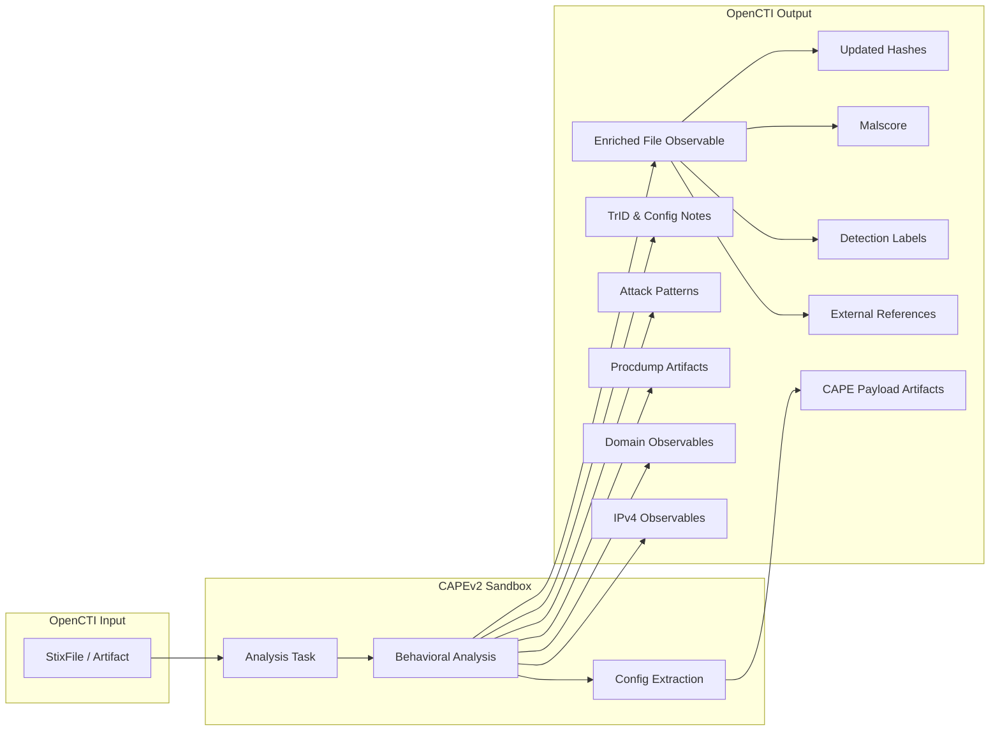

# OpenCTI CAPEv2 Sandbox Connector

The CAPEv2 Sandbox connector enriches File and Artifact observables by submitting them to a CAPEv2 malware analysis sandbox, importing behavioral analysis results, extracted configurations, MITRE ATT&CK mappings, and network IOCs.

| Status            | Date | Comment |
|-------------------|------|---------|
| Filigran Verified | -    | -       |

## Table of Contents

- [OpenCTI CAPEv2 Sandbox Connector](#opencti-capev2-sandbox-connector)
  - [Table of Contents](#table-of-contents)
  - [Introduction](#introduction)
  - [Installation](#installation)
    - [Requirements](#requirements)
  - [Configuration variables](#configuration-variables)
    - [OpenCTI environment variables](#opencti-environment-variables)
    - [Base connector environment variables](#base-connector-environment-variables)
    - [Connector extra parameters environment variables](#connector-extra-parameters-environment-variables)
  - [Deployment](#deployment)
    - [Docker Deployment](#docker-deployment)
    - [Manual Deployment](#manual-deployment)
  - [Usage](#usage)
  - [Behavior](#behavior)
  - [Debugging](#debugging)
  - [Additional information](#additional-information)

## Introduction

CAPEv2 (Config And Payload Extraction) is an open-source malware sandbox derived from Cuckoo Sandbox, specifically designed for extracting malware configurations and payloads. It provides comprehensive behavioral analysis including process monitoring, network traffic capture, API tracing, and automated config extraction.

This connector integrates CAPEv2 with OpenCTI to:
- Submit File and Artifact observables for dynamic analysis
- Import extracted malware configurations
- Create relationships to MITRE ATT&CK techniques
- Extract network IOCs (domains, IP addresses)
- Upload extracted payloads and process dumps as related artifacts

## Installation

### Requirements

- OpenCTI Platform >= 6.x
- CAPEv2 instance with API access enabled
- CAPEv2 API v2 endpoint configured

### CAPEv2 Prerequisites

1. **Enable API endpoints** for procdumps and payloads in `CAPEv2/conf/api.conf`:
   - `[procdumpfiles]` - Enable procdump file downloads
   - `[payloadfiles]` - Enable payload file downloads

2. **Configure API rate limits** (or adjust connector retry settings):
   - `[procdumpfiles]`
   - `[payloadfiles]`
   - `[taskstatus]`
   - `[taskreport]`

3. **(Optional) Enable authentication**:
   - Set `token_auth_enabled = yes` in `api.conf`
   - Configure `auth_only` for relevant endpoints
   - Restart CAPE services

## Configuration variables

There are a number of configuration options, which are set either in `docker-compose.yml` (for Docker) or in `config.yml` (for manual deployment).

### OpenCTI environment variables

| Parameter     | config.yml | Docker environment variable | Mandatory | Description                                          |
|---------------|------------|-----------------------------|-----------|------------------------------------------------------|
| OpenCTI URL   | url        | `OPENCTI_URL`               | Yes       | The URL of the OpenCTI platform.                     |
| OpenCTI Token | token      | `OPENCTI_TOKEN`             | Yes       | The default admin token set in the OpenCTI platform. |

### Base connector environment variables

| Parameter          | config.yml       | Docker environment variable   | Default         | Mandatory | Description                                                                   |
|--------------------|------------------|-------------------------------|-----------------|-----------|-------------------------------------------------------------------------------|
| Connector ID       | id               | `CONNECTOR_ID`                |                 | Yes       | A unique `UUIDv4` identifier for this connector instance.                     |
| Connector Name     | name             | `CONNECTOR_NAME`              |                 | Yes       | Name of the connector.                                                        |
| Connector Scope    | scope            | `CONNECTOR_SCOPE`             | StixFile,Artifact | Yes     | The scope of observables the connector will enrich.                           |
| Connector Type     | type             | `CONNECTOR_TYPE`              | INTERNAL_ENRICHMENT | Yes   | Should always be `INTERNAL_ENRICHMENT` for this connector.                    |
| Log Level          | log_level        | `CONNECTOR_LOG_LEVEL`         | info            | No        | Determines the verbosity of the logs: `debug`, `info`, `warn`, or `error`.    |
| Confidence Level   | confidence_level | `CONNECTOR_CONFIDENCE_LEVEL`  | 50              | No        | The default confidence level for created relationships (1-100).               |
| Auto Mode          | auto             | `CONNECTOR_AUTO`              | false           | No        | Enables or disables automatic enrichment of observables.                      |

### Connector extra parameters environment variables

| Parameter        | config.yml                | Docker environment variable       | Default      | Mandatory | Description                                                              |
|------------------|---------------------------|-----------------------------------|--------------|-----------|--------------------------------------------------------------------------|
| CAPE URL         | cape_sandbox.url          | `CAPE_SANDBOX_URL`                |              | Yes       | Base URL for the CAPEv2 API (e.g., `https://cape.example.com/apiv2`).    |
| API Token        | cape_sandbox.token        | `CAPE_SANDBOX_TOKEN`              |              | No        | API token for authentication (if enabled on CAPEv2).                     |
| Max TLP          | cape_sandbox.max_tlp      | `CAPE_SANDBOX_MAX_TLP`            | TLP:AMBER    | No        | Maximum TLP level for observables to be submitted for analysis.          |
| Route            | cape_sandbox.route        | `CAPE_SANDBOX_ROUTE`              | tor          | No        | Network routing: `none`, `internet`, `tor`, `vpn0`, etc.                 |
| Timeout          | cape_sandbox.timeout      | `CAPE_SANDBOX_TIMEOUT`            | 300          | No        | Maximum analysis time in seconds.                                        |
| Enforce Timeout  | cape_sandbox.enforce_timeout | `CAPE_SANDBOX_ENFORCE_TIMEOUT` | false        | No        | Force analysis to run for full timeout duration.                         |
| Priority         | cape_sandbox.priority     | `CAPE_SANDBOX_PRIORITY`           | 1            | No        | Task priority: 1-3 (3 is highest).                                       |
| Try Extract      | cape_sandbox.try_extract  | `CAPE_SANDBOX_TRY_EXTRACT`        | false        | No        | Attempt static config extraction before dynamic analysis.                |
| Options          | cape_sandbox.options      | `CAPE_SANDBOX_OPTIONS`            | procmemdump=1,import_reconstruction=1,fake-rdtsc=1 | No | Analysis package options (comma-separated).            |
| Less Noise       | cape_sandbox.less_noise   | `CAPE_SANDBOX_LESS_NOISE`         | true         | No        | Only upload artifacts with YARA rule matches.                            |
| Cooldown Time    | cape_sandbox.cooldown_time| `CAPE_SANDBOX_COOLDOWN_TIME`      | 20           | No        | Seconds to wait between API retries.                                     |
| Max Retries      | cape_sandbox.max_retries  | `CAPE_SANDBOX_MAX_RETRIES`        | 10           | No        | Maximum API retry attempts before failing.                               |

## Deployment

### Docker Deployment

Build the Docker image:

```bash
docker build -t opencti/connector-cape-sandbox:latest .
```

Configure the connector in `docker-compose.yml`:

```yaml
  connector-cape-sandbox:
    image: opencti/connector-cape-sandbox:latest
    environment:
      - OPENCTI_URL=http://localhost
      - OPENCTI_TOKEN=ChangeMe
      - CONNECTOR_ID=ChangeMe_UUID4
      - CONNECTOR_NAME=CAPEv2 Sandbox
      - CONNECTOR_SCOPE=StixFile,Artifact
      - CONNECTOR_LOG_LEVEL=info
      - CONNECTOR_AUTO=false
      - CAPE_SANDBOX_URL=https://cape.example.com/apiv2
      - CAPE_SANDBOX_TOKEN=ChangeMe
      - CAPE_SANDBOX_MAX_TLP=TLP:AMBER
      - CAPE_SANDBOX_ROUTE=tor
      - CAPE_SANDBOX_TIMEOUT=300
      - CAPE_SANDBOX_ENFORCE_TIMEOUT=false
      - CAPE_SANDBOX_PRIORITY=1
      - CAPE_SANDBOX_TRY_EXTRACT=false
      - CAPE_SANDBOX_OPTIONS=procmemdump=1,import_reconstruction=1,fake-rdtsc=1
      - CAPE_SANDBOX_LESS_NOISE=true
      - CAPE_SANDBOX_COOLDOWN_TIME=20
      - CAPE_SANDBOX_MAX_RETRIES=10
    restart: always
```

Start the connector:

```bash
docker compose up -d
```

### Manual Deployment

1. Copy and configure `config.yml` from the provided `config.yml.sample`.

2. Install dependencies:

```bash
pip3 install -r requirements.txt
```

3. Start the connector from the `src` directory:

```bash
python3 cape-sandbox.py
```

## Usage

The connector enriches File and Artifact observables by submitting them to CAPEv2 for dynamic analysis. Due to analysis time requirements, automatic mode is typically disabled.

**Observations → Observables**

Select a StixFile or Artifact observable, then click the enrichment button and choose CAPEv2 Sandbox.

## Behavior

The connector submits files to CAPEv2 for malware analysis and imports comprehensive results back into OpenCTI.

### Data Flow



### Enrichment Mapping

| CAPEv2 Data                    | OpenCTI Entity/Property     | Description                                              |
|--------------------------------|-----------------------------|----------------------------------------------------------|
| target.md5/sha1/sha256         | File Hashes                 | Updates file observable with computed hashes             |
| malscore                       | Observable Score            | Maliciousness score (0-100, scaled from 0-10)            |
| detections                     | Labels                      | Malware family detection names                           |
| Task URL                       | External Reference          | Link to CAPEv2 analysis page                             |
| JSON Report URL                | External Reference          | Link to full JSON report                                 |
| HTML Report URL                | External Reference          | Link to HTML report                                      |
| trid                           | Note                        | TrID file type identification results                    |
| ttps                           | Attack Pattern              | MITRE ATT&CK techniques with `uses` relationship         |
| procdump                       | Artifact                    | Process memory dumps with YARA matches                   |
| CAPE.payloads                  | Artifact                    | Extracted malware payloads                               |
| CAPE.configs                   | Note                        | Extracted malware configuration                          |
| CAPE.configs.address           | IPv4-Addr / Domain-Name     | C2 server addresses from configs                         |
| network.domains                | Domain-Name                 | Contacted domains during analysis                        |
| network.hosts                  | IPv4-Addr                   | Contacted IP addresses during analysis                   |
| flare_capa.ATTCK               | Attack Pattern              | Flare CAPA MITRE ATT&CK mappings                         |

### Processing Details

1. **File Submission**: Downloads artifact from OpenCTI and submits to CAPEv2
2. **Analysis Monitoring**: Polls task status until `reported` state
3. **Hash Update**: Updates observable with MD5, SHA-1, SHA-256 hashes
4. **Score Assignment**: Sets observable score based on malscore (×10)
5. **Detection Labels**: Creates labels for detected malware families
6. **External References**: Creates links to analysis page, JSON, and HTML reports
7. **TrID Note**: Creates note with file type identification
8. **MITRE ATT&CK**: Creates Attack Pattern entities with `uses` relationships
9. **Procdump Processing** (if enabled):
   - Downloads procdump archive
   - Uploads artifacts with YARA matches (if `less_noise=true`)
   - Applies YARA rule labels
   - Processes Flare CAPA ATT&CK mappings
10. **Payload Processing**: Uploads CAPE-extracted payloads with labels
11. **Config Extraction**: Creates notes with extracted configs and C2 observables
12. **Network IOCs**: Creates Domain-Name and IPv4-Addr observables from network activity

### Generated STIX Objects

| STIX Object Type | Condition                          | Description                                          |
|------------------|------------------------------------|------------------------------------------------------|
| External Reference | Always                           | Links to CAPEv2 analysis, JSON, and HTML reports     |
| Labels           | When detections present            | Malware family names                                 |
| Note             | When TrID/config data present      | TrID results and malware configurations              |
| Attack Pattern   | When TTPs detected                 | MITRE ATT&CK techniques                              |
| Artifact         | When procdumps/payloads extracted  | Process dumps and CAPE payloads                      |
| IPv4-Addr        | When network hosts found           | Contacted IP addresses                               |
| Domain-Name      | When domains contacted             | Contacted domains                                    |
| Relationship     | Various                            | `uses`, `communicates-with`, `related-to`            |

### Relationships Created

- File → `uses` → Attack Pattern (TTPs)
- File → `communicates-with` → IPv4-Addr (network hosts)
- File → `communicates-with` → Domain-Name (network domains)
- File → `communicates-with` → IPv4-Addr/Domain-Name (C2 from configs)
- Procdump Artifact → `related-to` → Original File
- Procdump Artifact → `uses` → Attack Pattern (Flare CAPA)
- CAPE Payload → `related-to` → Original File
- CAPE Payload → `uses` → Attack Pattern (Flare CAPA)

## Debugging

Enable verbose logging by setting:

```env
CONNECTOR_LOG_LEVEL=debug
```

Log output includes:
- Task submission and ID
- Task status polling progress
- Procdump and payload upload status
- API retry attempts
- Bundle creation details

## Additional information

- **Analysis Time**: Dynamic analysis typically takes 5-10 minutes depending on configuration
- **API Rate Limits**: Adjust `COOLDOWN_TIME` and `MAX_RETRIES` if encountering rate limit errors
- **Less Noise Mode**: Enable to reduce noise by only uploading procdumps with YARA matches
- **Network Routing**: Use `tor` for anonymized analysis or `internet` for direct connectivity
- **Try Extract**: Experimental static extraction mode; may be buggy in some CAPEv2 versions
- **TLP Handling**: Files above `MAX_TLP` will not be submitted to the sandbox
- **Organization Identity**: Creates a "CAPEv2 Sandbox" organization identity for attribution

