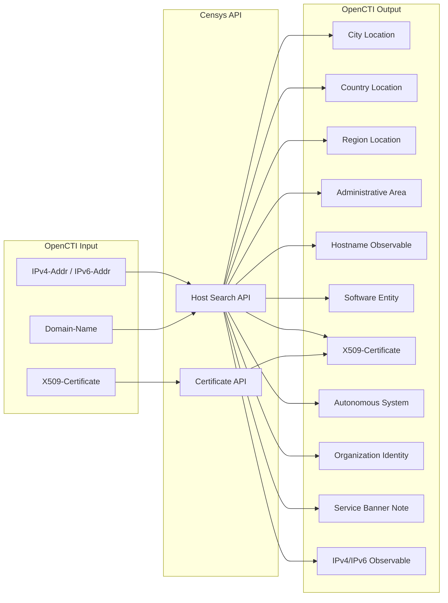

# OpenCTI Censys Connector

| Status | Date | Comment |
|--------|------|---------|
| Community | -    | -       |

The Censys Enrichment connector enriches IP addresses, domains, and certificates with internet scanning data from the Censys Search platform, providing geolocation, ASN, services, software, and infrastructure information.

## Table of Contents

- [OpenCTI Censys Connector](#opencti-censys-connector)
  - [Table of Contents](#table-of-contents)
  - [Introduction](#introduction)
  - [Installation](#installation)
    - [Requirements](#requirements)
  - [Configuration variables](#configuration-variables)
    - [OpenCTI environment variables](#opencti-environment-variables)
    - [Base connector environment variables](#base-connector-environment-variables)
    - [Connector extra parameters environment variables](#connector-extra-parameters-environment-variables)
  - [Deployment](#deployment)
    - [Docker Deployment](#docker-deployment)
    - [Manual Deployment](#manual-deployment)
  - [Usage](#usage)
  - [Behavior](#behavior)
  - [Debugging](#debugging)
  - [Additional information](#additional-information)

## Introduction

Censys is an internet intelligence platform that continuously scans the global IPv4 address space and provides comprehensive data about internet-connected devices, services, and certificates. The Censys Search API offers detailed host information including open ports, running services, TLS certificates, geolocation, and autonomous system data.

This connector integrates Censys Search with OpenCTI to enrich:
- **IP addresses** (IPv4/IPv6): Geolocation, ASN, services, software, hostnames, certificates
- **Domain names**: Resolving hosts with all associated IP enrichment data
- **X509 Certificates**: Certificate metadata from Censys certificate database

## Installation

### Requirements

- OpenCTI Platform >= 6.8.11
- Censys account with API access (Organisation ID and Token)

## Configuration variables

There are a number of configuration options, which are set either in `docker-compose.yml` (for Docker), `.env` file, or in `config.yml` (for manual deployment).

### OpenCTI environment variables

| Parameter     | config.yml | Docker environment variable | Mandatory | Description                                          |
|---------------|------------|-----------------------------|-----------|------------------------------------------------------|
| OpenCTI URL   | url        | `OPENCTI_URL`               | Yes       | The URL of the OpenCTI platform.                     |
| OpenCTI Token | token      | `OPENCTI_TOKEN`             | Yes       | The default admin token set in the OpenCTI platform. |

### Base connector environment variables

| Parameter       | config.yml | Docker environment variable | Default                                 | Mandatory | Description                                                                  |
|-----------------|------------|-----------------------------|-----------------------------------------|-----------|------------------------------------------------------------------------------|
| Connector ID    | id         | `CONNECTOR_ID`              | censys-enrichment--674403d0-...         | No        | A unique `UUIDv4` identifier for this connector instance.                    |
| Connector Name  | name       | `CONNECTOR_NAME`            | Censys Enrichment                       | No        | Name of the connector.                                                       |
| Connector Scope | scope      | `CONNECTOR_SCOPE`           | IPv4-Addr,IPv6-Addr,X509-Certificate,Domain-Name | No | The scope of observables the connector will enrich.                          |
| Connector Type  | type       | `CONNECTOR_TYPE`            | INTERNAL_ENRICHMENT                     | Yes       | Should always be `INTERNAL_ENRICHMENT` for this connector.                   |
| Log Level       | log_level  | `CONNECTOR_LOG_LEVEL`       | error                                   | No        | Determines the verbosity of the logs: `debug`, `info`, `warn`, or `error`.   |
| Auto Mode       | auto       | `CONNECTOR_AUTO`            | false                                   | No        | Enables or disables automatic enrichment of observables.                     |

### Connector extra parameters environment variables

| Parameter       | config.yml                         | Docker environment variable            | Default    | Mandatory | Description                                                        |
|-----------------|------------------------------------|-----------------------------------------|------------|-----------|--------------------------------------------------------------------|
| Organisation ID | censys_enrichment.organisation_id  | `CENSYS_ENRICHMENT_ORGANISATION_ID`     |            | Yes       | Your Censys organisation ID for API authentication.                |
| API Token       | censys_enrichment.token            | `CENSYS_ENRICHMENT_TOKEN`               |            | Yes       | Your Censys API token for authentication.                          |
| Max TLP         | censys_enrichment.max_tlp          | `CENSYS_ENRICHMENT_MAX_TLP`             | TLP:AMBER  | No        | Maximum TLP level for observables to be enriched.                  |

## Deployment

### Docker Deployment

Build the Docker image:

```bash
docker build -t opencti/connector-censys-enrichment:latest .
```

Configure the connector in `docker-compose.yml`:

```yaml
  connector-censys-enrichment:
    image: opencti/connector-censys-enrichment:latest
    environment:
      - OPENCTI_URL=http://localhost
      - OPENCTI_TOKEN=ChangeMe
      - CONNECTOR_ID=ChangeMe_UUID4
      - CONNECTOR_NAME=Censys Enrichment
      - CONNECTOR_SCOPE=IPv4-Addr,IPv6-Addr,X509-Certificate,Domain-Name
      - CONNECTOR_LOG_LEVEL=error
      - CONNECTOR_AUTO=false
      - CENSYS_ENRICHMENT_ORGANISATION_ID=ChangeMe
      - CENSYS_ENRICHMENT_TOKEN=ChangeMe
      - CENSYS_ENRICHMENT_MAX_TLP=TLP:AMBER
    restart: always
```

Start the connector:

```bash
docker compose up -d
```

### Manual Deployment

1. Copy `.env.sample` to `.env` and configure with your credentials.

2. Install dependencies:

```bash
pip3 install -r requirements.txt
```

3. Start the connector from the `src` directory:

```bash
python3 main.py
```

## Usage

The connector enriches IP addresses, domains, and certificates with Censys internet scanning data.

**Observations → Observables**

Select an IPv4-Addr, IPv6-Addr, Domain-Name, or X509-Certificate observable, then click the enrichment button and choose Censys Enrichment.

## Behavior
  The connector enriches the following observable types:

  ### IPv4/IPv6 Addresses
  - Retrieves host information including geolocation, ASN, and services
  - Creates location entities (City, Country, Region, Administrative Area)
  - Links autonomous systems and organizations
  - Extracts DNS names associated with the IP
  - Creates software entities for detected services
  - Includes service banners as notes

  ### Domain Names
  - Searches for hosts with the domain in their DNS records
  - Creates IP address observables for discovered hosts
  - **Discovers X.509 certificates** that reference the domain in their Subject Alternative Names (SANs) or Common Name (CN)
  - Creates certificate entities with full metadata (issuer, validity, extensions)
  - Links certificates to the domain for infrastructure mapping

  This comprehensive domain enrichment is particularly useful for:
  - Certificate transparency monitoring
  - Threat actor infrastructure discovery
  - Identifying shared hosting or certificate patterns
  - Detecting potential phishing domains using similar certificates

  ### X.509 Certificates
  - Enriches certificates by their hash values (MD5, SHA-1, SHA-256)
  - Extracts detailed certificate metadata including extensions and key information

  **Note**: Certificate discovery for domains adds an additional API call per domain enrichment. Be mindful of Censys API rate limits.

The connector queries the Censys Search API and creates related entities based on the data returned.

### Data Flow



### Enrichment Mapping

| Censys Data               | OpenCTI Entity           | Description                                                |
|---------------------------|--------------------------|-------------------------------------------------------------|
| location.city             | City (Location)          | City where the host is located                              |
| location.country          | Country (Location)       | Country where the host is located                           |
| location.continent        | Region (Location)        | Continent/region of the host                                |
| location.province         | Administrative Area      | Province/state with coordinates                             |
| dns.names                 | Hostname                 | DNS hostnames resolving to the IP                           |
| services.software         | Software                 | Running software with vendor and CPE                        |
| services.cert             | X509-Certificate         | TLS certificates from services                              |
| services.banner           | Note                     | Service banner content                                      |
| autonomous_system.asn     | Autonomous System        | ASN number                                                  |
| autonomous_system.name    | Organization (Identity)  | Organization operating the AS                               |
| Certificate fingerprints  | X509-Certificate         | Certificate with SHA-1, SHA-256, MD5 hashes                 |
| Certificate parsed data   | X509-Certificate         | Subject, issuer, validity, key info, extensions             |

### Entity Mapping by Observable Type

| Input Type       | Generated Entities                                                              |
|------------------|---------------------------------------------------------------------------------|
| IPv4-Addr        | Locations, Hostnames, Software, Certificates, ASN, Organization, Notes          |
| IPv6-Addr        | Locations, Hostnames, Software, Certificates, ASN, Organization, Notes          |
| Domain-Name      | Related IPs + all enrichment data for each resolved IP                          |
| X509-Certificate | Certificate entity with full parsed metadata                                    |

### Relationships Created

| Relationship Type  | Source              | Target              | Description                           |
|--------------------|---------------------|---------------------|---------------------------------------|
| `located-at`       | IP Observable       | City/Country/Region | Geolocation relationship              |
| `located-at`       | IP Observable       | Administrative Area | Province/state location               |
| `resolves-to`      | Hostname            | IP Observable       | DNS resolution                        |
| `related-to`       | IP Observable       | Organization        | Operating organization                |
| `belongs-to`       | IP Observable       | Autonomous System   | ASN membership                        |
| `related-to`       | IP Observable       | Software            | Running software                      |
| `related-to`       | IP Observable       | X509-Certificate    | Associated TLS certificates           |
| `related-to`       | Autonomous System   | Organization        | AS operator                           |
| `related-to`       | Autonomous System   | Country             | AS country location                   |
| `related-to`       | Domain-Name         | IPv4/IPv6 Address   | Resolved IP addresses                 |

### Processing Details

1. **TLP Check**: Validates observable TLP against `max_tlp` setting
2. **API Query**: Queries appropriate Censys endpoint based on observable type
3. **Location Processing**: Creates hierarchical location entities
4. **DNS Processing**: Creates hostname observables with resolution relationships
5. **Service Processing**: Creates software and certificate entities per service
6. **ASN Processing**: Creates autonomous system with organization relationship
7. **Certificate Processing**: Full certificate parsing with all available metadata

## Debugging

Enable verbose logging by setting:

```env
CONNECTOR_LOG_LEVEL=debug
```

Log output includes:
- API request details
- Entity generation progress
- Relationship creation status
- Error handling information

## Additional information

- **API Reference**: [Censys Search API Documentation](https://search.censys.io/api)
- **Rate Limits**: API calls are subject to Censys rate limits based on subscription tier
- **Data Freshness**: Censys continuously scans the internet; data freshness depends on scan frequency
- **TLP Handling**: Observables with TLP above `MAX_TLP` will not be sent to Censys
- **Playbook Support**: This connector supports OpenCTI playbook automation
- **Roadmap**: Potential future support for additional observable types (e.g., URL)
