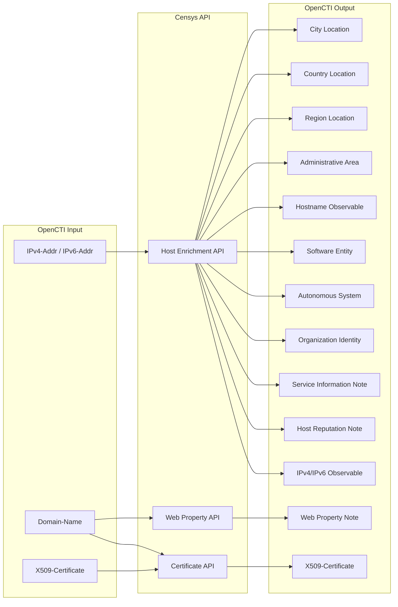

# OpenCTI Censys Connector

| Status | Date | Comment |
|--------|------|---------|
| Community | -    | -       |

The Censys EnrichmentAPIs connector enriches IP addresses, domains, and certificates with internet scanning data from the Censys Platform, providing geolocation, ASN, services, software, infrastructure information, host reputation score, host threat labels if present. 

## Table of Contents

- [OpenCTI Censys Connector](#opencti-censys-connector)
  - [Table of Contents](#table-of-contents)
  - [Introduction](#introduction)
  - [Installation](#installation)
    - [Requirements](#requirements)
  - [Configuration variables](#configuration-variables)
    - [OpenCTI environment variables](#opencti-environment-variables)
    - [Base connector environment variables](#base-connector-environment-variables)
    - [Connector extra parameters environment variables](#connector-extra-parameters-environment-variables)
  - [Deployment](#deployment)
    - [Docker Deployment](#docker-deployment)
    - [Manual Deployment](#manual-deployment)
  - [Usage](#usage)
  - [Behavior](#behavior)
    - [Note Types](#note-types)
  - [Debugging](#debugging)
  - [Additional information](#additional-information)

## Introduction

Censys is an internet intelligence platform that continuously scans the global IPv4 address space and provides comprehensive data about internet-connected devices, services, and certificates. The Censys Search API offers detailed host information including open ports, running services, TLS certificates, geolocation, and autonomous system data.

This connector integrates Censys Search with OpenCTI to enrich:
- **IP addresses** (IPv4/IPv6): Geolocation, ASN, services, software, hostnames, certificates, reputation score, threat labels.
- **Domain names**: Web properties on ports 80 and 443, plus related certificates
- **X509 Certificates**: Certificate metadata from Censys certificate database

## Installation

### Requirements

- OpenCTI Platform >= 6.8.11
- Censys account with API access (Organisation ID and Token)

## Configuration variables

There are a number of configuration options, which are set either in `docker-compose.yml` (for Docker), `.env` file, or in `config.yml` (for manual deployment).

### OpenCTI environment variables

| Parameter     | config.yml | Docker environment variable | Mandatory | Description                                          |
|---------------|------------|-----------------------------|-----------|------------------------------------------------------|
| OpenCTI URL   | url        | `OPENCTI_URL`               | Yes       | The URL of the OpenCTI platform.                     |
| OpenCTI Token | token      | `OPENCTI_TOKEN`             | Yes       | The default admin token set in the OpenCTI platform. |

### Base connector environment variables

| Parameter       | config.yml | Docker environment variable | Default                                 | Mandatory | Description                                                                  |
|-----------------|------------|-----------------------------|-----------------------------------------|-----------|------------------------------------------------------------------------------|
| Connector ID    | id         | `CONNECTOR_ID`              | censys-enrichmentapis--674403d0-...         | No        | A unique `UUIDv4` identifier for this connector instance.                    |
| Connector Name  | name       | `CONNECTOR_NAME`            | Censys EnrichmentAPIs                       | No        | Name of the connector.                                                       |
| Connector Scope | scope      | `CONNECTOR_SCOPE`           | IPv4-Addr,IPv6-Addr,X509-Certificate,Domain-Name | No | The scope of observables the connector will enrich.                          |
| Connector Type  | type       | `CONNECTOR_TYPE`            | INTERNAL_ENRICHMENT                     | Yes       | Should always be `INTERNAL_ENRICHMENT` for this connector.                   |
| Log Level       | log_level  | `CONNECTOR_LOG_LEVEL`       | error                                   | No        | Determines the verbosity of the logs: `debug`, `info`, `warn`, or `error`.   |
| Auto Mode       | auto       | `CONNECTOR_AUTO`            | false                                   | No        | Enables or disables automatic enrichment of observables.                     |

### Connector extra parameters environment variables

| Parameter       | config.yml                         | Docker environment variable            | Default    | Mandatory | Description                                                        |
|-----------------|------------------------------------|-----------------------------------------|------------|-----------|--------------------------------------------------------------------|
| Organisation ID | censys_enrichmentapis.organisation_id  | `CENSYS_ENRICHMENTAPIS_ORGANISATION_ID`     |            | Yes       | Your Censys organisation ID for API authentication.                |
| API Token       | censys_enrichmentapis.token            | `CENSYS_ENRICHMENTAPIS_TOKEN`               |            | Yes       | Your Censys API token for authentication.                          |
| Max TLP         | censys_enrichmentapis.max_tlp          | `CENSYS_ENRICHMENTAPIS_MAX_TLP`             | TLP:AMBER  | No        | Maximum TLP level for observables to be enriched.                  |

## Deployment

### Docker Deployment

Build the Docker image:

```bash
docker build -t opencti/connector-censys-enrichmentapis:latest .
```

Configure the connector in `docker-compose.yml`:

```yaml
  connector-censys-enrichmentapis:
    image: opencti/connector-censys-enrichmentapis:latest
    environment:
      - OPENCTI_URL=http://localhost
      - OPENCTI_TOKEN=ChangeMe
      - CONNECTOR_ID=ChangeMe_UUID4
      - CONNECTOR_NAME=Censys EnrichmentAPIs
      - CONNECTOR_SCOPE=IPv4-Addr,IPv6-Addr,X509-Certificate,Domain-Name
      - CONNECTOR_LOG_LEVEL=error
      - CONNECTOR_AUTO=false
      - CENSYS_ENRICHMENTAPIS_ORGANISATION_ID=ChangeMe
      - CENSYS_ENRICHMENTAPIS_TOKEN=ChangeMe
      - CENSYS_ENRICHMENTAPIS_MAX_TLP=TLP:AMBER
    restart: always
```

Start the connector:

```bash
docker compose up -d
```

### Manual Deployment

1. Copy `config.yml.sample` to `src/config.yml` and configure with your credentials.

2. Install dependencies:

```bash
pip3 install -r src/requirements.txt
```

3. Start the connector from the `src` directory:

```bash
python3 main.py
```

## Usage

The connector enriches IP addresses, domains, and certificates with Censys internet scanning data.

**Observations → Observables**

Select an IPv4-Addr, IPv6-Addr, Domain-Name, or X509-Certificate observable, then click the enrichment button and choose Censys EnrichmentAPIs.

## Behavior
  The connector enriches the following observable types:

  ### IPv4/IPv6 Addresses
  - Retrieves host information including geolocation, ASN, services, and reputation
  - Creates location entities (City, Country, Region, Administrative Area)
  - Links autonomous systems and organizations
  - Extracts DNS names associated with the IP
  - Creates software entities for detected services
  - Includes comprehensive service notes with:
    - Service protocol and scan time
    - Detected service labels (e.g., REMOTE_ACCESS)
    - Associated threats and security information
  - Generates reputation notes with:
    - Host reputation score and risk level
    - Model version information

  ### Domain Names
  - Retrieves the Censys web properties identified by `<domain>:80` and `<domain>:443`
  - Creates one domain-linked Markdown note per property with web, threat, vulnerability, software, and certificate details
  - **Discovers X.509 certificates** that reference the domain in their Subject Alternative Names (SANs) or Common Name (CN)
  - Creates certificate entities with full metadata (issuer, validity, extensions)
  - Links certificates to the domain for infrastructure mapping

  This comprehensive domain enrichment is particularly useful for:
  - Certificate transparency monitoring
  - Threat actor infrastructure discovery
  - Identifying shared hosting or certificate patterns
  - Detecting potential phishing domains using similar certificates

  ### X.509 Certificates
  - Enriches certificates by their hash values (MD5, SHA-1, SHA-256)
  - Extracts detailed certificate metadata including extensions and key information

  **Note**: Certificate discovery for domains adds an additional API call per domain enrichment. Be mindful of Censys API rate limits.

The connector queries the Censys Platform APIs and creates related entities based on the data returned.

### Data Flow



### Enrichment Mapping

| Censys Data               | OpenCTI Entity           | Description                                                |
|---------------------------|--------------------------|-------------------------------------------------------------|
| location.city             | City (Location)          | City where the host is located                              |
| location.country          | Country (Location)       | Country where the host is located                           |
| location.continent        | Region (Location)        | Continent/region of the host                                |
| location.province         | Administrative Area      | Province/state with coordinates                             |
| dns.names                 | Hostname                 | DNS hostnames resolving to the IP                           |
| services.protocol         | Note                     | Service protocol information                                |
| services.scan_time        | Note                     | Service scan timestamp                                      |
| services.labels           | Note                     | Service labels (e.g., REMOTE_ACCESS, WEB)                  |
| services.threats          | Note                     | Associated threats and security information                 |
| services.software         | Software                 | Running software with vendor and CPE                        |
| services.vulns            | Vulnerability            | CVEs detected for the service, with CVSS/EPSS/CWE data      |
| reputation.score          | Note                     | Host reputation score and risk level                        |
| reputation.model_version  | Note                     | Reputation model version used                               |
| autonomous_system.asn     | Autonomous System        | ASN number                                                  |
| autonomous_system.name    | Organization (Identity)  | Organization operating the AS                               |
| Certificate fingerprints  | X509-Certificate         | Certificate with SHA-1, SHA-256, MD5 hashes                 |
| Certificate parsed data   | X509-Certificate         | Subject, issuer, validity, key info, extensions             |
| Web property fields       | Note                     | Key/value Markdown table for ports 80 and 443               |

### Entity Mapping by Observable Type

| Input Type       | Generated Entities                                                              |
|------------------|---------------------------------------------------------------------------------|
| IPv4-Addr        | Locations, Hostnames, Software, Vulnerabilities, ASN, Organization, Notes       |
| IPv6-Addr        | Locations, Hostnames, Software, Vulnerabilities, ASN, Organization, Notes       |
| Domain-Name      | Web-property notes for ports 80/443 and related certificate entities            |
| X509-Certificate | Certificate entity with full parsed metadata                                    |

### Relationships Created

| Relationship Type  | Source              | Target              | Description                           |
|--------------------|---------------------|---------------------|---------------------------------------|
| `located-at`       | IP Observable       | City/Country/Region | Geolocation relationship              |
| `located-at`       | IP Observable       | Administrative Area | Province/state location               |
| `resolves-to`      | Hostname            | IP Observable       | DNS resolution                        |
| `related-to`       | IP Observable       | Organization        | Operating organization                |
| `belongs-to`       | IP Observable       | Autonomous System   | ASN membership                        |
| `related-to`       | IP Observable       | Software            | Running software                      |
| `has`              | Software            | Vulnerability       | CVE affecting the detected service   |
| `related-to`       | Autonomous System   | Organization        | AS operator                           |
| `related-to`       | Autonomous System   | Country             | AS country location                   |
| `related-to`       | X509-Certificate    | Domain-Name         | Certificate discovered for the domain |

### Note Types

The connector generates two types of notes with detailed information:

#### Service Information Notes
Each detected service generates a comprehensive note containing:
- **Service Protocol**: The network protocol (e.g., SSH, HTTP, HTTPS)
- **Scan Time**: ISO 8601 timestamp of when the service was scanned
- **Service Labels**: Security classification labels (e.g., REMOTE_ACCESS, WEB)
- **Threats**: Any associated security threats or warnings

*Note Format Example:*
```
| Key             | Value                     |
|------------------|---------------------------|
| Protocol         | SSH                       |
| Last Scan Time   | 2025-11-03T12:35:48Z      |
| Label 1          | REMOTE_ACCESS             |

### Threats
- Exposed SSH Service | Severity: HIGH
```

#### Reputation Notes
Host reputation information is documented in external notes containing:
- **Score**: Reputation score as an integer percentage (0-100)
- **Label**: Risk classification (e.g. LOW, MEDIUM_RISK, HIGH, CRITICAL)
- **Model version**: Version of the reputation model used
- An evidence-feature table, when Censys returns contributing features

*Note Format Example:*
```
- Score: 42
- Label: MEDIUM_RISK
- Model version: 2.0.0
```

### Processing Details

1. **TLP Check**: Validates observable TLP against `max_tlp` setting
2. **API Query**: Queries appropriate Censys endpoint based on observable type
3. **Location Processing**: Creates hierarchical location entities
4. **DNS Processing**: Creates hostname observables with resolution relationships
5. **Service Processing**: Creates comprehensive service notes with protocol, labels, and threats
6. **Reputation Processing**: Generates reputation notes with score and risk level
7. **ASN Processing**: Creates autonomous system with organization relationship
8. **Certificate Processing**: Full certificate parsing with all available metadata

## Debugging

Enable verbose logging by setting:

```env
CONNECTOR_LOG_LEVEL=debug
```

Log output includes:
- API request details
- Entity generation progress
- Relationship creation status
- Error handling information

## Additional information

- **API Reference**: [Censys Search API Documentation](https://search.censys.io/api)
- **Rate Limits**: API calls are subject to Censys rate limits based on subscription tier
- **Data Freshness**: Censys continuously scans the internet; data freshness depends on scan frequency
- **TLP Handling**: Observables with TLP above `MAX_TLP` will not be sent to Censys
- **Playbook Support**: This connector supports OpenCTI playbook automation
- **Roadmap**: Potential future support for additional observable types (e.g., URL)
