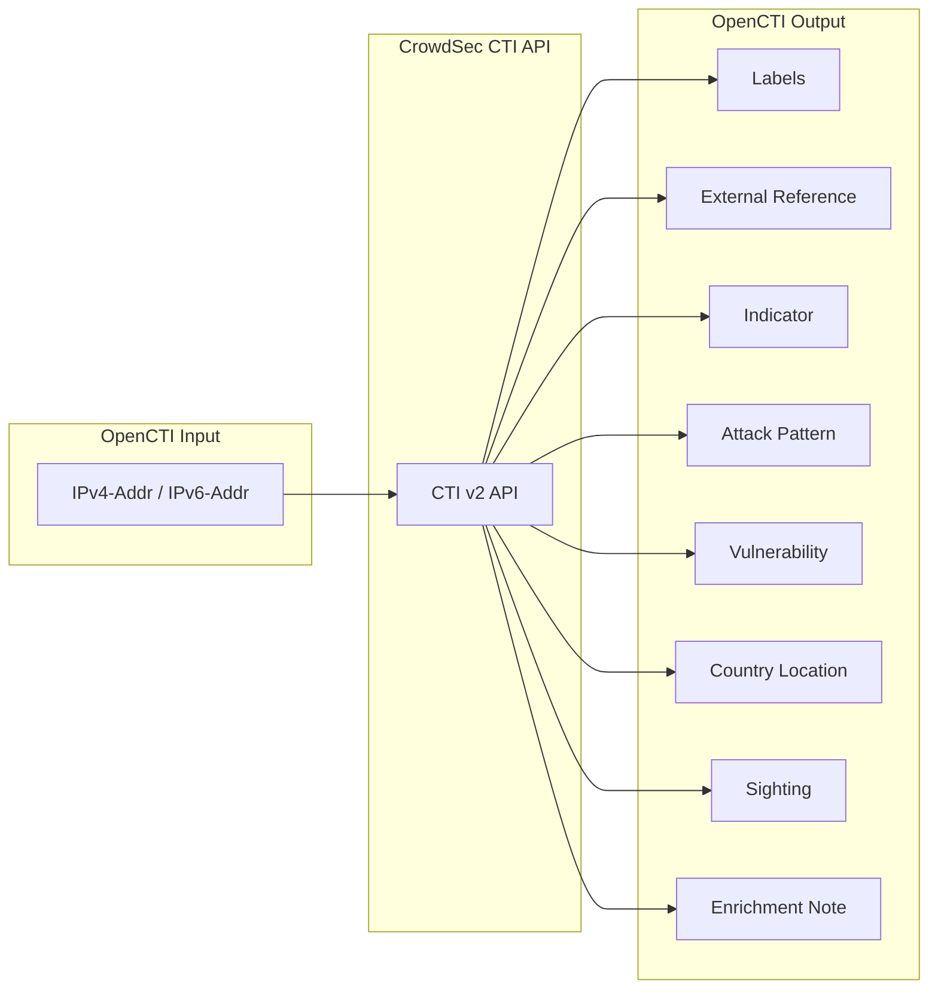

# OpenCTI CrowdSec Connector

The CrowdSec connector enriches IPv4 and IPv6 address observables with threat intelligence from CrowdSec's Cyber Threat Intelligence (CTI) API, providing reputation scores, attack behaviors, MITRE ATT&CK mappings, CVEs, and targeted country information.

| Status            | Date | Comment |
|-------------------|------|---------|
| Filigran Verified | -    | -       |

## Table of Contents

- [OpenCTI CrowdSec Connector](#opencti-crowdsec-connector)
  - [Table of Contents](#table-of-contents)
  - [Introduction](#introduction)
  - [Installation](#installation)
    - [Requirements](#requirements)
  - [Configuration variables](#configuration-variables)
    - [OpenCTI environment variables](#opencti-environment-variables)
    - [Base connector environment variables](#base-connector-environment-variables)
    - [Connector extra parameters environment variables](#connector-extra-parameters-environment-variables)
  - [Deployment](#deployment)
    - [Docker Deployment](#docker-deployment)
    - [Manual Deployment](#manual-deployment)
  - [Usage](#usage)
  - [Behavior](#behavior)
  - [Debugging](#debugging)
  - [Additional information](#additional-information)

## Introduction

CrowdSec is an open-source and collaborative security platform that leverages crowd-sourced threat intelligence to protect systems and networks. The CrowdSec CTI API provides comprehensive threat intelligence data about IP addresses, including reputation scoring, attack behaviors, MITRE ATT&CK technique mappings, associated CVEs, and geographical targeting information.

This connector integrates CrowdSec CTI with OpenCTI to:
- Enrich IP observables with reputation scores (malicious, suspicious, known, safe)
- Create MITRE ATT&CK technique mappings
- Generate vulnerability entities from CVEs
- Add targeted country information with sighting relationships
- Create indicators with STIX patterns for malicious/suspicious IPs
- Apply customizable labels for various threat attributes

## Installation

### Requirements

- OpenCTI Platform >= 6.x
- CrowdSec CTI API key (available from [CrowdSec Console](https://app.crowdsec.net))

## Configuration variables

There are a number of configuration options, which are set either in `docker-compose.yml` (for Docker) or in `config.yml` (for manual deployment).

### OpenCTI environment variables

| Parameter     | config.yml | Docker environment variable | Mandatory | Description                                          |
|---------------|------------|-----------------------------|-----------|------------------------------------------------------|
| OpenCTI URL   | url        | `OPENCTI_URL`               | Yes       | The URL of the OpenCTI platform.                     |
| OpenCTI Token | token      | `OPENCTI_TOKEN`             | Yes       | The default admin token set in the OpenCTI platform. |

### Base connector environment variables

| Parameter            | config.yml           | Docker environment variable      | Default         | Mandatory | Description                                                                 |
|----------------------|----------------------|----------------------------------|-----------------|-----------|-----------------------------------------------------------------------------|
| Connector ID         | id                   | `CONNECTOR_ID`                   |                 | Yes       | A unique `UUIDv4` identifier for this connector instance.                   |
| Connector Name       | name                 | `CONNECTOR_NAME`                 | CrowdSec        | No        | Name of the connector.                                                      |
| Connector Scope      | scope                | `CONNECTOR_SCOPE`                | IPv4-Addr,IPv6-Addr | No    | The scope of observables the connector will enrich.                         |
| Connector Type       | type                 | `CONNECTOR_TYPE`                 | INTERNAL_ENRICHMENT | Yes   | Should always be `INTERNAL_ENRICHMENT` for this connector.                  |
| Log Level            | log_level            | `CONNECTOR_LOG_LEVEL`            | error           | No        | Determines the verbosity of the logs: `debug`, `info`, `warn`, or `error`.  |
| Confidence Level     | confidence_level     | `CONNECTOR_CONFIDENCE_LEVEL`     | 100             | No        | The default confidence level for created relationships (1-100).             |
| Auto Mode            | auto                 | `CONNECTOR_AUTO`                 | true            | No        | Enables or disables automatic enrichment of observables.                    |
| Update Existing Data | update_existing_data | `CONNECTOR_UPDATE_EXISTING_DATA` | false           | No        | Update existing data in database during enrichment.                         |

### Connector extra parameters environment variables

| Parameter                          | config.yml                                  | Docker environment variable                        | Default         | Mandatory | Description                                                                |
|------------------------------------|---------------------------------------------|----------------------------------------------------|-----------------|-----------|----------------------------------------------------------------------------|
| API Key                            | crowdsec.key                                | `CROWDSEC_KEY`                                     |                 | Yes       | CrowdSec CTI API key.                                                      |
| API Version                        | crowdsec.api_version                        | `CROWDSEC_API_VERSION`                             | v2              | No        | API version (only v2 is supported).                                        |
| Max TLP                            | crowdsec.max_tlp                            | `CROWDSEC_MAX_TLP`                                 | TLP:AMBER       | No        | Maximum TLP level for observables to be enriched.                          |
| Labels - Scenario Name             | crowdsec.labels_scenario_name               | `CROWDSEC_LABELS_SCENARIO_NAME`                    | true            | No        | Add scenario name as label.                                                |
| Labels - Scenario Label            | crowdsec.labels_scenario_label              | `CROWDSEC_LABELS_SCENARIO_LABEL`                   | false           | No        | Add scenario label as label.                                               |
| Labels - Scenario Color            | crowdsec.labels_scenario_color              | `CROWDSEC_LABELS_SCENARIO_COLOR`                   | #2E2A14         | No        | Color for scenario labels.                                                 |
| Labels - CVE                       | crowdsec.labels_cve                         | `CROWDSEC_LABELS_CVE`                              | true            | No        | Add CVE identifiers as labels.                                             |
| Labels - CVE Color                 | crowdsec.labels_cve_color                   | `CROWDSEC_LABELS_CVE_COLOR`                        | #800080         | No        | Color for CVE labels.                                                      |
| Labels - MITRE                     | crowdsec.labels_mitre                       | `CROWDSEC_LABELS_MITRE`                            | true            | No        | Add MITRE technique IDs as labels.                                         |
| Labels - MITRE Color               | crowdsec.labels_mitre_color                 | `CROWDSEC_LABELS_MITRE_COLOR`                      | #000080         | No        | Color for MITRE labels.                                                    |
| Labels - Behavior                  | crowdsec.labels_behavior                    | `CROWDSEC_LABELS_BEHAVIOR`                         | false           | No        | Add behavior names as labels.                                              |
| Labels - Behavior Color            | crowdsec.labels_behavior_color              | `CROWDSEC_LABELS_BEHAVIOR_COLOR`                   | #808000         | No        | Color for behavior labels.                                                 |
| Labels - Reputation                | crowdsec.labels_reputation                  | `CROWDSEC_LABELS_REPUTATION`                       | true            | No        | Add reputation as label.                                                   |
| Labels - Reputation Malicious Color| crowdsec.labels_reputation_malicious_color  | `CROWDSEC_LABELS_REPUTATION_MALICIOUS_COLOR`       | #FF0000         | No        | Color for malicious reputation label.                                      |
| Labels - Reputation Suspicious Color| crowdsec.labels_reputation_suspicious_color| `CROWDSEC_LABELS_REPUTATION_SUSPICIOUS_COLOR`      | #FFA500         | No        | Color for suspicious reputation label.                                     |
| Labels - Reputation Safe Color     | crowdsec.labels_reputation_safe_color       | `CROWDSEC_LABELS_REPUTATION_SAFE_COLOR`            | #00BFFF         | No        | Color for safe reputation label.                                           |
| Labels - Reputation Known Color    | crowdsec.labels_reputation_known_color      | `CROWDSEC_LABELS_REPUTATION_KNOWN_COLOR`           | #808080         | No        | Color for known reputation label.                                          |
| Indicator Create From              | crowdsec.indicator_create_from              | `CROWDSEC_INDICATOR_CREATE_FROM`                   | malicious,suspicious,known | No | Comma-separated reputations to create indicators from.                |
| Attack Pattern from MITRE          | crowdsec.attack_pattern_create_from_mitre   | `CROWDSEC_ATTACK_PATTERN_CREATE_FROM_MITRE`        | true            | No        | Create Attack Pattern entities from MITRE techniques.                      |
| Create Note                        | crowdsec.create_note                        | `CROWDSEC_CREATE_NOTE`                             | true            | No        | Create a Note with enrichment summary.                                     |
| Create Sighting                    | crowdsec.create_sighting                    | `CROWDSEC_CREATE_SIGHTING`                         | true            | No        | Create sighting relationship for CrowdSec.                                 |
| Target Countries Sightings         | crowdsec.create_targeted_countries_sightings| `CROWDSEC_CREATE_TARGETED_COUNTRIES_SIGHTINGS`     | true            | No        | Create sightings for targeted countries.                                   |
| Last Enrichment in Description     | crowdsec.last_enrichment_date_in_description| `CROWDSEC_LAST_ENRICHMENT_DATE_IN_DESCRIPTION`     | true            | No        | Save last enrichment date in observable description.                       |
| Min Delay Between Enrichments      | crowdsec.min_delay_between_enrichments      | `CROWDSEC_MIN_DELAY_BETWEEN_ENRICHMENTS`           | 300             | No        | Minimum seconds between enrichments (uses description date).               |
| Vulnerability from CVE             | crowdsec.vulnerability_create_from_cve      | `CROWDSEC_VULNERABILITY_CREATE_FROM_CVE`           | true            | No        | Create Vulnerability entities from CVEs.                                   |

## Deployment

### Docker Deployment

Build the Docker image:

```bash
docker build -t opencti/connector-crowdsec:latest .
```

Configure the connector in `docker-compose.yml`:

```yaml
  connector-crowdsec:
    image: opencti/connector-crowdsec:latest
    environment:
      - OPENCTI_URL=http://localhost
      - OPENCTI_TOKEN=ChangeMe
      - CONNECTOR_ID=ChangeMe_UUID4
      - CONNECTOR_NAME=CrowdSec
      - CONNECTOR_SCOPE=IPv4-Addr,IPv6-Addr
      - CONNECTOR_LOG_LEVEL=error
      - CONNECTOR_AUTO=true
      - CONNECTOR_UPDATE_EXISTING_DATA=false
      - CROWDSEC_KEY=ChangeMe
      - CROWDSEC_API_VERSION=v2
      - CROWDSEC_MAX_TLP=TLP:AMBER
      - CROWDSEC_LABELS_SCENARIO_NAME=true
      - CROWDSEC_LABELS_CVE=true
      - CROWDSEC_LABELS_MITRE=true
      - CROWDSEC_LABELS_REPUTATION=true
      - CROWDSEC_INDICATOR_CREATE_FROM=malicious,suspicious,known
      - CROWDSEC_ATTACK_PATTERN_CREATE_FROM_MITRE=true
      - CROWDSEC_CREATE_NOTE=true
      - CROWDSEC_CREATE_SIGHTING=true
      - CROWDSEC_CREATE_TARGETED_COUNTRIES_SIGHTINGS=true
      - CROWDSEC_VULNERABILITY_CREATE_FROM_CVE=true
    restart: always
```

Start the connector:

```bash
docker compose up -d
```

### Manual Deployment

1. Copy and configure `config.yml` from the provided `config.yml.sample`.

2. Install dependencies:

```bash
pip3 install -r requirements.txt
```

3. Start the connector from the `src` directory:

```bash
python3 main.py
```

## Usage

The connector enriches IPv4 and IPv6 address observables with CrowdSec CTI data.

**Observations → Observables**

Select an IPv4-Addr or IPv6-Addr observable, then click the enrichment button and choose CrowdSec.

## Behavior

The connector queries the CrowdSec CTI API and creates comprehensive threat intelligence around the IP address.

### Data Flow



### Enrichment Mapping

| CrowdSec CTI Data        | OpenCTI Entity           | Description                                              |
|--------------------------|--------------------------|----------------------------------------------------------|
| reputation               | Label                    | IP reputation (malicious, suspicious, known, safe)       |
| reputation               | Indicator                | STIX pattern indicator for matching reputations          |
| behaviors                | Labels                   | Attack behavior names                                    |
| attack_details           | Labels                   | Scenario names and labels                                |
| mitre_techniques         | Attack Pattern           | MITRE ATT&CK technique entities                          |
| mitre_techniques         | Labels                   | MITRE technique IDs as labels                            |
| cves                     | Vulnerability            | CVE vulnerability entities                               |
| cves                     | Labels                   | CVE identifiers as labels                                |
| target_countries         | Country (Location)       | Countries targeted by this IP                            |
| target_countries         | Sighting                 | Sightings to targeted countries with count               |
| history.first_seen       | Sighting                 | First seen timestamp                                     |
| history.last_seen        | Sighting                 | Last seen timestamp                                      |
| references               | External Reference       | Blocklist and reference URLs                             |
| CTI URL                  | External Reference       | Link to CrowdSec CTI page for the IP                     |

### Reputation Scoring

| Reputation   | Confidence Mapping | Description                                    |
|--------------|-------------------|------------------------------------------------|
| malicious    | high → 90         | Known malicious IP with high confidence        |
| suspicious   | medium → 60       | Suspicious activity detected                   |
| known        | low → 30          | IP known to CrowdSec network                   |
| safe         | 0                 | IP deemed safe                                 |

### Generated STIX Objects

| STIX Object Type | Condition                           | Description                                              |
|------------------|-------------------------------------|----------------------------------------------------------|
| External Reference | Always                            | Link to CrowdSec CTI and blocklist references            |
| Labels           | Based on configuration              | Scenario, CVE, MITRE, behavior, reputation labels        |
| Indicator        | When reputation in configured list  | STIX pattern for the IP address                          |
| Attack Pattern   | When MITRE techniques present       | MITRE ATT&CK technique entities                          |
| Vulnerability    | When CVEs present                   | CVE vulnerability entities                               |
| Country          | When target countries present       | Country location entities                                |
| Sighting         | When enabled                        | Sighting from CrowdSec organization                      |
| Note             | When enabled                        | Summary note with all enrichment data                    |

### Relationships Created

| Relationship Type | Source              | Target              | Description                                |
|-------------------|---------------------|---------------------|--------------------------------------------|
| `based-on`        | Indicator           | IP Observable       | Indicator based on observable              |
| `indicates`       | Indicator           | Attack Pattern      | Indicator indicates attack technique       |
| `related-to`      | IP Observable       | Attack Pattern      | When no indicator created                  |
| `related-to`      | Vulnerability       | IP Observable       | CVE associated with IP                     |
| `targets`         | Attack Pattern      | Country             | Attack pattern targets country             |
| Sighting          | IP Observable       | CrowdSec Identity   | Sighting relationship                      |
| Sighting          | Indicator           | CrowdSec Identity   | Indicator sighting                         |
| Sighting          | Observable/Indicator| Country             | Country-specific sightings with count      |

### Note Content

When `create_note` is enabled, the Note includes:
- Reputation status
- Confidence level
- First and last seen dates
- Origin country and city
- Behaviors with descriptions
- Most targeted countries with percentages

## Debugging

Enable verbose logging by setting:

```env
CONNECTOR_LOG_LEVEL=debug
```

Log output includes:
- CTI API response data
- Label creation status
- Bundle object details
- Enrichment completion status

## Additional information

- **API Documentation**: [CrowdSec CTI API Documentation](https://docs.crowdsec.net/docs/cti_api/intro)
- **API Quota**: CrowdSec CTI API has rate limits based on subscription tier
- **Enrichment Throttling**: Use `min_delay_between_enrichments` to prevent excessive API calls
- **Organization Identity**: Creates a "CrowdSec" organization identity for attribution
- **External Import Connector**: CrowdSec also offers an external import connector for bulk data import
- **Playbook Support**: This connector supports OpenCTI playbook automation
