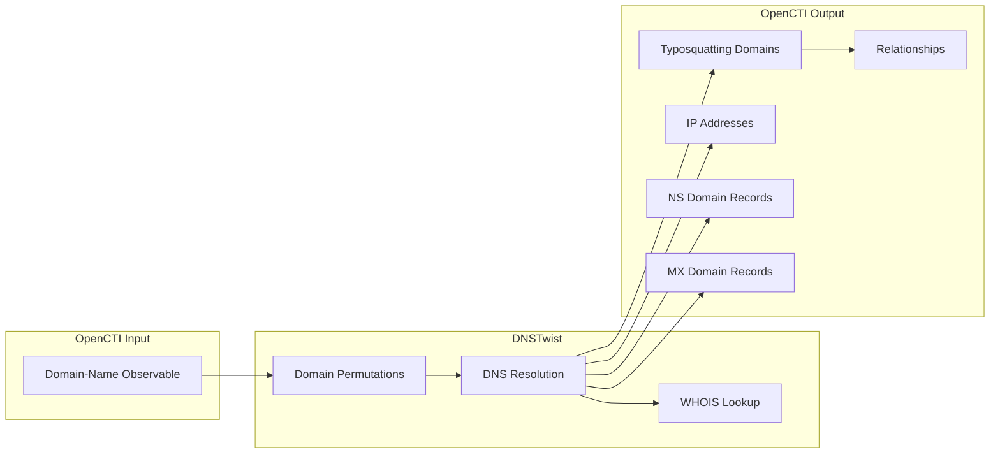

# OpenCTI DNSTwist Connector

| Status | Date | Comment |
|--------|------|---------|
| Filigran Verified | -    | -       |

The DNSTwist connector enriches Domain-Name observables by generating and detecting typosquatting domains using the DNSTwist library, discovering potential phishing domains, brand impersonation attempts, and domain squatting.

## Table of Contents

- [OpenCTI DNSTwist Connector](#opencti-dnstwist-connector)
  - [Table of Contents](#table-of-contents)
  - [Introduction](#introduction)
  - [Installation](#installation)
    - [Requirements](#requirements)
  - [Configuration variables](#configuration-variables)
    - [OpenCTI environment variables](#opencti-environment-variables)
    - [Base connector environment variables](#base-connector-environment-variables)
    - [Connector extra parameters environment variables](#connector-extra-parameters-environment-variables)
  - [Deployment](#deployment)
    - [Docker Deployment](#docker-deployment)
    - [Manual Deployment](#manual-deployment)
  - [Usage](#usage)
  - [Behavior](#behavior)
  - [Debugging](#debugging)
  - [Additional information](#additional-information)

## Introduction

[DNSTwist](https://github.com/elceef/dnstwist) is a powerful tool for finding lookalike domains that adversaries can use to attack organizations. It generates domain permutations using various algorithms including character substitution, homoglyphs, typos, and TLD variations, then checks which of these domains are actually registered.

This connector integrates DNSTwist with OpenCTI to:
- Generate potential typosquatting domain variations
- Check DNS resolution for generated domains
- Create relationships between the original domain and discovered squatting domains
- Extract DNS records (A, AAAA, NS, MX) for discovered domains
- Provide WHOIS information when available

## Installation

### Requirements

- OpenCTI Platform >= 6.x
- DNSTwist library (included in requirements)

## Configuration variables

There are a number of configuration options, which are set either in `docker-compose.yml` (for Docker) or as environment variables.

### OpenCTI environment variables

| Parameter     | config.yml | Docker environment variable | Mandatory | Description                                          |
|---------------|------------|-----------------------------|-----------|------------------------------------------------------|
| OpenCTI URL   | url        | `OPENCTI_URL`               | Yes       | The URL of the OpenCTI platform.                     |
| OpenCTI Token | token      | `OPENCTI_TOKEN`             | Yes       | The default admin token set in the OpenCTI platform. |

### Base connector environment variables

| Parameter            | config.yml           | Docker environment variable      | Default      | Mandatory | Description                                                                 |
|----------------------|----------------------|----------------------------------|--------------|-----------|-----------------------------------------------------------------------------|
| Connector ID         | id                   | `CONNECTOR_ID`                   |              | Yes       | A unique `UUIDv4` identifier for this connector instance.                   |
| Connector Name       | name                 | `CONNECTOR_NAME`                 | DNS_TWISTER  | No        | Name of the connector.                                                      |
| Connector Scope      | scope                | `CONNECTOR_SCOPE`                | Domain-Name  | No        | The scope of observables the connector will enrich.                         |
| Connector Type       | type                 | `CONNECTOR_TYPE`                 | INTERNAL_ENRICHMENT | Yes | Should always be `INTERNAL_ENRICHMENT` for this connector.                  |
| Auto Mode            | auto                 | `CONNECTOR_AUTO`                 | false        | No        | Enables or disables automatic enrichment (not recommended).                 |
| Update Existing Data | update_existing_data | `CONNECTOR_UPDATE_EXISTING_DATA` | true         | No        | Update existing data in database during enrichment.                         |

### Connector extra parameters environment variables

| Parameter          | config.yml            | Docker environment variable     | Default | Mandatory | Description                                                          |
|--------------------|-----------------------|---------------------------------|---------|-----------|----------------------------------------------------------------------|
| Fetch Registered   | fetch_registered      | `CONNECTOR_FETCH_REGISTERED`    | true    | No        | Only return domains that are actually registered.                    |
| DNS Twist Threads  | dns_twist_threads     | `CONNECTOR_DNS_TWIST_THREADS`   | 20      | No        | Number of threads for DNS lookups.                                   |

## Deployment

### Docker Deployment

Build the Docker image:

```bash
docker build -t opencti/connector-dnstwist:latest .
```

Configure the connector in `docker-compose.yml`:

```yaml
  connector-dnstwist:
    image: opencti/connector-dnstwist:latest
    environment:
      - OPENCTI_URL=http://localhost
      - OPENCTI_TOKEN=ChangeMe
      - CONNECTOR_ID=ChangeMe_UUID4
      - CONNECTOR_NAME=DNS_TWISTER
      - CONNECTOR_SCOPE=Domain-Name
      - CONNECTOR_AUTO=false
      - CONNECTOR_UPDATE_EXISTING_DATA=true
      - CONNECTOR_FETCH_REGISTERED=true
      - CONNECTOR_DNS_TWIST_THREADS=80
    restart: always
```

Start the connector:

```bash
docker compose up -d
```

### Manual Deployment

1. Install dependencies:

```bash
pip3 install -r requirements.txt
```

2. Set environment variables for configuration.

3. Start the connector from the `src` directory:

```bash
python3 main.py
```

## Usage

The connector enriches Domain-Name observables by finding typosquatting variations.

**Observations → Observables**

Select a Domain-Name observable, then click the enrichment button and choose DNS Twist.

**Warning**: Do NOT enable automatic mode (`CONNECTOR_AUTO=true`) as this will generate a large number of domain lookups and can flood your OpenCTI instance with data.

## Behavior

The connector uses DNSTwist to generate domain permutations and checks DNS resolution, creating a network of related domains.

### Data Flow



### Enrichment Mapping

| DNSTwist Data         | OpenCTI Entity       | Description                                            |
|-----------------------|----------------------|--------------------------------------------------------|
| domain                | Domain-Name          | Discovered typosquatting domain                        |
| dns_a                 | IPv4-Addr            | A record IP addresses                                  |
| dns_aaaa              | IPv6-Addr            | AAAA record IP addresses                               |
| dns_ns                | Domain-Name          | Name server domains                                    |
| dns_mx                | Domain-Name          | Mail exchange domains                                  |
| whois_created         | Description          | Domain creation date                                   |
| whois_registrar       | Description          | Domain registrar information                           |

### Domain Permutation Types

DNSTwist generates variations using multiple algorithms:

| Type           | Description                                      | Example (example.com)      |
|----------------|--------------------------------------------------|----------------------------|
| Addition       | Character added                                  | examplea.com               |
| Bitsquatting   | Bit-flip character variations                    | dxample.com                |
| Homoglyph      | Visually similar characters                      | examp1e.com                |
| Hyphenation    | Hyphens added                                    | exam-ple.com               |
| Insertion      | Character inserted                               | exaample.com               |
| Omission       | Character removed                                | examle.com                 |
| Repetition     | Character repeated                               | eexample.com               |
| Replacement    | Character replaced                               | axample.com                |
| Subdomain      | Split into subdomain                             | ex.ample.com               |
| Transposition  | Adjacent characters swapped                      | exmaple.com                |
| TLD Variation  | Different top-level domain                       | example.net                |

### Generated STIX Objects

| STIX Object Type | Condition                          | Description                                          |
|------------------|------------------------------------|------------------------------------------------------|
| Domain-Name      | For each discovered domain         | Typosquatting domain with WHOIS description          |
| IPv4-Addr        | When A records present             | IP addresses from A records                          |
| IPv6-Addr        | When AAAA records present          | IP addresses from AAAA records                       |
| Domain-Name      | When NS records present            | Name server domains                                  |
| Domain-Name      | When MX records present            | Mail exchange domains                                |

### Relationships Created

| Relationship Type | Source              | Target                  | Description                                |
|-------------------|---------------------|-------------------------|--------------------------------------------|
| `related-to`      | Original Domain     | Typosquatting Domain    | Links original to discovered domain        |
| `resolves-to`     | Typosquatting Domain| IPv4-Addr / IPv6-Addr   | DNS A/AAAA record resolution               |
| `resolves-to`     | Typosquatting Domain| NS Domain               | Name server relationship                   |
| `resolves-to`     | Typosquatting Domain| MX Domain               | Mail exchange relationship                 |

### Domain Description Content

Each discovered domain includes a description with:
- Registrar information (when available)
- Creation date (when available)
- NS server records
- A record IP addresses
- AAAA record IP addresses
- MX record domains

## Debugging

Enable verbose logging by setting:

```env
CONNECTOR_LOG_LEVEL=debug
```

Log output includes:
- Observable processing status
- DNSTwist execution progress
- Bundle creation and sending status
- Relationship creation details

## Additional information

- **Performance**: DNSTwist performs many DNS lookups; adjust `CONNECTOR_DNS_TWIST_THREADS` based on your network capacity
- **Rate Limiting**: High thread counts may trigger DNS rate limiting; consider using a dedicated resolver
- **Data Volume**: A single domain can generate hundreds of variations; be prepared for significant data import
- **Automatic Mode Warning**: Never enable auto mode for this connector; it will flood your instance
- **Registered Only**: Set `CONNECTOR_FETCH_REGISTERED=true` to only show actually registered domains (recommended)
- **Dictionary Files**: The connector uses TLD dictionaries from the `/dictionaries/` directory
- **WHOIS Data**: WHOIS information availability depends on registrar policies
