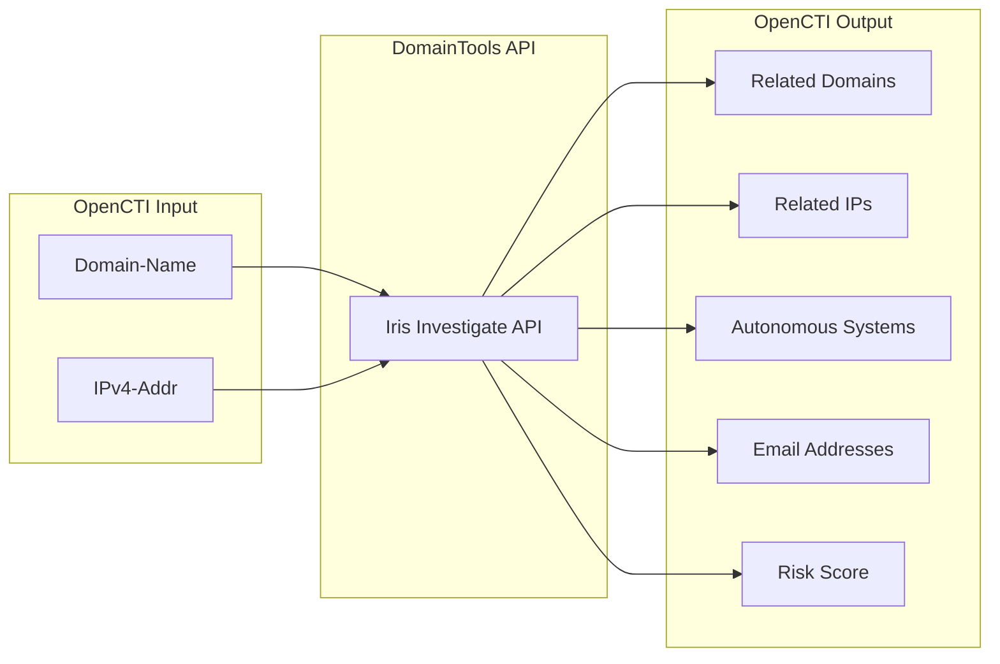

# OpenCTI DomainTools Connector

The DomainTools connector enriches Domain-Name and IPv4-Addr observables with WHOIS data, DNS records, risk scores, and related infrastructure from the DomainTools Iris Investigate API.

| Status            | Date | Comment |
|-------------------|------|---------|
| Filigran Verified | -    | -       |

## Table of Contents

- [OpenCTI DomainTools Connector](#opencti-domaintools-connector)
  - [Table of Contents](#table-of-contents)
  - [Introduction](#introduction)
  - [Installation](#installation)
    - [Requirements](#requirements)
  - [Configuration variables](#configuration-variables)
    - [OpenCTI environment variables](#opencti-environment-variables)
    - [Base connector environment variables](#base-connector-environment-variables)
    - [Connector extra parameters environment variables](#connector-extra-parameters-environment-variables)
  - [Deployment](#deployment)
    - [Docker Deployment](#docker-deployment)
    - [Manual Deployment](#manual-deployment)
  - [Usage](#usage)
  - [Behavior](#behavior)
  - [Debugging](#debugging)
  - [Additional information](#additional-information)

## Introduction

DomainTools is a leading provider of WHOIS and DNS profile data for threat intelligence enrichment. The DomainTools Iris Investigate API provides comprehensive domain intelligence including registration details, DNS records, risk scores, and related infrastructure.

This connector integrates DomainTools Iris Investigate with OpenCTI to:
- Enrich domains with DNS records (A, NS, MX)
- Extract IP addresses and their ASN associations
- Discover related domains (name servers, email domains, redirects)
- Extract email addresses from WHOIS records
- Apply domain risk scores as observable scores
- Create relationships with validity periods based on domain registration

## Installation

### Requirements

- OpenCTI Platform >= 6.x
- DomainTools API credentials (username and API key)
- DomainTools Iris Investigate API access

## Configuration variables

There are a number of configuration options, which are set either in `docker-compose.yml` (for Docker) or in `config.yml` (for manual deployment).

### OpenCTI environment variables

| Parameter     | config.yml | Docker environment variable | Mandatory | Description                                          |
|---------------|------------|-----------------------------|-----------|------------------------------------------------------|
| OpenCTI URL   | url        | `OPENCTI_URL`               | Yes       | The URL of the OpenCTI platform.                     |
| OpenCTI Token | token      | `OPENCTI_TOKEN`             | Yes       | The default admin token set in the OpenCTI platform. |

### Base connector environment variables

| Parameter          | config.yml       | Docker environment variable   | Default            | Mandatory | Description                                                                   |
|--------------------|------------------|-------------------------------|--------------------|-----------|-------------------------------------------------------------------------------|
| Connector ID       | id               | `CONNECTOR_ID`                |                    | Yes       | A unique `UUIDv4` identifier for this connector instance.                     |
| Connector Name     | name             | `CONNECTOR_NAME`              | DomainTools        | No        | Name of the connector.                                                        |
| Connector Scope    | scope            | `CONNECTOR_SCOPE`             | Domain-Name,IPv4-Addr | No     | The scope of observables the connector will enrich.                           |
| Connector Type     | type             | `CONNECTOR_TYPE`              | INTERNAL_ENRICHMENT | Yes     | Should always be `INTERNAL_ENRICHMENT` for this connector.                    |
| Log Level          | log_level        | `CONNECTOR_LOG_LEVEL`         | info               | No        | Determines the verbosity of the logs: `debug`, `info`, `warn`, or `error`.    |
| Confidence Level   | confidence_level | `CONNECTOR_CONFIDENCE_LEVEL`  | 80                 | No        | The default confidence level for created relationships (1-100).               |
| Auto Mode          | auto             | `CONNECTOR_AUTO`              | false              | No        | Enables or disables automatic enrichment of observables.                      |

### Connector extra parameters environment variables

| Parameter      | config.yml               | Docker environment variable     | Default    | Mandatory | Description                                                     |
|----------------|--------------------------|--------------------------------|------------|-----------|-----------------------------------------------------------------|
| API Username   | domaintools.api_username | `DOMAINTOOLS_API_USERNAME`     |            | Yes       | DomainTools API username for authentication.                    |
| API Key        | domaintools.api_key      | `DOMAINTOOLS_API_KEY`          |            | Yes       | DomainTools API key for authentication.                         |
| Max TLP        | domaintools.max_tlp      | `DOMAINTOOLS_MAX_TLP`          | TLP:AMBER  | No        | Maximum TLP level for observables to be enriched.               |

## Deployment

### Docker Deployment

Build the Docker image:

```bash
docker build -t opencti/connector-domaintools:latest .
```

Configure the connector in `docker-compose.yml`:

```yaml
  connector-domaintools:
    image: opencti/connector-domaintools:latest
    environment:
      - OPENCTI_URL=http://localhost
      - OPENCTI_TOKEN=ChangeMe
      - CONNECTOR_ID=ChangeMe_UUID4
      - CONNECTOR_NAME=DomainTools
      - CONNECTOR_SCOPE=Domain-Name,IPv4-Addr
      - CONNECTOR_LOG_LEVEL=info
      - CONNECTOR_AUTO=false
      - DOMAINTOOLS_API_USERNAME=ChangeMe
      - DOMAINTOOLS_API_KEY=ChangeMe
      - DOMAINTOOLS_MAX_TLP=TLP:AMBER
    restart: always
```

Start the connector:

```bash
docker compose up -d
```

### Manual Deployment

1. Copy and configure `config.yml` from the provided `config.yml.sample`.

2. Install dependencies:

```bash
pip3 install -r requirements.txt
```

3. Start the connector from the `src` directory:

```bash
python3 main.py
```

## Usage

The connector enriches Domain-Name and IPv4-Addr observables with DomainTools intelligence.

**Observations → Observables**

Select a Domain-Name or IPv4-Addr observable, then click the enrichment button and choose DomainTools.

## Behavior

The connector queries the DomainTools Iris Investigate API and creates a network of related entities.

### Data Flow



### Enrichment Mapping

| DomainTools Data        | OpenCTI Entity       | Description                                                |
|-------------------------|----------------------|------------------------------------------------------------|
| domain                  | Domain-Name          | Primary domain being investigated                          |
| domain_risk.risk_score  | Observable Score     | Domain risk score (0-100)                                  |
| ip.address              | IPv4-Addr            | IP addresses resolving from the domain                     |
| ip.asn                  | Autonomous System    | ASN associated with IP addresses                           |
| name_server.domain      | Domain-Name          | Name server domains                                        |
| mx.domain               | Domain-Name          | Mail exchange server domains                               |
| email_domain            | Domain-Name          | Domains from email addresses in WHOIS                      |
| redirect_domain         | Domain-Name          | Redirect destination domains                               |
| soa_email               | Email-Addr           | SOA email addresses                                        |
| admin_contact.email     | Email-Addr           | Admin contact emails from WHOIS                            |
| billing_contact.email   | Email-Addr           | Billing contact emails from WHOIS                          |
| registrant_contact.email| Email-Addr           | Registrant emails from WHOIS                               |
| technical_contact.email | Email-Addr           | Technical contact emails from WHOIS                        |
| create_date             | Relationship start   | Domain creation date                                       |
| expiration_date         | Relationship end     | Domain expiration date                                     |

### Generated STIX Objects

| STIX Object Type    | Condition                    | Description                                          |
|---------------------|------------------------------|------------------------------------------------------|
| Domain-Name         | When related domains found   | Name servers, MX, email domains, redirects           |
| IPv4-Addr           | When IP addresses found      | IP addresses resolving from domains                  |
| Autonomous System   | When ASN data present        | ASN for IP addresses                                 |
| Email-Addr          | When WHOIS emails found      | Contact emails from WHOIS records                    |

### Relationships Created

| Relationship Type | Source              | Target              | Description                                |
|-------------------|---------------------|---------------------|--------------------------------------------|
| `resolves-to`     | Domain-Name         | IPv4-Addr           | Domain DNS A record resolution             |
| `resolves-to`     | Domain-Name         | Domain-Name         | NS, MX, redirect, email domain relations   |
| `belongs-to`      | IPv4-Addr           | Autonomous System   | IP to ASN association                      |
| `related-to`      | Domain-Name         | Email-Addr          | WHOIS email associations                   |

### IP Address Enrichment

When enriching an IPv4-Addr:
- The connector searches for domains associated with the IP
- For each domain found, it performs the same enrichment as domain enrichment
- Creates the domain and links it to the original IP

### Relationship Validity

Relationships include temporal validity based on:
- **Start Time**: Domain creation date from WHOIS
- **Stop Time**: Domain expiration date from WHOIS

## Debugging

Enable verbose logging by setting:

```env
CONNECTOR_LOG_LEVEL=debug
```

Log output includes:
- Observable type detection
- DomainTools API responses
- Entity creation progress
- Bundle size and sending status

## Additional information

- **API Documentation**: Uses the [DomainTools Official Python API](https://github.com/DomainTools/python_api)
- **Risk Scores**: Domain risk scores from DomainTools are applied as `x_opencti_score` on observables
- **TLP Marking**: All created objects are marked with TLP:AMBER by default
- **Organization Identity**: Creates a "DomainTools" organization identity for attribution
- **Validation**: Domain and email values are validated before creating STIX objects
- **Iris Investigate**: Requires access to the DomainTools Iris Investigate product
