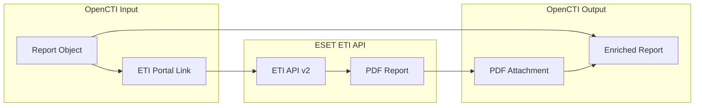

# OpenCTI ESET ETI Report Connector

The ESET ETI Report Enrichment connector automatically downloads PDF reports from the ESET Threat Intelligence (ETI) portal and attaches them to ESET report objects in OpenCTI.

| Status            | Date | Comment |
|-------------------|------|---------|
| Filigran Verified | -    | -       |

## Table of Contents

- [OpenCTI ESET ETI Report Enrichment Connector](#opencti-eset-eti-report-enrichment-connector)
  - [Table of Contents](#table-of-contents)
  - [Introduction](#introduction)
  - [Installation](#installation)
    - [Requirements](#requirements)
  - [Configuration variables](#configuration-variables)
    - [OpenCTI environment variables](#opencti-environment-variables)
    - [Base connector environment variables](#base-connector-environment-variables)
    - [Connector extra parameters environment variables](#connector-extra-parameters-environment-variables)
  - [Deployment](#deployment)
    - [Docker Deployment](#docker-deployment)
    - [Manual Deployment](#manual-deployment)
  - [Usage](#usage)
  - [Behavior](#behavior)
  - [Debugging](#debugging)
  - [Additional information](#additional-information)

## Introduction

ESET Threat Intelligence (ETI) provides comprehensive threat intelligence including APT reports, malware analysis, and threat actor profiles. ESET report objects imported into OpenCTI typically contain external references linking to the ETI portal where detailed PDF reports are available.

This connector automates the process of:
- Detecting ESET report objects with ETI portal links
- Downloading PDF reports from the ETI API
- Attaching the PDF files directly to the report objects in OpenCTI

## Installation

### Requirements

- OpenCTI Platform >= 6.5.1
- ESET Threat Intelligence API credentials (API key and secret)

For information on obtaining API credentials, visit the [ESET Threat Intelligence documentation](https://help.eset.com/eti_portal/en-US/access_credentials.html).

## Configuration variables

There are a number of configuration options, which are set either in `docker-compose.yml` (for Docker) or in `config.yml` (for manual deployment).

### OpenCTI environment variables

| Parameter     | config.yml | Docker environment variable | Mandatory | Description                                          |
|---------------|------------|-----------------------------|-----------|------------------------------------------------------|
| OpenCTI URL   | url        | `OPENCTI_URL`               | Yes       | The URL of the OpenCTI platform.                     |
| OpenCTI Token | token      | `OPENCTI_TOKEN`             | Yes       | The default admin token set in the OpenCTI platform. |

### Base connector environment variables

| Parameter       | config.yml | Docker environment variable | Default             | Mandatory | Description                                                                 |
|-----------------|------------|-----------------------------|---------------------|-----------|-----------------------------------------------------------------------------|
| Connector ID    | id         | `CONNECTOR_ID`              |                     | Yes       | A unique `UUIDv4` identifier for this connector instance.                   |
| Connector Name  | name       | `CONNECTOR_NAME`            | ESET ETI Report Enrichment Connector | No | Name of the connector.                                                      |
| Connector Scope | scope      | `CONNECTOR_SCOPE`           | report              | Yes       | Should be `report` for this connector.                                      |
| Connector Type  | type       | `CONNECTOR_TYPE`            | INTERNAL_ENRICHMENT | Yes       | Should always be `INTERNAL_ENRICHMENT` for this connector.                  |
| Log Level       | log_level  | `CONNECTOR_LOG_LEVEL`       | info                | No        | Determines the verbosity of the logs: `debug`, `info`, `warn`, or `error`.  |
| Auto Mode       | auto       | `CONNECTOR_AUTO`            | true                | No        | Enables or disables automatic enrichment of reports.                        |

### Connector extra parameters environment variables

| Parameter  | config.yml     | Docker environment variable | Default              | Mandatory | Description                                               |
|------------|----------------|----------------------------|----------------------|-----------|-----------------------------------------------------------|
| API Key    | eset.api_key   | `ESET_API_KEY`             |                      | Yes       | ESET Threat Intelligence API key.                         |
| API Secret | eset.api_secret| `ESET_API_SECRET`          |                      | Yes       | ESET Threat Intelligence API secret.                      |
| API Host   | eset.api_host  | `ESET_API_HOST`            | https://eti.eset.com/ | No       | ESET Threat Intelligence API base URL.                    |

## Deployment

### Docker Deployment

Build the Docker image:

```bash
docker build -t opencti/connector-eset-enrichment:latest .
```

Configure the connector in `docker-compose.yml`:

```yaml
  connector-eset-enrichment:
    image: opencti/connector-eset-enrichment:latest
    environment:
      - OPENCTI_URL=http://localhost
      - OPENCTI_TOKEN=ChangeMe
      - CONNECTOR_ID=ChangeMe_UUID4
      - CONNECTOR_NAME=ESET ETI Report Enrichment Connector
      - CONNECTOR_SCOPE=report
      - CONNECTOR_LOG_LEVEL=info
      - CONNECTOR_AUTO=true
      - ESET_API_KEY=ChangeMe
      - ESET_API_SECRET=ChangeMe
      - ESET_API_HOST=https://eti.eset.com/
    restart: always
```

Start the connector:

```bash
docker compose up -d
```

### Manual Deployment

1. Copy and configure `config.yml` from the provided `config.yml.sample`.

2. Install dependencies:

```bash
pip3 install -r requirements.txt
```

3. Start the connector from the `src` directory:

```bash
python3 main.py
```

## Usage

The connector enriches ESET report objects by downloading and attaching PDF reports.

**Analyses → Reports**

When automatic mode is enabled, the connector will automatically process new ESET reports. Alternatively, select an ESET report and click the enrichment button to manually trigger.

## Behavior

The connector identifies ESET reports with ETI portal links and downloads the associated PDF files.

### Data Flow



### Enrichment Process

| Step | Action                                           | Description                                           |
|------|--------------------------------------------------|-------------------------------------------------------|
| 1    | Scope Check                                      | Verify entity type is in connector scope              |
| 2    | Creator Check                                    | Confirm report was created by ESET                    |
| 3    | TLP Check                                        | Validate TLP against max_tlp setting                  |
| 4    | Attachment Check                                 | Skip if PDF already attached                          |
| 5    | URL Extraction                                   | Find ETI portal download link                         |
| 6    | PDF Download                                     | Download report via ETI API                           |
| 7    | Attachment                                       | Attach PDF to report object                           |

### URL Pattern Matching

The connector looks for ETI portal URLs matching the pattern:
```
https://[www.]*.eset.com/reports/apt/{report_uid}/download
```

These URLs are converted to API calls:
```
{api_host}/api/v2/apt-reports/{report_uid}/download/pdf
```

### Processing Details

1. **Scope Validation**: Ensures the entity type matches the configured scope (`report`)
2. **Creator Validation**: Only processes reports created by "ESET"
3. **TLP Validation**: Respects TLP markings and max_tlp configuration
4. **Duplicate Prevention**: Skips reports that already have the PDF attached
5. **URL Discovery**: Searches report's related objects for ETI portal links
6. **API Authentication**: Uses Bearer token with format `{api_key}|{api_secret}`
7. **File Attachment**: Adds PDF as base64-encoded attachment to report

### Generated STIX Objects

| STIX Property      | Description                                            |
|--------------------|--------------------------------------------------------|
| x_opencti_files    | PDF report attached as file to the report object       |

## Debugging

Enable verbose logging by setting:

```env
CONNECTOR_LOG_LEVEL=debug
```

Log output includes:
- Entity processing status
- Creator validation results
- URL extraction details
- Download progress
- Bundle sending status

## Additional information

- **ESET Only**: The connector only processes reports created by the ESET identity
- **ETI Portal Required**: Reports must contain ETI portal download links in their objects
- **Duplicate Prevention**: Reports with existing PDF attachments are skipped
- **API Documentation**: [ESET Threat Intelligence Portal Help](https://help.eset.com/eti_portal/en-US/)
- **Credential Creation**: [ETI Access Credentials Guide](https://help.eset.com/eti_portal/en-US/access_credentials.html)
- **Playbook Support**: This connector supports OpenCTI playbook automation
