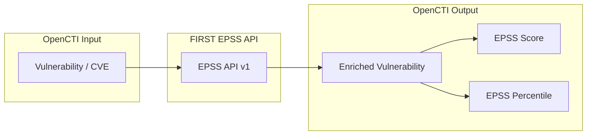

# OpenCTI FIRST EPSS Connector

| Status | Date | Comment |
|--------|------|---------|
| Filigran Verified | -    | -       |

The FIRST EPSS connector enriches CVE Vulnerability entities with Exploit Prediction Scoring System (EPSS) scores and percentiles from the FIRST.org API, helping prioritize vulnerability remediation efforts.

## Table of Contents

- [OpenCTI FIRST EPSS Connector](#opencti-first-epss-connector)
  - [Table of Contents](#table-of-contents)
  - [Introduction](#introduction)
  - [Installation](#installation)
    - [Requirements](#requirements)
  - [Configuration variables](#configuration-variables)
    - [OpenCTI environment variables](#opencti-environment-variables)
    - [Base connector environment variables](#base-connector-environment-variables)
    - [Connector extra parameters environment variables](#connector-extra-parameters-environment-variables)
  - [Deployment](#deployment)
    - [Docker Deployment](#docker-deployment)
    - [Manual Deployment](#manual-deployment)
  - [Usage](#usage)
  - [Behavior](#behavior)
  - [Debugging](#debugging)
  - [Additional information](#additional-information)

## Introduction

The Exploit Prediction Scoring System (EPSS) is a data-driven effort for estimating the probability that a software vulnerability will be exploited in the wild. Developed by [FIRST.org](https://www.first.org/epss/), EPSS produces daily scores based on CVE information combined with evidence of exploitation activity.

This connector integrates the FIRST EPSS API with OpenCTI to:
- Query EPSS scores for CVE vulnerabilities
- Add EPSS score (probability of exploitation) to vulnerability entities
- Add EPSS percentile (relative ranking) to vulnerability entities
- Help security teams prioritize patching based on exploitation likelihood

## Installation

### Requirements

- OpenCTI Platform >= 6.9.22

## Configuration variables

There are a number of configuration options, which are set either in `docker-compose.yml` (for Docker) or in `config.yml` (for manual deployment).

### OpenCTI environment variables

| Parameter     | config.yml | Docker environment variable | Mandatory | Description                                          |
|---------------|------------|-----------------------------|-----------|------------------------------------------------------|
| OpenCTI URL   | url        | `OPENCTI_URL`               | Yes       | The URL of the OpenCTI platform.                     |
| OpenCTI Token | token      | `OPENCTI_TOKEN`             | Yes       | The default admin token set in the OpenCTI platform. |

### Base connector environment variables

| Parameter       | config.yml | Docker environment variable | Default                               | Mandatory | Description                                                                 |
|-----------------|------------|-----------------------------|-----------------------------------------|-----------|-----------------------------------------------------------------------------|
| Connector ID    | id         | `CONNECTOR_ID`              | 18f1a9e6-a82b-4ef4-9699-ae406fe4a1a6 | No        | A unique `UUIDv4` identifier for this connector instance.                   |
| Connector Name  | name       | `CONNECTOR_NAME`            | First EPSS                            | No        | Name of the connector.                                                      |
| Connector Scope | scope      | `CONNECTOR_SCOPE`           | vulnerability                         | No        | Should be `vulnerability` for this connector.                               |
| Connector Type  | type       | `CONNECTOR_TYPE`            | INTERNAL_ENRICHMENT                   | Yes       | Should always be `INTERNAL_ENRICHMENT` for this connector.                  |
| Log Level       | log_level  | `CONNECTOR_LOG_LEVEL`       | error                                 | No        | Determines the verbosity of the logs: `debug`, `info`, `warn`, or `error`.  |
| Auto Mode       | auto       | `CONNECTOR_AUTO`            | false                                 | No        | Enables or disables automatic enrichment of vulnerabilities.                |

### Connector extra parameters environment variables

| Parameter     | config.yml              | Docker environment variable  | Default                              | Mandatory | Description                                         |
|---------------|-------------------------|------------------------------|--------------------------------------|-----------|-----------------------------------------------------|
| API Base URL  | first_epss.api_base_url | `FIRST_EPSS_API_BASE_URL`    | https://api.first.org/data/v1/epss  | No        | FIRST EPSS API endpoint URL.                        |
| Max TLP       | first_epss.max_tlp      | `FIRST_EPSS_MAX_TLP`         | TLP:AMBER                           | No        | Maximum TLP level for vulnerabilities to be enriched.|

## Deployment

### Docker Deployment

Build the Docker image:

```bash
docker build -t opencti/connector-first-epss:latest .
```

Configure the connector in `docker-compose.yml`:

```yaml
  connector-first-epss:
    image: opencti/connector-first-epss:latest
    environment:
      - OPENCTI_URL=http://localhost
      - OPENCTI_TOKEN=ChangeMe
      - CONNECTOR_ID=18f1a9e6-a82b-4ef4-9699-ae406fe4a1a6
      - CONNECTOR_NAME=First EPSS
      - CONNECTOR_SCOPE=vulnerability
      - CONNECTOR_LOG_LEVEL=error
      - CONNECTOR_AUTO=false
      - FIRST_EPSS_API_BASE_URL=https://api.first.org/data/v1/epss
      - FIRST_EPSS_MAX_TLP=TLP:AMBER
    restart: always
```

Start the connector:

```bash
docker compose up -d
```

### Manual Deployment

1. Copy and configure `config.yml` from the provided `config.yml.sample`.

2. Install dependencies:

```bash
pip3 install -r requirements.txt
```

3. Start the connector from the `src` directory:

```bash
python3 main.py
```

## Usage

The connector enriches Vulnerability entities (CVEs) with EPSS scores.

**Arsenal → Vulnerabilities**

Select a Vulnerability (CVE), then click the enrichment button and choose FIRST EPSS.

## Behavior

The connector queries the FIRST EPSS API for CVE identifiers and updates vulnerability entities with exploitation probability data.

### Data Flow



### Enrichment Mapping

| FIRST EPSS Data  | OpenCTI Property              | Description                                            |
|------------------|-------------------------------|--------------------------------------------------------|
| cve              | Vulnerability name            | CVE identifier (validation check)                      |
| epss             | x_opencti_epss_score          | Probability of exploitation (0.0 - 1.0)                |
| percentile       | x_opencti_epss_percentile     | Percentile ranking compared to all CVEs (0.0 - 1.0)    |

### Processing Details

1. **Scope Validation**: Verifies entity type is `vulnerability`
2. **CVE Format Check**: Validates CVE identifier format (CVE-YYYY-NNNNN)
3. **TLP Validation**: Checks TLP against max_tlp configuration
4. **API Query**: Queries FIRST EPSS API with CVE identifier
5. **Score Update**: Updates vulnerability with EPSS score and percentile

### EPSS Score Interpretation

| Score Range    | Interpretation                                             |
|----------------|-----------------------------------------------------------|
| 0.0 - 0.1      | Low probability of exploitation                            |
| 0.1 - 0.3      | Moderate probability of exploitation                       |
| 0.3 - 0.7      | High probability of exploitation                           |
| 0.7 - 1.0      | Very high probability of exploitation                      |

### EPSS Percentile Interpretation

| Percentile    | Interpretation                                              |
|---------------|-------------------------------------------------------------|
| 0.90 - 1.00   | Top 10% most likely to be exploited                         |
| 0.70 - 0.90   | Above average exploitation likelihood                       |
| 0.30 - 0.70   | Average exploitation likelihood                             |
| 0.00 - 0.30   | Below average exploitation likelihood                       |

### Generated STIX Objects

| STIX Property              | Description                                         |
|----------------------------|-----------------------------------------------------|
| x_opencti_epss_score       | EPSS probability score (float, 0.0-1.0)             |
| x_opencti_epss_percentile  | EPSS percentile ranking (float, 0.0-1.0)            |

## Debugging

Enable verbose logging by setting:

```env
CONNECTOR_LOG_LEVEL=debug
```

Log output includes:
- CVE processing status
- API query details
- EPSS score retrieval results
- Bundle sending status

## Additional information

- **API Documentation**: [FIRST EPSS API](https://www.first.org/epss/api)
- **EPSS Model**: Scores are updated daily based on current exploitation evidence
- **CVE Format Required**: Only CVE-formatted vulnerability names are processed
- **Free API**: The FIRST EPSS API is publicly available without authentication
- **Playbook Support**: This connector supports OpenCTI playbook automation
- **Organization Identity**: Creates a "FIRST EPSS" organization identity for attribution
