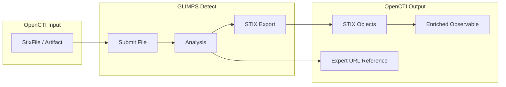

# OpenCTI GLIMPS Malware Connector

| Status | Date | Comment |
|--------|------|---------|
| Partner | -    | -       |

The GLIMPS Malware connector enriches File and Artifact observables by submitting them to the GLIMPS Detect malware analysis platform, retrieving detection results, STIX bundles, and expert analysis URLs.

## Table of Contents

- [OpenCTI GLIMPS Malware Connector](#opencti-glimps-malware-connector)
  - [Table of Contents](#table-of-contents)
  - [Introduction](#introduction)
  - [Installation](#installation)
    - [Requirements](#requirements)
  - [Configuration variables](#configuration-variables)
    - [OpenCTI environment variables](#opencti-environment-variables)
    - [Base connector environment variables](#base-connector-environment-variables)
    - [Connector extra parameters environment variables](#connector-extra-parameters-environment-variables)
  - [Deployment](#deployment)
    - [Docker Deployment](#docker-deployment)
    - [Manual Deployment](#manual-deployment)
  - [Usage](#usage)
  - [Behavior](#behavior)
  - [Debugging](#debugging)
  - [Additional information](#additional-information)

## Introduction

GLIMPS Malware (GDetect) is a malware analysis platform that provides deep file analysis, malware detection, and threat intelligence. It analyzes files for malicious behavior and generates comprehensive reports including STIX bundles.

This connector integrates GLIMPS Detect with OpenCTI to:
- Submit File and Artifact observables for analysis
- Retrieve malware detection results
- Import STIX bundles generated by GLIMPS analysis
- Add external references to expert analysis views

## Installation

### Requirements

- OpenCTI Platform >= 6.x
- GLIMPS API Detect token with submit and export report permissions

## Configuration variables

There are a number of configuration options, which are set either in `docker-compose.yml` (for Docker) or in `config.yml` (for manual deployment).

### OpenCTI environment variables

| Parameter     | config.yml | Docker environment variable | Mandatory | Description                                          |
|---------------|------------|-----------------------------|-----------|------------------------------------------------------|
| OpenCTI URL   | url        | `OPENCTI_URL`               | Yes       | The URL of the OpenCTI platform.                     |
| OpenCTI Token | token      | `OPENCTI_TOKEN`             | Yes       | The default admin token set in the OpenCTI platform. |

### Base connector environment variables

| Parameter       | config.yml | Docker environment variable | Default           | Mandatory | Description                                                                 |
|-----------------|------------|-----------------------------|-------------------|-----------|-----------------------------------------------------------------------------|
| Connector ID    | id         | `CONNECTOR_ID`              |                   | Yes       | A unique `UUIDv4` identifier for this connector instance.                   |
| Connector Name  | name       | `CONNECTOR_NAME`            | GLIMPS Malware    | No        | Name of the connector.                                                      |
| Connector Scope | scope      | `CONNECTOR_SCOPE`           | StixFile,Artifact | Yes       | The scope of observables the connector will enrich.                         |
| Connector Type  | type       | `CONNECTOR_TYPE`            | INTERNAL_ENRICHMENT | Yes     | Should always be `INTERNAL_ENRICHMENT` for this connector.                  |
| Log Level       | log_level  | `CONNECTOR_LOG_LEVEL`       | info              | No        | Determines the verbosity of the logs: `debug`, `info`, `warn`, or `error`.  |
| Auto Mode       | auto       | `CONNECTOR_AUTO`            | false             | No        | Enables or disables automatic enrichment of observables.                    |

### Connector extra parameters environment variables

| Parameter          | config.yml             | Docker environment variable  | Default    | Mandatory | Description                                               |
|--------------------|------------------------|------------------------------|------------|-----------|-----------------------------------------------------------|
| GLIMPS URL         | glimps.url             | `GLIMPS_URL`                 |            | Yes       | The GLIMPS Malware API URL.                               |
| GLIMPS Token       | glimps.token           | `GLIMPS_TOKEN`               |            | Yes       | Authentication token for GLIMPS Malware API.              |
| Insecure           | glimps.insecure        | `GLIMPS_INSECURE`            | false      | No        | Disable SSL certificate verification.                     |
| Tags               | glimps.tags            | `GLIMPS_TAGS`                |            | No        | Comma-separated tags to add to the analysis.              |
| Analysis Timeout   | glimps.analysis_timeout| `GLIMPS_ANALYSIS_TIMEOUT`    | 180        | No        | Analysis timeout in seconds.                              |
| Max TLP            | glimps.max_tlp         | `GLIMPS_MAX_TLP`             | TLP:AMBER  | No        | Maximum TLP level for observables to be analyzed.         |

## Deployment

### Docker Deployment

Build the Docker image:

```bash
docker build -t opencti/connector-glimps-malware:latest .
```

Configure the connector in `docker-compose.yml`:

```yaml
  connector-glimps-malware:
    image: opencti/connector-glimps-malware:latest
    environment:
      - OPENCTI_URL=http://localhost
      - OPENCTI_TOKEN=ChangeMe
      - CONNECTOR_ID=ChangeMe_UUID4
      - CONNECTOR_NAME=GLIMPS Malware
      - CONNECTOR_SCOPE=StixFile,Artifact
      - CONNECTOR_LOG_LEVEL=info
      - CONNECTOR_AUTO=true
      - GLIMPS_URL=https://my.gdetect.service.tld
      - GLIMPS_TOKEN=ChangeMe
      - GLIMPS_INSECURE=false
      - GLIMPS_TAGS=tag1,tag2
      - GLIMPS_ANALYSIS_TIMEOUT=180
      - GLIMPS_MAX_TLP=TLP:AMBER
    restart: always
```

Start the connector:

```bash
docker compose up -d
```

### Manual Deployment

1. Copy and configure `config.yml` from the provided `config.yml.sample`.

2. Install dependencies:

```bash
pip3 install -r requirements.txt
```

3. Start the connector from the `src` directory:

```bash
python3 main.py
```

## Usage

The connector enriches File and Artifact observables by submitting them to GLIMPS for analysis.

**Observations → Observables**

Select a StixFile or Artifact observable, then click the enrichment button and choose GLIMPS Malware.

## Behavior

The connector submits files to GLIMPS Detect for analysis and imports the results back into OpenCTI.

### Data Flow



### Processing Details

1. **File Retrieval**: Downloads file from OpenCTI storage
2. **Hash Lookup**: Checks if file was previously analyzed using SHA-256
3. **Submission**: If not previously analyzed, submits file for analysis
4. **Wait for Results**: Waits for analysis completion (up to timeout)
5. **STIX Export**: Retrieves STIX bundle from GLIMPS (requires export permission)
6. **Expert URL**: Extracts expert view URL for detailed analysis
7. **Bundle Creation**: Merges GLIMPS results with OpenCTI bundle

### Generated STIX Objects

| STIX Object Type   | Description                                             |
|--------------------|---------------------------------------------------------|
| From GLIMPS Bundle | Various STIX objects from GLIMPS analysis               |
| External Reference | Link to GLIMPS expert view / token view                 |

## Debugging

Enable verbose logging by setting:

```env
CONNECTOR_LOG_LEVEL=debug
```

Log output includes:
- File submission status
- Analysis result retrieval
- STIX bundle export status
- Expert URL extraction

## Additional information

- **Analysis Caching**: Previously analyzed files are retrieved by SHA-256 hash
- **Timeout Handling**: Connector waits up to configured timeout for analysis
- **Export Permissions**: STIX export requires appropriate API permissions
- **TLP Handling**: Files above `MAX_TLP` will not be submitted for analysis
