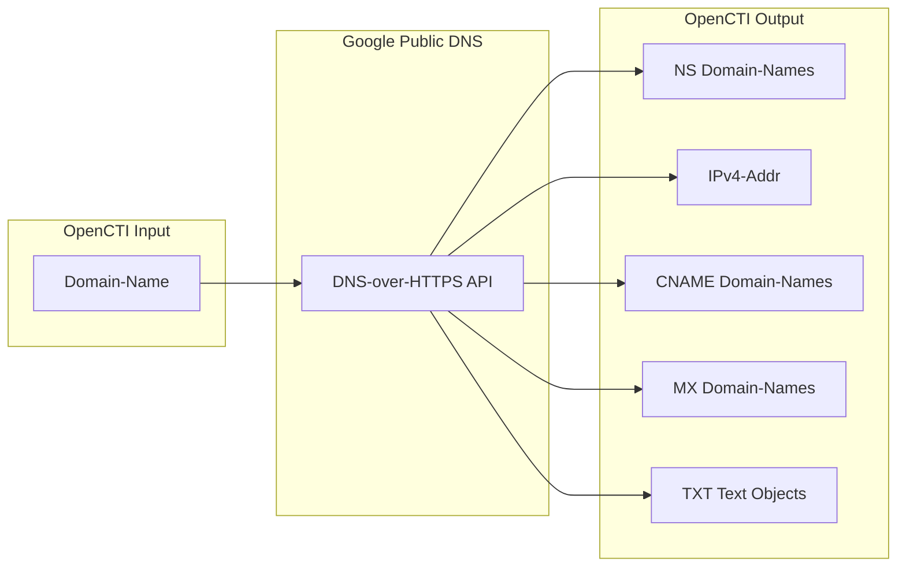

# OpenCTI Google DNS Connector

The Google DNS connector enriches Domain-Name observables by querying DNS records (A, NS, CNAME, MX, TXT) using Google Public DNS and creating related observables with their relationships.

| Status            | Date | Comment |
|-------------------|------|---------|
| Filigran Verified | -    | -       |

## Table of Contents

- [OpenCTI Google DNS Connector](#opencti-google-dns-connector)
  - [Table of Contents](#table-of-contents)
  - [Introduction](#introduction)
  - [Installation](#installation)
    - [Requirements](#requirements)
  - [Configuration variables](#configuration-variables)
    - [OpenCTI environment variables](#opencti-environment-variables)
    - [Base connector environment variables](#base-connector-environment-variables)
  - [Deployment](#deployment)
    - [Docker Deployment](#docker-deployment)
    - [Manual Deployment](#manual-deployment)
  - [Usage](#usage)
  - [Behavior](#behavior)
  - [Debugging](#debugging)
  - [Additional information](#additional-information)

## Introduction

Google Public DNS is a free, global DNS resolution service. This connector uses the Google DNS-over-HTTPS (DoH) API to query various DNS record types for domain names and creates corresponding observables and relationships in OpenCTI.

This connector enriches Domain-Name observables by:
- Querying NS (Name Server) records
- Querying A (IPv4 Address) records
- Querying CNAME (Canonical Name) records
- Querying MX (Mail Exchange) records
- Querying TXT (Text) records
- Creating observables and relationships based on DNS data

## Installation

### Requirements

- OpenCTI Platform >= 6.x
- No external API key required (uses public Google DNS service)

## Configuration variables

There are a number of configuration options, which are set either in `docker-compose.yml` (for Docker) or in `config.yml` (for manual deployment).

### OpenCTI environment variables

| Parameter     | config.yml | Docker environment variable | Mandatory | Description                                          |
|---------------|------------|-----------------------------|-----------|------------------------------------------------------|
| OpenCTI URL   | url        | `OPENCTI_URL`               | Yes       | The URL of the OpenCTI platform.                     |
| OpenCTI Token | token      | `OPENCTI_TOKEN`             | Yes       | The default admin token set in the OpenCTI platform. |

### Base connector environment variables

| Parameter       | config.yml | Docker environment variable | Default      | Mandatory | Description                                                                 |
|-----------------|------------|-----------------------------|--------------|-----------|-----------------------------------------------------------------------------|
| Connector ID    | id         | `CONNECTOR_ID`              |              | Yes       | A unique `UUIDv4` identifier for this connector instance.                   |
| Connector Name  | name       | `CONNECTOR_NAME`            | Google DNS   | No        | Name of the connector.                                                      |
| Connector Scope | scope      | `CONNECTOR_SCOPE`           | Domain-Name  | No        | The scope of observables the connector will enrich.                         |
| Connector Type  | type       | `CONNECTOR_TYPE`            | INTERNAL_ENRICHMENT | Yes | Should always be `INTERNAL_ENRICHMENT` for this connector.                  |
| Log Level       | log_level  | `CONNECTOR_LOG_LEVEL`       | info         | No        | Determines the verbosity of the logs: `debug`, `info`, `warn`, or `error`.  |
| Auto Mode       | auto       | `CONNECTOR_AUTO`            | false        | No        | Enables or disables automatic enrichment of observables.                    |

## Deployment

### Docker Deployment

Build the Docker image:

```bash
docker build -t opencti/connector-google-dns:latest .
```

Configure the connector in `docker-compose.yml`:

```yaml
  connector-google-dns:
    image: opencti/connector-google-dns:latest
    environment:
      - OPENCTI_URL=http://localhost
      - OPENCTI_TOKEN=ChangeMe
      - CONNECTOR_ID=ChangeMe_UUID4
      - CONNECTOR_NAME=Google DNS
      - CONNECTOR_SCOPE=Domain-Name
      - CONNECTOR_LOG_LEVEL=info
      - CONNECTOR_AUTO=false
    restart: always
```

Start the connector:

```bash
docker compose up -d
```

### Manual Deployment

1. Copy and configure `config.yml` from the provided `config.yml.sample`.

2. Install dependencies:

```bash
pip3 install -r requirements.txt
```

3. Start the connector from the `src` directory:

```bash
python3 -m __main__
```

## Usage

The connector enriches Domain-Name observables by querying various DNS record types.

**Observations → Observables**

Select a Domain-Name observable, then click the enrichment button and choose Google DNS.

## Behavior

The connector queries Google Public DNS for multiple record types and creates observables with relationships.

### Data Flow



### DNS Record Type Mapping

| DNS Record Type | OpenCTI Entity   | Relationship Type | Description                           |
|-----------------|------------------|-------------------|---------------------------------------|
| NS              | Domain-Name      | `resolves-to`     | Name server domains                   |
| A               | IPv4-Addr        | `resolves-to`     | IPv4 addresses                        |
| CNAME           | Domain-Name      | `resolves-to`     | Canonical name aliases                |
| MX              | Domain-Name      | `resolves-to`     | Mail exchange servers                 |
| TXT             | Text (Custom)    | `related-to`      | SPF, DKIM, verification records       |

### Generated STIX Objects

| STIX Object Type | Condition               | Description                              |
|------------------|-------------------------|------------------------------------------|
| Domain-Name      | When NS records found   | Name server domains                      |
| IPv4-Addr        | When A records found    | Resolved IP addresses                    |
| Domain-Name      | When CNAME records found| Canonical name aliases                   |
| Domain-Name      | When MX records found   | Mail exchange server domains             |
| Text (Custom)    | When TXT records found  | Text records (SPF, DKIM, etc.)           |

### Relationships Created

| Relationship Type | Source        | Target           | Description                              |
|-------------------|---------------|------------------|------------------------------------------|
| `resolves-to`     | Domain-Name   | Domain-Name (NS) | Domain resolves to name server           |
| `resolves-to`     | Domain-Name   | IPv4-Addr        | Domain resolves to IP address            |
| `resolves-to`     | Domain-Name   | Domain-Name (CNAME) | Domain is alias for another domain    |
| `resolves-to`     | Domain-Name   | Domain-Name (MX) | Domain uses mail exchange server         |
| `related-to`      | Domain-Name   | Text             | Domain has associated TXT record         |

### Processing Details

1. **NS Records**: Queries name servers and creates Domain-Name observables
2. **A Records**: Queries IPv4 addresses and creates IPv4-Addr observables
3. **CNAME Records**: Queries canonical names and creates Domain-Name observables
4. **MX Records**: Queries mail exchangers and creates Domain-Name observables
5. **TXT Records**: Queries text records and creates Text observables

## Debugging

Enable verbose logging by setting:

```env
CONNECTOR_LOG_LEVEL=debug
```

Log output includes:
- DNS query execution for each record type
- Observable creation status
- Relationship creation status
- Bundle sending status

## Additional information

- **Free Service**: Uses Google Public DNS which requires no API key
- **Rate Limits**: Subject to Google Public DNS rate limits
- **All Records Queried**: All five record types are queried for each domain
- **TLP Marking**: All created objects are marked with TLP:WHITE
- **Self-Reference Prevention**: Does not create relationships when source and target are the same
