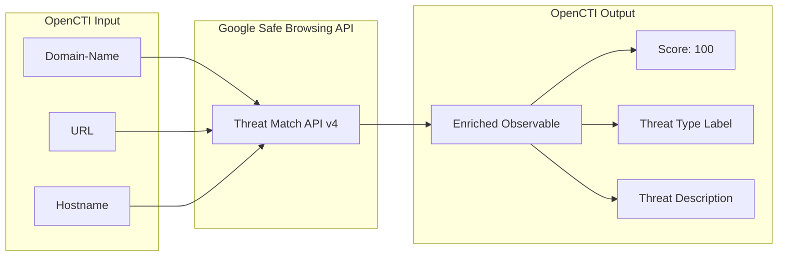

# OpenCTI Google Safe Browsing Connector

| Status | Date | Comment |
|--------|------|---------|
| Community | -    | -       |

The Google Safe Browsing connector enriches Domain-Name, URL, and Hostname observables by checking them against Google's Safe Browsing threat lists, identifying malware, phishing, and unwanted software threats.

## Table of Contents

- [OpenCTI Google Safe Browsing Connector](#opencti-google-safe-browsing-connector)
  - [Table of Contents](#table-of-contents)
  - [Introduction](#introduction)
  - [Installation](#installation)
    - [Requirements](#requirements)
  - [Configuration variables](#configuration-variables)
    - [OpenCTI environment variables](#opencti-environment-variables)
    - [Base connector environment variables](#base-connector-environment-variables)
    - [Connector extra parameters environment variables](#connector-extra-parameters-environment-variables)
  - [Deployment](#deployment)
    - [Docker Deployment](#docker-deployment)
    - [Manual Deployment](#manual-deployment)
  - [Usage](#usage)
  - [Behavior](#behavior)
  - [Debugging](#debugging)
  - [Additional information](#additional-information)

## Introduction

Google Safe Browsing is a service that lets client applications check URLs against Google's constantly updated lists of unsafe web resources. These include social engineering sites (phishing and deceptive sites), sites that host malware or unwanted software, and sites that host potentially harmful applications.

This connector integrates Google Safe Browsing with OpenCTI to:
- Check domains, URLs, and hostnames against threat lists
- Flag malicious resources with threat type labels
- Update observable scores based on threat detection
- Add threat descriptions to observables

## Installation

### Requirements

- OpenCTI Platform >= 6.0.6
- Google Safe Browsing API key (from Google Cloud Console)

## Configuration variables

There are a number of configuration options, which are set either in `docker-compose.yml` (for Docker) or as environment variables.

### OpenCTI environment variables

| Parameter     | config.yml | Docker environment variable | Mandatory | Description                                          |
|---------------|------------|-----------------------------|-----------|------------------------------------------------------|
| OpenCTI URL   | url        | `OPENCTI_URL`               | Yes       | The URL of the OpenCTI platform.                     |
| OpenCTI Token | token      | `OPENCTI_TOKEN`             | Yes       | The default admin token set in the OpenCTI platform. |

### Base connector environment variables

| Parameter            | config.yml           | Docker environment variable      | Default                    | Mandatory | Description                                                                 |
|----------------------|----------------------|----------------------------------|----------------------------|-----------|-----------------------------------------------------------------------------|
| Connector ID         | id                   | `CONNECTOR_ID`                   |                            | Yes       | A unique `UUIDv4` identifier for this connector instance.                   |
| Connector Name       | name                 | `CONNECTOR_NAME`                 | Google Safe Browsing       | No        | Name of the connector.                                                      |
| Connector Scope      | scope                | `CONNECTOR_SCOPE`                | Url,Domain-Name,Hostname   | No        | The scope of observables the connector will enrich.                         |
| Connector Type       | type                 | `CONNECTOR_TYPE`                 | INTERNAL_ENRICHMENT        | Yes       | Should always be `INTERNAL_ENRICHMENT` for this connector.                  |
| Log Level            | log_level            | `CONNECTOR_LOG_LEVEL`            | info                       | No        | Determines the verbosity of the logs: `debug`, `info`, `warn`, or `error`.  |
| Confidence Level     | confidence_level     | `CONNECTOR_CONFIDENCE_LEVEL`     | 100                        | No        | The default confidence level for created data.                              |
| Auto Mode            | auto                 | `CONNECTOR_AUTO`                 | true                       | No        | Enables or disables automatic enrichment of observables.                    |
| Update Existing Data | update_existing_data | `CONNECTOR_UPDATE_EXISTING_DATA` | true                       | No        | Update existing data in database during enrichment.                         |

### Connector extra parameters environment variables

| Parameter        | config.yml | Docker environment variable      | Mandatory | Description                                    |
|------------------|------------|----------------------------------|-----------|------------------------------------------------|
| API Key          |            | `GOOGLE_SAFE_BROWSING_API_KEY`   | Yes       | Google Safe Browsing API key from Cloud Console.|

## Deployment

### Docker Deployment

Build the Docker image:

```bash
docker build -t opencti/connector-google-safebrowsing:latest .
```

Configure the connector in `docker-compose.yml`:

```yaml
  connector-google-safebrowsing:
    image: opencti/connector-google-safebrowsing:latest
    environment:
      - OPENCTI_URL=http://localhost
      - OPENCTI_TOKEN=ChangeMe
      - CONNECTOR_ID=ChangeMe_UUID4
      - CONNECTOR_NAME=Google Safe Browsing
      - CONNECTOR_SCOPE=Url,Domain-Name,Hostname
      - CONNECTOR_LOG_LEVEL=info
      - CONNECTOR_AUTO=true
      - CONNECTOR_UPDATE_EXISTING_DATA=true
      - GOOGLE_SAFE_BROWSING_API_KEY=ChangeMe
    restart: always
```

Start the connector:

```bash
docker compose up -d
```

### Manual Deployment

1. Set environment variables for configuration.

2. Install dependencies:

```bash
pip3 install -r requirements.txt
```

3. Start the connector from the `src` directory:

```bash
python3 main.py
```

## Usage

The connector checks observables against Google Safe Browsing threat lists.

**Observations → Observables**

Select a Domain-Name, URL, or Hostname observable, then click the enrichment button and choose Google Safe Browsing.

## Behavior

The connector queries the Google Safe Browsing API to check if URLs/domains are flagged as threats.

### Data Flow



### Threat Types Checked

| Threat Type                      | Description                                         |
|----------------------------------|-----------------------------------------------------|
| MALWARE                          | Sites hosting malicious software                    |
| SOCIAL_ENGINEERING               | Phishing and deceptive sites                        |
| UNWANTED_SOFTWARE                | Sites distributing unwanted software                |
| POTENTIALLY_HARMFUL_APPLICATION  | Sites with potentially harmful applications         |
| THREAT_TYPE_UNSPECIFIED          | Unspecified threat type                             |

### Platform Types Checked

- ANY_PLATFORM (checks across all platforms)

### Threat Entry Types Checked

- URL
- EXECUTABLE
- THREAT_ENTRY_TYPE_UNSPECIFIED

### Enrichment Mapping

| Safe Browsing Data | OpenCTI Property          | Description                              |
|--------------------|---------------------------|------------------------------------------|
| threatType         | Label                     | Applied as label to observable           |
| threatType         | x_opencti_description     | Added to observable description          |
| platformType       | x_opencti_description     | Added to observable description          |
| threatEntryType    | x_opencti_description     | Added to observable description          |
| Match found        | x_opencti_score           | Set to 100 when threat detected          |

### Processing Details

1. **Observable Type Check**: Verifies entity is Domain-Name, URL, or Hostname
2. **API Query**: Sends threat match request to Safe Browsing API
3. **Result Processing**: If match found:
   - Sets observable score to 100 (malicious)
   - Adds threat type label
   - Updates description with threat details
4. **Bundle Creation**: Creates and sends STIX bundle with updated observable

### Generated STIX Objects

| Update                | Condition             | Description                              |
|-----------------------|-----------------------|------------------------------------------|
| x_opencti_score       | When threat detected  | Set to 100 indicating malicious          |
| x_opencti_description | When threat detected  | Threat type, platform, and entry type    |
| Label                 | When threat detected  | Threat type name as label                |

## Debugging

Enable verbose logging by setting:

```env
CONNECTOR_LOG_LEVEL=debug
```

Log output includes:
- Observable processing status
- Safe Browsing API query details
- Threat match results
- Bundle sending status

## Additional information

- **API Key Required**: Obtain from [Google Cloud Console](https://console.cloud.google.com/apis/credentials)
- **Free Tier Available**: Safe Browsing API has a free usage tier
- **Rate Limits**: Subject to Google API rate limits
- **Score Assignment**: Flagged observables receive score of 100
- **Label Application**: Threat type is applied as a label for easy filtering
