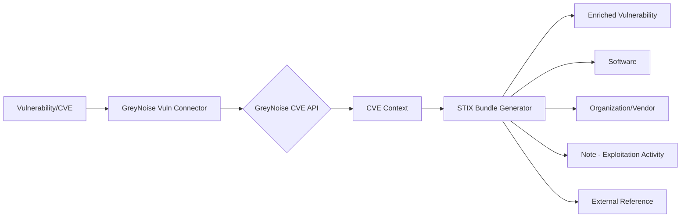

# OpenCTI GreyNoise Vulnerability Connector

| Status | Date | Comment |
|--------|------|---------|
| Partner Verified | -    | -       |

## Table of Contents

- [Introduction](#introduction)
- [Installation](#installation)
  - [Requirements](#requirements)
- [Configuration](#configuration)
  - [OpenCTI Configuration](#opencti-configuration)
  - [Base Connector Configuration](#base-connector-configuration)
  - [GreyNoise Configuration](#greynoise-configuration)
- [Deployment](#deployment)
  - [Docker Deployment](#docker-deployment)
  - [Manual Deployment](#manual-deployment)
- [Usage](#usage)
- [Behavior](#behavior)
  - [Data Flow](#data-flow)
  - [Enrichment Mapping](#enrichment-mapping)
  - [Generated STIX Objects](#generated-stix-objects)
- [Debugging](#debugging)
- [Additional Information](#additional-information)

---

## Introduction

GreyNoise is a system that collects, analyzes, and labels omnidirectional Internet scan and attack activity. The GreyNoise Vulnerability connector helps answer the question: **"Is this vulnerability being exploited in the wild?"**

This internal enrichment connector queries the GreyNoise API for CVE (Vulnerability) entities and enriches them with exploitation activity data including:
- Exploitation activity seen status
- Benign and threat IP counts over time
- CVSS scores and attack vectors
- EPSS scores
- CISA KEV status
- Related software and vendors
- Threat actor exploitation information

---

## Installation

### Requirements

- OpenCTI Platform >= 6.0.0
- GreyNoise API key.  Full details require a key with Vulnerability Prioritization License, but any key will provide basic information.
- Network access to GreyNoise API

---

## Configuration

### OpenCTI Configuration

| Parameter | Docker envvar | Mandatory | Description |
|-----------|---------------|-----------|-------------|
| `opencti_url` | `OPENCTI_URL` | Yes | The URL of the OpenCTI platform |
| `opencti_token` | `OPENCTI_TOKEN` | Yes | The default admin token configured in the OpenCTI platform |

### Base Connector Configuration

| Parameter | Docker envvar | Mandatory | Description |
|-----------|---------------|-----------|-------------|
| `connector_id` | `CONNECTOR_ID` | Yes | A valid arbitrary `UUIDv4` unique for this connector |
| `connector_name` | `CONNECTOR_NAME` | Yes | The name of the connector instance |
| `connector_scope` | `CONNECTOR_SCOPE` | Yes | Must be `vulnerability` |
| `connector_auto` | `CONNECTOR_AUTO` | Yes | Enable/disable auto-enrichment of vulnerabilities |
| `connector_log_level` | `CONNECTOR_LOG_LEVEL` | Yes | Log level (`debug`, `info`, `warn`, `error`) |

### GreyNoise Configuration

| Parameter | Docker envvar | Mandatory | Description |
|-----------|---------------|-----------|-------------|
| `greynoise_key` | `GREYNOISE_KEY` | Yes | The GreyNoise API key |
| `greynoise_max_tlp` | `GREYNOISE_MAX_TLP` | Yes | Maximum TLP level for data processing |
| `greynoise_name` | `GREYNOISE_NAME` | No | The GreyNoise organization name |
| `greynoise_description` | `GREYNOISE_DESCRIPTION` | No | The GreyNoise organization description |

---

## Deployment

### Docker Deployment

Build a Docker Image using the provided `Dockerfile`.

Example `docker-compose.yml`:

```yaml
version: '3'
services:
  connector-greynoise-vuln:
    image: opencti/connector-greynoise-vuln:latest
    environment:
      - OPENCTI_URL=http://localhost
      - OPENCTI_TOKEN=ChangeMe
      - CONNECTOR_ID=ChangeMe
      - CONNECTOR_NAME=GreyNoise Vulnerability Enrichment
      - CONNECTOR_SCOPE=vulnerability
      - CONNECTOR_AUTO=true
      - CONNECTOR_LOG_LEVEL=error
      - GREYNOISE_KEY=ChangeMe
      - GREYNOISE_MAX_TLP=TLP:AMBER
      - "GREYNOISE_NAME=GreyNoise Internet Scanner"
      - "GREYNOISE_DESCRIPTION=GreyNoise collects and analyzes opportunistic scan and attack activity."
    restart: always
```

### Manual Deployment

1. Clone the repository
2. Copy `config.yml.sample` to `config.yml` and configure
3. Install dependencies: `pip install -r requirements.txt`
4. Run: `python main.py`

---

## Usage

The connector enriches Vulnerability entities (CVEs) by:
1. Querying the GreyNoise CVE API for exploitation data
2. Creating STIX objects with enrichment data
3. Building relationships between the vulnerability and related entities

Trigger enrichment:
- Manually via the OpenCTI UI on Vulnerability entities
- Automatically if `CONNECTOR_AUTO=true`
- Via playbooks

---

## Behavior

### Data Flow



### Enrichment Mapping

| GreyNoise Field | OpenCTI Entity/Attribute | Description |
|-----------------|--------------------------|-------------|
| `exploitation_activity.activity_seen` | Label (gn-activity-seen) | Exploitation activity detected |
| `exploitation_stats.number_of_available_exploits` | Label (gn-exploits-available) | Exploits are available |
| `exploitation_stats.number_of_threat_actors_exploiting_vulnerability` | Label (gn-threat-actors-exploiting) | Active threat actor exploitation |
| `details.cve_cvss_score` | Vulnerability CVSS score | Base CVSS score |
| `exploitation_details.attack_vector` | Vulnerability attack vector | Attack vector type |
| `exploitation_details.epss_score` | Vulnerability EPSS score | EPSS probability score |
| `timeline.cisa_kev_date_added` | CISA KEV status | Added to CISA KEV catalog |
| `details.product` | Software | Affected software |
| `details.vendor` | Identity (Organization) | Software vendor |
| Exploitation activity stats | Note | Detailed activity table |

### Generated STIX Objects

| Object Type | Description |
|-------------|-------------|
| Identity (Organization) | GreyNoise identity and software vendors |
| Vulnerability | Enriched CVE with CVSS, EPSS, and KEV data |
| Software | Affected software products |
| Note | Exploitation activity statistics table |
| External Reference | Link to GreyNoise CVE details page |
| Relationship | Software has Vulnerability, Software related-to Vendor |

---

## Debugging

Enable debug logging by setting `CONNECTOR_LOG_LEVEL=debug` to see detailed connector operations including:
- API key validation status
- GreyNoise CVE API responses
- STIX bundle generation details

Common issues:
- **CVE not found**: The CVE may not be tracked by GreyNoise
- **Invalid API Key**: Ensure you have a valid API key with Vulnerability Prioritization License
- **TLP Restrictions**: Check that entity TLP does not exceed `GREYNOISE_MAX_TLP`

---

## Additional Information

- [GreyNoise Documentation](https://docs.greynoise.io/)
- [GreyNoise CVE API Reference](https://docs.greynoise.io/reference/get_v1-cve-cve-id)
- [Get GreyNoise API Key](https://viz.greynoise.io/account/api-key)

### Subscription Information

This connector requires an API key from GreyNoise with Vulnerability Prioritization License for full data access. Users with a Vulnerability Prioritization License will see the complete data response. Contact [sales@greynoise.io](mailto:sales@greynoise.io) for more information.
