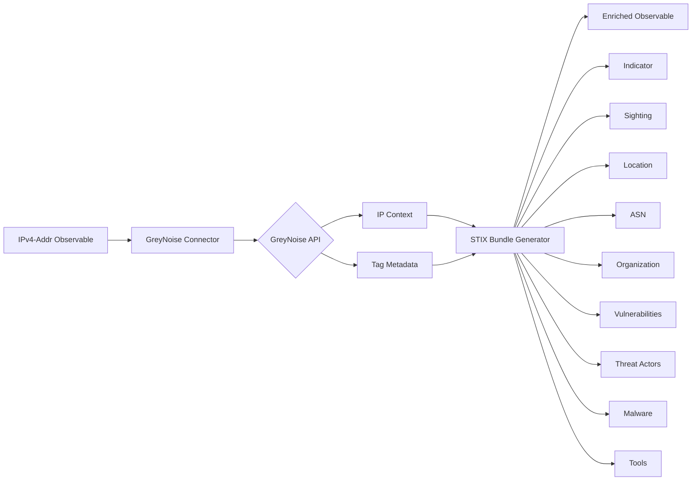

# OpenCTI GreyNoise Connector

| Status | Date | Comment |
|--------|------|---------|
| Partner Verified | -    | -       |

## Table of Contents

- [Introduction](#introduction)
- [Installation](#installation)
  - [Requirements](#requirements)
- [Configuration](#configuration)
  - [OpenCTI Configuration](#opencti-configuration)
  - [Base Connector Configuration](#base-connector-configuration)
  - [GreyNoise Configuration](#greynoise-configuration)
- [Deployment](#deployment)
  - [Docker Deployment](#docker-deployment)
  - [Manual Deployment](#manual-deployment)
- [Usage](#usage)
- [Behavior](#behavior)
  - [Data Flow](#data-flow)
  - [Enrichment Mapping](#enrichment-mapping)
  - [Classification Scoring](#classification-scoring)
  - [Generated STIX Objects](#generated-stix-objects)
- [Debugging](#debugging)
- [Additional Information](#additional-information)

---

## Introduction

GreyNoise is a system that collects, analyzes, and labels omnidirectional Internet scan and attack activity. The connector helps answer the question: **"Is everyone else seeing this stuff, or is it just me?"**

In other words, it determines whether traffic to your network is regular Internet background noise or if a machine is actually targeting and attacking your network specifically.

This internal enrichment connector queries the GreyNoise API for IPv4 addresses and enriches them with contextual information including:
- Classification (benign, malicious, suspicious, unknown)
- Geolocation data (city, country)
- ASN information
- Associated vulnerabilities (CVEs)
- VPN service usage
- Known threat actors
- Malware associations
- Bot and TOR exit node detection

---

## Installation

### Requirements

- OpenCTI Platform >= 6.0.0
- GreyNoise API key **Uses with Free Tier keys will be rate limited**
- Network access to GreyNoise API

---

## Configuration

### OpenCTI Configuration

| Parameter | Docker envvar | Mandatory | Description |
|-----------|---------------|-----------|-------------|
| `opencti_url` | `OPENCTI_URL` | Yes | The URL of the OpenCTI platform |
| `opencti_token` | `OPENCTI_TOKEN` | Yes | The default admin token configured in the OpenCTI platform |

### Base Connector Configuration

| Parameter | Docker envvar | Mandatory | Description |
|-----------|---------------|-----------|-------------|
| `connector_id` | `CONNECTOR_ID` | Yes | A valid arbitrary `UUIDv4` unique for this connector |
| `connector_name` | `CONNECTOR_NAME` | Yes | The name of the connector instance |
| `connector_scope` | `CONNECTOR_SCOPE` | Yes | Must be `IPv4-Addr` |
| `connector_auto` | `CONNECTOR_AUTO` | Yes | Enable/disable auto-enrichment of observables |
| `connector_log_level` | `CONNECTOR_LOG_LEVEL` | Yes | Log level (`debug`, `info`, `warn`, `error`) |

### GreyNoise Configuration

| Parameter | Docker envvar | Mandatory | Description |
|-----------|---------------|-----------|-------------|
| `greynoise_key` | `GREYNOISE_KEY` | Yes | The GreyNoise API key |
| `greynoise_max_tlp` | `GREYNOISE_MAX_TLP` | Yes | Maximum TLP level for data to be sent to GreyNoise |
| `greynoise_name` | `GREYNOISE_NAME` | No | The GreyNoise organization name |
| `greynoise_description` | `GREYNOISE_DESCRIPTION` | No | The GreyNoise organization description |
| `greynoise_sighting_not_seen` | `GREYNOISE_SIGHTING_NOT_SEEN` | No | Create sighting with count=0 when IP not seen |
| `greynoise_no_sightings` | `GREYNOISE_NO_SIGHTINGS` | No | Skip any sighting creations |
| `greynoise_indicator_score_malicious` | `GREYNOISE_INDICATOR_SCORE_MALICIOUS` | No | Score for malicious classification (default: 75) |
| `greynoise_indicator_score_suspicious` | `GREYNOISE_INDICATOR_SCORE_SUSPICIOUS` | No | Score for suspicious classification (default: 50) |
| `greynoise_indicator_score_benign` | `GREYNOISE_INDICATOR_SCORE_BENIGN` | No | Score for benign classification (default: 20) |

---

## Deployment

### Docker Deployment

Build a Docker Image using the provided `Dockerfile`.

Example `docker-compose.yml`:

```yaml
version: '3'
services:
  connector-greynoise:
    image: opencti/connector-greynoise:latest
    environment:
      - OPENCTI_URL=http://localhost
      - OPENCTI_TOKEN=ChangeMe
      - CONNECTOR_ID=ChangeMe
      - CONNECTOR_NAME=GreyNoise
      - CONNECTOR_SCOPE=IPv4-Addr
      - CONNECTOR_AUTO=true
      - CONNECTOR_LOG_LEVEL=error
      - GREYNOISE_KEY=ChangeMe
      - GREYNOISE_MAX_TLP=TLP:AMBER
      - GREYNOISE_SIGHTING_NOT_SEEN=false
      - GREYNOISE_NO_SIGHTINGS=false
    restart: always
```

### Manual Deployment

1. Clone the repository
2. Copy `config.yml.sample` to `config.yml` and configure
3. Install dependencies: `pip install -r requirements.txt`
4. Run: `python main.py`

---

## Usage

The connector enriches IPv4 address observables by:
1. Querying the GreyNoise API for IP context
2. Creating STIX objects representing the enrichment data
3. Building relationships between the observable and enrichment entities

Trigger enrichment:
- Manually via the OpenCTI UI on IPv4-Addr observables
- Automatically if `CONNECTOR_AUTO=true`
- Via playbooks

**NOTE: Uses with Free Tier GreyNoise accounts should not use the CONNECTOR_AUTO=true value as the daily rate limits do not work well with this setting.  Uses this enrichment manually to control which indicators are enriched with the connector**
---

## Behavior

### Data Flow



### Enrichment Mapping

| GreyNoise Field | OpenCTI Entity | Relationship |
|-----------------|----------------|--------------|
| `classification` | Observable score, Labels | Direct attribute |
| `metadata.city` | Location (City) | `located-at` |
| `metadata.country_code` | Location (Country) | `located-at` |
| `metadata.asn` | Autonomous System | `belongs-to` |
| `metadata.organization` | Identity (Organization) | `related-to` |
| `cve` | Vulnerability | `related-to` |
| `actor` | Threat Actor | `related-to` |
| `tags` (worm category) | Malware | `related-to` |
| `vpn_service` | Tool | `related-to` |
| `tor`, `vpn` | Labels | Direct attribute |

### Classification Scoring

| Classification | Default Score |
|----------------|---------------|
| Malicious | 75 |
| Suspicious | 50 |
| Benign | 20 |
| Unknown | 20 |

### Generated STIX Objects

| Object Type | Description |
|-------------|-------------|
| Identity (Organization) | GreyNoise organization and associated organizations |
| Indicator | IPv4 pattern indicator with classification score |
| Sighting | Observation by GreyNoise sensors |
| Location (City) | City-level geolocation |
| Location (Country) | Country-level geolocation |
| Autonomous System | ASN information |
| Vulnerability | Associated CVEs |
| Threat Actor | Known threat actors |
| Malware | Worm-type malware from tags |
| Tool | VPN service tools |
| Labels | Classification, bot activity, TOR, VPN status |

---

## Debugging

Enable debug logging by setting `CONNECTOR_LOG_LEVEL=debug` to see detailed connector operations including:
- API key validation status
- GreyNoise API responses
- STIX bundle generation details

Common issues:
- **Invalid API Key**: Ensure you have an valid API key
- **Rate Limit Error**: Ensure the connector is set to manual enrichment and only enrich within the weekly limits allowed for Free Tier users
- **TLP Restrictions**: Check that observable TLP does not exceed `GREYNOISE_MAX_TLP`

---

## Additional Information

- [GreyNoise Documentation](https://docs.greynoise.io/)
- [GreyNoise Visualizer](https://viz.greynoise.io/)
- [Get GreyNoise API Key](https://viz.greynoise.io/account/api-key)
