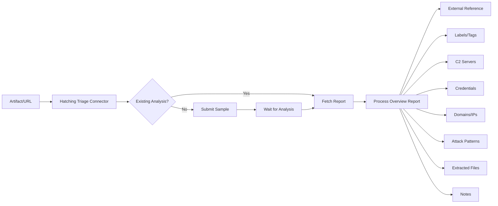

# OpenCTI Hatching Triage Sandbox Internal Enrichment Connector

| Status | Date | Comment |
|--------|------|---------|
| Filigran Verified | -    | -       |

## Table of Contents

- [Introduction](#introduction)
- [Installation](#installation)
  - [Requirements](#requirements)
- [Configuration](#configuration)
  - [OpenCTI Configuration](#opencti-configuration)
  - [Base Connector Configuration](#base-connector-configuration)
  - [Hatching Triage Configuration](#hatching-triage-configuration)
- [Deployment](#deployment)
  - [Docker Deployment](#docker-deployment)
  - [Manual Deployment](#manual-deployment)
- [Usage](#usage)
- [Behavior](#behavior)
  - [Data Flow](#data-flow)
  - [Enrichment Mapping](#enrichment-mapping)
  - [Processing Details](#processing-details)
  - [Generated STIX Objects](#generated-stix-objects)
- [Debugging](#debugging)
- [Additional Information](#additional-information)

---

## Introduction

Hatching Triage is a malware analysis sandbox that automatically analyzes malicious files and URLs, extracting configuration data, network indicators, and behavioral information.

This internal enrichment connector submits files (Artifacts) and URLs to Hatching Triage for dynamic analysis and enriches OpenCTI with the analysis results including:
- Malware family identification
- C2 server addresses and URLs
- Network indicators (domains, IPs)
- Extracted credentials
- MITRE ATT&CK TTPs
- Dropped files and configurations
- Botnet and campaign information

---

## Installation

### Requirements

- OpenCTI Platform >= 6.0.0
- Hatching Triage API token
- Network access to Hatching Triage API (tria.ge)

---

## Configuration

### OpenCTI Configuration

| Parameter | Docker envvar | Mandatory | Description |
|-----------|---------------|-----------|-------------|
| `opencti_url` | `OPENCTI_URL` | Yes | The URL of the OpenCTI platform |
| `opencti_token` | `OPENCTI_TOKEN` | Yes | The default admin token configured in the OpenCTI platform |

### Base Connector Configuration

| Parameter | Docker envvar | Mandatory | Description |
|-----------|---------------|-----------|-------------|
| `connector_id` | `CONNECTOR_ID` | Yes | A valid arbitrary `UUIDv4` unique for this connector |
| `connector_name` | `CONNECTOR_NAME` | Yes | The name of the connector instance |
| `connector_scope` | `CONNECTOR_SCOPE` | Yes | Supported: `Artifact`, `Url` |
| `connector_auto` | `CONNECTOR_AUTO` | Yes | Enable/disable auto-enrichment |
| `connector_log_level` | `CONNECTOR_LOG_LEVEL` | Yes | Log level (`debug`, `info`, `warn`, `error`) |

### Hatching Triage Configuration

| Parameter | Docker envvar | Mandatory | Description |
|-----------|---------------|-----------|-------------|
| `hatching_triage_sandbox_base_url` | `HATCHING_TRIAGE_SANDBOX_BASE_URL` | Yes | Triage API URL (e.g., `https://tria.ge/api`) |
| `hatching_triage_sandbox_token` | `HATCHING_TRIAGE_SANDBOX_TOKEN` | Yes | Triage API token |
| `hatching_triage_sandbox_use_existing_analysis` | `HATCHING_TRIAGE_SANDBOX_USE_EXISTING_ANALYSIS` | No | Reuse existing analysis if available (default: true) |
| `hatching_triage_sandbox_family_color` | `HATCHING_TRIAGE_SANDBOX_FAMILY_COLOR` | No | Label color for malware family |
| `hatching_triage_sandbox_botnet_color` | `HATCHING_TRIAGE_SANDBOX_BOTNET_COLOR` | No | Label color for botnet tags |
| `hatching_triage_sandbox_campaign_color` | `HATCHING_TRIAGE_SANDBOX_CAMPAIGN_COLOR` | No | Label color for campaign tags |
| `hatching_triage_sandbox_tag_color` | `HATCHING_TRIAGE_SANDBOX_TAG_COLOR` | No | Label color for other tags |
| `hatching_triage_sandbox_max_tlp` | `HATCHING_TRIAGE_SANDBOX_MAX_TLP` | No | Maximum TLP for submission |

---

## Deployment

### Docker Deployment

Build a Docker Image using the provided `Dockerfile`.

Example `docker-compose.yml`:

```yaml
version: '3'
services:
  connector-hatching-triage-sandbox:
    image: opencti/connector-hatching-triage-sandbox:latest
    environment:
      - OPENCTI_URL=http://localhost
      - OPENCTI_TOKEN=ChangeMe
      - CONNECTOR_ID=Hatching_Triage_Sandbox
      - "CONNECTOR_NAME=Hatching Triage Sandbox"
      - CONNECTOR_SCOPE=Artifact,Url
      - CONNECTOR_AUTO=false
      - CONNECTOR_LOG_LEVEL=error
      - HATCHING_TRIAGE_SANDBOX_BASE_URL=https://tria.ge/api
      - HATCHING_TRIAGE_SANDBOX_TOKEN=ChangeMe
      - HATCHING_TRIAGE_SANDBOX_USE_EXISTING_ANALYSIS=true
      - HATCHING_TRIAGE_SANDBOX_FAMILY_COLOR=#0059f7
      - HATCHING_TRIAGE_SANDBOX_BOTNET_COLOR=#f79e00
      - HATCHING_TRIAGE_SANDBOX_CAMPAIGN_COLOR=#7a01e5
      - HATCHING_TRIAGE_SANDBOX_TAG_COLOR=#54483b
      - HATCHING_TRIAGE_SANDBOX_MAX_TLP=TLP:AMBER
    restart: always
```

### Manual Deployment

1. Clone the repository
2. Copy `config.yml.sample` to `config.yml` and configure
3. Install dependencies: `pip install -r requirements.txt`
4. Run: `python hatching-triage-sandbox.py`

---

## Usage

The connector enriches Artifact and URL observables by:
1. Checking for existing analysis (if enabled)
2. Submitting the sample to Hatching Triage
3. Waiting for analysis completion
4. Processing and importing the results

Trigger enrichment:
- Manually via the OpenCTI UI
- Automatically if `CONNECTOR_AUTO=true`
- Via playbooks

---

## Behavior

### Data Flow



### Enrichment Mapping

| Triage Data | OpenCTI Entity | Relationship |
|-------------|----------------|--------------|
| `analysis.tags` | Labels | family, botnet, campaign tags |
| `extracted.config.c2` | IPv4-Addr, URL | `communicates-with` or `related-to` |
| `extracted.config.credentials` | Hostname, Email-Addr | `related-to` |
| `targets.iocs.domains` | Domain-Name | `communicates-with` or `related-to` |
| `targets.iocs.ips` | IPv4-Addr | `communicates-with` or `related-to` |
| `signatures.ttp` | Attack Pattern | `uses` or `related-to` |
| `extracted.dropper.urls` | URL | `related-to` |
| `extracted.dumped_file` | Artifact | `related-to` |
| `extracted.config` | Note | Configuration details |

### Processing Details

1. **Existing Analysis Check**: If enabled, searches for existing analysis by SHA256 hash or URL
2. **Sample Submission**: Submits file or URL if no existing analysis found
3. **Analysis Wait**: Polls for analysis completion status
4. **Tag Processing**: Creates colored labels based on tag type (family, botnet, campaign)
5. **Config Extraction**: Extracts C2 servers, credentials, and configuration data
6. **IOC Extraction**: Creates observables for domains, IPs, and URLs from dynamic analysis
7. **TTP Mapping**: Maps detected signatures to MITRE ATT&CK patterns
8. **File Extraction**: Downloads and uploads extracted/dropped files

### Generated STIX Objects

| Object Type | Description |
|-------------|-------------|
| External Reference | Link to Hatching Triage analysis report |
| Labels | Malware family, botnet, campaign, and other tags |
| Note | Configuration JSON data |
| URL | C2 servers and dropper URLs |
| IPv4-Addr | C2 IP addresses and network IOCs |
| Domain-Name | Network communication domains |
| Hostname | Credential hosts |
| Email-Addr | SMTP credentials |
| Attack Pattern | MITRE ATT&CK TTPs with x_mitre_id |
| Artifact | Extracted/dropped files |
| Relationship | Various relationships between entities |

---

## Debugging

Enable debug logging by setting `CONNECTOR_LOG_LEVEL=debug` to see detailed connector operations including:
- Sample submission status
- Analysis progress
- Report processing details

Common issues:
- **Analysis Failed**: Check if the sample type is supported
- **Timeout**: Complex samples may take longer to analyze
- **File Not Available**: Extracted files may take time to become available

---

## Additional Information

- [Hatching Triage Documentation](https://tria.ge/docs/)
- [Get Triage API Token](https://tria.ge/account)
- [Triage Public Cloud](https://tria.ge/)
