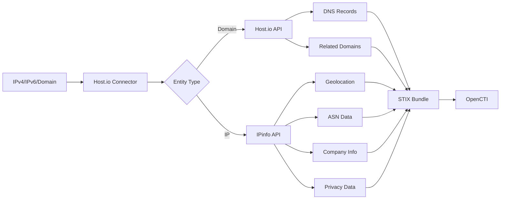

# OpenCTI Host.io Connector

| Status | Date | Comment |
|--------|------|---------|
| Community | -    | -       |

## Table of Contents

- [Introduction](#introduction)
- [Installation](#installation)
  - [Requirements](#requirements)
- [Configuration](#configuration)
  - [OpenCTI Configuration](#opencti-configuration)
  - [Base Connector Configuration](#base-connector-configuration)
  - [Host.io Configuration](#hostio-configuration)
- [Deployment](#deployment)
  - [Docker Deployment](#docker-deployment)
  - [Manual Deployment](#manual-deployment)
- [Usage](#usage)
- [Behavior](#behavior)
  - [Data Flow](#data-flow)
  - [Enrichment Mapping](#enrichment-mapping)
  - [Processing Details](#processing-details)
  - [Generated STIX Objects](#generated-stix-objects)
- [Debugging](#debugging)
- [Additional Information](#additional-information)

---

## Introduction

Host.io is a comprehensive domain data service that provides detailed information about domains, their DNS records, and associated infrastructure. This connector also integrates with IPinfo for IP address enrichment.

This internal enrichment connector enriches IP addresses and domain names using Host.io's domain data and IPinfo's IP data services, providing:
- DNS record information (A, AAAA, CNAME, MX, NS)
- IP address geolocation
- ASN information
- Company/organization data
- Related domains
- Privacy information (VPN, proxy, hosting, etc.)

---

## Installation

### Requirements

- OpenCTI Platform >= 6.9.23
- Host.io/IPinfo API token
- Network access to Host.io and IPinfo APIs

---

## Configuration

### OpenCTI Configuration

| Parameter | Docker envvar | Mandatory | Description |
|-----------|---------------|-----------|-------------|
| `opencti_url` | `OPENCTI_URL` | Yes | The URL of the OpenCTI platform |
| `opencti_token` | `OPENCTI_TOKEN` | Yes | The default admin token configured in the OpenCTI platform |

### Base Connector Configuration

| Parameter | Docker envvar | Mandatory | Description |
|-----------|---------------|-----------|-------------|
| `connector_id` | `CONNECTOR_ID` | Yes | A valid arbitrary `UUIDv4` unique for this connector |
| `connector_name` | `CONNECTOR_NAME` | Yes | The name of the connector instance |
| `connector_scope` | `CONNECTOR_SCOPE` | Yes | Supported: `IPv4-Addr`, `Domain-Name`, `IPv6-Addr` |
| `connector_confidence_level` | `CONNECTOR_CONFIDENCE_LEVEL` | Yes | Default confidence level (1-100) |
| `connector_log_level` | `CONNECTOR_LOG_LEVEL` | Yes | Log level (`debug`, `info`, `warn`, `error`) |
| `connector_update_existing_data` | `CONNECTOR_UPDATE_EXISTING_DATA` | No | Whether to update existing data |

### Host.io Configuration

| Parameter | Docker envvar | Mandatory | Description |
|-----------|---------------|-----------|-------------|
| `hostio_token` | `HOSTIO_TOKEN` | Yes | Token for Host.io or IPinfo API |
| `hostio_limit` | `HOSTIO_LIMIT` | Yes | Limit for returned results (default: 5) |
| `hostio_labels` | `HOSTIO_LABELS` | Yes | Comma-separated list of labels to add |
| `hostio_marking_refs` | `HOSTIO_MARKING_REFS` | Yes | TLP marking reference |
| `hostio_tlp_max` | `HOSTIO_TLP_MAX` | No | Maximum TLP level to process |

---

## Deployment

### Docker Deployment

Build a Docker Image using the provided `Dockerfile`.

Example `docker-compose.yml`:

```yaml
version: '3'
services:
  connector-hostio:
    image: opencti/connector-hostio:latest
    environment:
      - OPENCTI_URL=http://localhost
      - OPENCTI_TOKEN=ChangeMe
      - CONNECTOR_NAME=hostio
      - CONNECTOR_SCOPE=IPv4-Addr,Domain-Name,IPv6-Addr
      - CONNECTOR_ID=ChangeMe
      - CONNECTOR_CONFIDENCE_LEVEL=70
      - CONNECTOR_LOG_LEVEL=error
      - HOSTIO_TOKEN=ChangeMe
      - HOSTIO_LIMIT=5
      - HOSTIO_LABELS=hostio,osint
      - HOSTIO_MARKING_REFS=TLP:WHITE
      - HOSTIO_TLP_MAX=TLP:AMBER
    restart: always
```

### Manual Deployment

1. Clone the repository
2. Copy configuration and configure
3. Install dependencies: `pip install -r requirements.txt`
4. Run: `python main.py`

---

## Usage

The connector enriches IP addresses and domain names by:
1. Querying Host.io for domain data (DNS, related domains)
2. Querying IPinfo for IP address data (geolocation, ASN, company)
3. Creating STIX objects and relationships

Trigger enrichment:
- Manually via the OpenCTI UI
- Automatically if `CONNECTOR_AUTO=true`
- Via playbooks

---

## Behavior

### Data Flow



### Enrichment Mapping

| Source | OpenCTI Entity | Relationship |
|--------|----------------|--------------|
| DNS A records | IPv4-Addr | `resolves-to` |
| DNS AAAA records | IPv6-Addr | `resolves-to` |
| DNS CNAME records | Domain-Name | `resolves-to` |
| IPinfo ASN | Autonomous System | `belongs-to` |
| IPinfo company | Identity (Organization) | `resolves-to` |
| IPinfo domains | Domain-Name | `resolves-to` |
| IPinfo country | Location (Country) | `located-at` |
| IPinfo city | Location (City) | `located-at` |
| IPinfo hostname | Domain-Name | `resolves-to` |
| IPinfo privacy | Labels | VPN, proxy, hosting flags |

### Processing Details

1. **Domain Enrichment**:
   - Fetches DNS records (A, AAAA, CNAME, MX, NS)
   - Retrieves IP information for resolved addresses
   - Creates relationships between domain and resolved IPs

2. **IP Enrichment**:
   - Fetches geolocation data (country, city, coordinates)
   - Retrieves ASN information
   - Identifies company/organization
   - Checks privacy flags (VPN, proxy, hosting)
   - Finds related domains

### Generated STIX Objects

| Object Type | Description |
|-------------|-------------|
| Autonomous System | Network autonomous systems |
| Domain-Name | Domain name entities and resolved domains |
| IPv4-Addr | IPv4 addresses from DNS resolution |
| IPv6-Addr | IPv6 addresses from DNS resolution |
| Identity (Organization) | Companies associated with domains/IPs |
| Location (Country) | Country-level geolocation |
| Location (City) | City-level geolocation |
| Relationship | Links between entities (resolves-to, belongs-to, located-at) |
| Note | Raw results from Host.io and IPinfo |

---

## Debugging

Enable debug logging by setting `CONNECTOR_LOG_LEVEL=debug` to see detailed connector operations including:
- API requests and responses
- STIX object creation
- Relationship building

Common issues:
- **API Rate Limits**: Adjust `HOSTIO_LIMIT` based on your subscription
- **Invalid Token**: Verify your Host.io/IPinfo API token
- **TLP Restrictions**: Check that entity TLP does not exceed `HOSTIO_TLP_MAX`

---

## Additional Information

- [Host.io Documentation](https://host.io/docs)
- [IPinfo Documentation](https://ipinfo.io/developers)
- Users should be aware of API rate limits and ensure proper API keys are configured
