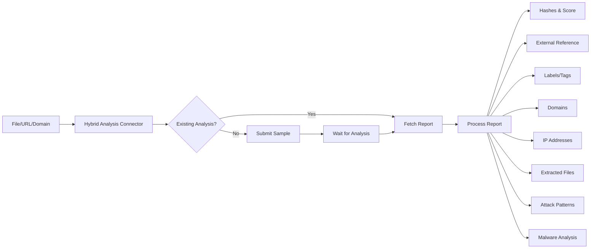

# OpenCTI Hybrid Analysis Sandbox Internal Enrichment Connector

| Status | Date | Comment |
|--------|------|---------|
| Filigran Verified | -    | -       |

## Table of Contents

- [Introduction](#introduction)
- [Installation](#installation)
  - [Requirements](#requirements)
- [Configuration](#configuration)
  - [OpenCTI Configuration](#opencti-configuration)
  - [Base Connector Configuration](#base-connector-configuration)
  - [Hybrid Analysis Configuration](#hybrid-analysis-configuration)
- [Deployment](#deployment)
  - [Docker Deployment](#docker-deployment)
  - [Manual Deployment](#manual-deployment)
- [Usage](#usage)
- [Behavior](#behavior)
  - [Data Flow](#data-flow)
  - [Enrichment Mapping](#enrichment-mapping)
  - [Analysis Environments](#analysis-environments)
  - [Generated STIX Objects](#generated-stix-objects)
- [Debugging](#debugging)
- [Additional Information](#additional-information)

---

## Introduction

Hybrid Analysis is a free malware analysis service powered by CrowdStrike Falcon Sandbox that detects and analyzes unknown threats using hybrid analysis technology.

This internal enrichment connector submits files, URLs, domains, and hostnames to Hybrid Analysis for dynamic analysis and enriches OpenCTI with the results including:
- File hashes (MD5, SHA-1, SHA-256)
- Threat scores and verdicts
- MITRE ATT&CK TTPs
- Network indicators (domains, IPs)
- Dropped/extracted files
- Malware Analysis reports

---

## Installation

### Requirements

- OpenCTI Platform >= 6.0.0
- Hybrid Analysis API token
- Network access to Hybrid Analysis API

---

## Configuration

### OpenCTI Configuration

| Parameter | Docker envvar | Mandatory | Description |
|-----------|---------------|-----------|-------------|
| `opencti_url` | `OPENCTI_URL` | Yes | The URL of the OpenCTI platform |
| `opencti_token` | `OPENCTI_TOKEN` | Yes | The default admin token configured in the OpenCTI platform |

### Base Connector Configuration

| Parameter | Docker envvar | Mandatory | Description |
|-----------|---------------|-----------|-------------|
| `connector_id` | `CONNECTOR_ID` | Yes | A valid arbitrary `UUIDv4` unique for this connector |
| `connector_name` | `CONNECTOR_NAME` | Yes | The name of the connector instance |
| `connector_scope` | `CONNECTOR_SCOPE` | Yes | Supported: `StixFile`, `Artifact`, `Url`, `Domain-Name`, `Hostname` |
| `connector_auto` | `CONNECTOR_AUTO` | Yes | Enable/disable auto-enrichment |
| `connector_confidence_level` | `CONNECTOR_CONFIDENCE_LEVEL` | Yes | Default confidence level (0-100) |
| `connector_log_level` | `CONNECTOR_LOG_LEVEL` | Yes | Log level (`debug`, `info`, `warn`, `error`) |

### Hybrid Analysis Configuration

| Parameter | Docker envvar | Mandatory | Description |
|-----------|---------------|-----------|-------------|
| `hybrid_analysis_api_key` | `HYBRID_ANALYSIS_TOKEN` | Yes | Hybrid Analysis API token |
| `hybrid_analysis_environment_id` | `HYBRID_ANALYSIS_ENVIRONMENT_ID` | No | Analysis environment ID (default: 110) |
| `hybrid_analysis_max_tlp` | `HYBRID_ANALYSIS_MAX_TLP` | No | Maximum TLP for submission |

---

## Deployment

### Docker Deployment

Build a Docker Image using the provided `Dockerfile`.

Example `docker-compose.yml`:

```yaml
version: '3'
services:
  connector-hybrid-analysis-sandbox:
    image: opencti/connector-hybrid-analysis-sandbox:latest
    environment:
      - OPENCTI_URL=http://localhost
      - OPENCTI_TOKEN=ChangeMe
      - CONNECTOR_ID=ChangeMe
      - "CONNECTOR_NAME=Hybrid Analysis (Sandbox Windows 10 64bit)"
      - "CONNECTOR_SCOPE=StixFile,Artifact,Url,Domain-Name,Hostname"
      - CONNECTOR_AUTO=true
      - CONNECTOR_CONFIDENCE_LEVEL=50
      - CONNECTOR_LOG_LEVEL=error
      - HYBRID_ANALYSIS_TOKEN=ChangeMe
      - HYBRID_ANALYSIS_ENVIRONMENT_ID=160
      - HYBRID_ANALYSIS_MAX_TLP=TLP:AMBER
    restart: always
```

### Manual Deployment

1. Clone the repository
2. Copy `config.yml.sample` to `config.yml` and configure
3. Install dependencies: `pip install -r requirements.txt`
4. Run: `python hybrid-analysis-sandbox.py`

---

## Usage

The connector enriches files, URLs, domains, and hostnames by:
1. Searching for existing analysis by hash (for files)
2. Submitting samples if no existing analysis found
3. Waiting for analysis completion
4. Importing results into OpenCTI

Trigger enrichment:
- Manually via the OpenCTI UI
- Automatically if `CONNECTOR_AUTO=true`
- Via playbooks

---

## Behavior

### Data Flow



### Enrichment Mapping

| Hybrid Analysis Field | OpenCTI Entity/Attribute | Description |
|-----------------------|--------------------------|-------------|
| `md5`, `sha1`, `sha256` | File hashes | File hash values |
| `threat_score` | Observable score | Threat score (0-100) |
| `verdict` | Malware Analysis result | Analysis verdict |
| `type_short` | Labels | File type tags |
| `mitre_attcks` | Attack Pattern | MITRE ATT&CK TTPs |
| `domains` | Domain-Name | Network communication domains |
| `hosts` | IPv4-Addr, IPv6-Addr | Network communication IPs |
| `extracted_files` | File | Dropped/extracted files |
| `submit_name` | Additional names | Original filename |
| `environment_description` | Software | Analysis environment OS |

### Analysis Environments

| ID | Environment |
|----|-------------|
| 100 | Windows 7 32 bit |
| 110 | Windows 7 32 bit (HWP Support) |
| 120 | Windows 7 64 bit |
| 160 | Windows 10 64 bit |
| 200 | Android Static Analysis |
| 300 | Linux (Ubuntu 16.04, 64 bit) |
| 310 | Linux (Ubuntu 20.04, 64 bit) |
| 400 | Mac Catalina 64 bit (x86) |

### Generated STIX Objects

| Object Type | Description |
|-------------|-------------|
| External Reference | Link to Hybrid Analysis report |
| Labels | File type tags |
| Attack Pattern | MITRE ATT&CK techniques with x_mitre_id |
| Domain-Name | Network communication domains |
| IPv4-Addr | Network communication IPs |
| IPv6-Addr | Network communication IPs |
| File | Dropped/extracted files with hashes |
| Software | Analysis environment operating system |
| Malware Analysis | Complete analysis report with verdict |
| Relationship | Related-to, drops relationships |

---

## Debugging

Enable debug logging by setting `CONNECTOR_LOG_LEVEL=debug` to see detailed connector operations including:
- Hash search results
- Sample submission status
- Analysis progress
- Report processing details

Common issues:
- **Analysis Failed**: Check if the file type is supported
- **Rate Limiting**: API has rate limits for submissions
- **File Not Found**: Ensure the artifact has an attached file

---

## Additional Information

- [Hybrid Analysis](https://www.hybrid-analysis.com/)
- [Hybrid Analysis API Documentation](https://www.hybrid-analysis.com/docs/api/v2)
- Free service powered by CrowdStrike Falcon Sandbox
