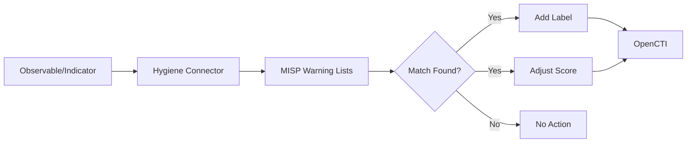

# OpenCTI Hygiene Internal Enrichment Connector

| Status | Date | Comment |
|--------|------|---------|
| Filigran Verified | -    | -       |

## Table of Contents

- [Introduction](#introduction)
- [Installation](#installation)
  - [Requirements](#requirements)
- [Configuration](#configuration)
  - [OpenCTI Configuration](#opencti-configuration)
  - [Base Connector Configuration](#base-connector-configuration)
  - [Hygiene Configuration](#hygiene-configuration)
- [Deployment](#deployment)
  - [Docker Deployment](#docker-deployment)
  - [Manual Deployment](#manual-deployment)
- [Usage](#usage)
- [Behavior](#behavior)
  - [Data Flow](#data-flow)
  - [Warning List Matching](#warning-list-matching)
  - [Score Adjustment](#score-adjustment)
  - [Processing Details](#processing-details)
- [Performance and Multi-threading](#performance-and-multi-threading)
- [Debugging](#debugging)
- [Additional Information](#additional-information)

---

## Introduction

The Hygiene connector is an internal enrichment connector that uses external warning lists to identify observable values in OpenCTI that may lead to false positives when used for detection.

This connector utilizes the [MISP Warning Lists](https://github.com/MISP/misp-warninglists) project to check observables against known benign infrastructure, public services, and common false-positive sources.

### Supported Observable Types

- IPv4-Addr
- IPv6-Addr
- Domain-Name
- StixFile
- Artifact

The connector also works for Indicators based on these observable types.

---

## Installation

### Requirements

- OpenCTI Platform >= 6.0.0
- Python packages:
  - tldextract
  - pydantic-settings
  - pycti
  - PyMISPWarningLists

---

## Configuration

### OpenCTI Configuration

| Parameter | Docker envvar | Mandatory | Description |
|-----------|---------------|-----------|-------------|
| `opencti_url` | `OPENCTI_URL` | Yes | The URL of the OpenCTI platform |
| `opencti_token` | `OPENCTI_TOKEN` | Yes | The default admin token configured in the OpenCTI platform |

### Base Connector Configuration

| Parameter | Docker envvar | Mandatory | Description |
|-----------|---------------|-----------|-------------|
| `connector_id` | `CONNECTOR_ID` | Yes | A valid arbitrary `UUIDv4` unique for this connector |
| `connector_name` | `CONNECTOR_NAME` | Yes | The name of the connector instance |
| `connector_scope` | `CONNECTOR_SCOPE` | Yes | Entity types to process |
| `connector_auto` | `CONNECTOR_AUTO` | Yes | Enable/disable auto-enrichment |
| `connector_log_level` | `CONNECTOR_LOG_LEVEL` | Yes | Log level (`debug`, `info`, `warn`, `error`) |

### Hygiene Configuration

| Parameter | Docker envvar | Mandatory | Description |
|-----------|---------------|-----------|-------------|
| `hygiene_max_workers` | `HYGIENE_MAX_WORKERS` | No | Number of parallel workers (default: 100) |
| `hygiene_warninglists_slow_search` | `HYGIENE_WARNINGLISTS_SLOW_SEARCH` | No | Enable slow but thorough search |
| `hygiene_label_color` | `HYGIENE_LABEL_COLOR` | No | Color for the hygiene label |
| `hygiene_label` | `HYGIENE_LABEL` | No | Label name (default: hygiene) |
| `hygiene_parent_label` | `HYGIENE_PARENT_LABEL` | No | Parent domain label name |

---

## Deployment

### Docker Deployment

Build a Docker Image using the provided `Dockerfile`.

Example `docker-compose.yml`:

```yaml
version: '3'
services:
  connector-hygiene:
    image: opencti/connector-hygiene:latest
    environment:
      - OPENCTI_URL=http://localhost
      - OPENCTI_TOKEN=ChangeMe
      - HYGIENE_MAX_WORKERS=100
    restart: always
```

### Manual Deployment

1. Clone the repository
2. Copy `config.yml.sample` to `config.yml` and configure
3. Install dependencies: `pip install -r requirements.txt`
4. Run: `python -m src`

---

## Usage

The connector automatically processes observables and indicators by:
1. Checking values against MISP warning lists
2. Adding labels to matching entities
3. Adjusting indicator scores based on matches

Trigger enrichment:
- Automatically if `CONNECTOR_AUTO=true`
- Manually via the OpenCTI UI
- Via playbooks

---

## Behavior

### Data Flow



### Warning List Matching

The connector checks observables against various MISP warning lists including:
- Public DNS servers
- Known CDN IP ranges
- Public cloud provider IPs
- Common email domains
- Whitelisted certificates
- Security vendor domains
- And many more...

### Score Adjustment

When an observable matches a warning list entry, the connector adjusts related indicator scores:

| Warning List Hits | New Score |
|-------------------|-----------|
| 1 | 15 |
| 3+ | 10 |
| 5+ | 5 |
| Default (no match) | 20 |

### Processing Details

1. **Label Application**:
   - Adds `hygiene` label to observables matching warning list entries
   - Adds `hygiene_parent` label when parent domain matches

2. **Score Modification**:
   - Reduces indicator scores based on the number of warning list matches
   - Lower scores indicate higher likelihood of false positives

3. **Warning List Types**:
   - IP-based lists (CDN, cloud providers, DNS servers)
   - Domain-based lists (public services, security vendors)
   - Hash-based lists (known benign files)

---

## Performance and Multi-threading

The connector supports multi-threaded processing for significant performance improvements:

### Configuration

Set the number of parallel workers using `HYGIENE_MAX_WORKERS`:
- Default: 100 workers
- Range: 1-500 workers
- Set to 1 for sequential processing

### Features

- **Parallel Processing**: Process up to 100 indicators/observables simultaneously
- **Direct Thread Pool Submission**: Messages are immediately submitted to the thread pool
- **Thread-safe Operations**: All warning list searches are protected with thread locks
- **Automatic Resource Management**: ThreadPoolExecutor handles queueing and worker management
- **Statistics Tracking**: Monitor processing rates, hits, errors, and average processing time
- **Graceful Shutdown**: Properly handles shutdown signals and waits for active tasks

### Performance Metrics

The connector logs statistics every 100 processed messages:
- Total messages processed
- Total warning list hits
- Processing errors
- Average processing time per message
- Number of active tasks vs max workers

### Architecture

1. Main thread receives messages from RabbitMQ via OpenCTI helper
2. Each message is immediately submitted to a ThreadPoolExecutor
3. Thread pool handles all queuing and worker management
4. Workers process messages in parallel, limited by max_workers setting

---

## Debugging

Enable debug logging by setting `CONNECTOR_LOG_LEVEL=debug` to see:
- Warning list matches
- Score adjustments
- Label applications
- Processing statistics

Common issues:
- **Slow Processing**: Increase `HYGIENE_MAX_WORKERS` if processing is slow
- **Memory Issues**: Reduce `HYGIENE_MAX_WORKERS` if memory usage is high
- **Missing Matches**: Enable `HYGIENE_WARNINGLISTS_SLOW_SEARCH` for thorough matching

---

## Additional Information

- [MISP Warning Lists Repository](https://github.com/MISP/misp-warninglists)
- Warning lists are automatically updated from the MISP project
- Labels and colors are configurable to match your organization's taxonomy
