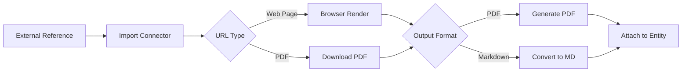

# OpenCTI Import External Reference Internal Enrichment Connector

## Table of Contents

- [Introduction](#introduction)
- [Installation](#installation)
  - [Requirements](#requirements)
- [Configuration](#configuration)
  - [OpenCTI Configuration](#opencti-configuration)
  - [Base Connector Configuration](#base-connector-configuration)
  - [Import External Reference Configuration](#import-external-reference-configuration)
- [Deployment](#deployment)
  - [Docker Deployment](#docker-deployment)
  - [Manual Deployment](#manual-deployment)
- [Usage](#usage)
- [Behavior](#behavior)
  - [Data Flow](#data-flow)
  - [Processing Details](#processing-details)
  - [Generated Objects](#generated-objects)
- [Debugging](#debugging)
- [Additional Information](#additional-information)

---

## Introduction

This connector allows organizations to import external references as PDF files or Markdown files. When an external reference URL is processed, the connector fetches the content and stores it as an attached file in OpenCTI.

This is useful for:
- Archiving external threat intelligence reports
- Creating offline copies of referenced materials
- Converting web pages to PDF or Markdown format

---

## Installation

### Requirements

- OpenCTI Platform >= 5.0.0
- wkhtmltopdf (for PDF conversion)
- Network access to external reference URLs

---

## Configuration

### OpenCTI Configuration

| Parameter | Docker envvar | Mandatory | Description |
|-----------|---------------|-----------|-------------|
| `opencti_url` | `OPENCTI_URL` | Yes | The URL of the OpenCTI platform |
| `opencti_token` | `OPENCTI_TOKEN` | Yes | The default admin token configured in the OpenCTI platform |

### Base Connector Configuration

| Parameter | Docker envvar | Mandatory | Description |
|-----------|---------------|-----------|-------------|
| `connector_id` | `CONNECTOR_ID` | Yes | A valid arbitrary `UUIDv4` unique for this connector |
| `connector_name` | `CONNECTOR_NAME` | Yes | Option `ImportExternalReference` |
| `connector_scope` | `CONNECTOR_SCOPE` | Yes | Must be `External-Reference` |
| `connector_auto` | `CONNECTOR_AUTO` | Yes | Enable/disable auto-import (recommended: `false`) |
| `connector_confidence_level` | `CONNECTOR_CONFIDENCE_LEVEL` | Yes | Default confidence level (0-100) |
| `connector_log_level` | `CONNECTOR_LOG_LEVEL` | Yes | Log level (`debug`, `info`, `warn`, `error`) |

### Import External Reference Configuration

| Parameter | Docker envvar | Mandatory | Description |
|-----------|---------------|-----------|-------------|
| `import_as_pdf` | `IMPORT_EXTERNAL_REFERENCE_IMPORT_AS_PDF` | Yes | Import as PDF file |
| `import_as_md` | `IMPORT_EXTERNAL_REFERENCE_IMPORT_AS_MD` | Yes | Import as Markdown file |
| `import_pdf_as_md` | `IMPORT_EXTERNAL_REFERENCE_IMPORT_PDF_AS_MD` | No | Convert PDF to Markdown |
| `timestamp_files` | `IMPORT_EXTERNAL_REFERENCE_TIMESTAMP_FILES` | No | Timestamp imported files to prevent overwriting |
| `cache_size` | `IMPORT_EXTERNAL_REFERENCE_CACHE_SIZE` | No | Size of LRU URL cache (default: 32) |
| `cache_ttl` | `IMPORT_EXTERNAL_REFERENCE_CACHE_TTL` | No | Cache TTL in seconds (default: 3600) |
| `browser_worker_count` | `IMPORT_EXTERNAL_REFERENCE_BROWSER_WORKER_COUNT` | No | Number of browser workers (default: 4) |
| `max_download_size` | `IMPORT_EXTERNAL_REFERENCE_MAX_DOWNLOAD_SIZE` | No | Maximum download size (default: 50MB) |

---

## Deployment

### Docker Deployment

Build a Docker Image using the provided `Dockerfile`.

Example `docker-compose.yml`:

```yaml
version: '3'
services:
  connector-import-external-reference:
    image: opencti/connector-import-external-reference:latest
    environment:
      - OPENCTI_URL=http://localhost
      - OPENCTI_TOKEN=ChangeMe
      - CONNECTOR_ID=ChangeMe
      - CONNECTOR_NAME=ImportExternalReference
      - CONNECTOR_SCOPE=External-Reference
      - CONNECTOR_AUTO=false
      - CONNECTOR_CONFIDENCE_LEVEL=15
      - CONNECTOR_LOG_LEVEL=error
      - IMPORT_EXTERNAL_REFERENCE_IMPORT_AS_PDF=true
      - IMPORT_EXTERNAL_REFERENCE_IMPORT_AS_MD=true
      - IMPORT_EXTERNAL_REFERENCE_IMPORT_PDF_AS_MD=true
    restart: always
```

### Manual Deployment

1. Clone the repository
2. Copy `config.yml.sample` to `config.yml` and configure
3. Install dependencies: `pip install -r requirements.txt`
4. Install wkhtmltopdf for PDF generation
5. Run the connector

---

## Usage

The connector processes External Reference entities by:
1. Fetching content from the external reference URL
2. Converting the content to PDF and/or Markdown
3. Attaching the files to the external reference entity

Trigger enrichment:
- Manually via the OpenCTI UI on External Reference entities
- Automatically if `CONNECTOR_AUTO=true` (not recommended)

---

## Behavior

### Data Flow



### Processing Details

1. **URL Caching**: Uses LRU cache to prevent fetching the same URL repeatedly
2. **Browser Rendering**: Uses headless browser to render JavaScript-heavy pages
3. **PDF Generation**: Converts web pages to PDF using wkhtmltopdf
4. **Markdown Conversion**: Extracts text content and formats as Markdown
5. **File Timestamping**: Optional timestamping to prevent file overwrites
6. **Size Limits**: Respects maximum download size configuration

### Generated Objects

| Object Type | Description |
|-------------|-------------|
| PDF File | Rendered PDF of the external reference URL |
| Markdown File | Text content converted to Markdown format |

---

## Debugging

Enable debug logging by setting `CONNECTOR_LOG_LEVEL=debug` to see:
- URL fetch operations
- Browser rendering status
- File conversion details

Common issues:
- **wkhtmltopdf not found**: Install wkhtmltopdf on your system
- **Timeout errors**: Increase browser timeout for slow pages
- **Size limit exceeded**: Adjust `max_download_size` if needed

---

## Additional Information

- [STIX 2.1 Specification](https://docs.oasis-open.org/cti/stix/v2.1/cs01/stix-v2.1-cs01.html)
- [wkhtmltopdf](https://wkhtmltopdf.org/)
