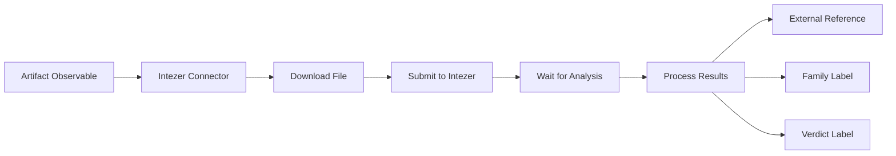

# OpenCTI Intezer Sandbox Internal Enrichment Connector

## Table of Contents

- [Introduction](#introduction)
- [Installation](#installation)
  - [Requirements](#requirements)
- [Configuration](#configuration)
  - [OpenCTI Configuration](#opencti-configuration)
  - [Base Connector Configuration](#base-connector-configuration)
  - [Intezer Sandbox Configuration](#intezer-sandbox-configuration)
- [Deployment](#deployment)
  - [Docker Deployment](#docker-deployment)
  - [Manual Deployment](#manual-deployment)
- [Usage](#usage)
- [Behavior](#behavior)
  - [Data Flow](#data-flow)
  - [Enrichment Mapping](#enrichment-mapping)
  - [Verdict Scoring](#verdict-scoring)
  - [Generated Objects](#generated-objects)
- [Debugging](#debugging)
- [Additional Information](#additional-information)

---

## Introduction

Intezer Sandbox provides genetic malware analysis that identifies the origins of malware by analyzing its code. This connector submits file artifacts to Intezer for analysis and enriches OpenCTI with the results.

Key features:
- Malware family identification through genetic analysis
- Verdict classification (malicious, suspicious, trusted, unknown)
- Code reuse detection
- Threat intelligence enrichment

---

## Installation

### Requirements

- OpenCTI Platform >= 6.0.0
- Intezer API key
- Network access to Intezer API

---

## Configuration

### OpenCTI Configuration

| Parameter | Docker envvar | Mandatory | Description |
|-----------|---------------|-----------|-------------|
| `opencti_url` | `OPENCTI_URL` | Yes | The URL of the OpenCTI platform |
| `opencti_token` | `OPENCTI_TOKEN` | Yes | The default admin token configured in the OpenCTI platform |

### Base Connector Configuration

| Parameter | Docker envvar | Mandatory | Description |
|-----------|---------------|-----------|-------------|
| `connector_id` | `CONNECTOR_ID` | Yes | A valid arbitrary `UUIDv4` unique for this connector |
| `connector_name` | `CONNECTOR_NAME` | Yes | The name of the connector instance |
| `connector_scope` | `CONNECTOR_SCOPE` | Yes | Must be `Artifact` |
| `connector_auto` | `CONNECTOR_AUTO` | Yes | Enable/disable auto-enrichment |
| `connector_confidence_level` | `CONNECTOR_CONFIDENCE_LEVEL` | Yes | Default confidence level (0-100) |
| `connector_log_level` | `CONNECTOR_LOG_LEVEL` | Yes | Log level (`debug`, `info`, `warn`, `error`) |

### Intezer Sandbox Configuration

| Parameter | Docker envvar | Mandatory | Description |
|-----------|---------------|-----------|-------------|
| `intezer_sandbox_api_key` | `INTEZER_SANDBOX_API_KEY` | Yes | Intezer API key |
| `intezer_sandbox_family_color` | `INTEZER_SANDBOX_FAMILY_COLOR` | No | Label color for malware family |
| `intezer_sandbox_malicious_color` | `INTEZER_SANDBOX_MALICIOUS_COLOR` | No | Label color for malicious verdict |
| `intezer_sandbox_trusted_color` | `INTEZER_SANDBOX_TRUSTED_COLOR` | No | Label color for trusted verdict |
| `intezer_sandbox_unknown_color` | `INTEZER_SANDBOX_UNKNOWN_COLOR` | No | Label color for unknown verdict |
| `intezer_sandbox_suspicious_color` | `INTEZER_SANDBOX_SUSPICIOUS_COLOR` | No | Label color for suspicious verdict |
| `intezer_sandbox_max_tlp` | `INTEZER_SANDBOX_MAX_TLP` | No | Maximum TLP for submission |

---

## Deployment

### Docker Deployment

Build a Docker Image using the provided `Dockerfile`.

Example `docker-compose.yml`:

```yaml
version: '3'
services:
  connector-intezer-sandbox:
    image: opencti/connector-intezer-sandbox:latest
    environment:
      - OPENCTI_URL=http://localhost
      - OPENCTI_TOKEN=ChangeMe
      - CONNECTOR_ID=Intezer_Sandbox
      - "CONNECTOR_NAME=IntezerSandbox"
      - CONNECTOR_SCOPE=Artifact
      - CONNECTOR_AUTO=false
      - CONNECTOR_CONFIDENCE_LEVEL=50
      - CONNECTOR_LOG_LEVEL=error
      - INTEZER_SANDBOX_API_KEY=ChangeMe
      - INTEZER_SANDBOX_FAMILY_COLOR=#0059f7
      - INTEZER_SANDBOX_MALICIOUS_COLOR=#d90e18
      - INTEZER_SANDBOX_TRUSTED_COLOR=#06c93a
      - INTEZER_SANDBOX_UNKNOWN_COLOR=#ffff00
      - INTEZER_SANDBOX_SUSPICIOUS_COLOR=#f79e00
      - INTEZER_SANDBOX_MAX_TLP=TLP:AMBER
    restart: always
```

### Manual Deployment

1. Clone the repository
2. Copy `config.yml.sample` to `config.yml` and configure
3. Install dependencies: `pip install -r requirements.txt`
4. Run: `python intezer_sandbox.py`

---

## Usage

The connector enriches Artifact observables by:
1. Downloading the file from OpenCTI
2. Submitting the file to Intezer for analysis
3. Waiting for analysis completion
4. Importing the results (family, verdict, external reference)

Trigger enrichment:
- Manually via the OpenCTI UI on Artifact entities
- Automatically if `CONNECTOR_AUTO=true`
- Via playbooks

---

## Behavior

### Data Flow



### Enrichment Mapping

| Intezer Field | OpenCTI Entity | Description |
|---------------|----------------|-------------|
| `analysis_url` | External Reference | Link to Intezer analysis |
| `family_name` | Label | Identified malware family |
| `verdict` | Label | Analysis verdict with color coding |

### Verdict Scoring

| Verdict | Color | Description |
|---------|-------|-------------|
| Malicious | Red (#d90e18) | Confirmed malware |
| Suspicious | Orange (#f79e00) | Potentially malicious |
| Unknown | Yellow (#ffff00) | Unable to determine |
| Trusted | Green (#06c93a) | Confirmed legitimate |

### Generated Objects

| Object Type | Description |
|-------------|-------------|
| External Reference | Link to Intezer analysis results |
| Label (Family) | Malware family name |
| Label (Verdict) | Analysis verdict with appropriate color |

---

## Debugging

Enable debug logging by setting `CONNECTOR_LOG_LEVEL=debug` to see:
- File submission details
- Analysis status polling
- Result processing

Common issues:
- **No files found**: Ensure the artifact has an attached file
- **Analysis failed**: Check if the file type is supported
- **API errors**: Verify your Intezer API key

---

## Additional Information

- [Intezer Analyze](https://analyze.intezer.com/)
- [Get Intezer API Key](https://analyze.intezer.com/account-details)
- [Intezer Documentation](https://docs.intezer.com/)

