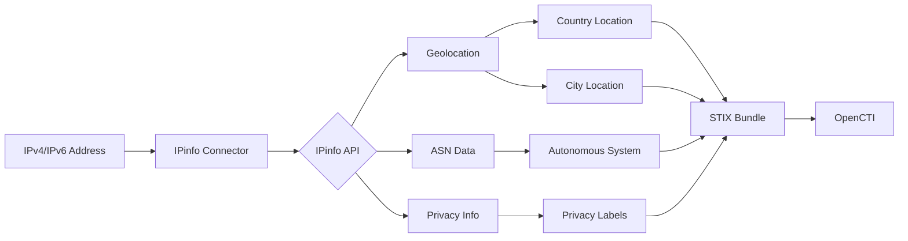

# OpenCTI IPinfo Connector

| Status | Date | Comment |
|--------|------|---------|
| Filigran Verified | -    | -       |

## Table of Contents

- [Introduction](#introduction)
- [Installation](#installation)
  - [Requirements](#requirements)
- [Configuration](#configuration)
  - [OpenCTI Configuration](#opencti-configuration)
  - [Base Connector Configuration](#base-connector-configuration)
  - [IPinfo Configuration](#ipinfo-configuration)
- [Deployment](#deployment)
  - [Docker Deployment](#docker-deployment)
  - [Manual Deployment](#manual-deployment)
- [Usage](#usage)
- [Behavior](#behavior)
  - [Data Flow](#data-flow)
  - [Enrichment Mapping](#enrichment-mapping)
  - [Privacy Detection](#privacy-detection)
  - [Generated STIX Objects](#generated-stix-objects)
- [Debugging](#debugging)
- [Additional Information](#additional-information)

---

## Introduction

IPinfo provides accurate IP address data for secure, specific, and forward-looking use cases. This connector enriches IPv4 and IPv6 addresses with geolocation, ASN, company, and privacy information.

Key features:
- IP geolocation (country, city, coordinates)
- ASN and organization information
- Privacy detection (VPN, proxy, TOR, relay, hosting)
- High accuracy and comprehensive coverage

---

## Installation

### Requirements

- OpenCTI Platform >= 6.0.0
- IPinfo API token
- Network access to IPinfo API

---

## Configuration

### OpenCTI Configuration

| Parameter | Docker envvar | Mandatory | Description |
|-----------|---------------|-----------|-------------|
| `opencti_url` | `OPENCTI_URL` | Yes | The URL of the OpenCTI platform |
| `opencti_token` | `OPENCTI_TOKEN` | Yes | The default admin token configured in the OpenCTI platform |

### Base Connector Configuration

| Parameter | Docker envvar | Mandatory | Description |
|-----------|---------------|-----------|-------------|
| `connector_id` | `CONNECTOR_ID` | Yes | A valid arbitrary `UUIDv4` unique for this connector |
| `connector_name` | `CONNECTOR_NAME` | Yes | The name of the connector instance |
| `connector_scope` | `CONNECTOR_SCOPE` | Yes | Supported: `IPv4-Addr`, `IPv6-Addr` |
| `connector_auto` | `CONNECTOR_AUTO` | Yes | Enable/disable auto-enrichment |
| `connector_confidence_level` | `CONNECTOR_CONFIDENCE_LEVEL` | Yes | Default confidence level (0-100) |
| `connector_log_level` | `CONNECTOR_LOG_LEVEL` | Yes | Log level (`debug`, `info`, `warn`, `error`) |

### IPinfo Configuration

| Parameter | Docker envvar | Mandatory | Description |
|-----------|---------------|-----------|-------------|
| `ipinfo_token` | `IPINFO_TOKEN` | Yes | IPinfo API token |
| `ipinfo_max_tlp` | `IPINFO_MAX_TLP` | No | Maximum TLP for processing |
| `ipinfo_use_asn_name` | `IPINFO_USE_ASN_NAME` | No | Use ASN name vs number (default: true) |

---

## Deployment

### Docker Deployment

Build a Docker Image using the provided `Dockerfile`.

Example `docker-compose.yml`:

```yaml
version: '3'
services:
  connector-ipinfo:
    image: opencti/connector-ipinfo:latest
    environment:
      - OPENCTI_URL=http://localhost
      - OPENCTI_TOKEN=ChangeMe
      - CONNECTOR_ID=ChangeMe
      - CONNECTOR_NAME=IpInfo
      - CONNECTOR_SCOPE=IPv4-Addr,IPv6-Addr
      - CONNECTOR_AUTO=true
      - CONNECTOR_CONFIDENCE_LEVEL=75
      - CONNECTOR_LOG_LEVEL=error
      - IPINFO_TOKEN=ChangeMe
      - IPINFO_MAX_TLP=TLP:AMBER
      - IPINFO_USE_ASN_NAME=true
    restart: always
```

### Manual Deployment

1. Clone the repository
2. Copy `config.yml.sample` to `config.yml` and configure
3. Install dependencies: `pip install -r requirements.txt`
4. Run: `python -m src`

---

## Usage

The connector enriches IPv4 and IPv6 addresses by:
1. Querying the IPinfo API for IP data
2. Creating STIX objects for geolocation and ASN
3. Building relationships between entities
4. Adding privacy labels if detected

Trigger enrichment:
- Manually via the OpenCTI UI
- Automatically if `CONNECTOR_AUTO=true`
- Via playbooks

---

## Behavior

### Data Flow



### Enrichment Mapping

| IPinfo Field | OpenCTI Entity | Relationship |
|--------------|----------------|--------------|
| `country` | Location (Country) | `located-at` |
| `city` | Location (City) | `located-at` |
| `loc` | Location coordinates | Latitude/Longitude |
| `asn`/`org` | Autonomous System | `belongs-to` |
| `privacy` | Labels | Direct attribute |

### Privacy Detection

| Privacy Type | Label | Description |
|--------------|-------|-------------|
| VPN | `vpn` | Commercial VPN service |
| Proxy | `proxy` | Proxy server |
| TOR | `tor` | TOR exit node |
| Relay | `relay` | iCloud Private Relay |
| Hosting | `hosting` | Hosting/datacenter IP |
| Service | (service name) | Specific service name |

### Generated STIX Objects

| Object Type | Description |
|-------------|-------------|
| Location (Country) | Country-level geolocation |
| Location (City) | City-level geolocation with coordinates |
| Autonomous System | ASN number and name |
| Labels | Privacy indicators (vpn, proxy, tor, etc.) |
| Relationship | located-at (IP to locations), belongs-to (IP to ASN) |

---

## Debugging

Enable debug logging by setting `CONNECTOR_LOG_LEVEL=debug` to see:
- API requests and responses
- STIX object creation
- Relationship building

Common issues:
- **Invalid API Token**: Error 403 - Check your IPinfo token
- **Rate Limit Exceeded**: Error 429 - Wait or upgrade your plan
- **Country not found**: Some IPs may not have geolocation data

---

## Additional Information

- [IPinfo Documentation](https://ipinfo.io/developers)
- [Get IPinfo Token](https://ipinfo.io/signup)
- [IPinfo Privacy Detection](https://ipinfo.io/products/privacy-detection-api)
