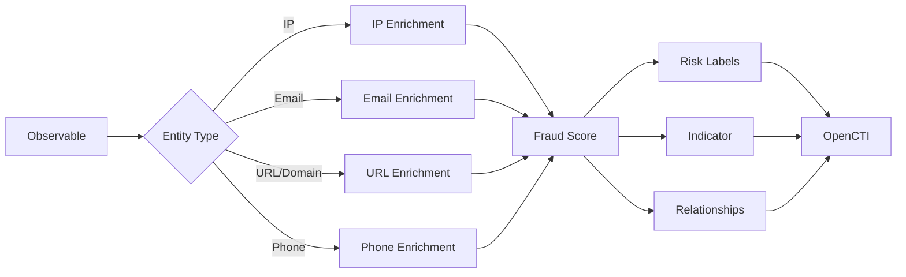

# OpenCTI IPQS Fraud and Risk Scoring Internal Enrichment Connector

## Table of Contents

- [Introduction](#introduction)
- [Installation](#installation)
  - [Requirements](#requirements)
- [Configuration](#configuration)
  - [OpenCTI Configuration](#opencti-configuration)
  - [Base Connector Configuration](#base-connector-configuration)
  - [IPQS Configuration](#ipqs-configuration)
- [Deployment](#deployment)
  - [Docker Deployment](#docker-deployment)
  - [Manual Deployment](#manual-deployment)
- [Usage](#usage)
- [Behavior](#behavior)
  - [Data Flow](#data-flow)
  - [Enrichment Mapping](#enrichment-mapping)
  - [Risk Scoring](#risk-scoring)
  - [Generated STIX Objects](#generated-stix-objects)
- [Debugging](#debugging)
- [Additional Information](#additional-information)

---

## Introduction

IPQualityScore (IPQS) provides enterprise-grade fraud prevention, risk analysis, and threat detection. This connector analyzes IP addresses, email addresses, phone numbers, URLs, and domains to identify sophisticated bad actors and high-risk behavior.

Key features:
- IP address fraud scoring and proxy detection
- Email address validation and risk assessment
- Phone number verification and fraud detection
- URL and domain reputation analysis
- Malware and phishing detection

---

## Installation

### Requirements

- OpenCTI Platform >= 5.4.2
- IPQualityScore API key ([Register here](https://www.ipqualityscore.com/create-account/openccti))
- Network access to IPQS API

---

## Configuration

### OpenCTI Configuration

| Parameter | Docker envvar | Mandatory | Description |
|-----------|---------------|-----------|-------------|
| `opencti_url` | `OPENCTI_URL` | Yes | The URL of the OpenCTI platform |
| `opencti_token` | `OPENCTI_TOKEN` | Yes | The default admin token configured in the OpenCTI platform |

### Base Connector Configuration

| Parameter | Docker envvar | Mandatory | Description |
|-----------|---------------|-----------|-------------|
| `connector_id` | `CONNECTOR_ID` | Yes | A valid arbitrary `UUIDv4` unique for this connector |
| `connector_name` | `CONNECTOR_NAME` | Yes | The name of the connector instance |
| `connector_scope` | `CONNECTOR_SCOPE` | Yes | Supported: `Domain-Name`, `IPv4-Addr`, `Email-Addr`, `Url`, `Phone-Number` |
| `connector_auto` | `CONNECTOR_AUTO` | Yes | Enable/disable auto-enrichment |
| `connector_confidence_level` | `CONNECTOR_CONFIDENCE_LEVEL` | Yes | Default confidence level (0-100) |
| `connector_log_level` | `CONNECTOR_LOG_LEVEL` | Yes | Log level (`debug`, `info`, `warn`, `error`) |

### IPQS Configuration

| Parameter | Docker envvar | Mandatory | Description |
|-----------|---------------|-----------|-------------|
| `private_key` | `IPQS_PRIVATE_KEY` | Yes | IPQualityScore API key |
| `base_url` | `IPQS_BASE_URL` | No | IPQS API base URL |
| `ip_add_relationships` | `IPQS_IP_ADD_RELATIONSHIPS` | No | Add ASN relationships for IPs |
| `domain_add_relationships` | `IPQS_DOMAIN_ADD_RELATIONSHIPS` | No | Add IP resolution relationships for domains |

---

## Deployment

### Docker Deployment

Build a Docker Image using the provided `Dockerfile`.

Example `docker-compose.yml`:

```yaml
version: '3'
services:
  connector-ipqs:
    image: opencti/connector-ipqs:latest
    environment:
      - OPENCTI_URL=http://localhost
      - OPENCTI_TOKEN=ChangeMe
      - CONNECTOR_ID=ChangeMe
      - CONNECTOR_NAME=IPQS Fraud and Risk Scoring
      - CONNECTOR_SCOPE=Domain-Name,IPv4-Addr,Email-Addr,Url,Phone-Number
      - CONNECTOR_AUTO=true
      - CONNECTOR_CONFIDENCE_LEVEL=15
      - CONNECTOR_LOG_LEVEL=error
      - IPQS_PRIVATE_KEY=ChangeMe
      - IPQS_BASE_URL=https://ipqualityscore.com/api/json
      - IPQS_IP_ADD_RELATIONSHIPS=true
      - IPQS_DOMAIN_ADD_RELATIONSHIPS=true
    restart: always
```

### Manual Deployment

1. Clone the repository
2. Copy `config.yml.sample` to `config.yml` and configure
3. Install dependencies: `pip install -r requirements.txt`
4. Run: `python main.py`

---

## Usage

The connector enriches observables by:
1. Querying the IPQS API for risk scoring
2. Creating indicators with fraud scores
3. Adding risk-based labels
4. Building relationships (ASN for IPs, resolution for domains)

Trigger enrichment:
- Manually via the OpenCTI UI
- Automatically if `CONNECTOR_AUTO=true`
- Via playbooks

---

## Behavior

### Data Flow



### Enrichment Mapping

| Entity Type | IPQS Endpoint | Enrichment Data |
|-------------|---------------|-----------------|
| IPv4-Addr | IP | Fraud score, proxy detection, ASN, VPN, TOR |
| Email-Addr | Email | Fraud score, disposable, valid, deliverability |
| URL/Domain-Name | URL | Risk score, malware, phishing, suspicious |
| Phone-Number | Phone | Fraud score, valid, active, carrier info |

### Risk Scoring

The connector assigns risk labels based on fraud scores:

| Score Range | Risk Level | Description |
|-------------|------------|-------------|
| 0-25 | Low | Likely legitimate |
| 26-50 | Medium | Moderate risk |
| 51-75 | High | Suspicious activity |
| 76-100 | Critical | High fraud risk |

### Generated STIX Objects

| Object Type | Description |
|-------------|-------------|
| Identity | IPQS organization identity |
| Indicator | Pattern-based indicator with fraud score |
| Autonomous System | ASN for IP addresses (if enabled) |
| IPv4-Addr | Resolved IP for domains (if enabled) |
| Relationship | `based-on` (indicator to observable), `belongs-to` (IP to ASN), `resolves-to` (domain to IP) |
| Note | Detailed enrichment data in markdown format |

---

## Debugging

Enable debug logging by setting `CONNECTOR_LOG_LEVEL=debug` to see:
- API requests and responses
- Entity processing details
- Score calculations

Common issues:
- **Invalid API Key**: Verify your IPQS private key
- **Unsupported Entity Type**: Check connector scope configuration
- **Rate Limiting**: IPQS may limit requests based on your plan

---

## Additional Information

- [IPQualityScore](https://www.ipqualityscore.com/)
- [IPQS API Documentation](https://www.ipqualityscore.com/documentation/overview)
- [Register for API Key](https://www.ipqualityscore.com/create-account/openccti)
