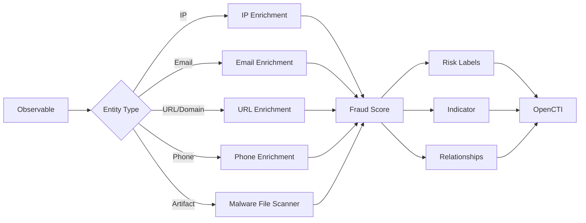

# OpenCTI IPQS Fraud, Risk Scoring & Malware-File-Scanner Connector

| Status | Date | Comment |
|--------|------|---------|
| Community | -    | -       |

## Table of Contents

- [Introduction](#introduction)
- [Installation](#installation)
  - [Requirements](#requirements)
- [Configuration](#configuration)
  - [OpenCTI Configuration](#opencti-configuration)
  - [Base Connector Configuration](#base-connector-configuration)
  - [IPQS Configuration](#ipqs-configuration)
- [Deployment](#deployment)
  - [Docker Deployment](#docker-deployment)
  - [Manual Deployment](#manual-deployment)
- [Usage](#usage)
- [Behavior](#behavior)
  - [Data Flow](#data-flow)
  - [Enrichment Mapping](#enrichment-mapping)
  - [Risk Scoring](#risk-scoring)
  - [Malware File Scanner](#malware-file-scanner)
  - [Generated STIX Objects](#generated-stix-objects)
- [Debugging](#debugging)
- [Additional Information](#additional-information)

---

## Introduction

IPQualityScore (IPQS) provides enterprise-grade fraud prevention, risk analysis, and threat detection. This connector drives three IPQS API families with a single API key and a single OpenCTI scope:

* the **fraud-and-risk-scoring** endpoints (`/ip`, `/url`, `/email`, `/phone`) for `IPv4-Addr`, `Email-Addr`, `Phone-Number`, `Domain-Name` and `Url` observables;
* the **Darkweb-Leak** endpoints (`/leaked/email`, `/leaked/username`, `/leaked/password`) for `User-Account` observables (added by [PR #6399](https://github.com/OpenCTI-Platform/connectors/pull/6399));
* the **malware-file-scanner** endpoints (`/malware/scan`, `/malware/lookup`, `/postback`) for `Artifact` observables — originally proposed as a standalone `ipqs-analyzer` connector in [PR #5970](https://github.com/OpenCTI-Platform/connectors/pull/5970), now integrated here so a single connector covers every IPQS use case (see [issue #6199](https://github.com/OpenCTI-Platform/connectors/issues/6199)).

Key features:
- IP address fraud scoring and proxy detection
- Email address validation and risk assessment
- Phone number verification and fraud detection
- URL and domain reputation analysis
- **Artifact malware scanning** with the IPQS Malware File Scanner API (cache-first lookup, then submit, then poll the postback endpoint)
- Malware and phishing detection
- Darkweb-Leak lookup for `User-Account` observables (username, email, password)

---

## Installation

### Requirements

- OpenCTI Platform >= 5.4.2
- IPQualityScore API key ([Register here](https://www.ipqualityscore.com/create-account/openccti))
- Network access to IPQS API

---

## Configuration

### OpenCTI Configuration

| Parameter | Docker envvar | Mandatory | Description |
|-----------|---------------|-----------|-------------|
| `opencti_url` | `OPENCTI_URL` | Yes | The URL of the OpenCTI platform |
| `opencti_token` | `OPENCTI_TOKEN` | Yes | The default admin token configured in the OpenCTI platform |

### Base Connector Configuration

| Parameter | Docker envvar | Mandatory | Description |
|-----------|---------------|-----------|-------------|
| `connector_id` | `CONNECTOR_ID` | Yes | A valid arbitrary `UUIDv4` unique for this connector |
| `connector_name` | `CONNECTOR_NAME` | Yes | The name of the connector instance |
| `connector_scope` | `CONNECTOR_SCOPE` | Yes | Supported: `Domain-Name`, `IPv4-Addr`, `Email-Addr`, `Url`, `Phone-Number`, `User-Account`, `Artifact` |
| `connector_auto` | `CONNECTOR_AUTO` | Yes | Enable/disable auto-enrichment |
| `connector_confidence_level` | `CONNECTOR_CONFIDENCE_LEVEL` | Yes | Default confidence level (0-100) |
| `connector_log_level` | `CONNECTOR_LOG_LEVEL` | Yes | Log level (`debug`, `info`, `warn`, `error`) |

### IPQS Configuration

| Parameter | Docker envvar | Mandatory | Default | Description |
|-----------|---------------|-----------|---------|-------------|
| `private_key` | `IPQS_PRIVATE_KEY` | Yes | | IPQualityScore API key (used for both API families) |
| `base_url` | `IPQS_BASE_URL` | No | `https://ipqualityscore.com/api/json` | IPQS API base URL |
| `ip_add_relationships` | `IPQS_IP_ADD_RELATIONSHIPS` | No | `false` | Add ASN relationships for IPs |
| `domain_add_relationships` | `IPQS_DOMAIN_ADD_RELATIONSHIPS` | No | `false` | Add IP resolution relationships for domains |
| `default_tlp` | `IPQS_DEFAULT_TLP` | No | `TLP:CLEAR` | TLP marking applied to STIX objects emitted by the malware-file-scanner branch when the observable carries none. Supports `TLP:CLEAR` / `TLP:WHITE`, `TLP:GREEN`, `TLP:AMBER`, `TLP:AMBER+STRICT`, `TLP:RED`. |
| `max_tlp` | `IPQS_MAX_TLP` | No | `TLP:AMBER` | Maximum TLP for which the connector will submit data to IPQS; observables with a higher marking are skipped. Enforced **on every enrichment branch** (IP / Email / URL / Phone / User-Account / Artifact). |

---

## Deployment

### Docker Deployment

Build a Docker Image using the provided `Dockerfile`.

Example `docker-compose.yml`:

```yaml
version: '3'
services:
  connector-ipqs:
    image: opencti/connector-ipqs:latest
    environment:
      - OPENCTI_URL=http://localhost
      - OPENCTI_TOKEN=ChangeMe
      - CONNECTOR_ID=ChangeMe
      - CONNECTOR_NAME=IPQS Fraud and Risk Scoring
      - CONNECTOR_SCOPE=Domain-Name,IPv4-Addr,Email-Addr,Url,Phone-Number,User-Account,Artifact
      - CONNECTOR_AUTO=true
      - CONNECTOR_CONFIDENCE_LEVEL=15
      - CONNECTOR_LOG_LEVEL=error
      - IPQS_PRIVATE_KEY=ChangeMe
      - IPQS_BASE_URL=https://ipqualityscore.com/api/json
      - IPQS_IP_ADD_RELATIONSHIPS=true
      - IPQS_DOMAIN_ADD_RELATIONSHIPS=true
      - IPQS_DEFAULT_TLP=TLP:CLEAR
      - IPQS_MAX_TLP=TLP:AMBER
    restart: always
```

### Manual Deployment

1. Clone the repository
2. Copy `config.yml.sample` to `config.yml` and configure
3. Install dependencies: `pip install -r requirements.txt`
4. Run: `python main.py`

---

## Usage

The connector enriches observables by:
1. Querying the IPQS API for risk scoring
2. Creating indicators with fraud scores
3. Adding risk-based labels
4. Building relationships (ASN for IPs, resolution for domains)

Trigger enrichment:
- Manually via the OpenCTI UI
- Automatically if `CONNECTOR_AUTO=true`
- Via playbooks

---

## Behavior

### Data Flow


```mermaid
flowchart LR
    A[Observable] --> B{Entity Type}
    B -->|IP| C[IP Enrichment]
    B -->|Email| D[Email Enrichment]
    B -->|URL/Domain| E[URL Enrichment]
    B -->|Phone| F[Phone Enrichment]
    B -->|Artifact| AF[Malware File Scanner]
    C --> G[Fraud Score]
    D --> G
    E --> G
    F --> G
    AF --> G
    G --> H[Risk Labels]
    G --> I[Indicator]
    G --> J[Relationships]
    H --> K[OpenCTI]
    I --> K
    J --> K
```

### Enrichment Mapping

| Entity Type     | IPQS Endpoint                                                                                                            | Enrichment Data                                                                                              |
|-----------------|--------------------------------------------------------------------------------------------------------------------------|--------------------------------------------------------------------------------------------------------------|
| IPv4-Addr       | `/ip`                                                                                                                    | Fraud score, proxy detection, ASN, VPN, TOR.                                                                 |
| Email-Addr      | `/email`                                                                                                                 | Fraud score, disposable, valid, deliverability.                                                              |
| URL/Domain-Name | `/url`                                                                                                                   | Risk score, malware, phishing, suspicious.                                                                   |
| Phone-Number    | `/phone`                                                                                                                 | Fraud score, valid, active, carrier info.                                                                    |
| User-Account    | `/leaked/email` or `/leaked/username` (when an `account_login` is set) or `/leaked/password` (when a `credential` is set) | Darkweb-Leak exposure (`exposed`, `plain_text_password`, sources, first-seen timestamp).                     |
| Artifact        | `/malware/lookup` → `/malware/scan` → `/postback`                                                                          | Multi-engine malware verdict, file hashes, scan metadata.                                                    |

### Darkweb-Leak (User-Account)

When a `User-Account` observable is submitted, the connector picks one of
the IPQS `/leaked/...` endpoints depending on which value is populated:

- `account_login` that looks like an email → `/leaked/email`;
- any other `account_login` → `/leaked/username`;
- `credential` → `/leaked/password`. If both `account_login` and
  `credential` are present, the credential lookup takes precedence
  (passwords are the more sensitive value to know about).

The verdict policy for User-Account observables is simple: any positive
exposure (either `exposed=True` or `plain_text_password=True`) yields a
`CRITICAL` score (100). A clean response yields `CLEAN` (0).

The IPQS API key is **always** sent through the `IPQS-KEY` HTTP header
— never in the URL path — so it is not leaked in HTTP access logs.

### Risk Scoring

The connector renders an `IPQS:VERDICT="…"` label on each enriched
observable. The mapping is endpoint-specific (see `builder.py` for the
exact match statements) but follows the same colour palette:

| Verdict label   | Hex colour | Meaning                                                                                                                       |
|-----------------|------------|-------------------------------------------------------------------------------------------------------------------------------|
| CLEAN           | `#CDCDCD`  | No evidence of risk.                                                                                                          |
| LOW RISK        | `#CDCDCD`  | Marginal score, observable is probably benign.                                                                                |
| MODERATE RISK   | `#FFCF00`  | Mid-range fraud score; investigate.                                                                                           |
| SUSPICIOUS      | `#FFCF00`  | Mid-range fraud score with one or more risky attributes.                                                                      |
| HIGH RISK       | `#D10028`  | High fraud score.                                                                                                             |
| CRITICAL        | `#D10028`  | Score == 100, IPQS-flagged disposable email, or `exposed`/`plain_text_password` for User-Account.                             |
| INVALID         | `#D10028`  | The observable is invalid according to IPQS (e.g. malformed email).                                                           |

### Malware File Scanner

The `Artifact` branch implements the IPQS Malware File Scanner API following the same defensive flow originally proposed in [PR #5970](https://github.com/OpenCTI-Platform/connectors/pull/5970):

1. **Lookup first** — the file content is uploaded to `/malware/lookup`. IPQS hashes the upload server-side and, if it already has a recent (24h) verdict for that hash, returns `status="cached"` and the connector skips straight to step 4.
2. **Submit** — on a cache miss the file content is uploaded to `/malware/scan`. IPQS responds with a `request_id`.
3. **Poll** — `/postback` is polled with the `request_id` (up to 9 attempts, 10s apart) until the scan completes, the upstream surfaces an error, or a hard 120s polling deadline is reached. Each `/postback` call additionally uses a 10s per-request timeout so a stuck request cannot eat the whole budget.
4. **Build the bundle** — on success the connector:
   - sets the observable's `x_opencti_score` (100 if any engine flagged the file, 50 otherwise);
   - attaches a `Clean` / `Malicious` label to the observable;
   - builds an `Indicator` with the canonical `[file:hashes.'SHA-256' = '<hash>']` pattern, the detection verdict (`x_opencti_detection`), and a `based-on` relationship to the observable;
   - attaches an external reference (`source_name="IPQS File Analyzer"`, `external_id=<request_id>`) to the observable **when the IPQS response carries a `request_id`**. Cache hits (`status="cached"` on `/malware/lookup`) intentionally skip the external reference because the upstream does not surface a stable `request_id` for cached verdicts.
5. **Failure path** — when IPQS returns `success=false` (no credits, invalid input, ...) or the upstream is unreachable, the connector emits a `Note` (`abstract="IPQS enrichment failed"`) attached to the observable so the operator can diagnose the issue from the OpenCTI UI without inspecting connector logs.

### Generated STIX Objects

| Object Type        | Description                                                                                                                       |
|--------------------|-----------------------------------------------------------------------------------------------------------------------------------|
| Identity           | IPQS organization identity                                                                                                        |
| Indicator          | Pattern-based indicator with fraud / leak / malware verdict, description and `IPQS:VERDICT` (or `Clean`/`Malicious`) label        |
| Autonomous System  | ASN for IP addresses (if `IPQS_IP_ADD_RELATIONSHIPS=true`)                                                                        |
| IPv4-Addr          | Resolved IP for domains (if `IPQS_DOMAIN_ADD_RELATIONSHIPS=true`)                                                                  |
| External Reference | Link to the IPQS analysis report (Artifact branch, attached to the observable when the IPQS response carries a `request_id`)      |
| Relationship       | `based-on` (indicator to observable), `belongs-to` (IP to ASN), `resolves-to` (domain to IP)                                      |
| Note               | Failure-Note attached to the observable when an Artifact enrichment fails (`abstract="IPQS enrichment failed"`)                   |

---

## Debugging

Enable debug logging by setting `CONNECTOR_LOG_LEVEL=debug` to see:
- API requests and responses
- Entity processing details
- Score calculations

Common issues:
- **Invalid API Key**: Verify your IPQS private key
- **Unsupported Entity Type**: Check connector scope configuration
- **Rate Limiting**: IPQS may limit requests based on your plan
- **Artifact / `Insufficient Credits`**: each malware scan costs 10 IPQS credits — check your account balance or upgrade
- **Artifact / timeouts**: complex samples may take longer than the hard 120s polling budget (`_POLLING_BUDGET_SECONDS`, with a per-`/postback`-request 10s `_POSTBACK_REQUEST_TIMEOUT_SECONDS`); rerun the enrichment — the cache will surface the result once IPQS completes the scan
- **Artifact / `IPQS authentication failed (HTTP 401)`**: the malware-file-scanner endpoints require a paid plan distinct from the fraud-scoring plan

---

## Additional Information

- [IPQualityScore](https://www.ipqualityscore.com/)
- [IPQS API Documentation](https://www.ipqualityscore.com/documentation/overview)
- [Malware File Scanner API Documentation](https://www.ipqualityscore.com/documentation/malware-file-scanner-api/overview)
- [Register for API Key](https://www.ipqualityscore.com/create-account/openccti)
- [PR #5970 — original `ipqs-analyzer` proposal that this branch integrates](https://github.com/OpenCTI-Platform/connectors/pull/5970)
- [Issue #6199 — IPQS Analyzer integration tracking issue](https://github.com/OpenCTI-Platform/connectors/issues/6199)
