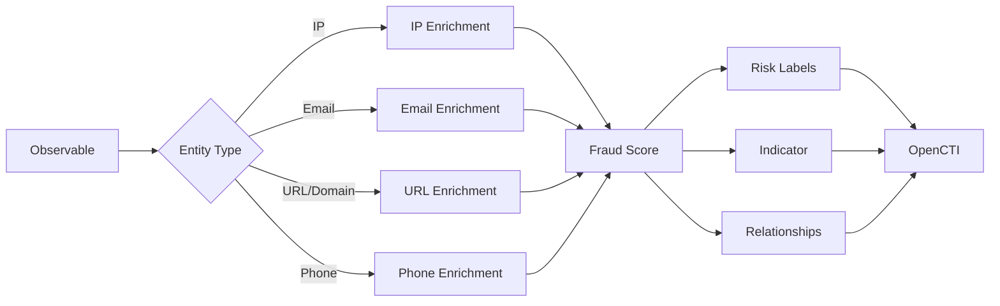

# OpenCTI IPQS Fraud and Risk Scoring Connector

| Status | Date | Comment |
|--------|------|---------|
| Community | -    | -       |

## Table of Contents

- [Introduction](#introduction)
- [Installation](#installation)
  - [Requirements](#requirements)
- [Configuration](#configuration)
  - [OpenCTI Configuration](#opencti-configuration)
  - [Base Connector Configuration](#base-connector-configuration)
  - [IPQS Configuration](#ipqs-configuration)
- [Deployment](#deployment)
  - [Docker Deployment](#docker-deployment)
  - [Manual Deployment](#manual-deployment)
- [Usage](#usage)
- [Behavior](#behavior)
  - [Data Flow](#data-flow)
  - [Enrichment Mapping](#enrichment-mapping)
  - [Risk Scoring](#risk-scoring)
  - [Generated STIX Objects](#generated-stix-objects)
- [Debugging](#debugging)
- [Additional Information](#additional-information)

---

## Introduction

IPQualityScore (IPQS) provides enterprise-grade fraud prevention, risk analysis, and threat detection. This connector analyzes IP addresses, email addresses, phone numbers, URLs, domains and `User-Account` observables (Darkweb-Leak lookups) to identify sophisticated bad actors and high-risk behavior.

Key features:
- IP address fraud scoring and proxy detection
- Email address validation and risk assessment
- Phone number verification and fraud detection
- URL and domain reputation analysis
- Malware and phishing detection
- Darkweb-Leak lookup for `User-Account` observables (username, email, password)

---

## Installation

### Requirements

- OpenCTI Platform >= 5.4.2
- IPQualityScore API key ([Register here](https://www.ipqualityscore.com/create-account/openccti))
- Network access to IPQS API

---

## Configuration

### OpenCTI Configuration

| Parameter | Docker envvar | Mandatory | Description |
|-----------|---------------|-----------|-------------|
| `opencti_url` | `OPENCTI_URL` | Yes | The URL of the OpenCTI platform |
| `opencti_token` | `OPENCTI_TOKEN` | Yes | The default admin token configured in the OpenCTI platform |

### Base Connector Configuration

| Parameter | Docker envvar | Mandatory | Description |
|-----------|---------------|-----------|-------------|
| `connector_id` | `CONNECTOR_ID` | Yes | A valid arbitrary `UUIDv4` unique for this connector |
| `connector_name` | `CONNECTOR_NAME` | Yes | The name of the connector instance |
| `connector_scope` | `CONNECTOR_SCOPE` | Yes | Supported: `Domain-Name`, `IPv4-Addr`, `Email-Addr`, `Url`, `Phone-Number`, `User-Account` |
| `connector_auto` | `CONNECTOR_AUTO` | Yes | Enable/disable auto-enrichment |
| `connector_confidence_level` | `CONNECTOR_CONFIDENCE_LEVEL` | Yes | Default confidence level (0-100) |
| `connector_log_level` | `CONNECTOR_LOG_LEVEL` | Yes | Log level (`debug`, `info`, `warn`, `error`) |

### IPQS Configuration

| Parameter | Docker envvar | Mandatory | Description |
|-----------|---------------|-----------|-------------|
| `private_key` | `IPQS_PRIVATE_KEY` | Yes | IPQualityScore API key |
| `base_url` | `IPQS_BASE_URL` | No | IPQS API base URL |
| `ip_add_relationships` | `IPQS_IP_ADD_RELATIONSHIPS` | No | Add ASN relationships for IPs |
| `domain_add_relationships` | `IPQS_DOMAIN_ADD_RELATIONSHIPS` | No | Add IP resolution relationships for domains |

---

## Deployment

### Docker Deployment

Build a Docker Image using the provided `Dockerfile`.

Example `docker-compose.yml`:

```yaml
version: '3'
services:
  connector-ipqs:
    image: opencti/connector-ipqs:latest
    environment:
      - OPENCTI_URL=http://localhost
      - OPENCTI_TOKEN=ChangeMe
      - CONNECTOR_ID=ChangeMe
      - CONNECTOR_NAME=IPQS Fraud and Risk Scoring
      - CONNECTOR_SCOPE=Domain-Name,IPv4-Addr,Email-Addr,Url,Phone-Number,User-Account
      - CONNECTOR_AUTO=true
      - CONNECTOR_CONFIDENCE_LEVEL=15
      - CONNECTOR_LOG_LEVEL=error
      - IPQS_PRIVATE_KEY=ChangeMe
      - IPQS_BASE_URL=https://ipqualityscore.com/api/json
      - IPQS_IP_ADD_RELATIONSHIPS=true
      - IPQS_DOMAIN_ADD_RELATIONSHIPS=true
    restart: always
```

### Manual Deployment

1. Clone the repository
2. Copy `config.yml.sample` to `config.yml` and configure
3. Install dependencies: `pip install -r requirements.txt`
4. Run: `python main.py`

---

## Usage

The connector enriches observables by:
1. Querying the IPQS API for risk scoring
2. Creating indicators with fraud scores
3. Adding risk-based labels
4. Building relationships (ASN for IPs, resolution for domains)

Trigger enrichment:
- Manually via the OpenCTI UI
- Automatically if `CONNECTOR_AUTO=true`
- Via playbooks

---

## Behavior

### Data Flow


```mermaid
flowchart LR
    A[Observable] --> B{Entity Type}
    B -->|IP| C[IP Enrichment]
    B -->|Email| D[Email Enrichment]
    B -->|URL/Domain| E[URL Enrichment]
    B -->|Phone| F[Phone Enrichment]
    C --> G[Fraud Score]
    D --> G
    E --> G
    F --> G
    G --> H[Risk Labels]
    G --> I[Indicator]
    G --> J[Relationships]
    H --> K[OpenCTI]
    I --> K
    J --> K
```

### Enrichment Mapping

| Entity Type     | IPQS Endpoint                          | Enrichment Data                                                                                              |
|-----------------|----------------------------------------|--------------------------------------------------------------------------------------------------------------|
| IPv4-Addr       | `/ip`                                  | Fraud score, proxy detection, ASN, VPN, TOR.                                                                 |
| Email-Addr      | `/email`                               | Fraud score, disposable, valid, deliverability.                                                              |
| URL/Domain-Name | `/url`                                 | Risk score, malware, phishing, suspicious.                                                                   |
| Phone-Number    | `/phone`                               | Fraud score, valid, active, carrier info.                                                                    |
| User-Account    | `/leaked/email` or `/leaked/username` (when an `account_login` is set) or `/leaked/password` (when a `credential` is set) | Darkweb-Leak exposure (`exposed`, `plain_text_password`, sources, first-seen timestamp). |

### Darkweb-Leak (User-Account)

When a `User-Account` observable is submitted, the connector picks one of
the IPQS `/leaked/...` endpoints depending on which value is populated:

- `account_login` that looks like an email → `/leaked/email`;
- any other `account_login` → `/leaked/username`;
- `credential` → `/leaked/password`. If both `account_login` and
  `credential` are present, the credential lookup takes precedence
  (passwords are the more sensitive value to know about).

The verdict policy for User-Account observables is simple: any positive
exposure (either `exposed=True` or `plain_text_password=True`) yields a
`CRITICAL` score (100). A clean response yields `CLEAN` (0).

The IPQS API key is **always** sent through the `IPQS-KEY` HTTP header
— never in the URL path — so it is not leaked in HTTP access logs.

### Risk Scoring

The connector renders an `IPQS:VERDICT="…"` label on each enriched
observable. The mapping is endpoint-specific (see `builder.py` for the
exact match statements) but follows the same colour palette:

| Verdict label   | Hex colour | Meaning                                                                            |
|-----------------|------------|------------------------------------------------------------------------------------|
| CLEAN           | `#CDCDCD`  | No evidence of risk.                                                               |
| LOW RISK        | `#CDCDCD`  | Marginal score, observable is probably benign.                                     |
| MODERATE RISK   | `#FFCF00`  | Mid-range fraud score; investigate.                                                |
| SUSPICIOUS      | `#FFCF00`  | Mid-range fraud score with one or more risky attributes.                           |
| HIGH RISK       | `#D10028`  | High fraud score.                                                                  |
| CRITICAL        | `#D10028`  | Score == 100, or `exposed`/`plain_text_password` for User-Account.                 |
| INVALID         | `#D10028`  | The observable is invalid according to IPQS (e.g. malformed email).                |
| DISPOSABLE      | `#D10028`  | The email is on a disposable-provider list.                                        |

### Generated STIX Objects

| Object Type | Description |
|-------------|-------------|
| Identity          | IPQS organization identity                                                                                                |
| Indicator         | Pattern-based indicator with fraud / leak score, description and `IPQS:VERDICT` label                                     |
| Autonomous System | ASN for IP addresses (if `IPQS_IP_ADD_RELATIONSHIPS=true`)                                                                |
| IPv4-Addr         | Resolved IP for domains (if `IPQS_DOMAIN_ADD_RELATIONSHIPS=true`)                                                          |
| Relationship      | `based-on` (indicator to observable), `belongs-to` (IP to ASN), `resolves-to` (domain to IP)                              |

---

## Debugging

Enable debug logging by setting `CONNECTOR_LOG_LEVEL=debug` to see:
- API requests and responses
- Entity processing details
- Score calculations

Common issues:
- **Invalid API Key**: Verify your IPQS private key
- **Unsupported Entity Type**: Check connector scope configuration
- **Rate Limiting**: IPQS may limit requests based on your plan

---

## Additional Information

- [IPQualityScore](https://www.ipqualityscore.com/)
- [IPQS API Documentation](https://www.ipqualityscore.com/documentation/overview)
- [Register for API Key](https://www.ipqualityscore.com/create-account/openccti)
