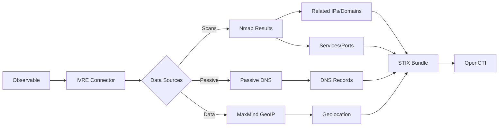

# OpenCTI IVRE Connector

| Status | Date | Comment |
|--------|------|---------|
| Partner | -    | -       |

## Table of Contents

- [Introduction](#introduction)
- [Installation](#installation)
  - [Requirements](#requirements)
- [Configuration](#configuration)
  - [OpenCTI Configuration](#opencti-configuration)
  - [Base Connector Configuration](#base-connector-configuration)
  - [IVRE Configuration](#ivre-configuration)
- [Deployment](#deployment)
  - [Docker Deployment](#docker-deployment)
  - [Manual Deployment](#manual-deployment)
- [Usage](#usage)
- [Behavior](#behavior)
  - [Data Flow](#data-flow)
  - [Data Sources](#data-sources)
  - [Generated STIX Objects](#generated-stix-objects)
- [Debugging](#debugging)
- [Additional Information](#additional-information)

---

## Introduction

[IVRE](https://ivre.rocks) is an open-source network reconnaissance framework that makes it easy to build self-hosted, fully controlled alternatives to services such as Shodan, ZoomEye, Censys (wide network scans), GreyNoise (scanners monitoring), and PassiveDNS.

This connector enriches network observables using data from your IVRE instance, creating relationships and adding contextual information from:
- Network scan results (Nmap)
- Passive DNS data
- MaxMind geolocation data

---

## Installation

### Requirements

- OpenCTI Platform >= 6.0.0
- Access to an IVRE instance (database or web API)
- Network access to IVRE data sources

---

## Configuration

### OpenCTI Configuration

| Parameter | Docker envvar | Mandatory | Description |
|-----------|---------------|-----------|-------------|
| `opencti_url` | `OPENCTI_URL` | Yes | The URL of the OpenCTI platform |
| `opencti_token` | `OPENCTI_TOKEN` | Yes | The default admin token configured in the OpenCTI platform |

### Base Connector Configuration

| Parameter | Docker envvar | Mandatory | Description |
|-----------|---------------|-----------|-------------|
| `connector_id` | `CONNECTOR_ID` | Yes | A valid arbitrary `UUIDv4` unique for this connector |
| `connector_name` | `CONNECTOR_NAME` | Yes | The name of the IVRE connector instance |
| `connector_scope` | `CONNECTOR_SCOPE` | Yes | Supported: `autonomous-system`, `domain-name`, `ipv4-addr`, `ipv6-addr`, `mac-addr`, `x509-certificate` |
| `connector_auto` | `CONNECTOR_AUTO` | Yes | Enable/disable auto-enrichment |
| `connector_confidence_level` | `CONNECTOR_CONFIDENCE_LEVEL` | Yes | Default confidence level (0-100) |
| `connector_log_level` | `CONNECTOR_LOG_LEVEL` | Yes | Log level (`debug`, `info`, `warn`, `error`) |

### IVRE Configuration

| Parameter | Docker envvar | Mandatory | Description |
|-----------|---------------|-----------|-------------|
| `ivre_db_url` | `IVRE_DB_URL` | No | IVRE database URL (default: IVRE config) |
| `ivre_db_url_data` | `IVRE_DB_URL_DATA` | No | Data purpose database URL (MaxMind) |
| `ivre_db_url_passive` | `IVRE_DB_URL_PASSIVE` | No | Passive DNS database URL |
| `ivre_db_url_scans` | `IVRE_DB_URL_SCANS` | No | Nmap scans database URL |
| `ivre_max_tlp` | `IVRE_MAX_TLP` | Yes | Maximum TLP for processing |
| `ivre_use_data` | `IVRE_USE_DATA` | No | Enable MaxMind data enrichment |
| `ivre_use_passive` | `IVRE_USE_PASSIVE` | No | Enable passive DNS enrichment |
| `ivre_use_passive_as` | `IVRE_USE_PASSIVE_AS` | No | Passive for autonomous-system |
| `ivre_use_passive_domain` | `IVRE_USE_PASSIVE_DOMAIN` | No | Passive for domain-name |
| `ivre_use_scans` | `IVRE_USE_SCANS` | No | Enable Nmap scans enrichment |
| `ivre_use_scans_as` | `IVRE_USE_SCANS_AS` | No | Scans for autonomous-system |
| `ivre_use_scans_domain` | `IVRE_USE_SCANS_DOMAIN` | No | Scans for domain-name |

---

## Deployment

### Docker Deployment

Build a Docker Image using the provided `Dockerfile`.

Example `docker-compose.yml`:

```yaml
version: '3'
services:
  connector-ivre:
    image: opencti/connector-ivre:latest
    environment:
      - OPENCTI_URL=http://localhost
      - OPENCTI_TOKEN=ChangeMe
      - CONNECTOR_ID=ChangeMe
      - CONNECTOR_NAME=ivre
      - CONNECTOR_SCOPE=autonomous-system,domain-name,ipv4-addr,ipv6-addr,mac-addr,x509-certificate
      - CONNECTOR_AUTO=true
      - CONNECTOR_CONFIDENCE_LEVEL=100
      - CONNECTOR_LOG_LEVEL=error
      - IVRE_MAX_TLP=TLP:AMBER
    restart: always
```

### Manual Deployment

1. Clone the repository
2. Copy `config.yml.sample` to `config.yml` and configure
3. Install dependencies: `pip install -r requirements.txt`
4. Run: `python ivre_connector.py`

---

## Usage

The connector enriches network observables by:
1. Querying IVRE data sources for matching records
2. Creating relationships between observables
3. Adding new observables discovered in IVRE data

Trigger enrichment:
- Manually via the OpenCTI UI
- Automatically if `CONNECTOR_AUTO=true`
- Via playbooks

---

## Behavior

### Data Flow



### Data Sources

| Source | Purpose | Observable Types |
|--------|---------|------------------|
| Scans (Nmap) | Network scan results | IP addresses, domains, services |
| Passive | Passive DNS data | Domain resolutions, DNS records |
| Data (MaxMind) | Geolocation data | IP to country/city mapping |

### Generated STIX Objects

| Object Type | Description |
|-------------|-------------|
| IPv4-Addr | IP addresses from scans and DNS resolution |
| IPv6-Addr | IPv6 addresses from scans and DNS resolution |
| Domain-Name | Domains from passive DNS |
| MAC-Addr | MAC addresses from network scans |
| X509-Certificate | SSL/TLS certificates from scans |
| Autonomous System | ASN information |
| Location | Geolocation from MaxMind |
| Relationship | Various relationships between entities |

---

## Debugging

Enable debug logging by setting `CONNECTOR_LOG_LEVEL=debug` to see:
- Database queries
- Data source results
- STIX object creation

Common issues:
- **Database connection**: Verify IVRE database URLs
- **Empty results**: Ensure IVRE has data for the queried observables
- **TLP Restrictions**: Check entity TLP against `IVRE_MAX_TLP`

---

## Additional Information

- [IVRE Website](https://ivre.rocks/)
- [IVRE Documentation](https://doc.ivre.rocks/)
- [IVRE GitHub Repository](https://github.com/ivre/ivre)
- [IVRE Use Cases](https://doc.ivre.rocks/en/latest/usage/use-cases.html)

### Example Visualizations

The connector creates relationships between observables, enabling rich investigation graphs:

- IP addresses linked to domains via DNS resolution
- Certificates linked to IP addresses via SSL/TLS scans
- Geolocation data for IP addresses
- Service information from network scans
