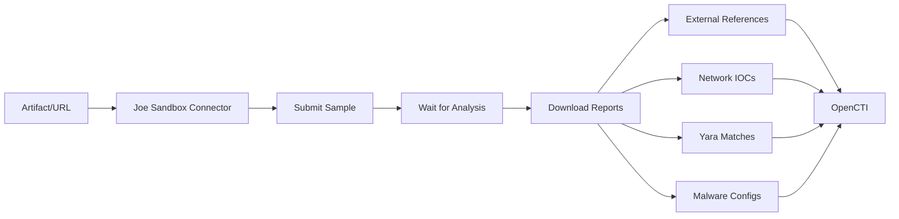

# OpenCTI Joe Sandbox Connector

| Status | Date | Comment |
|--------|------|---------|
| Community | -    | -       |

## Table of Contents

- [Introduction](#introduction)
- [Installation](#installation)
  - [Requirements](#requirements)
- [Configuration](#configuration)
  - [OpenCTI Configuration](#opencti-configuration)
  - [Base Connector Configuration](#base-connector-configuration)
  - [Joe Sandbox Configuration](#joe-sandbox-configuration)
- [Deployment](#deployment)
  - [Docker Deployment](#docker-deployment)
  - [Manual Deployment](#manual-deployment)
- [Usage](#usage)
- [Behavior](#behavior)
  - [Data Flow](#data-flow)
  - [Report Types](#report-types)
  - [Generated STIX Objects](#generated-stix-objects)
- [Debugging](#debugging)
- [Additional Information](#additional-information)

---

## Introduction

[Joe Sandbox](https://www.joesecurity.org/) is a deep malware analysis platform that performs dynamic and static analysis of malicious files and URLs. This connector submits samples to Joe Sandbox for analysis and enriches OpenCTI with the results.

Key features:
- Multi-platform analysis (Windows, Linux, macOS, Android)
- MITRE ATT&CK mapping
- Network indicator extraction
- Malware configuration extraction
- Yara rule matching
- Comprehensive report generation

---

## Installation

### Requirements

- OpenCTI Platform >= 6.0.0
- Joe Sandbox API key (Cloud Basic or Cloud Pro)
- Network access to Joe Sandbox API

---

## Configuration

### OpenCTI Configuration

| Parameter | Docker envvar | Mandatory | Description |
|-----------|---------------|-----------|-------------|
| `opencti_url` | `OPENCTI_URL` | Yes | The URL of the OpenCTI platform |
| `opencti_token` | `OPENCTI_TOKEN` | Yes | The default admin token configured in the OpenCTI platform |

### Base Connector Configuration

| Parameter | Docker envvar | Mandatory | Description |
|-----------|---------------|-----------|-------------|
| `connector_id` | `CONNECTOR_ID` | Yes | A valid arbitrary `UUIDv4` unique for this connector |
| `connector_name` | `CONNECTOR_NAME` | Yes | The name of the connector instance |
| `connector_scope` | `CONNECTOR_SCOPE` | Yes | Supported: `Artifact`, `Url` |
| `connector_auto` | `CONNECTOR_AUTO` | Yes | Enable/disable auto-enrichment |
| `connector_confidence_level` | `CONNECTOR_CONFIDENCE_LEVEL` | Yes | Default confidence level (0-100) |
| `connector_log_level` | `CONNECTOR_LOG_LEVEL` | Yes | Log level (`debug`, `info`, `warn`, `error`) |

### Joe Sandbox Configuration

| Parameter | Docker envvar | Mandatory | Description |
|-----------|---------------|-----------|-------------|
| `joe_sandbox_api_url` | `JOE_SANDBOX_API_URL` | Yes | API URL (Cloud Pro or Cloud Basic) |
| `joe_sandbox_api_key` | `JOE_SANDBOX_API_KEY` | Yes | Joe Sandbox API key |
| `joe_sandbox_analysis_url` | `JOE_SANDBOX_ANALYSIS_URL` | Yes | Analysis results URL |
| `joe_sandbox_accept_tac` | `JOE_SANDBOX_ACCEPT_TAC` | Yes | Accept Terms and Conditions |
| `joe_sandbox_report_types` | `JOE_SANDBOX_REPORT_TYPES` | No | Comma-separated report types to download |
| `joe_sandbox_systems` | `JOE_SANDBOX_SYSTEMS` | No | Analysis systems (e.g., w10x64_office) |
| `joe_sandbox_analysis_time` | `JOE_SANDBOX_ANALYSIS_TIME` | No | Analysis timeout in seconds |
| `joe_sandbox_internet_access` | `JOE_SANDBOX_INTERNET_ACCESS` | No | Enable full internet access |
| `joe_sandbox_internet_simulation` | `JOE_SANDBOX_INTERNET_SIMULATION` | No | Enable internet simulation |
| `joe_sandbox_hybrid_code_analysis` | `JOE_SANDBOX_HYBRID_CODE_ANALYSIS` | No | Enable HCA |
| `joe_sandbox_hybrid_decompilation` | `JOE_SANDBOX_HYBRID_DECOMPILATION` | No | Enable decompilation |
| `joe_sandbox_report_cache` | `JOE_SANDBOX_REPORT_CACHE` | No | Check cache before analysis |
| `joe_sandbox_ssl_inspection` | `JOE_SANDBOX_SSL_INSPECTION` | No | Enable HTTPS inspection |
| `joe_sandbox_browser` | `JOE_SANDBOX_BROWSER` | No | Use browser for URL analysis |
| `joe_sandbox_default_tlp` | `JOE_SANDBOX_DEFAULT_TLP` | No | Default TLP for created objects |
| `joe_sandbox_yara_color` | `JOE_SANDBOX_YARA_COLOR` | No | Color for Yara labels |
| `joe_sandbox_default_color` | `JOE_SANDBOX_DEFAULT_COLOR` | No | Default label color |

---

## Deployment

### Docker Deployment

Build a Docker Image using the provided `Dockerfile`.

Example `docker-compose.yml`:

```yaml
version: '3'
services:
  connector-joe-sandbox:
    image: opencti/connector-joe-sandbox:latest
    environment:
      - OPENCTI_URL=http://localhost
      - OPENCTI_TOKEN=ChangeMe
      - CONNECTOR_ID=Joe_Sandbox
      - "CONNECTOR_NAME=Joe Sandbox"
      - CONNECTOR_SCOPE=Artifact,Url
      - CONNECTOR_AUTO=false
      - CONNECTOR_CONFIDENCE_LEVEL=50
      - CONNECTOR_LOG_LEVEL=error
      - JOE_SANDBOX_API_URL=https://jbxcloud.joesecurity.org/api
      - JOE_SANDBOX_API_KEY=ChangeMe
      - JOE_SANDBOX_ANALYSIS_URL=https://jbxcloud.joesecurity.org/analysis
      - JOE_SANDBOX_ACCEPT_TAC=true
      - JOE_SANDBOX_SYSTEMS=w10x64_office
      - JOE_SANDBOX_ANALYSIS_TIME=300
      - JOE_SANDBOX_INTERNET_ACCESS=true
      - JOE_SANDBOX_DEFAULT_TLP=TLP:CLEAR
    restart: always
```

### Manual Deployment

1. Clone the repository
2. Copy `config.yml.sample` to `config.yml` and configure
3. Install dependencies: `pip install -r requirements.txt`
4. Run the connector

---

## Usage

The connector enriches Artifact and URL observables by:
1. Submitting samples to Joe Sandbox for analysis
2. Waiting for analysis completion
3. Downloading analysis reports
4. Creating relationships and enrichment data

Trigger enrichment:
- Manually via the OpenCTI UI
- Automatically if `CONNECTOR_AUTO=true`
- Via playbooks

---

## Behavior

### Data Flow



### Report Types

| Report Type | Description | Availability |
|-------------|-------------|--------------|
| executive | HTML Management Report | All |
| html | HTML Report | All |
| pdf | PDF Report | All |
| pdfexecutive | PDF Management Report | All |
| iochtml | IOC HTML Report | All |
| iocjson | IOC JSON Report | All |
| iocxml | IOC XML Report | All |
| stix | STIX Report | All |
| misp | MISP Export | All |
| pcap | Network Capture | All |
| pcapunified | Unified PCAP | All |
| pcapsslinspection | SSL Inspection PCAP | All |
| maec | MAEC Report | All |
| memdumps | Memory Dumps | All |
| unpackpe | Unpacked PE Files | All |
| ida | IDA Pro Database | All |
| json | JSON Report | Cloud Pro only |
| xml | XML Report | Cloud Pro only |
| lightjsonfixed | Light JSON | Cloud Pro only |
| lightxml | Light XML | Cloud Pro only |

### Generated STIX Objects

| Object Type | Description |
|-------------|-------------|
| External Reference | Links to analysis reports |
| Domain-Name | Contacted domains |
| IPv4-Addr/IPv6-Addr | Contacted IP addresses |
| URL | Contacted URLs |
| Labels | Yara rule matches |
| Note | Malware configuration data |
| Relationship | Related-to relationships between entities |

---

## Debugging

Enable debug logging by setting `CONNECTOR_LOG_LEVEL=debug` to see:
- Sample submission status
- Analysis progress
- Report download details

Common issues:
- **API timeout**: Increase `JOE_SANDBOX_API_TIMEOUT`
- **Analysis timeout**: Increase `JOE_SANDBOX_ANALYSIS_TIME`
- **Terms not accepted**: Set `JOE_SANDBOX_ACCEPT_TAC=true`

---

## Additional Information

- [Joe Sandbox](https://www.joesecurity.org/)
- [Joe Sandbox Cloud](https://www.joesandbox.com/)
- [Joe Sandbox API Documentation](https://jbxcloud.joesecurity.org/apidocs)
- [Terms and Conditions](https://jbxcloud.joesecurity.org/tandc)

### API Endpoints

- **Cloud Pro**: `https://jbxcloud.joesecurity.org/api`
- **Cloud Basic**: `https://joesandbox.com/api`
