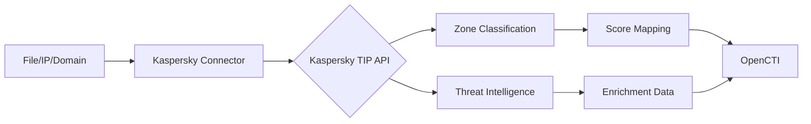

# OpenCTI Kaspersky Connector

| Status | Date | Comment |
|--------|------|---------|
| Filigran Verified | -    | -       |

## Table of Contents

- [Introduction](#introduction)
- [Installation](#installation)
  - [Requirements](#requirements)
- [Configuration](#configuration)
  - [OpenCTI Configuration](#opencti-configuration)
  - [Base Connector Configuration](#base-connector-configuration)
  - [Kaspersky Configuration](#kaspersky-configuration)
- [Deployment](#deployment)
  - [Docker Deployment](#docker-deployment)
  - [Manual Deployment](#manual-deployment)
- [Usage](#usage)
- [Behavior](#behavior)
  - [Data Flow](#data-flow)
  - [API Endpoints](#api-endpoints)
  - [Generated STIX Objects](#generated-stix-objects)
- [Debugging](#debugging)
- [Additional Information](#additional-information)

---

## Introduction

Kaspersky Threat Intelligence Portal provides threat intelligence services for investigating files, IP addresses, domains, hostnames, and URLs. This connector enriches observables using the Kaspersky TIP API.

**Note**: At this time, the connector primarily supports the enrichment of File-type observables. Enrichment for other observable types will be introduced in future releases.

Key features:
- File hash reputation lookup
- Zone classification (red, orange, yellow, gray, green)
- Threat intelligence enrichment
- Score mapping based on threat zones

---

## Installation

### Requirements

- OpenCTI Platform >= 7.260227.0
- Kaspersky TIP API key
- Network access to Kaspersky TIP API

---

## Configuration

### OpenCTI Configuration

| Parameter | Docker envvar | Mandatory | Description |
|-----------|---------------|-----------|-------------|
| `opencti_url` | `OPENCTI_URL` | Yes | The URL of the OpenCTI platform |
| `opencti_token` | `OPENCTI_TOKEN` | Yes | The default admin token configured in the OpenCTI platform |

### Base Connector Configuration

| Parameter | Docker envvar | Mandatory | Description |
|-----------|---------------|-----------|-------------|
| `connector_id` | `CONNECTOR_ID` | Yes | A valid arbitrary `UUIDv4` unique for this connector |
| `connector_name` | `CONNECTOR_NAME` | No | The name of the connector instance |
| `connector_scope` | `CONNECTOR_SCOPE` | No | Supported: `StixFile`, `IPv4-Addr`, `Domain-Name`, `Hostname` |
| `connector_auto` | `CONNECTOR_AUTO` | No | Enable/disable auto-enrichment |
| `connector_log_level` | `CONNECTOR_LOG_LEVEL` | No | Log level (`debug`, `info`, `warn`, `error`) |

### Kaspersky Configuration

| Parameter | Docker envvar | Mandatory | Description |
|-----------|---------------|-----------|-------------|
| `kaspersky_api_key` | `KASPERSKY_API_KEY` | Yes | Kaspersky TIP API key |
| `kaspersky_api_base_url` | `KASPERSKY_API_BASE_URL` | No | API base URL (default: https://tip.kaspersky.com) |
| `kaspersky_max_tlp` | `KASPERSKY_MAX_TLP` | No | Maximum TLP for processing |
| `kaspersky_zone_octi_score_mapping` | `KASPERSKY_ZONE_OCTI_SCORE_MAPPING` | No | Zone to score mapping |
| `kaspersky_file_sections` | `KASPERSKY_FILE_SECTIONS` | No | File API sections to retrieve |
| `kaspersky_ipv4_sections` | `KASPERSKY_IPV4_SECTIONS` | No | IPv4 API sections to retrieve |
| `kaspersky_domain_sections` | `KASPERSKY_DOMAIN_SECTIONS` | No | Domain API sections to retrieve |

---

## Deployment

### Docker Deployment

Build a Docker Image using the provided `Dockerfile`.

Example `docker-compose.yml`:

```yaml
version: '3'
services:
  connector-kaspersky-enrichment:
    image: opencti/connector-kaspersky-enrichment:latest
    environment:
      - OPENCTI_URL=http://localhost
      - OPENCTI_TOKEN=ChangeMe
      - CONNECTOR_ID=ChangeMe
      - KASPERSKY_API_KEY=ChangeMe
    restart: always
```

### Manual Deployment

1. Clone the repository
2. Create `config.yml` based on `config.yml.sample`
3. Install dependencies: `pip3 install -r requirements.txt`
4. Run from src directory: `python3 main.py`

---

## Usage

The connector enriches observables by:
1. Querying the Kaspersky TIP API for threat intelligence
2. Applying zone-based scoring
3. Enriching the observable with threat data

Trigger enrichment:
- Manually via the OpenCTI UI
- Automatically if `CONNECTOR_AUTO=true`
- Via playbooks

---

## Behavior

### Data Flow



### API Endpoints

| API Endpoint | Observable Type | Description |
|--------------|-----------------|-------------|
| `/api/hash/{hash_value}` | File | Enrich File observable |
| `/api/ip/{ip_value}` | IPv4-Addr | Enrich IP address (future) |
| `/api/domain/{domain_value}` | Domain-Name | Enrich domain (future) |

### Zone Score Mapping

| Zone | Default Score | Description |
|------|---------------|-------------|
| Red | 100 | High threat |
| Orange | 80 | Medium-high threat |
| Yellow | 60 | Medium threat |
| Gray | 20 | Unknown/Low |
| Green | 0 | Safe |

### Generated STIX Objects

| Object Type | Description |
|-------------|-------------|
| Observable enrichment | Zone, score, and threat data |
| External Reference | Link to Kaspersky TIP |
| Labels | Zone classification |

---

## Debugging

Enable debug logging by setting `CONNECTOR_LOG_LEVEL=debug`.

Use logging with:
```python
self.helper.connector_logger.{LOG_LEVEL}("Message")
```

---

## Additional Information

- [Kaspersky Threat Intelligence Portal](https://tip.kaspersky.com/)
- [Kaspersky TIP API Documentation](https://tip.kaspersky.com/help/api/)
