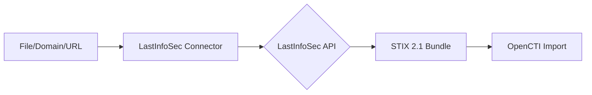

# OpenCTI LastInfoSec Connector

| Status | Date | Comment |
|--------|------|---------|
| Partner | -    | -       |

## Table of Contents

- [Introduction](#introduction)
- [Installation](#installation)
  - [Requirements](#requirements)
- [Configuration](#configuration)
  - [OpenCTI Configuration](#opencti-configuration)
  - [Base Connector Configuration](#base-connector-configuration)
  - [LastInfoSec Configuration](#lastinfosec-configuration)
- [Deployment](#deployment)
  - [Docker Deployment](#docker-deployment)
  - [Manual Deployment](#manual-deployment)
- [Usage](#usage)
- [Behavior](#behavior)
  - [Data Flow](#data-flow)
  - [API Endpoints](#api-endpoints)
  - [Generated STIX Objects](#generated-stix-objects)
- [Debugging](#debugging)
- [Additional Information](#additional-information)

---

## Introduction

LastInfoSec (now part of Gatewatcher) provides a Threat Feed that makes it easier to detect threats within information systems. The feed contains enriched compromised evidence to reduce the time of threat analysis once detected.

This connector enriches files, domains, hostnames, and URLs using the LastInfoSec STIX 2.1 API, providing threat intelligence data in a standardized format.

---

## Installation

### Requirements

- OpenCTI Platform >= 6.0.0
- LastInfoSec API key ([Contact LastInfoSec](https://info.gatewatcher.com/en/lp/opencti))
- Network access to LastInfoSec API

---

## Configuration

### OpenCTI Configuration

| Parameter | Docker envvar | Mandatory | Description |
|-----------|---------------|-----------|-------------|
| `opencti_url` | `OPENCTI_URL` | Yes | The URL of the OpenCTI platform |
| `opencti_token` | `OPENCTI_TOKEN` | Yes | The default admin token configured in the OpenCTI platform |

### Base Connector Configuration

| Parameter | Docker envvar | Mandatory | Description |
|-----------|---------------|-----------|-------------|
| `connector_id` | `CONNECTOR_ID` | Yes | A valid arbitrary `UUIDv4` unique for this connector |
| `connector_name` | `CONNECTOR_NAME` | Yes | The name of the connector instance |
| `connector_scope` | `CONNECTOR_SCOPE` | Yes | Supported: `StixFile`, `Domain-Name`, `Hostname`, `Url` |
| `connector_auto` | `CONNECTOR_AUTO` | Yes | Enable/disable auto-enrichment |
| `connector_confidence_level` | `CONNECTOR_CONFIDENCE_LEVEL` | Yes | Default confidence level (0-100) |
| `connector_log_level` | `CONNECTOR_LOG_LEVEL` | Yes | Log level (`debug`, `info`, `warn`, `error`) |

### LastInfoSec Configuration

| Parameter | Docker envvar | Mandatory | Description |
|-----------|---------------|-----------|-------------|
| `api_key_cti` | `CONFIG_LIS_APIKEY_CTI` | Yes | LastInfoSec API key |
| `proxy_http` | `PROXY_HTTP` | No | HTTP proxy (optional) |
| `proxy_https` | `PROXY_HTTPS` | No | HTTPS proxy (optional) |

---

## Deployment

### Docker Deployment

Build a Docker Image using the provided `Dockerfile`.

Example `docker-compose.yml`:

```yaml
version: '3'
services:
  connector-lastinfosec-enrichment:
    image: opencti/connector-lastinfosec-enrichment:latest
    environment:
      - OPENCTI_URL=http://localhost
      - OPENCTI_TOKEN=ChangeMe
      - CONNECTOR_ID=ChangeMe
      - CONNECTOR_NAME=Last Info Sec Enrichment
      - CONNECTOR_SCOPE=StixFile,Domain-Name,Hostname,Url
      - CONNECTOR_AUTO=true
      - CONNECTOR_CONFIDENCE_LEVEL=50
      - CONNECTOR_LOG_LEVEL=error
      - CONFIG_LIS_APIKEY_CTI=ChangeMe
    restart: always
```

### Manual Deployment

1. Clone the repository
2. Copy `config.yml.sample` to `config.yml` and configure
3. Install dependencies: `pip install -r requirements.txt`
4. Run the connector

---

## Usage

The connector enriches observables by:
1. Querying the LastInfoSec API for threat intelligence
2. Importing STIX 2.1 bundles from the response
3. Creating relationships between entities

Trigger enrichment:
- Manually via the OpenCTI UI
- Automatically if `CONNECTOR_AUTO=true`
- Via playbooks

---

## Behavior

### Data Flow



### API Endpoints

| API Endpoint | Observable Type | Description |
|--------------|-----------------|-------------|
| `/v2/stix21/search_hash/{hash}` | StixFile | Search by file hash |
| `/v2/stix21/search_host/{host}` | Domain-Name, Hostname, Url | Search by host |

### Generated STIX Objects

The connector imports STIX 2.1 bundles from LastInfoSec, which may include:

| Object Type | Description |
|-------------|-------------|
| Indicator | Threat indicators |
| Malware | Malware information |
| Threat Actor | Associated threat actors |
| Attack Pattern | TTPs |
| Relationship | Links between entities |

---

## Debugging

Enable debug logging by setting `CONNECTOR_LOG_LEVEL=debug` to see:
- API requests and responses
- STIX bundle processing

---

## Additional Information

- LastInfoSec has been acquired by Gatewatcher
- [Gatewatcher LastInfoSec](https://www.gatewatcher.com/en/our-solutions/lastinfosec/)
- [Get API Key](https://info.gatewatcher.com/en/lp/opencti)
