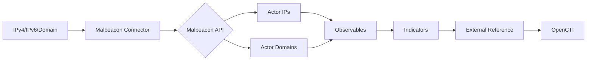

# OpenCTI Malbeacon Internal Enrichment Connector

## Table of Contents

- [Introduction](#introduction)
- [Installation](#installation)
  - [Requirements](#requirements)
- [Configuration](#configuration)
  - [OpenCTI Configuration](#opencti-configuration)
  - [Base Connector Configuration](#base-connector-configuration)
  - [Malbeacon Configuration](#malbeacon-configuration)
- [Deployment](#deployment)
  - [Docker Deployment](#docker-deployment)
  - [Manual Deployment](#manual-deployment)
- [Usage](#usage)
- [Behavior](#behavior)
  - [Data Flow](#data-flow)
  - [Enrichment Mapping](#enrichment-mapping)
  - [Generated STIX Objects](#generated-stix-objects)
- [Debugging](#debugging)
- [Additional Information](#additional-information)

---

## Introduction

[Malbeacon](https://malbeacon.com/) is a threat intelligence service that provides information about origin networks of attackers. This connector enriches IP addresses and domain names with attacker infrastructure intelligence.

Key features:
- Actor IP address identification
- Actor domain identification
- Attacker infrastructure mapping
- External reference links to Malbeacon

---

## Installation

### Requirements

- OpenCTI Platform >= 6.0.0
- Malbeacon API key ([Apply here](https://malbeacon.com/apply))
- Network access to Malbeacon API

---

## Configuration

### OpenCTI Configuration

| Parameter | Docker envvar | Mandatory | Description |
|-----------|---------------|-----------|-------------|
| `opencti_url` | `OPENCTI_URL` | Yes | The URL of the OpenCTI platform |
| `opencti_token` | `OPENCTI_TOKEN` | Yes | The default admin token configured in the OpenCTI platform |

### Base Connector Configuration

| Parameter | Docker envvar | Mandatory | Description |
|-----------|---------------|-----------|-------------|
| `connector_id` | `CONNECTOR_ID` | Yes | A valid arbitrary `UUIDv4` unique for this connector |
| `connector_name` | `CONNECTOR_NAME` | Yes | The name of the connector instance |
| `connector_scope` | `CONNECTOR_SCOPE` | Yes | Supported: `IPv4-Addr`, `IPv6-Addr`, `Domain-Name` |
| `connector_auto` | `CONNECTOR_AUTO` | Yes | Enable/disable auto-enrichment |
| `connector_log_level` | `CONNECTOR_LOG_LEVEL` | Yes | Log level (`debug`, `info`, `warn`, `error`) |

### Malbeacon Configuration

| Parameter | Docker envvar | Mandatory | Description |
|-----------|---------------|-----------|-------------|
| `malbeacon_api_key` | `MALBEACON_API_KEY` | Yes | Malbeacon API key |
| `malbeacon_api_base_url` | `MALBEACON_API_BASE_URL` | Yes | API base URL |
| `malbeacon_indicator_score_level` | `MALBEACON_INDICATOR_SCORE_LEVEL` | No | Default indicator score (default: 50) |
| `malbeacon_max_tlp` | `MALBEACON_MAX_TLP` | Yes | Maximum TLP for processing |

---

## Deployment

### Docker Deployment

Build a Docker Image using the provided `Dockerfile`.

Example `docker-compose.yml`:

```yaml
version: '3'
services:
  connector-malbeacon:
    image: opencti/connector-malbeacon:latest
    environment:
      - OPENCTI_URL=http://localhost
      - OPENCTI_TOKEN=ChangeMe
      - CONNECTOR_ID=ChangeMe
      - CONNECTOR_NAME=Malbeacon
      - CONNECTOR_AUTO=false
      - CONNECTOR_SCOPE=IPv4-Addr,IPv6-Addr,Domain-Name
      - CONNECTOR_LOG_LEVEL=error
      - MALBEACON_API_KEY=ChangeMe
      - MALBEACON_API_BASE_URL=https://api.malbeacon.com/v1/
      - MALBEACON_INDICATOR_SCORE_LEVEL=50
      - MALBEACON_MAX_TLP=TLP:AMBER
    restart: always
```

### Manual Deployment

1. Clone the repository
2. Copy `config.yml.sample` to `config.yml` and configure
3. Install dependencies: `pip install -r requirements.txt`
4. Run the connector

---

## Usage

The connector enriches IP addresses and domain names by:
1. Querying the Malbeacon API for attacker intelligence
2. Creating observables and indicators for actor infrastructure
3. Adding external references to Malbeacon

Trigger enrichment:
- Manually via the OpenCTI UI
- Automatically if `CONNECTOR_AUTO=true`
- Via playbooks

---

## Behavior

### Data Flow



### Enrichment Mapping

| Malbeacon Data | OpenCTI Entity | Description |
|----------------|----------------|-------------|
| Actor IP | IPv4-Addr, Indicator | Attacker IP addresses |
| Actor Domain | Domain-Name, Indicator | Attacker domains |
| Reference | External Reference | Link to Malbeacon |

### Generated STIX Objects

| Object Type | Description |
|-------------|-------------|
| External Reference | Link to Malbeacon for found observables |
| IPv4-Addr/IPv6-Addr | Actor IP addresses |
| Domain-Name | Actor domains |
| Indicator | Threat indicators for actor infrastructure |

---

## Debugging

Enable debug logging by setting `CONNECTOR_LOG_LEVEL=debug` to see:
- API requests and responses
- Observable creation details

---

## Additional Information

- [Malbeacon](https://malbeacon.com/)
- [Apply for API Key](https://malbeacon.com/apply)

### Known TODOs

- Add relationships from Actor objects to initial observables
- Use STIX 2.1 infrastructure components to explain attacker infrastructure
