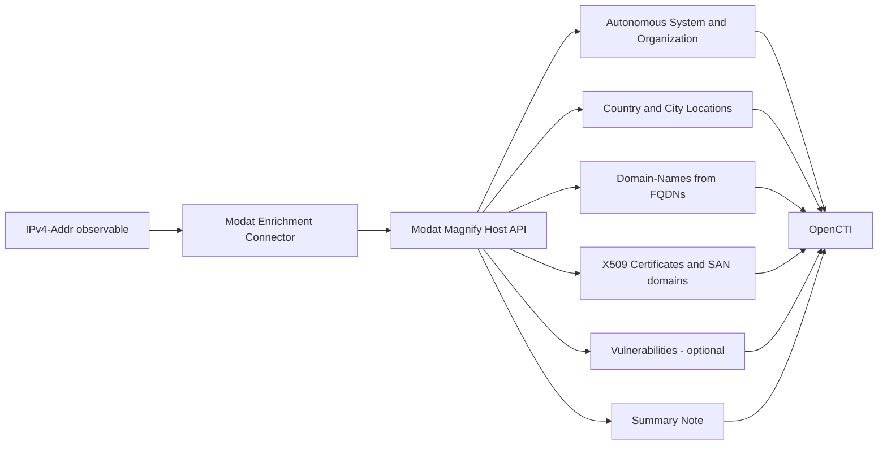

# OpenCTI Modat Enrichment Connector

| Status    | Date | Comment                            |
|-----------|------|------------------------------------|
| Community | -    | Canonical Modat enrichment variant |

The Modat Enrichment connector enriches `IPv4-Addr` observables in OpenCTI with internet exposure and host intelligence from the [Modat Magnify](https://magnify.modat.io/) platform, providing ASN, organization, geolocation, resolving domains, TLS certificates, and (optionally) vulnerability information.

## Table of Contents

- [OpenCTI Modat Enrichment Connector](#opencti-modat-enrichment-connector)
  - [Table of Contents](#table-of-contents)
  - [Introduction](#introduction)
  - [Installation](#installation)
    - [Requirements](#requirements)
  - [Configuration variables](#configuration-variables)
    - [OpenCTI environment variables](#opencti-environment-variables)
    - [Base connector environment variables](#base-connector-environment-variables)
    - [Connector extra parameters environment variables](#connector-extra-parameters-environment-variables)
  - [Deployment](#deployment)
    - [Docker Deployment](#docker-deployment)
    - [Manual Deployment](#manual-deployment)
  - [Usage](#usage)
  - [Behavior](#behavior)
    - [Data Flow](#data-flow)
    - [Generated STIX Objects](#generated-stix-objects)
    - [Relationships Created](#relationships-created)
    - [Processing Details](#processing-details)
  - [Debugging](#debugging)
  - [Additional information](#additional-information)

## Introduction

[Modat Magnify](https://magnify.modat.io/) is an internet exposure and host intelligence platform. It scans internet-connected hosts and exposes detailed records about each host, including open services, banners, TLS and SSH metadata, HTTP responses, resolving domains, autonomous system data, and known vulnerabilities.

This connector integrates Modat Magnify with OpenCTI to enrich `IPv4-Addr` observables. For each enriched IP it performs a single host-details lookup (`GET /host/{ip}/v1`), updates the observable in place, and creates the related STIX entities returned by Modat.

## Installation

### Requirements

- OpenCTI Platform >= 6.8.12
- A Modat Magnify account with API access (API key)
- Network access from the connector to `https://api.magnify.modat.io`

## Configuration variables

There are a number of configuration options, which are set either in `docker-compose.yml` (for Docker), in a `.env` file, or in `config.yml` (for manual deployment). The sample configuration is available in `config.yml.sample`.

### OpenCTI environment variables

| Parameter     | config.yml | Docker environment variable | Mandatory | Description                                          |
|---------------|------------|-----------------------------|-----------|------------------------------------------------------|
| OpenCTI URL   | `url`      | `OPENCTI_URL`               | Yes       | The URL of the OpenCTI platform.                     |
| OpenCTI Token | `token`    | `OPENCTI_TOKEN`             | Yes       | The default admin token set in the OpenCTI platform. |

### Base connector environment variables

| Parameter       | config.yml         | Docker environment variable | Default                                | Mandatory | Description                                                                |
|-----------------|--------------------|-----------------------------|----------------------------------------|-----------|----------------------------------------------------------------------------|
| Connector Type  | `connector.type`   | `CONNECTOR_TYPE`            | `INTERNAL_ENRICHMENT`                  | Yes       | Should always be `INTERNAL_ENRICHMENT` for this connector.                 |
| Connector ID    | `connector.id`     | `CONNECTOR_ID`              | `d2d7a7e3-4cb4-4f58-94c2-7bb6d2f8f643` | No        | A unique `UUIDv4` identifier for this connector instance.                  |
| Connector Name  | `connector.name`   | `CONNECTOR_NAME`            | `Modat Enrichment`                     | No        | Name of the connector.                                                     |
| Connector Scope | `connector.scope`  | `CONNECTOR_SCOPE`           | `IPv4-Addr`                            | No        | The scope of observables the connector enriches.                           |
| Log Level       | `connector.log_level` | `CONNECTOR_LOG_LEVEL`    | `info`                                 | No        | Determines the verbosity of the logs: `debug`, `info`, `warn`, or `error`. |
| Auto Mode       | `connector.auto`   | `CONNECTOR_AUTO`            | `false`                                | No        | Enables or disables automatic enrichment of observables.                   |

### Connector extra parameters environment variables

| Parameter               | config.yml                     | Docker environment variable     | Default                          | Mandatory | Description                                                                                       |
|-------------------------|--------------------------------|---------------------------------|----------------------------------|-----------|---------------------------------------------------------------------------------------------------|
| API Base URL            | `modat.api_base_url`           | `MODAT_API_BASE_URL`            | `https://api.magnify.modat.io`   | No        | Modat API base URL.                                                                               |
| API Key                 | `modat.api_key`                | `MODAT_API_KEY`                 |                                  | Yes       | Your Modat API key. Sent as a `Bearer` token (the `Bearer ` prefix is added automatically).       |
| Max TLP                 | `modat.max_tlp`                | `MODAT_MAX_TLP`                 | `TLP:AMBER`                      | No        | Maximum TLP of the observable that the connector is allowed to enrich.                            |
| Default Score           | `modat.default_score`          | `MODAT_DEFAULT_SCORE`           | `50`                             | No        | Score applied to the enriched observable and to the objects created from it.                      |
| Create Note             | `modat.create_note`            | `MODAT_CREATE_NOTE`             | `true`                           | No        | Create a single Note summarizing the host record (overview, services, domains, optional CVEs).    |
| Include CVEs            | `modat.include_cves`           | `MODAT_INCLUDE_CVES`            | `false`                          | No        | When `true`, include CVE data in the note and create STIX `Vulnerability` objects. Disabled by default because Modat-reported CVEs are not validated. |
| Max Services in Summary | `modat.max_services_in_summary`| `MODAT_MAX_SERVICES_IN_SUMMARY` | `25`                             | No        | Cap on the number of services rendered in the summary note. STIX object creation is not capped.   |

## Deployment

### Docker Deployment

Build the Docker image:

```bash
docker build -t opencti/connector-modat-enrichment:latest .
```

Configure the connector in `docker-compose.yml`:

```yaml
  connector-modat-enrichment:
    image: opencti/connector-modat-enrichment:latest
    environment:
      - OPENCTI_URL=http://localhost
      - OPENCTI_TOKEN=ChangeMe
      - CONNECTOR_ID=ChangeMe_UUID4
      - CONNECTOR_NAME=Modat Enrichment
      - CONNECTOR_SCOPE=IPv4-Addr
      - CONNECTOR_TYPE=INTERNAL_ENRICHMENT
      - CONNECTOR_AUTO=false
      - CONNECTOR_LOG_LEVEL=error
      - MODAT_API_BASE_URL=https://api.magnify.modat.io
      - MODAT_API_KEY=ChangeMe
      - MODAT_MAX_TLP=TLP:AMBER
      - MODAT_DEFAULT_SCORE=50
      - MODAT_CREATE_NOTE=true
      - MODAT_INCLUDE_CVES=false
      - MODAT_MAX_SERVICES_IN_SUMMARY=25
    restart: always
```

Start the connector:

```bash
docker compose up -d
```

### Manual Deployment

1. Copy `config.yml.sample` to `config.yml` and configure it with your credentials.

2. Install dependencies:

```bash
pip3 install -r src/requirements.txt
```

3. Start the connector from the `src` directory:

```bash
cd src
python3 main.py
```

## Usage

The connector enriches `IPv4-Addr` observables with Modat Magnify host intelligence.

Select an `IPv4-Addr` observable, then click the enrichment button and choose **Modat Enrichment**.

Enrichment can be triggered:
- Manually via the OpenCTI UI
- Automatically when `CONNECTOR_AUTO=true`
- Via playbooks (this connector is playbook-compatible)

## Behavior

The connector queries the Modat Magnify host-details API and creates related entities based on the data returned. A `404` from Modat (host not found) is treated as "no data": the original bundle is returned unchanged.

### Data Flow



### Generated STIX Objects

| Object Type           | Description                                                                                          |
|-----------------------|------------------------------------------------------------------------------------------------------|
| Identity (author)     | `Modat` organization, set as `created_by_ref` on every generated object.                             |
| Autonomous System     | ASN number and `AS<number>` name; `asn.org` stored as the AS description.                            |
| Identity (organization)| The ASN operator (`asn.org`), linked to the Autonomous System rather than directly to the IP.       |
| Location (Country)    | `geo.country_name`, with the ISO code stored as an alias.                                            |
| Location (City)       | `geo.city_name` when a country is also present.                                                      |
| Domain-Name           | One per FQDN in `fqdns` (wildcards skipped), plus certificate Subject Alternative Name DNS entries.  |
| X.509 Certificate     | One per unique TLS certificate observed across services (deduplicated by SHA-256, serial, port).     |
| Vulnerability         | One per unique CVE — created **only** when `MODAT_INCLUDE_CVES=true`.                                 |
| Note                  | A single Markdown summary of the host (overview, services, domains, optional CVEs).                  |

The input observable is also updated with a score, an external reference to the Modat Magnify host page, and labels (`modat`, `modat-enriched`, plus a `modat:<tag>` label for each Modat fingerprint tag).

### Relationships Created

| Relationship Type | Source            | Target            | Description                       |
|-------------------|-------------------|-------------------|-----------------------------------|
| `belongs-to`      | IPv4-Addr         | Autonomous System | ASN membership                    |
| `related-to`      | Autonomous System | Organization      | AS operator                       |
| `located-at`      | IPv4-Addr         | Country / City    | Geolocation                       |
| `located-at`      | City              | Country           | Location hierarchy                |
| `resolves-to`     | Domain-Name       | IPv4-Addr         | DNS resolution (FQDNs and SANs)   |
| `related-to`      | IPv4-Addr         | X.509 Certificate | Observed TLS certificate          |
| `related-to`      | X.509 Certificate | Domain-Name (SAN) | Certificate subject alt name      |
| `related-to`      | IPv4-Addr         | Vulnerability     | CVE on the host (optional)        |

### Processing Details

1. **TLP Check**: validates the observable TLP against `max_tlp`; observables above it are never sent to Modat.
2. **Scope Check**: only `IPv4-Addr` observables with a value are processed.
3. **API Query**: a single call to `GET /host/{ip}/v1`. A `404` returns the original bundle unchanged.
4. **Observable Update**: score, labels (including Modat tags), and the Modat Magnify external reference.
5. **Entity Creation**: ASN, organization, locations, domains, certificates and SAN domains, and (optionally) vulnerabilities.
6. **Summary Note**: a single Note keyed to the observable, so re-enrichment updates the existing note instead of creating duplicates.
7. **Bundle**: objects are sent to OpenCTI as a STIX 2.1 bundle; the platform upserts by STIX id (so any repeated object/relationship is merged server-side).

A full description of the generated STIX 2.1 objects is available in [`docs/STIX.md`](docs/STIX.md).

## Debugging

Enable verbose logging by setting:

```env
CONNECTOR_LOG_LEVEL=debug
```

Log output includes the outbound Modat request, the parsed host record counts, and the STIX bundle send result.

If the connector enriches nothing, check that:
- the observable is an `IPv4-Addr`
- the observable TLP is not above `MODAT_MAX_TLP`
- `MODAT_API_KEY` is valid and the connector can reach `https://api.magnify.modat.io`
- OpenCTI trigger filters are not excluding the connector

## Additional information

- **API Reference**: [Modat Magnify](https://magnify.modat.io/) — host page at `https://magnify.modat.io/hosts/<ip>`.
- **Authentication**: the Modat API key is sent in the `Authorization` header as a `Bearer` token; the `Bearer ` prefix is added automatically if absent.
- **TLP Handling**: observables with a TLP above `MODAT_MAX_TLP` are not sent to Modat.
- **CVE Data**: Modat-reported CVE attributions are **not validated**. Keep `MODAT_INCLUDE_CVES=false` unless you have a reason to ingest them.
- **Data Freshness**: Modat continuously scans the internet; data freshness depends on Modat's scan frequency.
- **Playbook Support**: this connector supports OpenCTI playbook automation.
